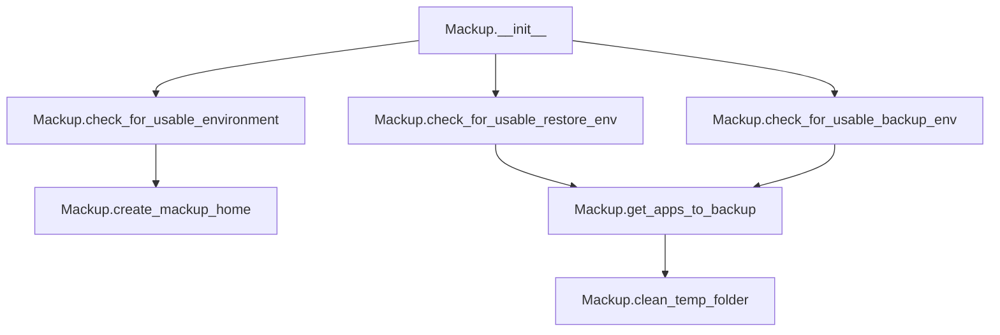

# `mackup.py`

## `mackup.mackup.Mackup` · *class*

## Summary:
Manages the core Mackup operations including environment validation, configuration handling, and application backup management.

## Description:
The Mackup class coordinates the backup and restore operations for user application configurations. It handles environment setup, validates storage locations, manages temporary directories, and determines which applications should be backed up based on configuration settings.

## State:
- `_config`: config.Config instance - holds configuration data including storage paths and application selection settings
- `mackup_folder`: str - absolute path to the Mackup storage directory (derived from config)
- `temp_folder`: str - absolute path to a temporary directory created for operations

## Lifecycle:
- Creation: Instantiate without arguments; automatically initializes configuration and creates temporary directory
- Usage: Call environment validation methods (`check_for_usable_environment`, `check_for_usable_backup_env`, `check_for_usable_restore_env`) before performing operations, then use `get_apps_to_backup()` to determine applications to process
- Destruction: Clean up temporary directory via `clean_temp_folder()` method

## Method Map:


## Raises:
- utils.error: Raised by various methods when environment conditions are not met or when user confirmation is denied
- OSError: Potentially raised during directory operations (not explicitly handled in provided code)

## Example:
```python
# Create Mackup instance
mackup = Mackup()

# Validate environment for backup operation
mackup.check_for_usable_backup_env()

# Determine which applications to backup
apps_to_backup = mackup.get_apps_to_backup()

# Clean up temporary files when done
mackup.clean_temp_folder()
```

### `mackup.mackup.Mackup.__init__` · *method*

## Summary:
Initializes a Mackup instance by setting up configuration and creating a temporary working directory.

## Description:
The `__init__` method performs the essential setup for a Mackup instance. It creates a configuration object to manage backup settings and establishes two critical directory paths: the main Mackup storage folder and a temporary directory for operations. This method is called automatically during object instantiation and prepares the instance for subsequent backup and restore operations.

## Args:
    None

## Returns:
    None

## Raises:
    None explicitly raised

## State Changes:
    Attributes READ: None
    Attributes WRITTEN: 
    - self._config: config.Config instance created from configuration settings
    - self.mackup_folder: str path to the Mackup storage directory derived from configuration
    - self.temp_folder: str path to a temporary directory for operations

## Constraints:
    Preconditions: None
    Postconditions: 
    - self._config is initialized with valid configuration data
    - self.mackup_folder contains the absolute path to the Mackup storage directory
    - self.temp_folder contains the absolute path to a newly created temporary directory

## Side Effects:
    - Creates a temporary directory on the filesystem with prefix "mackup_tmp_"
    - May raise OSError if temporary directory creation fails

### `mackup.mackup.Mackup.check_for_usable_environment` · *method*

## Summary:
Validates that the current environment meets safety and accessibility requirements for Mackup operations.

## Description:
This method performs two critical environment checks before proceeding with Mackup operations. It ensures the application isn't running with elevated privileges when configured to prohibit root execution, and that the configured storage directory exists. This validation prevents potentially dangerous operations and ensures proper setup.

The method is called during both backup and restore operations to establish a safe working environment. It's separated from other validation methods to encapsulate these fundamental safety checks that apply to all Mackup operations.

## Args:
    None

## Returns:
    None

## Raises:
    SystemExit: When either of the environment validation checks fails, causing the program to terminate with an error message.

## State Changes:
    Attributes READ: 
    - self._config.path: Used to verify existence of the storage directory
    - self._config: Configuration object containing path information
    
    Attributes WRITTEN: 
    - None

## Constraints:
    Preconditions:
    - The Mackup instance must be properly initialized with a valid _config object
    - The _config.path must be a valid string path
    - The utils module must be properly imported and available
    
    Postconditions:
    - Program terminates with error message if environment validation fails
    - If validation passes, the environment is confirmed to be usable for Mackup operations

## Side Effects:
    - I/O operations: Checks for directory existence using os.path.isdir()
    - External service calls: None
    - Mutations to objects outside self: None
    - Program termination via sys.exit() when validation fails

### `mackup.mackup.Mackup.check_for_usable_backup_env` · *method*

## Summary:
Validates the backup environment and ensures the Mackup home directory is created for storing configuration files.

## Description:
This method performs two critical setup operations in sequence: first validating that the environment is suitable for backup operations, and second ensuring that the Mackup home directory exists. It serves as a prerequisite check before initiating backup processes.

The method is called during backup initialization to ensure all necessary conditions are met before proceeding with backup operations. This separation of concerns allows for clear distinction between environment validation and directory creation logic.

## Args:
    None

## Returns:
    None

## Raises:
    SystemExit: When `check_for_usable_environment()` detects running as root without permission or when the storage folder cannot be found.
    SystemExit: When `create_mackup_home()` is called and the user declines to create the Mackup directory during interactive confirmation.

## State Changes:
    Attributes READ: 
    - self.mackup_folder: Path to the Mackup directory used for configuration storage
    - self._config.path: Path to the storage configuration directory used for validation
    
    Attributes WRITTEN: 
    - None

## Constraints:
    Preconditions:
    - The Mackup instance must be initialized with a valid _config object
    - The application must have appropriate permissions to create directories
    
    Postconditions:
    - Environment validation has been completed successfully
    - Mackup home directory exists and is accessible

## Side Effects:
    - May prompt user for interactive confirmation to create Mackup directory via `utils.confirm()`
    - May terminate process with `sys.exit()` if validation fails or user declines directory creation
    - May create a new directory on the filesystem via `os.makedirs()` if it doesn't exist

### `mackup.mackup.Mackup.check_for_usable_restore_env` · *method*

## Summary:
Validates that the Mackup environment is ready for restore operations by ensuring the Mackup folder exists.

## Description:
Checks whether the Mackup folder exists and is accessible for restore operations. This method is called during restore workflows to ensure that backed-up configuration files are available. Unlike backup operations which can create the Mackup folder if needed, restore operations require that the folder already exists with previously backed-up data.

This method is part of the environment validation process and is called before attempting to restore configuration files. It builds upon the general environment checks performed by `check_for_usable_environment()` and adds the specific requirement that the Mackup folder must exist.

## Args:
    None

## Returns:
    None

## Raises:
    SystemExit: When the Mackup folder does not exist, causing the program to terminate with an error message.

## State Changes:
    Attributes READ: 
    - self.mackup_folder: Path to the Mackup directory that must exist
    - self._config: Configuration object used by parent method
    
    Attributes WRITTEN: 
    - None

## Constraints:
    Preconditions:
    - The Mackup instance must be properly initialized with a valid _config object
    - The _config.fullpath must be a valid string path
    - The Mackup instance must have completed initialization before calling this method
    
    Postconditions:
    - If the Mackup folder exists, the method returns normally
    - If the Mackup folder does not exist, the program terminates with an error message

## Side Effects:
    - I/O operations: Checks for directory existence using os.path.isdir()
    - External service calls: None
    - Mutations to objects outside self: None
    - Program termination via sys.exit() when validation fails

### `mackup.mackup.Mackup.clean_temp_folder` · *method*

## Summary:
Removes the temporary directory used by Mackup during backup and restore operations.

## Description:
Deletes the temporary folder created during Mackup initialization. This method is typically called at the end of backup or restore operations to clean up temporary files and resources. It ensures that temporary files created during operations don't persist on the filesystem after completion, maintaining a clean environment for subsequent operations.

This method is part of Mackup's resource management system, ensuring proper cleanup of temporary files that are created during the backup/restore process.

## Args:
    None

## Returns:
    None

## Raises:
    FileNotFoundError: If the temporary folder does not exist.
    PermissionError: If the process lacks permission to remove the directory.
    OSError: If there are general OS-related errors during directory removal.

## State Changes:
    Attributes READ: self.temp_folder
    Attributes WRITTEN: None

## Constraints:
    Preconditions: The self.temp_folder attribute must be initialized and point to a valid directory path.
    Postconditions: The temporary directory and all its contents are permanently deleted, making the temp_folder attribute invalid for future use.

## Side Effects:
    I/O operation: Removes files and directories from the filesystem.
    Resource cleanup: Frees up disk space occupied by temporary files.

### `mackup.mackup.Mackup.create_mackup_home` · *method*

## Summary:
Creates the Mackup configuration directory if it doesn't already exist, prompting user confirmation.

## Description:
This method ensures that the Mackup home directory exists before proceeding with backup operations. It checks if the directory specified by `self.mackup_folder` exists, and if not, prompts the user for confirmation to create it. This method is typically called during environment setup to prepare for configuration file storage.

## Args:
    None

## Returns:
    None

## Raises:
    SystemExit: When user declines to create the directory, causing the application to exit with an error message.

## State Changes:
    Attributes READ: self.mackup_folder
    Attributes WRITTEN: None

## Constraints:
    Preconditions: The `self.mackup_folder` attribute must be properly initialized (typically in `__init__`).
    Postconditions: Either the directory exists and can be used for storing configuration files, or the application exits with an error.

## Side Effects:
    I/O: Creates a directory on the filesystem if user confirms.
    User Interaction: Prompts user for confirmation via standard input.
    Program Execution: May terminate the program if user declines to create the directory.

### `mackup.mackup.Mackup.get_apps_to_backup` · *method*

## Summary:
Determines the set of applications that should be backed up by combining configured applications with database application names while excluding ignored applications.

## Description:
This method serves as the core decision-making logic for identifying which applications to include in a backup operation. It first checks if specific applications have been configured for synchronization, falling back to all available applications from the database if none are explicitly specified. It then filters out any applications marked for exclusion in the configuration.

The method is designed as a separate utility to encapsulate the complex logic of application selection, making the backup process more modular and testable. This approach allows for flexible configuration where users can either specify exactly which applications to back up or let the system automatically select all supported applications.

## Args:
    None

## Returns:
    set[str]: A set of application names that should be backed up. Each name represents a valid application that can be found in the ApplicationsDatabase.

## Raises:
    None

## State Changes:
    Attributes READ: self._config.apps_to_sync, self._config.apps_to_ignore
    Attributes WRITTEN: None

## Constraints:
    Preconditions: 
    - The Mackup instance must be properly initialized with a valid _config attribute
    - The ApplicationsDatabase must be able to load application definitions successfully
    - The apps_to_sync and apps_to_ignore attributes must be sets or iterable collections
    
    Postconditions:
    - The returned set contains only applications that exist in the database
    - All applications in apps_to_ignore are excluded from the result
    - If apps_to_sync is specified, only those applications are returned (filtered by ignore list)
    - If apps_to_sync is None/empty, all database applications are returned (filtered by ignore list)

## Side Effects:
    - Creates a new ApplicationsDatabase instance (minimal overhead)
    - Reads configuration data from self._config
    - May raise exceptions from ApplicationsDatabase initialization if configuration files are malformed

