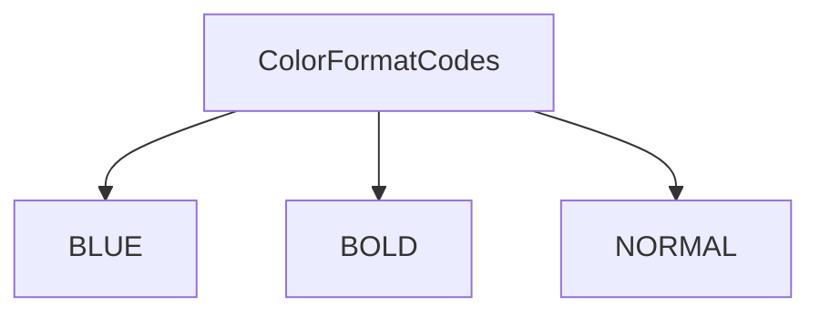
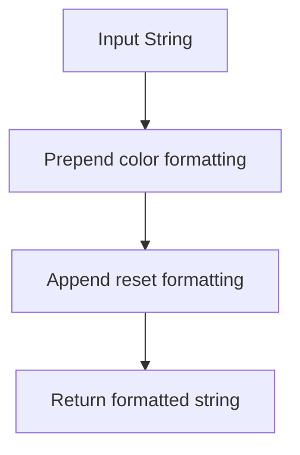
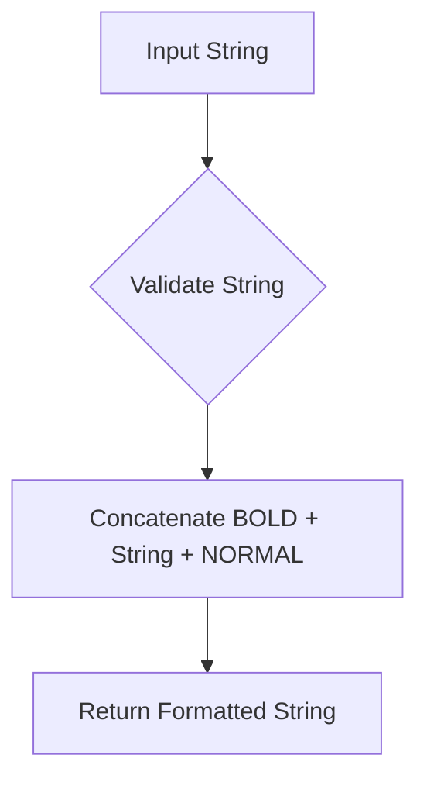

# `main.py`

## `mackup.main.ColorFormatCodes` · *class*

## Summary:
A utility class providing ANSI escape codes for terminal text formatting.

## Description:
This class defines constant ANSI escape sequences used to format text output in terminal environments. It serves as a centralized location for terminal formatting codes, making it easier to apply consistent styling to console output throughout the application. The class is typically used to add color and style to command-line interface messages.

## State:
- BLUE (str): ANSI escape sequence for setting text color to blue ("\033[34m")
- BOLD (str): ANSI escape sequence for making text bold ("\033[1m")  
- NORMAL (str): ANSI escape sequence for resetting text formatting ("\033[0m")

All attributes are immutable class constants with no validation constraints.

## Lifecycle:
- Creation: The class is instantiated automatically when imported; no explicit instantiation is required
- Usage: Constants are accessed directly as class attributes (e.g., ColorFormatCodes.BLUE)
- Destruction: No special cleanup required as it's a pure constants class

## Method Map:


## Raises:
No exceptions are raised during class initialization as it only contains constant definitions.

## Example:
```python
from mackup.main import ColorFormatCodes

# Apply formatting to text
message = f"{ColorFormatCodes.BLUE}This is blue text{ColorFormatCodes.NORMAL}"
bold_message = f"{ColorFormatCodes.BOLD}This is bold text{ColorFormatCodes.NORMAL}"

print(message)
print(bold_message)
```

## `mackup.main.header` · *function*

## Summary:
Returns a string formatted with terminal blue color coding.

## Description:
Wraps the input string with terminal color formatting codes to display text in blue. This utility function provides consistent header formatting for terminal-based user interfaces.

## Args:
    str (str): The string to be formatted with blue color coding.

## Returns:
    str: The input string with terminal color formatting codes prepended and reset codes appended.

## Raises:
    None: This function does not explicitly raise exceptions.

## Constraints:
    Preconditions: The input must be a string type.
    Postconditions: The returned string contains terminal formatting escape sequences.

## Side Effects:
    None: This function has no side effects beyond returning a formatted string.

## Control Flow:


## Examples:
    >>> header("Welcome to Mackup")
    # Returns string with blue color formatting applied

## `mackup.main.bold` · *function*

## Summary:
Formats a string with bold terminal formatting codes.

## Description:
Wraps the input string with ANSI escape codes to render text in bold font when displayed in a compatible terminal. This utility function provides a clean abstraction for applying bold formatting to text output throughout the application. The actual formatting codes are defined in the ColorFormatCodes class/module.

## Args:
    str (str): The input string to be formatted with bold styling.

## Returns:
    str: The input string wrapped with ANSI bold formatting codes followed by normal formatting codes.

## Raises:
    None

## Constraints:
    Preconditions:
        - Input must be a string type
    Postconditions:
        - Output string contains ANSI escape codes for bold formatting
        - Original string content is preserved within the formatting wrapper

## Side Effects:
    None

## Control Flow:


## Examples:
    # Basic usage
    bold("Hello World")  # Returns "\033[1mHello World\033[0m" (assuming standard ANSI codes)
    
    # In context of application output
    print(bold("Important Notice"))  # Displays "Important Notice" in bold
```

## `mackup.main.main` · *function*

## Summary:
Main entry point for the Mackup application that processes command-line arguments and orchestrates backup, restore, uninstall, list, and show operations for user application configurations.

## Description:
The main function serves as the central command-line interface for Mackup, parsing user arguments via docopt and delegating to appropriate operations. It handles five primary modes of operation: backup (synchronizing configuration files to storage), restore (retrieving files from storage), uninstall (removing Mackup management and restoring original files), list (displaying supported applications), and show (displaying details for a specific application). The function manages global configuration flags (--force, --root) and coordinates between the core Mackup system, application database, and individual application profiles.

## Args:
    None: This function reads command-line arguments via docopt and does not accept parameters directly.

## Returns:
    None: This function performs operations and exits, returning no value.

## Raises:
    SystemExit: When an unsupported application is specified in show mode or when environment validation fails.

## Constraints:
    Preconditions:
        - Must be run from a command-line interface with proper arguments
        - Environment must meet requirements for the selected operation (backup/restore/uninstall)
        - Application database must be properly initialized
    Postconditions:
        - Temporary folders are cleaned up after execution
        - Global utility flags (FORCE_YES, CAN_RUN_AS_ROOT) are set according to command-line options

## Side Effects:
    - Modifies global utility flags (FORCE_YES, CAN_RUN_AS_ROOT) when --force or --root flags are used
    - Performs file I/O operations (reading/writing configuration files, creating/deleting symbolic links)
    - May prompt user for confirmation in interactive mode when uninstalling
    - Prints formatted output to stdout for list and show operations
    - Creates and modifies directories in the user's home folder during backup/restore operations

## Control Flow:
```mermaid
flowchart TD
    A[Parse CLI args with docopt] --> B{Backup mode?}
    B -->|Yes| C[Validate backup environment]
    C --> D[Iterate apps to backup]
    D --> E[Create ApplicationProfile]
    E --> F[Call app.backup()]
    F --> G[Clean temp folder]
    
    B -->|No| H{Restore mode?}
    H -->|Yes| I[Validate restore environment]
    I --> J[Restore Mackup app first]
    J --> K[Reinitialize Mackup/db]
    K --> L[Iterate remaining apps]
    L --> M[Create ApplicationProfile]
    M --> N[Call app.restore()]
    N --> G
    
    H -->|No| O{Uninstall mode?}
    O -->|Yes| P[Validate restore environment]
    P --> Q{Dry run or confirmed?}
    Q -->|Yes| R[Iterate apps to uninstall]
    R --> S[Create ApplicationProfile]
    S --> T[Call app.uninstall()]
    T --> U[Uninstall Mackup app]
    U --> V[Print completion message]
    V --> G
    
    O -->|No| W{List mode?}
    W -->|Yes| X[Validate environment]
    X --> Y[Print app list]
    Y --> G
    
    W -->|No| Z{Show mode?}
    Z -->|Yes| AA[Validate environment]
    AA --> AB[Get app name from args]
    AB --> AC{App supported?}
    AC -->|No| AD[SystemExit]
    AC -->|Yes| AE[Print app details]
    AE --> G
    
    Z -->|No| AF[Invalid command]
    AF --> AG[SystemExit]
```

## Examples:
    # Backup all configured applications
    $ mackup backup
    
    # Restore configuration files from backup
    $ mackup restore
    
    # Uninstall Mackup and restore original files
    $ mackup uninstall
    
    # List all supported applications
    $ mackup list
    
    # Show details for a specific application
    $ mackup show vim
```

