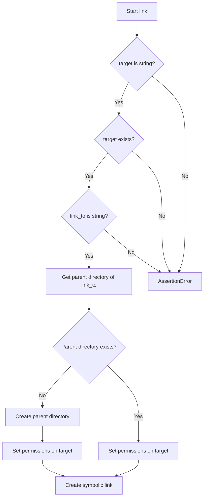
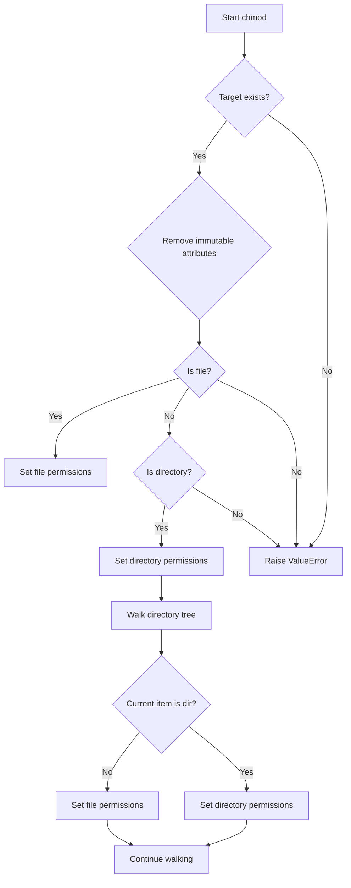
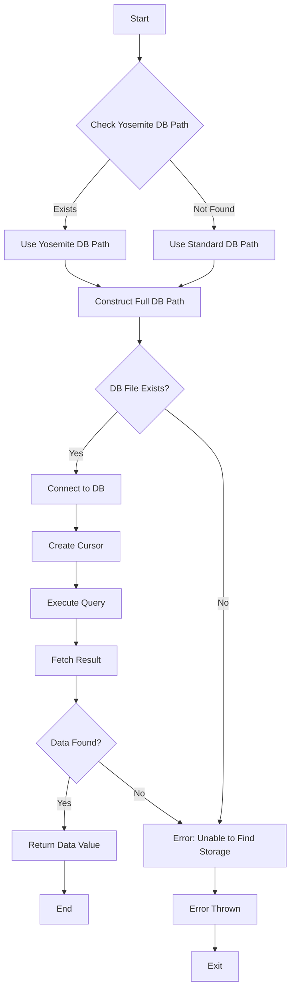
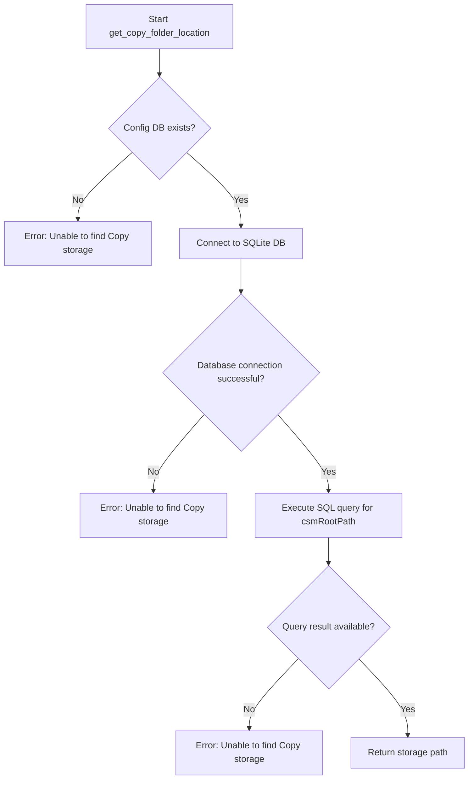
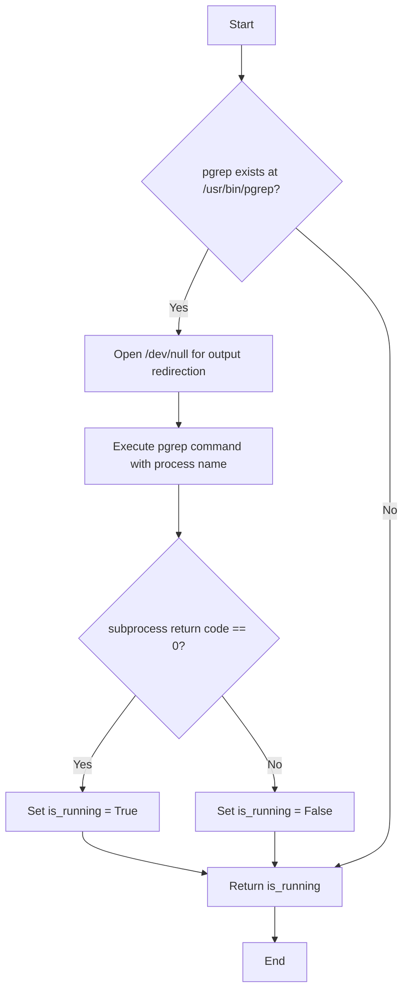
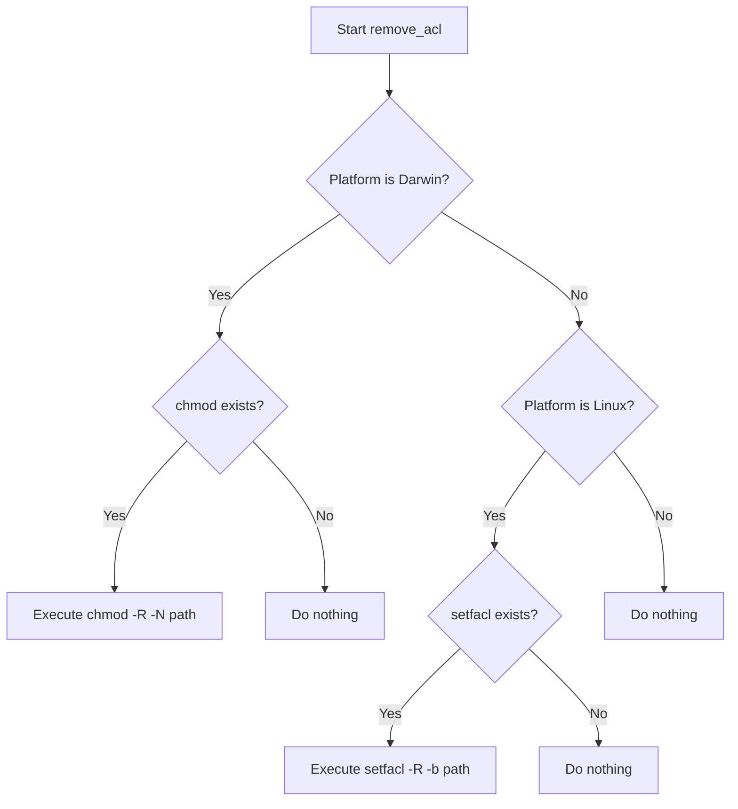
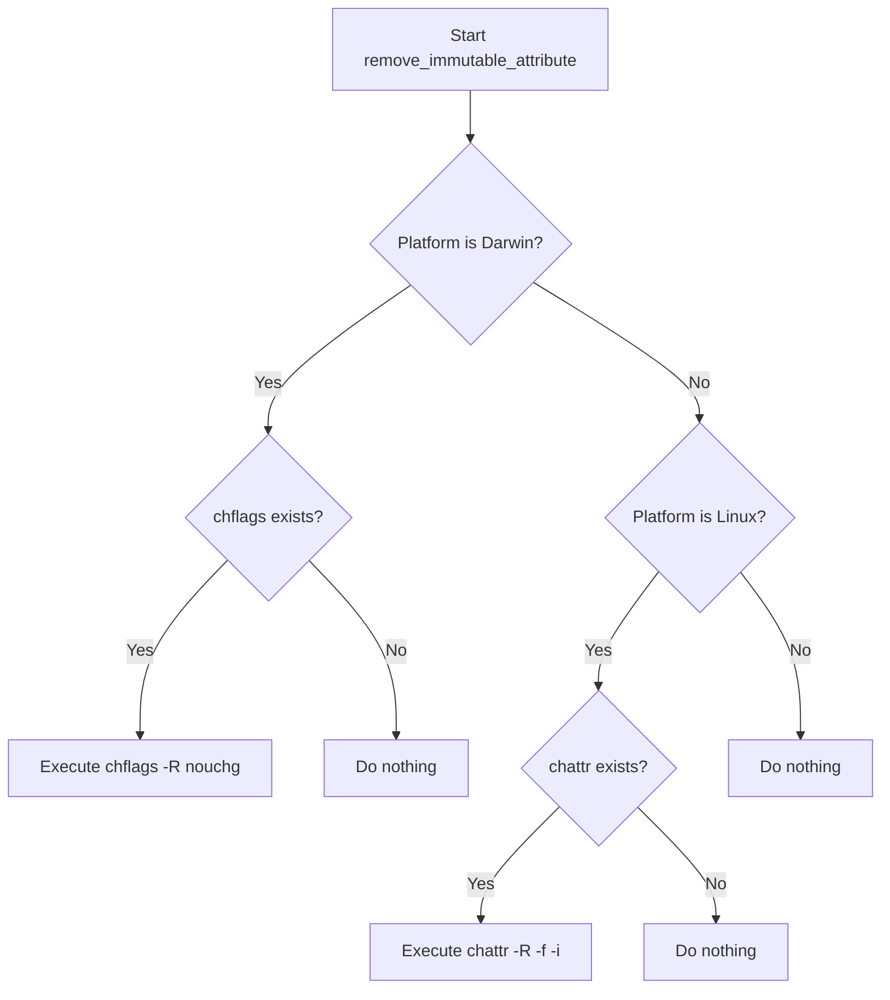

# `utils.py`

## `mackup.utils.confirm` · *function*

## Summary:
Prompts the user for confirmation and returns a boolean indicating whether the user accepted or rejected the request.

## Description:
This utility function provides a standardized way to request user confirmation for potentially destructive or important operations. It supports an automated mode via the FORCE_YES global flag that bypasses user interaction. The function normalizes user input to handle both full words ("yes"/"no") and single letters ("y"/"n").

## Args:
    question (str): The question or prompt to display to the user for confirmation.

## Returns:
    bool: True if the user confirms (answers "yes" or "y"), False if the user rejects (answers "no" or "n").

## Raises:
    KeyboardInterrupt: If the user interrupts the input process (e.g., Ctrl+C).

## Constraints:
    Precondition: The question parameter must be a string.
    Postcondition: Returns either True or False based on user input or FORCE_YES flag.

## Side Effects:
    I/O: Writes to stdout (displaying the question) and reads from stdin (user input).
    No external state mutations occur.

## Control Flow:
```mermaid
flowchart TD
    A[Start confirm()] --> B{FORCE_YES?}
    B -- Yes --> C[Return True]
    B -- No --> D[Display question]
    D --> E[Read user input]
    E --> F{Input is "yes" or "y"?}
    F -- Yes --> G[confirmed = True]
    F -- No --> H[confirmed = False]
    G --> I[Break loop]
    H --> I
    I --> J[Return confirmed]
```

## Examples:
    >>> confirm("Do you want to delete this file?")
    Do you want to delete this file? <Yes|No> y
    True
    
    >>> confirm("Are you sure you want to proceed?")
    Are you sure you want to proceed? <Yes|No> n
    False

## `mackup.utils.delete` · *function*

## Summary:
Deletes a file or directory while removing associated ACLs and immutable attributes.

## Description:
Removes a file or directory at the specified path after cleaning up platform-specific file attributes. This function ensures that files and directories can be safely deleted by first removing Access Control Lists (ACLs) and immutable attributes that might prevent deletion on certain operating systems.

The logic is extracted into its own function to encapsulate the complete deletion process including cleanup of file attributes, separating cross-platform file management concerns from higher-level backup/restore workflows.

## Args:
    filepath (str): The absolute or relative path to the file or directory to be deleted.

## Returns:
    None: This function does not return any value.

## Raises:
    OSError: Raised by underlying system calls when the file or directory cannot be accessed or removed due to permission issues or other filesystem errors.

## Constraints:
    Preconditions:
    - The filepath must exist and be accessible
    - The user must have appropriate permissions to modify file attributes and delete the target
    - The system must have the required tools installed for ACL and immutable attribute removal (platform-dependent)

    Postconditions:
    - The specified file or directory is completely removed from the filesystem
    - Associated ACLs and immutable attributes are cleared before deletion
    - No return value is provided

## Side Effects:
    - Modifies file permissions and attributes on the specified path
    - Executes external system commands for ACL and immutable attribute removal
    - Removes files or directories from the filesystem
    - May affect file access permissions on the filesystem

## Control Flow:
```mermaid
flowchart TD
    A[Start delete] --> B[Remove ACLs from filepath]
    B --> C[Remove immutable attributes from filepath]
    C --> D{Is filepath a file or link?}
    D -- Yes --> E[os.remove(filepath)]
    D -- No --> F{Is filepath a directory?}
    F -- Yes --> G[shutil.rmtree(filepath)]
    F -- No --> H[Do nothing - invalid path type]
```

## Examples:
    # Delete a regular file
    delete('/home/user/config.txt')
    
    # Delete a directory with nested files
    delete('/home/user/backup/')
    
    # Delete a symbolic link
    delete('/home/user/link_to_file')
```

## `mackup.utils.copy` · *function*

## Summary
Copies files or directories from a source location to a destination, creating parent directories as needed and setting appropriate file permissions.

## Description
This function provides a robust mechanism for copying files or directories from a source path to a destination path. It ensures that the destination directory structure exists before copying, handles both file and directory copying appropriately, and applies proper file permissions to the copied items.

The logic is extracted into its own function to encapsulate the complexity of handling different file types (files vs directories) and ensuring proper path creation and permission setting, rather than inlining this behavior throughout the codebase.

## Args
    src (str): The absolute or relative path to the source file or directory to be copied. Must exist on the filesystem.
    dst (str): The absolute or relative path to the destination where the source will be copied. Can be a file or directory path.

## Returns
    None: This function does not return any value.

## Raises
    ValueError: If the source path is neither a file nor a directory (unsupported file type).

## Constraints
    Preconditions:
    - The src parameter must be a string
    - The src path must exist on the filesystem
    - The dst parameter must be a string
    
    Postconditions:
    - The destination directory structure will be created if it doesn't exist
    - The source will be copied to the destination
    - The copied destination will have appropriate file permissions applied

## Side Effects
    - Creates parent directories in the destination path if they don't exist
    - Performs file system I/O operations (copying files/directories)
    - Modifies file permissions on the destination using the chmod function
    - May execute system commands through the chmod function's underlying operations

## Control Flow
```mermaid
flowchart TD
    A[Start copy] --> B{src is string?}
    B -- Yes --> C{src exists?}
    C -- Yes --> D{dst parent dir exists?}
    D -- No --> E[Create parent directories]
    E --> F{src is file?}
    F -- Yes --> G[shutil.copy(src, dst)]
    F -- No --> H{src is directory?}
    H -- Yes --> I[shutil.copytree(src, dst)]
    H -- No --> J[Raise ValueError]
    D -- Yes --> K{src is file?}
    K -- Yes --> G
    K -- No --> H
    J --> L[End]
    G --> L
    I --> L
```

## Examples
    # Copy a single file
    copy("/home/user/document.txt", "/backup/document.txt")
    
    # Copy a directory
    copy("/home/user/documents", "/backup/documents")
    
    # Handle potential errors
    try:
        copy("/home/user/source", "/destination/path")
    except ValueError as e:
        print(f"Copy failed: {e}")
```

## `mackup.utils.link` · *function*

## Summary
Creates a symbolic link from a target file or directory to a specified destination path.

## Description
This function establishes a symbolic link (symlink) from a target file or directory to a specified destination. It ensures the destination directory exists, sets appropriate permissions on the target, and then creates the symbolic link. The function is designed to handle both files and directories properly.

The logic is extracted into its own function to encapsulate the symlink creation process, ensuring proper directory setup, permission handling, and atomic link creation. This separation allows for consistent symlink creation behavior throughout the application while keeping the permission management logic in a dedicated function.

## Args
    target (str): The absolute or relative path to the file or directory that will be linked. Must exist on the filesystem.
    link_to (str): The absolute or relative path where the symbolic link will be created. The parent directory will be automatically created if it doesn't exist.

## Returns
    None: This function does not return any value.

## Raises
    AssertionError: If target is not a string, target does not exist, or link_to is not a string.

## Constraints
    Preconditions:
    - The target parameter must be a string
    - The target path must exist on the filesystem
    - The link_to parameter must be a string
    
    Postconditions:
    - The parent directory of link_to will exist (created if needed)
    - The target will have appropriate permissions set via chmod function
    - A symbolic link will be created from target to link_to

## Side Effects
    - Creates directories in the path to link_to if they don't exist
    - Modifies file permissions on the target using chmod function
    - Creates a symbolic link on the filesystem

## Control Flow


## Examples
    # Create a symlink for a file
    link("/home/user/documents/config.txt", "/home/user/.config/app_config.txt")
    
    # Create a symlink for a directory
    link("/home/user/backups/project", "/home/user/.local/share/project_backup")
    
    # Handle potential errors
    try:
        link("/nonexistent/file.txt", "/some/path/link.txt")
    except AssertionError:
        print("Invalid parameters or target does not exist")
```

## `mackup.utils.chmod` · *function*

## Summary
Sets appropriate read/write permissions for files and directories, recursively applying permissions to all nested files and directories while removing immutable attributes first.

## Description
This function configures file system permissions for a given target path. It removes immutable attributes first, then applies different permission modes based on whether the target is a file or directory. For directories, it recursively applies permissions to all contained files and subdirectories. This function is typically used during backup restoration or file management operations where proper file permissions are critical.

The logic is extracted into its own function to encapsulate the complex permission setting behavior and ensure consistent handling of both files and directories, including recursive permission application and immutable attribute removal.

## Args
    target (str): The absolute or relative path to the file or directory whose permissions should be set. Must exist and be a valid file or directory path.

## Returns
    None: This function does not return any value.

## Raises
    ValueError: If the target path is neither a file nor a directory (unsupported file type).

## Constraints
    Preconditions:
    - The target parameter must be a string
    - The target path must exist on the filesystem
    - The calling process must have appropriate permissions to modify file attributes and permissions
    
    Postconditions:
    - The target file or directory will have appropriate read/write permissions
    - All nested files and directories will have consistent permissions applied
    - Immutable attributes will be removed from the target and its contents

## Side Effects
    - Modifies file permissions on the filesystem using os.chmod
    - Removes immutable attributes from files and directories via remove_immutable_attribute function
    - May execute system commands through subprocess calls (via remove_immutable_attribute)

## Control Flow


## Examples
    # Set permissions for a single file
    chmod("/home/user/myfile.txt")
    
    # Set permissions for a directory and all its contents
    chmod("/home/user/backup_directory")
    
    # Handle potential errors
    try:
        chmod("/path/to/target")
    except ValueError as e:
        print(f"Unsupported file type: {e}")
```

## `mackup.utils.error` · *function*

## Summary:
Exits the program with a colored error message displayed in red.

## Description:
Displays an error message in red text using ANSI escape codes and terminates the program execution. This function serves as a centralized error reporting mechanism that provides visual distinction for error messages in terminal environments.

## Args:
    message (str): The error message to display before exiting the program.

## Returns:
    This function does not return as it calls sys.exit() to terminate execution.

## Raises:
    This function does not raise exceptions directly, but sys.exit() will be called with the formatted error message.

## Constraints:
    Preconditions:
    - The message parameter must be a string
    - The program environment must support ANSI escape codes for colored output
    
    Postconditions:
    - Program execution terminates immediately
    - Error message is displayed in red text to stderr

## Side Effects:
    - Terminates program execution via sys.exit()
    - Outputs colored text to standard error stream
    - No file I/O or external state mutations

## Control Flow:
```mermaid
flowchart TD
    A[Call error(message)] --> B[Define red color code]
    B --> C[Define reset code]
    C --> D[Format message with colors]
    D --> E[Exit program with error message]
```

## Examples:
    error("Configuration file not found")
    # Output: Error: Configuration file not found (in red text)
    # Program exits immediately

    error("Invalid user input provided")
    # Output: Error: Invalid user input provided (in red text)
    # Program exits immediately
```

## `mackup.utils.get_dropbox_folder_location` · *function*

## Summary:
Retrieves the local Dropbox folder path by parsing the Dropbox host database file.

## Description:
This function extracts the Dropbox installation directory path from the Dropbox host database file (.dropbox/host.db). It reads the host database, decodes base64-encoded data, and returns the path to the Dropbox folder. This logic is encapsulated in a separate function to isolate the Dropbox-specific file parsing logic from the main application flow.

## Args:
    None

## Returns:
    str: The absolute path to the local Dropbox folder as stored in the Dropbox host database.

## Raises:
    SystemExit: When the Dropbox host database file cannot be found or accessed, causing the program to exit with an error message.

## Constraints:
    Preconditions:
    - The HOME environment variable must be set and point to a valid user home directory
    - The Dropbox application must be installed and have created a host.db file
    - The host.db file must contain properly formatted base64-encoded data
    
    Postconditions:
    - The function returns a valid filesystem path to the Dropbox folder
    - If the Dropbox installation is not found, the program exits with an error

## Side Effects:
    - Reads from the local filesystem (specifically ~/.dropbox/host.db)
    - Exits the program with error code 1 if Dropbox installation cannot be located

## Control Flow:
```mermaid
flowchart TD
    A[Start get_dropbox_folder_location] --> B[Construct host.db file path]
    B --> C[Try to open host.db file]
    C --> D{File exists?}
    D -->|No| E[Exit with error]
    D -->|Yes| F[Read file content]
    F --> G[Split content into tokens]
    G --> H[Decode second token (data[1])]
    H --> I[Return decoded path]
```

## Examples:
    # Typical usage in a backup/restore workflow
    try:
        dropbox_path = get_dropbox_folder_location()
        print(f"Dropbox folder located at: {dropbox_path}")
    except SystemExit:
        print("Dropbox installation not found - cannot continue")
```

## `mackup.utils.get_google_drive_folder_location` · *function*

## Summary:
Retrieves the local synchronized folder path for Google Drive by querying the application's configuration database.

## Description:
This function locates and reads the Google Drive synchronization configuration database to extract the local folder path where Google Drive files are stored. It handles different database file locations for various macOS versions and returns the configured sync root path. The function is designed to be a centralized utility for accessing Google Drive's local storage location within the Mackup application management system.

## Args:
    None

## Returns:
    str: The absolute path to the local Google Drive synchronized folder.

## Raises:
    Exception: When unable to locate the Google Drive configuration database or when the expected data field is not found in the database.

## Constraints:
    Preconditions:
    - The user must have Google Drive installed on macOS
    - The Google Drive application must have been run at least once to create the configuration database
    - The HOME environment variable must be set correctly
    
    Postconditions:
    - Returns a valid filesystem path string if Google Drive is properly configured
    - Function execution will terminate with an error if no valid configuration is found

## Side Effects:
    - Reads from the local filesystem (accesses SQLite database file)
    - May trigger database connection and query operations

## Control Flow:


## Examples:
    # Typical usage in Mackup context
    try:
        drive_path = get_google_drive_folder_location()
        print(f"Google Drive folder located at: {drive_path}")
    except Exception as e:
        print(f"Failed to locate Google Drive folder: {e}")
```

## `mackup.utils.get_copy_folder_location` · *function*

## Summary
Retrieves the storage location for Copy backup service by parsing its configuration database.

## Description
This function attempts to locate and read the Copy backup storage path from the Copy Agent's configuration database. It searches for a specific SQLite database file in the standard macOS location and extracts the 'csmRootPath' configuration value. This function is part of the Mackup utility suite for managing application configurations and backups.

## Args
None

## Returns
str: The absolute path to the Copy backup storage directory as stored in the configuration database.

## Raises
SystemExit: When the Copy configuration database cannot be found or the required configuration value cannot be retrieved, causing the program to exit with an error message.

## Constraints
Preconditions:
- The user's HOME environment variable must be set
- The Copy Agent must be installed on the system
- The Copy configuration database file must exist at the expected location

Postconditions:
- The function either returns a valid storage path or terminates the program

## Side Effects
- Reads from the filesystem (specifically from the user's home directory)
- May cause program termination if configuration cannot be found

## Control Flow


## Examples
```python
# Typical usage in backup/restore operations
storage_path = get_copy_folder_location()
# Returns something like "/Users/username/Library/Containers/com.copy.backup/Data/Library/Application Support/Copy Agent"
```

## `mackup.utils.get_icloud_folder_location` · *function*

## Summary:
Retrieves the local filesystem path to the iCloud Drive folder for macOS Yosemite and later versions.

## Description:
This utility function locates the user's iCloud Drive storage directory, which is typically found at "~/Library/Mobile Documents/com~apple~CloudDocs/" on macOS systems. The function expands the user path using `os.path.expanduser()`, verifies the directory exists, and returns the absolute path as a string.

The logic is extracted into a separate function to encapsulate the platform-specific iCloud path resolution and validation, making it reusable across different parts of the application that need access to iCloud storage locations.

## Args:
    None

## Returns:
    str: The absolute filesystem path to the iCloud Drive folder as a string.

## Raises:
    Error: When the iCloud Drive directory cannot be found at the expected location (the function calls an `error()` function with a formatted message from constants.ERROR_UNABLE_TO_FIND_STORAGE).

## Constraints:
    Preconditions:
    - The system must be running macOS (as the path is macOS-specific)
    - The user must have iCloud Drive enabled and configured
    - The iCloud Drive directory must exist at the expected location
    
    Postconditions:
    - Returns a valid string path to an existing directory
    - The returned path is expanded to the full absolute path

## Side Effects:
    None

## Control Flow:
```mermaid
flowchart TD
    A[Start] --> B{icloud_home directory exists?}
    B -- No --> C[Call error() with formatted message]
    B -- Yes --> D[Return str(icloud_home)]
```

## Examples:
```python
# Typical usage
try:
    icloud_path = get_icloud_folder_location()
    print(f"iCloud Drive located at: {icloud_path}")
except Exception as e:
    print(f"Failed to locate iCloud Drive: {e}")
```

## `mackup.utils.is_process_running` · *function*

## Summary:
Checks whether a process with the specified name is currently running on the system.

## Description:
Determines if a process is actively running by invoking the pgrep utility. This function provides a simple mechanism to detect running processes on Unix-like systems where pgrep is available. The logic is extracted into a separate function to promote code reuse and encapsulation of process detection functionality.

## Args:
    process_name (str): The name of the process to check for. This corresponds to the process name as it would appear in the process table.

## Returns:
    bool: True if the process is running, False otherwise.

## Raises:
    OSError: Raised by subprocess.call if the pgrep command cannot be executed or if there are permission issues.

## Constraints:
    Precondition: The system must have the pgrep utility installed at "/usr/bin/pgrep" for this function to work properly.
    Postcondition: The function returns a boolean value indicating the process status without side effects beyond subprocess execution.

## Side Effects:
    - Opens /dev/null for subprocess output redirection
    - Executes external subprocess command (pgrep)
    - May cause slight performance overhead due to subprocess invocation

## Control Flow:


## Examples:
```python
# Check if a specific process is running
if is_process_running("firefox"):
    print("Firefox is currently running")

# Check if a background service is active
if is_process_running("nginx"):
    print("Web server is operational")

# Handle potential errors when checking process status
try:
    if is_process_running("some_process"):
        print("Process is running")
except OSError:
    print("Could not check process status due to system error")
```

## `mackup.utils.remove_acl` · *function*

## Summary:
Removes Access Control Lists (ACLs) from a specified path using platform-appropriate system commands.

## Description:
This function removes ACLs from files and directories recursively by executing platform-specific system commands. It is designed to be called during backup/restore operations where file permissions and ACLs need to be reset to default POSIX permissions.

The logic is extracted into its own function to encapsulate platform-specific ACL removal behavior, separating cross-platform concerns from the main backup/restore workflow and ensuring clean compatibility across different operating systems.

## Args:
    path (str): The absolute or relative path to the directory or file from which ACLs should be removed.

## Returns:
    None: This function does not return any value.

## Raises:
    None: This function does not explicitly raise exceptions. System command execution errors are not handled or propagated.

## Constraints:
    Preconditions:
    - The path must exist and be accessible
    - The system must have the appropriate ACL removal tools installed (/bin/chmod on macOS, /bin/setfacl on Linux)
    - The user must have sufficient privileges to modify file permissions

    Postconditions:
    - ACLs are removed from the specified path and all its contents recursively
    - File permissions are reset to standard POSIX permissions

## Side Effects:
    - Modifies file permissions on the specified path and its contents
    - Executes external system commands (chmod or setfacl)
    - May affect file access permissions on the filesystem

## Control Flow:


## Examples:
    # Remove ACLs from a backup directory
    remove_acl('/path/to/backup/directory')
    
    # Remove ACLs from a configuration directory
    remove_acl('~/.config/myapp')
```

## `mackup.utils.remove_immutable_attribute` · *function*

## Summary:
Removes immutable file attributes from directories and their contents recursively on macOS and Linux systems.

## Description:
This function removes the immutable attribute from files and directories using platform-specific system commands. On macOS, it uses the `chflags` command with the `-R nouchg` option to remove the "no update" flag. On Linux, it uses the `chattr` command with the `-R -f -i` options to remove the immutable flag. The function is designed to handle cross-platform compatibility for file attribute management.

## Args:
    path (str): The absolute or relative path to the directory or file whose immutable attributes should be removed.

## Returns:
    None: This function does not return any value.

## Raises:
    None: This function does not explicitly raise exceptions, though underlying subprocess calls may raise OSError or other system-related exceptions.

## Constraints:
    Preconditions:
    - The path must exist and be accessible
    - The system must be either macOS (Darwin) or Linux
    - The required system utilities (`/usr/bin/chflags` on macOS or `/usr/bin/chattr` on Linux) must be present
    
    Postconditions:
    - Immutable attributes are removed from the specified path and its contents recursively
    - No return value is provided

## Side Effects:
    - Executes system commands via subprocess calls
    - Modifies file attributes on the filesystem
    - May cause permission errors if the user lacks appropriate privileges

## Control Flow:


## Examples:
    # Remove immutable attributes from a backup directory
    remove_immutable_attribute("/path/to/backup/directory")
    
    # Remove immutable attributes from a specific file
    remove_immutable_attribute("/path/to/specific/file.txt")
```

## `mackup.utils.can_file_be_synced_on_current_platform` · *function*

## Summary:
Determines whether a file can be synced based on platform-specific restrictions, particularly preventing syncing of Library directories on Linux systems.

## Description:
This function evaluates if a given file path can be safely synchronized across platforms. It implements platform-specific filtering logic to avoid syncing files that may cause issues or are not meant to be synced on certain operating systems. The primary restriction applies to Linux systems where files located in the "Library/" directory are excluded from synchronization.

## Args:
    path (str): A relative path to a file or directory that needs to be evaluated for sync compatibility.

## Returns:
    bool: True if the file can be synced, False if it should be excluded from synchronization (particularly on Linux systems when located in Library directory).

## Raises:
    KeyError: If the HOME environment variable is not set in the environment.

## Constraints:
    Preconditions:
    - The HOME environment variable must be set and accessible
    - The path parameter must be a valid string path
    
    Postconditions:
    - Returns a boolean value indicating sync eligibility
    - Does not modify any external state

## Side Effects:
    None - This function performs only path manipulation and comparison operations.

## Control Flow:
```mermaid
flowchart TD
    A[Start] --> B{platform.system() == PLATFORM_LINUX?}
    B -- Yes --> C{fullpath.startswith(library_path)?}
    C -- Yes --> D[can_be_synced = False]
    C -- No --> E[can_be_synced = True]
    B -- No --> F[can_be_synced = True]
    D --> G[Return can_be_synced]
    E --> G
    F --> G
    G[Return can_be_synced] --> H[End]
```

## Examples:
    >>> can_file_be_synced_on_current_platform("Documents/file.txt")
    True
    
    >>> can_file_be_synced_on_current_platform("Library/Application Support/app.conf")
    False  # On Linux systems where PLATFORM_LINUX constant is detected

