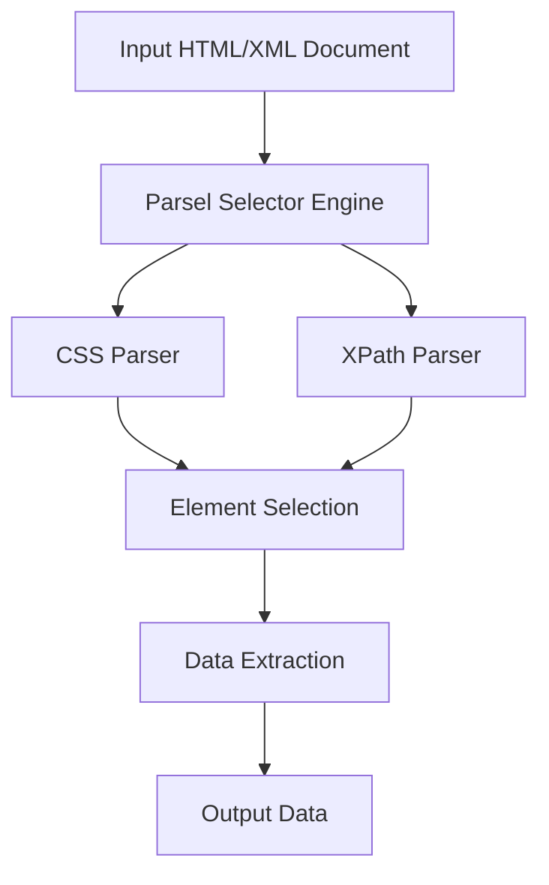

# `parsel`

## Repository Overview

### Tree Structure
```
parsel/
├── docs/
└── parsel/
```

### Purpose
This repository provides a Python library for extracting data from HTML and XML documents using CSS selectors and XPath expressions. It offers a convenient interface for parsing structured documents and extracting specific elements and data, making it ideal for web scraping, data mining, and content processing applications.

The library abstracts away the complexity of working directly with XML/HTML parsers, allowing developers to focus on data extraction rather than parsing mechanics.

### Target Users
- Web scrapers and data miners
- Developers building content processing pipelines  
- Automation engineers working with web APIs or HTML/XML data sources
- Data analysts extracting structured information from unstructured sources

### Position in Ecosystem
Parsel is a standalone Python library designed specifically for document parsing and data extraction. It can be used independently or integrated into larger web scraping frameworks and data processing pipelines. It serves as a high-level abstraction over underlying parsing engines.

### Architecture


Key architectural patterns:
- Pipeline-based processing of documents through selectors
- Fluent interface design for method chaining
- Abstraction layer over underlying parsing implementations
- Support for both CSS selectors and XPath expressions

### Entry Points
1. **Importable API**: 
   - Primary: `from parsel import Selector`
   - Direct imports: Various components accessible through the main package
2. **CLI**: Not typically provided - this is primarily a library

### Core Features
1. **CSS Selector Support** - Extract elements using CSS selectors
2. **XPath Expression Support** - Extract elements using XPath expressions
3. **HTML/XML Parsing** - Parse both HTML and XML documents
4. **Data Extraction** - Extract text content, attributes, and nested structures
5. **Multiple Output Formats** - Support for lists, strings, and dictionaries

### Dependencies
- **lxml**: Core dependency for XML/HTML parsing engine
- **cssselect**: For CSS selector parsing
- **six**: Python 2/3 compatibility utilities

### Configuration
No configuration files or environment variables required. Behavior is controlled through API parameters and method chaining.

### Extension Points
- Custom selector extensions through subclassing Selector
- Integration with custom parsing backends
- Plugin-style addition of new selector syntaxes

