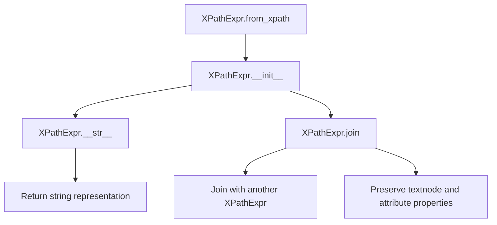
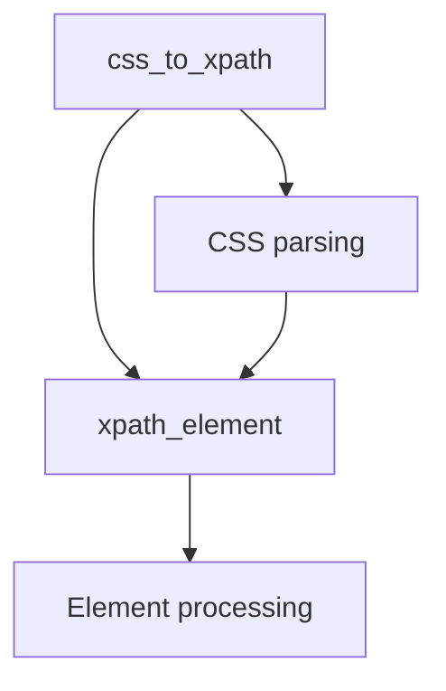
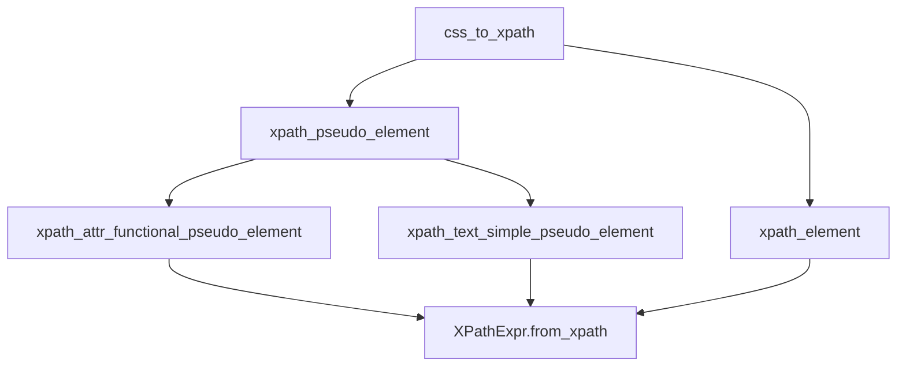
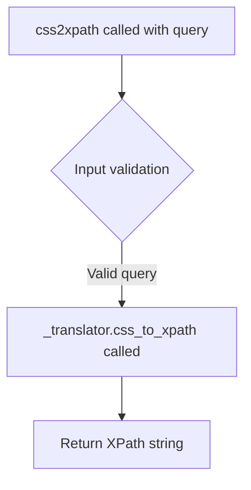

# `csstranslator.py`

## `parsel.csstranslator.XPathExpr` · *class*

## Summary:
A specialized XPath expression class that extends cssselect's XPathExpr to support text node and attribute-specific operations.

## Description:
This class extends the base XPathExpr functionality from cssselect to add support for text node selection and attribute access. It's primarily used in CSS selector translation contexts where more granular XPath control is needed. The class maintains full compatibility with the original XPathExpr while extending its capabilities to handle text content and attribute-specific queries.

## State:
- textnode: bool = False - Flag indicating whether this expression targets text nodes
- attribute: Optional[str] = None - Name of the attribute to select, or None if not selecting an attribute

## Lifecycle:
- Creation: Instances can be created directly using the constructor or via the `from_xpath` classmethod
- Usage: Typically used in CSS-to-XPath translation processes where text nodes or attributes need special handling
- Destruction: Inherits standard Python object destruction behavior

## Method Map:


## Raises:
- ValueError in join() method when attempting to join with non-XPathExpr objects
- ExpressionError from parent class methods when XPath construction fails

## Example:
```python
# Create from existing XPath expression
from cssselect.xpath import XPathExpr as OriginalXPathExpr
original = OriginalXPathExpr(path="div", element="div")
extended = XPathExpr.from_xpath(original, textnode=True)

# String representation shows text() for text nodes
print(str(extended))  # Output: "div/text()"

# Join with another expression
other = XPathExpr.from_xpath(original, attribute="class")
joined = extended.join("/", other)
print(str(joined))  # Output: "div/text()/@class"

# Direct instantiation
direct = XPathExpr(path="p", element="p", condition="[@id='test']")
print(str(direct))  # Output: "p[@id='test']"
```

### `parsel.csstranslator.XPathExpr.from_xpath` · *method*

## Summary:
Creates a new XPathExpr instance by copying properties from an existing XPath expression while allowing override of textnode and attribute settings.

## Description:
A classmethod factory that constructs a new XPathExpr instance from an existing XPath expression object. This method enables creating modified copies of XPath expressions while preserving the core path structure (path, element, condition) and optionally setting textnode and attribute properties.

The method is typically used during CSS selector translation when converting CSS expressions to XPath expressions, particularly when additional text node or attribute selection needs to be applied to an existing XPath structure.

## Args:
    cls: The class type (used for classmethod)
    xpath (OriginalXPathExpr): Source XPath expression containing path, element, and condition attributes
    textnode (bool): Flag indicating whether the expression targets text nodes. Defaults to False
    attribute (Optional[str]): Name of attribute to select, or None if selecting element/element content. Defaults to None

## Returns:
    Self: A new instance of XPathExpr with copied path/element/condition from xpath parameter and overridden textnode/attribute properties

## Raises:
    None explicitly raised

## State Changes:
    Attributes READ: xpath.path, xpath.element, xpath.condition
    Attributes WRITTEN: x.textnode, x.attribute

## Constraints:
    Preconditions:
    - The xpath parameter must have path, element, and condition attributes
    - The xpath parameter must be compatible with the XPathExpr constructor
    - cls must be a valid class that accepts path, element, and condition arguments in its constructor
    
    Postconditions:
    - Returns a new XPathExpr instance with identical path, element, and condition from source xpath
    - The returned instance has textnode set to the provided value (defaulting to False)
    - The returned instance has attribute set to the provided value (defaulting to None)

## Side Effects:
    None

### `parsel.csstranslator.XPathExpr.__str__` · *method*

## Summary:
Returns a string representation of the XPath expression, with special handling for text nodes and attribute selection.

## Description:
Converts the XPath expression to its canonical string form, applying XPath-specific formatting rules for text node selection and attribute access. This method is invoked during XPath expression serialization and ensures proper XPath syntax for different selection contexts.

When `textnode=True`, the method transforms the path to properly represent text content selection according to XPath conventions:
- For root wildcard paths ("*"), returns "text()" 
- For paths ending with "::*/*", replaces the last segment with "text()"
- For other paths, appends "/text()"

When `attribute` is specified, the method appends the attribute reference to the path:
- For paths ending with "::*/*", removes the trailing "/@" before appending the attribute
- Otherwise, appends "/@{attribute_name}"

## Args:
    None

## Returns:
    str: A properly formatted XPath expression string that maintains XPath syntax conventions for text nodes and attributes.

## Raises:
    None explicitly raised

## State Changes:
    Attributes READ: self.textnode, self.attribute
    Attributes WRITTEN: None

## Constraints:
    Preconditions:
    - The parent class must implement a `__str__` method that returns a valid XPath path string
    - The `textnode` attribute must be a boolean value
    - The `attribute` attribute must be None or a string value
    
    Postconditions:
    - Returns a syntactically valid XPath expression string
    - Text node selection follows XPath conventions (text(), /text())
    - Attribute access follows XPath conventions (@attribute)

## Side Effects:
    None

### `parsel.csstranslator.XPathExpr.join` · *method*

## Summary:
Joins this XPath expression with another expression using a combiner string, copying textnode and attribute properties from the other expression.

## Description:
This method combines the current XPath expression with another XPath expression using the specified combiner operator. It ensures type compatibility between expressions and propagates textnode and attribute metadata from the joined expression to the current one. This method is designed to be part of a custom XPath expression class that extends the base cssselect XPathExpr class.

## Args:
    combiner (str): The XPath combiner operator (e.g., 'and', 'or') to use when joining expressions
    other (XPathExpr): Another XPath expression to join with this one. Must be an instance of XPathExpr or its descendants.
    *args (Any): Additional positional arguments passed to the parent join method
    **kwargs (Any): Additional keyword arguments passed to the parent join method

## Returns:
    Self: Returns self to enable method chaining

## Raises:
    ValueError: When the other expression is not an instance of XPathExpr or its descendants. The error message indicates that only expressions of the same type (or descendants) can be joined.

## State Changes:
    Attributes READ: None
    Attributes WRITTEN: 
        - self.textnode: Set to the textnode property of the other expression
        - self.attribute: Set to the attribute property of the other expression

## Constraints:
    Preconditions:
        - The other expression must be an instance of XPathExpr or its descendant classes
        - The combiner string must be valid for XPath expression joining
    Postconditions:
        - The current expression is modified to represent the joined result
        - The textnode and attribute properties are copied from the other expression
        - The method returns self for chaining

## Side Effects:
    None

## `parsel.csstranslator.TranslatorProtocol` · *class*

## Summary:
Defines the interface for CSS selector to XPath expression translation in the parsel library.

## Description:
The TranslatorProtocol specifies the contract that CSS selector translators must implement to convert CSS selectors into XPath expressions. This protocol enables consistent interaction with CSS-to-XPath conversion functionality while allowing different implementations for various use cases (generic vs HTML-specific translation).

The protocol is designed to be implemented by classes such as GenericTranslator and HTMLTranslator from the cssselect library, providing a standardized way to process CSS selectors for XML/HTML document querying.

## State:
- No instance attributes as this is a Protocol defining an interface
- All behavior is defined through method signatures

## Lifecycle:
- Creation: Objects implementing this protocol are instantiated through concrete classes (GenericTranslator, HTMLTranslator, etc.)
- Usage: Called by CSS selector parsing functions that require conversion of CSS expressions to XPath
- Destruction: Managed by Python's garbage collection

## Method Map:


## Raises:
- No explicit exceptions defined in the protocol interface
- Concrete implementations may raise ExpressionError from cssselect.xpath when invalid CSS is encountered

## Example:
```python
# Typical usage pattern with concrete implementation
from cssselect import GenericTranslator
translator = GenericTranslator()
xpath_expr = translator.css_to_xpath("div.class p:nth-child(2)")
# xpath_element method processes individual Element objects
```

## `parsel.csstranslator.TranslatorMixin` · *class*

## Summary:
A mixin class that extends CSS selector translation capabilities by providing custom implementations for XPath element and pseudo-element handling.

## Description:
The TranslatorMixin class enhances the CSS to XPath translation process by extending the functionality of cssselect's GenericTranslator and HTMLTranslator classes. It provides custom implementations for translating CSS selectors containing pseudo-elements into XPath expressions. This mixin allows for the extension of CSS selector support beyond what is provided by the base cssselect library.

The class implements specialized methods for handling both functional pseudo-elements (like ::attr()) and simple pseudo-elements (like ::text), enabling more advanced CSS selector features in XPath translation. It serves as a bridge between the cssselect library and extended XPath functionality.

## State:
- The class doesn't maintain any instance state beyond what's inherited from its parent translators
- All methods operate on the translation context provided by the parent class
- Uses dynamic method dispatching based on pseudo-element names
- Inherits from cssselect's GenericTranslator or HTMLTranslator base classes

## Lifecycle:
- Creation: Instantiated as part of a class hierarchy that inherits from cssselect's GenericTranslator or HTMLTranslator
- Usage: Methods are automatically invoked during CSS to XPath translation processes when encountering elements or pseudo-elements
- Destruction: No special cleanup required; relies on parent class lifecycle management

## Method Map:


## Raises:
- ExpressionError: Raised when encountering unknown functional pseudo-elements (::unknown-function()) or unknown simple pseudo-elements (::unknown)
- ExpressionError: Raised when ::attr() functional pseudo-element receives invalid arguments (not a single string or ident)

## Example:
```python
# Usage with GenericTranslator
from parsel import GenericTranslator

# The TranslatorMixin is automatically used when creating instances
translator = GenericTranslator()

# This will work with supported pseudo-elements
xpath = translator.css_to_xpath("div::text")
xpath = translator.css_to_xpath("span::attr(class)")
```

### `parsel.csstranslator.TranslatorMixin.xpath_element` · *method*

*No documentation generated.*

### `parsel.csstranslator.TranslatorMixin.xpath_pseudo_element` · *method*

## Summary:
Dispatches CSS pseudo-element handling to specialized methods based on pseudo-element type.

## Description:
Routes CSS pseudo-element selectors to appropriate handler methods for translation into XPath expressions. This method serves as a central dispatcher that determines whether a pseudo-element is functional (with parentheses) or simple, then calls the corresponding specialized handler method. The method dynamically discovers handler methods by convention-based naming and raises appropriate errors when handlers are missing.

This logic is separated into its own method rather than being inlined because it provides a clean extension point for new pseudo-elements, follows the strategy pattern for different pseudo-element types, and centralizes the dispatching logic to avoid duplication.

## Args:
    self: The TranslatorMixin instance containing the translation logic
    xpath (OriginalXPathExpr): The existing XPath expression to be modified by pseudo-element processing
    pseudo_element (PseudoElement): The CSS pseudo-element to be translated into XPath

## Returns:
    OriginalXPathExpr: A modified XPath expression incorporating the pseudo-element semantics

## Raises:
    ExpressionError: When a functional pseudo-element lacks a corresponding handler method, or when a simple pseudo-element lacks a corresponding handler method

## State Changes:
    Attributes READ: None
    Attributes WRITTEN: None

## Constraints:
    Preconditions:
    - The pseudo_element parameter must be either a FunctionalPseudoElement or a PseudoElement instance
    - The xpath parameter must be a valid XPath expression compatible with the translator
    - Handler methods must follow the naming convention: 
      * For functional pseudo-elements: `xpath_{name}_functional_pseudo_element`
      * For simple pseudo-elements: `xpath_{name}_simple_pseudo_element`
    
    Postconditions:
    - The returned XPath expression reflects the semantics of the processed pseudo-element
    - The method preserves the original XPath structure while applying pseudo-element transformations

## Side Effects:
    None

### `parsel.csstranslator.TranslatorMixin.xpath_attr_functional_pseudo_element` · *method*

## Summary:
Transforms a CSS selector's `::attr()` functional pseudo-element into an XPath expression that targets a specific attribute.

## Description:
Handles the translation of CSS functional pseudo-elements of the form `::attr(attribute-name)` into equivalent XPath expressions. This method is invoked during the CSS to XPath conversion process when encountering the `::attr()` pseudo-element, which selects elements based on their attribute values.

This logic is separated into its own method because it represents a specific CSS selector feature that requires special handling for argument validation and XPath construction, distinct from other pseudo-element types like `::text`.

## Args:
    self: The TranslatorMixin instance containing the translation logic
    xpath (OriginalXPathExpr): The existing XPath expression to be modified
    function (FunctionalPseudoElement): The functional pseudo-element representing `::attr()` with its arguments

## Returns:
    XPathExpr: A new XPath expression that targets the specified attribute of the original selection

## Raises:
    ExpressionError: When the `::attr()` pseudo-element receives invalid arguments (not a single string or identifier)

## State Changes:
    Attributes READ: None
    Attributes WRITTEN: None

## Constraints:
    Preconditions:
    - The `function` parameter must be a FunctionalPseudoElement with name "attr"
    - The function must have exactly one argument that is either a STRING or IDENT type
    - The xpath parameter must be a valid XPath expression
    
    Postconditions:
    - The returned XPathExpr will target the attribute specified in function.arguments[0].value
    - The method preserves the original XPath structure while adding attribute selection

## Side Effects:
    None

### `parsel.csstranslator.TranslatorMixin.xpath_text_simple_pseudo_element` · *method*

## Summary:
Modifies an XPath expression to target text nodes instead of element nodes.

## Description:
Converts a given XPath expression to target text nodes by setting the `textnode` parameter to `True`. This method is invoked when processing CSS selectors that contain the `::text` pseudo-element, which selects text content within matched elements rather than the elements themselves.

This logic is implemented as its own method to provide a dedicated handler for the `::text` pseudo-element within the CSS-to-XPath translation pipeline. It follows the established pattern of specialized pseudo-element handlers in the `TranslatorMixin` class.

## Args:
    self: The TranslatorMixin instance containing the translation logic
    xpath (OriginalXPathExpr): The existing XPath expression to be modified to target text nodes

## Returns:
    XPathExpr: A modified XPath expression that targets text nodes instead of element nodes

## Raises:
    None explicitly raised by this method

## State Changes:
    Attributes READ: None
    Attributes WRITTEN: None

## Constraints:
    Preconditions:
    - The xpath parameter must be a valid XPath expression compatible with the cssselect library
    - The method assumes the underlying `XPathExpr.from_xpath` implementation supports the `textnode` parameter
    
    Postconditions:
    - The returned XPath expression will select text content rather than element content
    - The structural integrity of the original XPath expression is preserved

## Side Effects:
    None

## `parsel.csstranslator.GenericTranslator` · *class*

*No documentation generated.*

### `parsel.csstranslator.GenericTranslator.css_to_xpath` · *method*

## Summary:
Converts a CSS selector string into an XPath expression with optional namespace prefix, utilizing cached results for performance optimization.

## Description:
This method transforms a CSS selector into its equivalent XPath representation by delegating to the parent class implementation. It is decorated with `@lru_cache(maxsize=256)` for performance optimization, caching up to 256 most recent conversions. This method is typically invoked during the parsing and translation phase of CSS selectors in web scraping or DOM traversal operations.

## Args:
    css (str): A CSS selector string to be converted to XPath.
    prefix (str): Optional namespace prefix to prepend to the XPath expression. Defaults to "descendant-or-self::".

## Returns:
    str: An XPath expression equivalent to the provided CSS selector.

## Raises:
    ExpressionError: May be raised by the parent class implementation for invalid CSS selectors.

## State Changes:
    Attributes READ: None
    Attributes WRITTEN: None

## Constraints:
    Preconditions: The CSS selector string must be valid and parsable by the underlying cssselect library.
    Postconditions: The returned XPath string will be a valid XPath expression that matches the same elements as the CSS selector.

## Side Effects:
    None - this method is pure and doesn't cause any I/O or external service calls.

## `parsel.csstranslator.HTMLTranslator` · *class*

## Summary:
A cached CSS to XPath translator that extends cssselect's HTMLTranslator with LRU caching for improved performance.

## Description:
The HTMLTranslator class provides CSS selector to XPath expression conversion specifically designed for HTML documents. It extends the functionality of cssselect's HTMLTranslator by adding LRU (Least Recently Used) caching to the css_to_xpath method, which significantly improves performance when the same CSS selectors are translated repeatedly.

This class is part of the parsel library's CSS selector translation infrastructure and is intended for use when converting CSS selectors into XPath expressions for HTML document processing. It maintains full compatibility with the cssselect library's interface while providing performance optimization through caching.

## State:
- Inherits all state from parent cssselect HTMLTranslator classes
- The `css_to_xpath` method result is cached using LRU cache with maxsize=256
- No additional instance attributes beyond those inherited from parent classes

## Lifecycle:
- Creation: Instantiated directly or through factory methods like `from parsel import HTMLTranslator`
- Usage: Call `css_to_xpath()` method with CSS selector strings to convert them to XPath expressions
- Destruction: Managed by Python's garbage collection; no explicit cleanup required

## Method Map:
```mermaid
graph TD
    A[HTMLTranslator.css_to_xpath] --> B[super().css_to_xpath]
    B --> C[cssselect HTMLTranslator]
```

## Raises:
- ExpressionError: Raised by parent cssselect HTMLTranslator when encountering invalid CSS selectors or unsupported pseudo-elements
- ExpressionError: Raised when CSS selectors contain syntax errors or unsupported features

## Example:
```python
from parsel import HTMLTranslator

# Create translator instance
translator = HTMLTranslator()

# Convert CSS selectors to XPath expressions
xpath1 = translator.css_to_xpath("div.content p")
xpath2 = translator.css_to_xpath("a[href]", prefix="child::")

# The second call with same CSS will be cached
xpath3 = translator.css_to_xpath("div.content p")
```

### `parsel.csstranslator.HTMLTranslator.css_to_xpath` · *method*

*No documentation generated.*

## `parsel.csstranslator.css2xpath` · *function*

## Summary:
Converts CSS selector expressions into XPath expressions for XML/HTML document parsing.

## Description:
This function converts CSS selectors into their equivalent XPath expressions using the cssselect library. It serves as a simplified interface for CSS-to-XPath conversion within the parsel library ecosystem, allowing developers to work with familiar CSS selector syntax while leveraging XPath's powerful querying capabilities.

The function delegates the actual conversion to an internal translator instance that handles the complex mapping between CSS and XPath syntaxes.

## Args:
    query (str): A CSS selector string that needs to be converted to XPath format.

## Returns:
    str: The equivalent XPath expression as a string that can be used with XPath parsers.

## Raises:
    ExpressionError: If the CSS query is malformed or contains unsupported selectors, the underlying cssselect library may raise this exception.

## Constraints:
    Preconditions:
    - The input query must be a valid string containing a CSS selector
    - The cssselect library must be properly installed and available
    
    Postconditions:
    - The returned string is a valid XPath expression that corresponds to the input CSS selector
    - The XPath expression can be used with XPath-based parsers

## Side Effects:
    None - This function is stateless and does not perform any I/O operations or modify external state.

## Control Flow:


## Examples:
    >>> css2xpath("div.class")
    "//div[@class='class']"
    
    >>> css2xpath("p:nth-child(2)")
    "//p[position()=2]"

