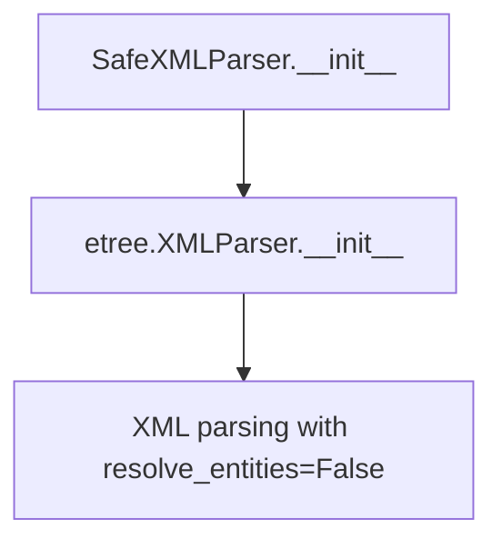
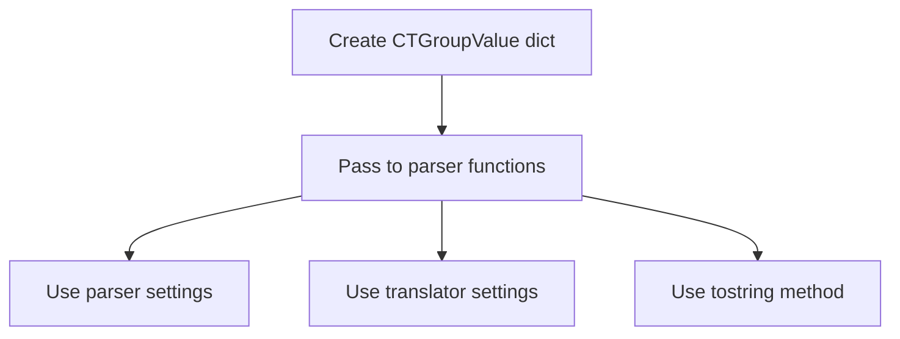
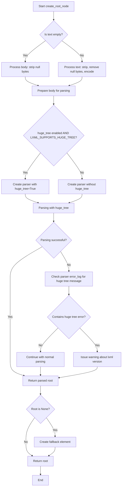

# `selector.py`

## `parsel.selector.CannotRemoveElementWithoutRoot` · *class*

## Summary:
Represents an error condition that occurs when attempting to remove or drop an element that has no root node.

## Description:
This exception is raised by the `Selector.remove()` and `Selector.drop()` methods when trying to remove or drop an element, but the element has no root node. This typically happens when attempting to operate on pseudo-elements (like text nodes selected with `::text`) or other elements that don't have proper DOM structure to be removed from a parent element.

The exception helps distinguish between different failure modes when working with selector elements, specifically indicating that the operation cannot proceed because the element lacks a root reference rather than a parent reference.

## State:
This class inherits from `Exception` and has no additional state beyond what's defined in its parent class. It serves purely as an exception type to indicate a specific error condition.

## Lifecycle:
- Creation: Automatically instantiated by the `Selector.remove()` and `Selector.drop()` methods when a root node cannot be accessed
- Usage: Thrown during element removal/dropping operations to signal that the operation cannot proceed due to missing root reference
- Destruction: Standard Python exception cleanup

## Method Map:
```mermaid
graph TD
    A[Selector.remove()/drop()] --> B{Has root?}
    B -- No --> C[CannotRemoveElementWithoutRoot]
    B -- Yes --> D{Has parent?}
    D -- No --> E[CannotRemoveElementWithoutParent]
    D -- Yes --> F[Remove/Drop element]
```

## Raises:
- `CannotRemoveElementWithoutRoot`: Raised when `Selector.remove()` or `Selector.drop()` attempts to remove/drop an element that has no root node, typically because it's a pseudo-element like `li::text` or `//li/text()` instead of `li` or `//li`.

## Example:
```python
from parsel import Selector

# Create a selector for text content (pseudo-element)
sel = Selector(text='<html><body><p>Hello World</p></body></html>')
# Select text node instead of element - this creates a pseudo-element
text_sel = sel.css('p::text')

# Try to remove the text pseudo-element (will raise CannotRemoveElementWithoutRoot)
try:
    text_sel.remove()  # This will raise CannotRemoveElementWithoutRoot
except CannotRemoveElementWithoutRoot as e:
    print(f"Cannot remove element without root: {e}")

# Correct approach - select the element itself
element_sel = sel.css('p')
element_sel.drop()  # This works fine
```

## `parsel.selector.CannotRemoveElementWithoutParent` · *class*

*No documentation generated.*

## `parsel.selector.CannotDropElementWithoutParent` · *class*

## Summary:
Represents an error condition that occurs when attempting to drop an element that has no parent node.

## Description:
This exception is raised by the `Selector.drop()` method when trying to remove an element from its parent node, but the element has no parent. This typically happens when attempting to drop a root element or a pseudo-element that doesn't belong to a parent node in the document tree.

The exception is part of a hierarchy of element removal-related exceptions that help distinguish between different failure modes when working with selector elements. It's specifically raised in the `drop()` method when the element's parent cannot be accessed, indicating that the operation would fail because there's no parent to remove the element from.

## State:
This class inherits from `CannotRemoveElementWithoutParent` and has no additional state beyond what's defined in its parent class. It serves purely as an exception type to indicate a specific error condition.

## Lifecycle:
- Creation: Automatically instantiated by the `Selector.drop()` method when a parent node cannot be accessed
- Usage: Thrown during element dropping operations to signal that the operation cannot proceed due to missing parent reference
- Destruction: Standard Python exception cleanup

## Method Map:
```mermaid
graph TD
    A[Selector.drop()] --> B{Has parent?}
    B -- No --> C[CannotDropElementWithoutParent]
    B -- Yes --> D[Remove element]
```

## Raises:
- `CannotDropElementWithoutParent`: Raised when `Selector.drop()` attempts to remove an element that has no parent node, typically because it's a root element or pseudo-element.

## Example:
```python
from parsel import Selector

# Create a selector for a root element
sel = Selector(text='<html><body><p>Hello World</p></body></html>')
# Try to drop the root element (html tag)
try:
    sel.drop()  # This will raise CannotDropElementWithoutParent
except CannotDropElementWithoutParent as e:
    print(f"Cannot drop element without parent: {e}")
```

## `parsel.selector.SafeXMLParser` · *class*

## Summary:
A secure XML parser that disables entity resolution to prevent XML External Entity (XXE) injection attacks.

## Description:
The SafeXMLParser class is a specialized XML parser that inherits from lxml's XMLParser and automatically configures entity resolution to be disabled. This security configuration prevents XXE (XML External Entity) injection vulnerabilities that could allow attackers to access local files, perform server-side request forgery, or cause denial of service through resource exhaustion.

This class is primarily used within the parsel library's selector module to provide secure XML parsing capabilities when processing potentially untrusted XML content. It serves as a drop-in replacement for standard XML parsers in security-sensitive contexts.

## State:
- Inherits all attributes from etree.XMLParser
- The resolve_entities parameter is explicitly set to False by default, preventing external entity resolution
- No additional instance attributes beyond those inherited from the parent class
- All initialization parameters are passed through to the parent etree.XMLParser constructor

## Lifecycle:
- Creation: Instantiated like any etree.XMLParser, but with resolve_entities=False enforced by default
- Usage: Used to parse XML documents through lxml's parsing interface via the etree.fromstring() or etree.parse() functions
- Destruction: Managed by Python's garbage collection, inherits cleanup behavior from etree.XMLParser

## Method Map:


## Raises:
- Any exceptions that etree.XMLParser.__init__ might raise due to invalid arguments
- Typically includes ValueError for invalid parser configuration options
- May raise TypeError if incompatible arguments are passed

## Example:
```python
from parsel.selector import SafeXMLParser
from lxml import etree

# Create a secure parser instance
parser = SafeXMLParser()

# Parse XML safely
xml_string = "<root><data>test</data></root>"
tree = etree.fromstring(xml_string, parser=parser)

# Or use with file-like objects
with open('document.xml', 'rb') as f:
    tree = etree.parse(f, parser=parser)
```

### `parsel.selector.SafeXMLParser.__init__` · *method*

## Summary:
Initializes a SafeXMLParser instance with entity resolution disabled to prevent XXE injection attacks.

## Description:
Configures the XML parser to disable entity resolution by default, providing security against XML External Entity (XXE) injection vulnerabilities. This method ensures that external entities are not resolved during XML parsing, which prevents potential security exploits such as accessing local files or performing SSRF attacks. The method explicitly sets resolve_entities=False to override lxml's default behavior, ensuring secure XML parsing regardless of user-provided arguments.

## Args:
    *args (Any): Positional arguments passed to the parent etree.XMLParser.__init__ method
    **kwargs (Any): Keyword arguments passed to the parent etree.XMLParser.__init__ method

## Returns:
    None: This method initializes the object in-place and does not return a value

## Raises:
    Any exceptions that etree.XMLParser.__init__ might raise due to invalid arguments:
    - ValueError: For invalid parser configuration options
    - TypeError: If incompatible arguments are passed

## State Changes:
    Attributes READ: None
    Attributes WRITTEN: None (initialization handled by parent class)

## Constraints:
    Preconditions: 
    - Valid arguments compatible with etree.XMLParser.__init__ must be provided
    - The parent class etree.XMLParser must be available in the environment
    
    Postconditions:
    - The parser instance will have resolve_entities=False set internally
    - All provided arguments are passed through to the parent constructor

## Side Effects:
    None: This method performs no I/O operations or external service calls

## `parsel.selector.CTGroupValue` · *class*

## Summary:
A TypedDict that defines a configuration group containing parser, CSS translator, and tostring method settings for HTML/XML processing.

## Description:
CTGroupValue serves as a type annotation for dictionaries that contain configuration settings needed for parsing HTML/XML content. It groups together three key components required for selector operations: the parser type, CSS translator type, and the tostring method name. This abstraction allows for consistent configuration management across different parsing contexts in the parsel library.

## State:
- `_parser`: Union[Type[etree.XMLParser], Type[html.HTMLParser]]
  - Valid values: Either XMLParser or HTMLParser class types
  - Purpose: Specifies which parser implementation to use for document parsing
- `_csstranslator`: Union[GenericTranslator, HTMLTranslator]
  - Valid values: Either GenericTranslator or HTMLTranslator instances
  - Purpose: Provides CSS selector translation capabilities for different document types
- `_tostring_method`: str
  - Valid values: String names representing tostring methods
  - Purpose: Identifies which tostring method to use when converting elements back to strings

## Lifecycle:
- Creation: Instantiated by creating a dictionary with the three required keys
- Usage: Passed as configuration to functions or methods that require parser setup
- Destruction: No explicit cleanup required as it's a simple data structure

## Method Map:


## Raises:
- No exceptions raised by the TypedDict itself
- Invalid usage patterns would result in runtime errors when accessing undefined keys

## Example:
```python
# Creating a CTGroupValue configuration
config = {
    '_parser': html.HTMLParser,
    '_csstranslator': HTMLTranslator(),
    '_tostring_method': 'tostring'
}

# This configuration would be used to set up parsing behavior consistently
```

## `parsel.selector._xml_or_html` · *function*

## Summary:
Determines whether to treat content as XML or HTML based on the provided type indicator.

## Description:
This helper function serves as a utility to normalize type indicators for XML/HTML parsing operations. It accepts an optional string parameter and returns either "xml" or "html" based on the input value. When the input is explicitly "xml", it returns "xml"; otherwise, it defaults to returning "html".

## Args:
    type (Optional[str]): A string indicating the desired parsing type. If None or any value other than "xml", defaults to "html". If "xml", returns "xml".

## Returns:
    str: Either "xml" or "html" representing the determined parsing type.

## Raises:
    None: This function does not raise any exceptions.

## Constraints:
    Preconditions: The input parameter should be a string or None.
    Postconditions: The return value is always either "xml" or "html".

## Side Effects:
    None: This function has no side effects.

## Control Flow:
```mermaid
flowchart TD
    A[Input type] --> B{type == "xml"?}
    B -->|Yes| C[Return "xml"]
    B -->|No| D[Return "html"]
    C --> E[End]
    D --> E[End]
```

## Examples:
    >>> _xml_or_html("xml")
    'xml'
    >>> _xml_or_html("html")
    'html'
    >>> _xml_or_html(None)
    'html'
    >>> _xml_or_html("other")
    'html'

## `parsel.selector.create_root_node` · *function*

## Summary:
Creates an XML/HTML root node from text or byte content using lxml parsing with appropriate error handling and fallback mechanisms.

## Description:
This function processes input text or binary content to construct a root XML/HTML element suitable for parsing with lxml. It handles various edge cases including null/empty inputs, zero-byte characters, and large tree detection with appropriate warnings. The function supports both regular and huge tree parsing modes based on configuration and availability.

## Args:
    text (str): Input text content to parse. If empty, the function falls back to using the body parameter.
    parser_cls (Type[_ParserType]): The lxml parser class to use for parsing (e.g., etree.XMLParser or etree.HTMLParser).
    base_url (Optional[str]): Base URL to use for resolving relative URLs in the parsed content. Defaults to None.
    huge_tree (bool): Whether to enable huge tree parsing mode. Defaults to LXML_SUPPORTS_HUGE_TREE.
    body (bytes): Binary content to parse when text is empty. Defaults to b"".
    encoding (str): Text encoding to use when converting text to bytes. Defaults to "utf8".

## Returns:
    etree._Element: An lxml element representing the root of the parsed document. Always returns a valid element, even when input is invalid or empty.

## Raises:
    None explicitly raised - though lxml parsing may raise exceptions internally which would propagate up.

## Constraints:
    Preconditions:
    - parser_cls must be a valid lxml parser class (XMLParser or HTMLParser)
    - text should be a string or empty
    - body should be bytes or empty
    
    Postconditions:
    - Always returns a valid etree._Element instance
    - The returned element is suitable for further lxml operations

## Side Effects:
    - May issue warnings via the warnings module when huge tree parsing is needed but not supported
    - Uses lxml's etree.fromstring() which may perform I/O operations during parsing
    - May modify global warning state through warnings.warn()

## Control Flow:


## Examples:
    # Basic usage with text
    root = create_root_node("<div>Hello World</div>", etree.HTMLParser)
    
    # Usage with empty text and body
    root = create_root_node("", etree.HTMLParser, body=b"<p>Default content</p>")
    
    # Usage with huge tree support
    root = create_root_node("<large_document>...</large_document>", etree.XMLParser, huge_tree=True)
```

## `parsel.selector.SelectorList` · *class*

## Summary:
A list-like container for selector objects that provides batch operations for web scraping and data extraction.

## Description:
SelectorList is a specialized list class that extends Python's built-in list to work with selector objects. It enables batch processing of multiple selectors, allowing operations like XPath, CSS, and JMESPath queries to be applied simultaneously to all elements in the list. This abstraction simplifies web scraping workflows by providing a unified interface for handling multiple selector results.

The class maintains compatibility with standard list operations while extending functionality for common scraping tasks such as extracting text content, applying filters, and retrieving attribute data from multiple elements at once. It provides convenient methods for querying and extracting data from collections of selectors.

## State:
- `_SelectorType`: Generic type representing selector objects (likely parsel.selector.Selector)
- Inherits all standard list attributes and behaviors
- Maintains order and indexing of contained selector objects
- All elements must be of type `_SelectorType`
- The list is mutable and supports all standard list operations

## Lifecycle:
- Creation: Instantiated by passing a sequence of selector objects or by using factory methods
- Usage: Apply batch operations like xpath(), css(), jmespath(), getall(), re(), etc.
- Destruction: Standard Python garbage collection handles cleanup

## Method Map:
```mermaid
graph TD
    A[SelectorList] --> B[xpath]
    A --> C[css]
    A --> D[jmespath]
    A --> E[getall]
    A --> F[get]
    A --> G[re]
    A --> H[re_first]
    A --> I[drop]
    A --> J[attrib]
    B --> K[SelectorList]
    C --> K
    D --> K
    E --> L[List[str]]
    F --> M[Optional[str]]
    G --> L
    H --> M
    I --> N[None]
    J --> O[Mapping[str,str]]
```

## Raises:
- TypeError: When attempting to pickle a SelectorList object via `__getstate__` method
- DeprecationWarning: When using the deprecated `remove` method (use `drop` instead)
- Various exceptions from underlying selector operations when invalid XPath/CSS/JMESPath expressions are provided

## Example:
```python
# Create a SelectorList from multiple selectors
selectors = SelectorList([selector1, selector2, selector3])

# Apply XPath query to all selectors at once
results = selectors.xpath('//div[@class="item"]')

# Extract all text content from matching elements
all_text = selectors.getall()

# Get first matching text or default value
first_text = selectors.get(default="No content")

# Apply regular expression to all results
regex_matches = selectors.re(r'\d+')

# Access attributes from first element
attrs = selectors.attrib
```

### `parsel.selector.SelectorList.__getitem__` · *method*

*No documentation generated.*

### `parsel.selector.SelectorList.__getstate__` · *method*

## Summary:
Prevents serialization of SelectorList objects by raising a TypeError during pickle operations.

## Description:
This special method is part of Python's pickle protocol and is called when attempting to serialize a SelectorList object. The method explicitly raises a TypeError to prevent pickling, as SelectorList objects contain complex lxml elements that cannot be reliably serialized.

## Args:
    self: The SelectorList instance being pickled

## Returns:
    None: This method always raises an exception and never returns normally

## Raises:
    TypeError: Always raised with the message "can't pickle SelectorList objects"

## State Changes:
    Attributes READ: None
    Attributes WRITTEN: None

## Constraints:
    Preconditions: None
    Postconditions: None

## Side Effects:
    None: This method only raises an exception and performs no other operations

### `parsel.selector.SelectorList.jmespath` · *method*

## Summary:
Applies a JMESPath query to each selector in the list and returns a new selector list with the query results.

## Description:
This method executes a JMESPath query against each selector in the current selector list. It leverages the individual selector's jmespath method to process each element, then flattens and combines all results into a new SelectorList instance. This approach allows for querying JSON data structures contained within each selector while maintaining the list-like interface.

## Args:
    query (str): The JMESPath query string to apply to each selector
    **kwargs (Any): Additional keyword arguments to pass to the underlying JMESPath search function

## Returns:
    SelectorList[_SelectorType]: A new SelectorList containing the results of applying the JMESPath query to each selector in the current list

## Raises:
    None explicitly raised - relies on underlying JMESPath and selector methods for error handling

## State Changes:
    Attributes READ: None - this method only reads from the self collection
    Attributes WRITTEN: None - this method creates a new object rather than modifying self

## Constraints:
    Preconditions:
    - Each selector in self must have a valid jmespath method implementation
    - The query parameter must be a valid JMESPath query string
    - Selectors should contain JSON data or be convertible to JSON for proper processing
    
    Postconditions:
    - Returns a new SelectorList instance with the same type as self
    - The returned list contains selectors that represent the results of the JMESPath query
    - Empty results are handled gracefully by returning empty lists

## Side Effects:
    None - this method is pure and doesn't cause any I/O operations or external service calls

### `parsel.selector.SelectorList.xpath` · *method*

## Summary:
Applies an XPath expression to each selector in the list and returns a new selector list containing all matching elements.

## Description:
This method executes the provided XPath expression on each selector within the current selector list. It collects results from all selectors, flattens them into a single list, and returns a new SelectorList instance containing all matched elements. This allows for batch XPath operations across multiple selectors simultaneously.

## Args:
    xpath (str): The XPath expression to apply to each selector in the list.
    namespaces (Optional[Mapping[str, str]]): Optional namespace declarations to use during XPath evaluation. Defaults to None.
    **kwargs (Any): Additional keyword arguments to pass to the underlying XPath engine.

## Returns:
    SelectorList[_SelectorType]: A new SelectorList containing all elements that match the XPath expression across all selectors in this list. The generic type parameter _SelectorType matches the type of selectors in the current list.

## Raises:
    ValueError: Raised when the XPath expression is invalid or when attempting to use XPath on a selector of unsupported type.

## State Changes:
    Attributes READ: None - this method only reads from the current instance's elements
    Attributes WRITTEN: None - this method does not modify any attributes of self

## Constraints:
    Preconditions: 
    - The current instance must contain selectors that support XPath operations
    - Each selector in the list must be compatible with the provided XPath expression
    
    Postconditions:
    - Returns a new SelectorList instance of the same type as self
    - All results from XPath evaluation are flattened into a single list
    - The returned list contains only elements that matched the XPath expression

## Side Effects:
    None - this method performs no I/O operations or external service calls. It only operates on the internal selector objects.

### `parsel.selector.SelectorList.css` · *method*

## Summary:
Applies a CSS selector query to each element in the selector list and returns a flattened list of matching elements.

## Description:
This method enables cascading CSS selection operations on a list of selectors. It applies the provided CSS query to each individual selector in the current list, collects all results, and flattens them into a new SelectorList instance. This allows for chaining CSS queries and processing multiple elements with the same selector pattern.

The method is part of the SelectorList class which extends Python's built-in List class to provide enhanced selection capabilities for parsed HTML/XML documents. Each element in the list must support CSS selection operations via its own css() method.

## Args:
    query (str): A CSS selector string to apply to each element in the selector list

## Returns:
    SelectorList[_SelectorType]: A new SelectorList instance containing all elements that match the CSS query across all selectors in the current list, with results from individual selections flattened into a single-level list structure

## Raises:
    None explicitly raised by this method, though underlying CSS operations may raise exceptions from lxml or css parsing libraries

## State Changes:
    Attributes READ: None (reads no self attributes)
    Attributes WRITTEN: None (modifies no self attributes)

## Constraints:
    Preconditions:
    - The SelectorList must contain elements that support CSS selection operations
    - Each element in the list must have a working css() method that accepts a string query
    - The query parameter must be a valid CSS selector string
    
    Postconditions:
    - Returns a new SelectorList instance (does not modify self)
    - All results are flattened into a single-level list structure
    - The returned list contains elements matching the CSS query from all input selectors

## Side Effects:
    None directly caused by this method, though the underlying css() operations on individual selectors may perform I/O or parsing operations

### `parsel.selector.SelectorList.re` · *method*

## Summary:
Applies a regular expression pattern to each selector in the list and returns a flattened list of all matched strings.

## Description:
This method enables batch regular expression matching across multiple selectors in the list. For each selector in the current SelectorList, it applies the provided regular expression pattern and collects all matches. The results from all selectors are flattened into a single-level list structure, making it easy to extract all matching strings from a collection of parsed elements.

The method follows the same pattern as other selector list operations like `css()`, `xpath()`, and `jmespath()` - iterating over each element and aggregating results. This design allows for consistent chaining of selection and extraction operations.

## Args:
    regex (Union[str, Pattern[str]]): A regular expression pattern to match against each selector's content. Can be either a string pattern or compiled regex object.
    replace_entities (bool): Whether to replace HTML entities in the extracted strings. Defaults to True.

## Returns:
    List[str]: A flattened list of all strings that match the regular expression pattern across all selectors in the list. Returns an empty list if no matches are found.

## Raises:
    None explicitly raised by this method, though underlying regex operations or selector methods may raise exceptions from the regex engine or lxml libraries.

## State Changes:
    Attributes READ: None (reads no self attributes)
    Attributes WRITTEN: None (modifies no self attributes)

## Constraints:
    Preconditions:
    - The SelectorList must contain elements that support regular expression operations
    - Each element in the list must have a working `re()` method that accepts a regex pattern and replace_entities parameter
    - The regex parameter must be a valid regular expression pattern
    
    Postconditions:
    - Returns a new list of strings (does not modify self)
    - All results are flattened into a single-level list structure
    - The returned list contains all strings matching the regex pattern from all selectors

## Side Effects:
    None directly caused by this method, though the underlying `re()` operations on individual selectors may perform text processing operations.

### `parsel.selector.SelectorList.re_first` · *method*

## Summary:
Returns the first string matching a regular expression pattern from any selector in the list, or a default value if no matches are found.

## Description:
This method applies a regular expression pattern to each selector in the list and returns the first matching string encountered. It's particularly useful when you want to extract a single value from potentially multiple matching elements in a selector list, rather than collecting all matches like the `re()` method would do.

The method iterates through each selector in the list, applies the regex pattern using the underlying `re()` method, flattens any nested results, and returns the first match found. If no matches are found across all selectors, it returns the specified default value (which defaults to None).

This method is especially valuable in web scraping scenarios where you're looking for a specific piece of information that might appear in various locations within a page, but you only need the first occurrence.

## Args:
    regex (Union[str, Pattern[str]]): A regular expression pattern to match against each selector's content. Can be either a string pattern or compiled regex object.
    default (Optional[str]): The value to return if no matches are found. Defaults to None.
    replace_entities (bool): Whether to replace HTML entities in the extracted strings. Defaults to True.

## Returns:
    Optional[str]: The first string matching the regex pattern from any selector in the list, or the default value if no matches are found.

## Raises:
    None explicitly raised by this method, though underlying regex operations or selector methods may raise exceptions from the regex engine or lxml libraries.

## State Changes:
    Attributes READ: None (reads no self attributes)
    Attributes WRITTEN: None (modifies no self attributes)

## Constraints:
    Preconditions:
    - The SelectorList must contain elements that support regular expression operations
    - Each element in the list must have a working `re()` method that accepts a regex pattern and replace_entities parameter
    - The regex parameter must be a valid regular expression pattern
    
    Postconditions:
    - Returns a single string or None (based on default parameter)
    - Does not modify the original SelectorList
    - The returned value comes from the first match found in iteration order

## Side Effects:
    None directly caused by this method, though the underlying `re()` operations on individual selectors may perform text processing operations.

### `parsel.selector.SelectorList.getall` · *method*

## Summary:
Extracts text content from all selector elements in the list and returns them as a list of strings.

## Description:
This method iterates through all selector objects contained in the SelectorList instance and calls their `.get()` method to extract text content. It's a convenience method that provides a clean interface for retrieving all text values from a collection of parsed HTML/XML elements.

The method is particularly useful when you've selected multiple elements using CSS selectors or XPath queries and want to extract all their text content at once. It's equivalent to calling `.get()` on each element individually but provides a more concise API.

## Args:
    None

## Returns:
    List[str]: A list of strings containing the text content extracted from each selector element. If the SelectorList is empty, returns an empty list.

## Raises:
    None explicitly raised

## State Changes:
    Attributes READ: None - this method only reads from the instance's iterable elements
    Attributes WRITTEN: None - this method doesn't modify any instance attributes

## Constraints:
    Preconditions:
    - The SelectorList instance must contain selector objects (likely lxml HtmlElement or similar)
    - Each selector object in the list must have a `.get()` method that returns a string
    
    Postconditions:
    - Returns a list of strings with the same length as the number of selector elements in the list
    - Empty lists are returned when the SelectorList is empty

## Side Effects:
    None - this method performs no I/O operations or external service calls

### `parsel.selector.SelectorList.get` · *method*

## Summary:
Returns the string value of the first element in the selector list, or a default value if the list is empty.

## Description:
This method iterates through the selector list and returns the result of calling `get()` on the first element. If the selector list is empty, it returns the specified default value. This method is particularly useful when you expect at most one matching element and want to extract its text content.

The method is also available as `extract_first` as an alias for backward compatibility.

## Args:
    default (Optional[str]): The value to return if the selector list is empty. Defaults to None.

## Returns:
    Any: The string value of the first element if available, otherwise the default value. When the default is None, returns Optional[str].

## Raises:
    None explicitly raised

## State Changes:
    Attributes READ: None - this method only reads from the iterable self
    Attributes WRITTEN: None - this method doesn't modify any instance attributes

## Constraints:
    Preconditions: 
    - self must be iterable (implements __iter__)
    - Each element in self must have a get() method that returns a string or None
    
    Postconditions:
    - Returns the result of calling get() on the first element, or the default value
    - Does not modify the selector list or its elements

## Side Effects:
    None - this method performs no I/O operations or external service calls

### `parsel.selector.SelectorList.remove` · *method*

## Summary:
Removes all selected elements from their respective parent nodes in the parsed document tree, issuing a deprecation warning.

## Description:
This method iterates through all Selector objects contained in the SelectorList and calls the deprecated `remove()` method on each one. It serves as a convenience method for removing multiple elements at once, but is deprecated in favor of the `drop()` method which provides equivalent functionality.

The method issues a deprecation warning directing users to use `SelectorList.drop()` instead. Each individual selector's `remove()` method may raise exceptions if the element cannot be removed due to missing root or parent nodes.

## Args:
    None

## Returns:
    None

## Raises:
    CannotRemoveElementWithoutRoot: Raised when attempting to remove an element that has no root node.
    CannotDropElementWithoutParent: Raised when attempting to remove an element that has no parent node.

## State Changes:
    Attributes READ: None
    Attributes WRITTEN: None

## Constraints:
    Preconditions: The SelectorList must contain Selector objects that have valid root nodes and parents.
    Postconditions: All Selector objects in the list will have been removed from their respective parent nodes in the document tree.

## Side Effects:
    Mutates the underlying XML/HTML document tree by removing elements from their parent nodes.

### `parsel.selector.SelectorList.drop` · *method*

## Summary:
Removes all selected elements from their respective parent nodes in the parsed document tree.

## Description:
This method iterates through all Selector objects contained in the SelectorList and calls the drop() method on each one. The drop() operation removes each selected element from its parent node in the document tree, effectively filtering out those elements from future selections.

## Args:
    None

## Returns:
    None

## Raises:
    CannotRemoveElementWithoutRoot: Raised when attempting to drop an element that has no root node.
    CannotDropElementWithoutParent: Raised when attempting to drop an element that has no parent node.

## State Changes:
    Attributes READ: None
    Attributes WRITTEN: None

## Constraints:
    Preconditions: The SelectorList must contain Selector objects that have valid root nodes and parents.
    Postconditions: All Selector objects in the list will have been removed from their respective parent nodes in the document tree.

## Side Effects:
    Mutates the underlying XML/HTML document tree by removing elements from their parent nodes.

## `parsel.selector._get_root_from_text` · *function*

## Summary:
Creates an XML or HTML root element from text content using the appropriate parser based on content type.

## Description:
This function serves as a factory for creating lxml root elements from text content by selecting the correct parser based on the specified content type. It abstracts the parser selection logic and delegates the actual parsing work to `create_root_node`.

The function is typically called internally by selector methods when processing text content that needs to be parsed into an lxml element tree for further manipulation.

## Args:
    text (str): The text content to parse into an lxml element tree.
    type (str): The content type identifier used to select the appropriate parser from the internal `_ctgroup` mapping. Common values are likely "xml" and "html".
    **lxml_kwargs (Any): Additional keyword arguments to pass to the lxml parser constructor.

## Returns:
    etree._Element: An lxml element representing the root of the parsed document.

## Raises:
    None explicitly raised - though underlying lxml parsing may raise exceptions which would propagate up.

## Constraints:
    Preconditions:
    - The `type` parameter must be a valid key in the internal `_ctgroup` dictionary
    - The `text` parameter should be a string containing valid XML or HTML content
    - The `_ctgroup` dictionary must contain a "_parser" key for the specified `type`

    Postconditions:
    - Always returns a valid etree._Element instance
    - The returned element is suitable for further lxml operations

## Side Effects:
    - May issue warnings via the warnings module when huge tree parsing is needed but not supported
    - Uses lxml's etree parsing functions which may perform I/O operations during parsing
    - May modify global warning state through warnings.warn()

## Control Flow:
```mermaid
flowchart TD
    A[Start _get_root_from_text] --> B{Get parser from _ctgroup[type]["_parser"]}
    B --> C[Call create_root_node with text, parser, and lxml_kwargs]
    C --> D{create_root_node succeeds?}
    D -- Yes --> E[Return parsed root element]
    D -- No --> F[Propagate exception]
    E --> G[End]
    F --> G
```

## Examples:
    # Parse HTML content
    root = _get_root_from_text("<div>Hello World</div>", type="html")
    
    # Parse XML content with custom parser options
    root = _get_root_from_text("<root><item>test</item></root>", type="xml", huge_tree=True)
```

## `parsel.selector._get_root_and_type_from_bytes` · *function*

## Summary:
Parses byte content and determines the appropriate root node and content type for further processing.

## Description:
This function analyzes byte-encoded content and returns both the parsed root node and the determined content type. It handles multiple content types including text, JSON, HTML, and XML, with specific logic for each case. The function is designed to be a central parsing entry point that normalizes input data into a consistent format for downstream processing.

Known callers within the codebase:
- This function is likely called by higher-level parsing functions in the selector module that need to process raw byte content from HTTP responses or file inputs.
- It's typically invoked during the initialization or parsing phase of selector objects when byte data needs to be converted to a parseable format.

This logic is extracted into its own function rather than being inlined because it encapsulates the complex decision-making process for determining content type and creating appropriate root nodes, separating concerns between content type detection and actual parsing.

## Args:
    body (bytes): Raw byte content to be parsed.
    encoding (str): Character encoding to use when decoding text content.
    input_type (Optional[str]): Explicit content type hint ("text", "json", "html", "xml", or None). Defaults to None.
    **lxml_kwargs (Any): Additional keyword arguments to pass to lxml parsers.

## Returns:
    Tuple[Any, str]: A tuple containing (root_node, content_type) where:
        - root_node: The parsed root element (etree._Element for XML/HTML, decoded text for text, dict for JSON)
        - content_type: String indicating the detected content type ("text", "json", "html", or "xml")

## Raises:
    AssertionError: When input_type is not one of ("html", "xml", None) after validation.

## Constraints:
    Preconditions:
    - body must be bytes
    - encoding must be a valid string
    - input_type must be one of "text", "json", "html", "xml", or None
    
    Postconditions:
    - Always returns a tuple with a root node and content type string
    - The root node is suitable for further parsing operations

## Side Effects:
    None: This function has no direct side effects, though the underlying parsing operations may involve I/O or memory allocation.

## Control Flow:
```mermaid
flowchart TD
    A[Start _get_root_and_type_from_bytes] --> B{input_type == "text"?}
    B -- Yes --> C[Decode body with encoding, return (decoded_text, "text")]
    B -- No --> D{encoding == "utf8"?}
    D -- Yes --> E[Try json.load(BytesIO(body))]
    D -- No --> F[Skip JSON parsing]
    E --> G{json parsing succeeded?}
    G -- Yes --> H[Return (parsed_json, "json")]
    G -- No --> I[Continue to next check]
    F --> J{input_type == "json"?}
    J -- Yes --> K[Return (None, "json")]
    J -- No --> L[Validate input_type]
    L --> M{input_type in ("html", "xml", None)?}
    M -->|No| N[AssertionError]
    M -->|Yes| O[Call _xml_or_html(input_type)]
    O --> P[Get parser from _ctgroup[type]["_parser"]]
    P --> Q[Call create_root_node()]
    Q --> R[Return (root, type)]
```

## Examples:
    # Parse HTML content
    root, content_type = _get_root_and_type_from_bytes(b"<html><body>Hello</body></html>", "utf-8", input_type="html")
    
    # Parse JSON content
    root, content_type = _get_root_and_type_from_bytes(b'{"key": "value"}', "utf-8", input_type="json")
    
    # Parse text content
    root, content_type = _get_root_and_type_from_bytes(b"Hello world", "utf-8", input_type="text")
    
    # Auto-detect content type
    root, content_type = _get_root_and_type_from_bytes(b"<html>...</html>", "utf-8")
```

## `parsel.selector._get_root_and_type_from_text` · *function*

## Summary:
Parses text input to determine its type (JSON, HTML, XML, or plain text) and returns the parsed content along with its type indicator.

## Description:
This function serves as a content-type detection and parsing utility that analyzes input text to determine whether it contains JSON data, HTML markup, XML markup, or plain text. It handles multiple input formats by attempting different parsing strategies in order of precedence: explicit text type, JSON parsing, HTML/XML parsing. The function is typically called internally by selector methods when processing text content for further manipulation.

The logic is extracted into its own function to encapsulate the complex type-detection and parsing decisions, providing a clean interface for downstream processing while maintaining separation of concerns between content type identification and actual parsing.

## Args:
    text (str): The text content to analyze and parse. This can be plain text, JSON-formatted string, HTML markup, or XML markup.
    input_type (Optional[str]): Explicit type hint for the input content. Can be "text", "json", "html", "xml", or None. When None, the function attempts to auto-detect the content type.
    **lxml_kwargs (Any): Additional keyword arguments to pass to the lxml parser when parsing HTML or XML content.

## Returns:
    Tuple[Any, str]: A tuple containing two elements:
        - The parsed content (either the original text string for "text" type, parsed JSON data for "json" type, or an lxml element for "html"/"xml" types)
        - A string indicating the detected content type ("text", "json", "html", or "xml")

## Raises:
    None explicitly raised - though underlying parsing operations may raise exceptions that propagate up.

## Constraints:
    Preconditions:
    - The `text` parameter must be a string
    - The `input_type` parameter, if provided, must be one of "text", "json", "html", "xml", or None
    
    Postconditions:
    - Always returns a tuple with a parsed content object and a valid type string
    - For "text" input_type, returns the original text unchanged
    - For "json" input_type, returns None when text is not valid JSON
    - For "html"/"xml" input_type, returns a parsed lxml element

## Side Effects:
    - May issue warnings via the warnings module during HTML/XML parsing operations
    - Uses lxml's etree parsing functions which may perform I/O operations during parsing
    - May modify global warning state through warnings.warn() when parsing large documents

## Control Flow:
```mermaid
flowchart TD
    A[Start _get_root_and_type_from_text] --> B{input_type == "text"?}
    B -->|Yes| C[Return (text, "text")]
    B -->|No| D[Try json.loads(text)]
    D --> E{json.loads succeeds?}
    E -->|Yes| F[Return (parsed_data, "json")]
    E -->|No| G{input_type == "json"?}
    G -->|Yes| H[Return (None, "json")]
    G -->|No| I[Assert input_type in ("html", "xml", None)]
    I --> J[Call _xml_or_html(input_type)]
    J --> K[Call _get_root_from_text(text, type=..., **lxml_kwargs)]
    K --> L[Return (root_element, type)]
```

## Examples:
    # Parse plain text
    result, type = _get_root_and_type_from_text("Hello World", input_type="text")
    # Returns ("Hello World", "text")
    
    # Parse JSON data
    result, type = _get_root_and_type_from_text('{"key": "value"}', input_type=None)
    # Returns ({"key": "value"}, "json")
    
    # Parse HTML content
    result, type = _get_root_and_type_from_text("<div>Hello</div>", input_type="html")
    # Returns (lxml element, "html")
```

## `parsel.selector._get_root_type` · *function*

## Summary:
Determines the appropriate root type for parsing based on the input root object and explicit type hint.

## Description:
This function analyzes the type of the provided root object and determines the appropriate parsing type (XML, HTML, or JSON) for selector operations. It enforces type consistency by validating that lxml elements are not paired with conflicting type hints, and provides sensible defaults when no explicit type is specified.

## Args:
    root (Any): The root object to analyze, which can be an lxml element, dict, list, or other data structure
    input_type (Optional[str]): An explicit type hint indicating the expected parsing type ('xml', 'html', or 'json'), or None to infer from root

## Returns:
    str: The determined root type, which will be one of 'xml', 'html', or 'json'

## Raises:
    ValueError: When an lxml.etree._Element is provided as root with input_type set to 'json' or 'text'

## Constraints:
    Preconditions:
        - root can be any type of object
        - input_type should be a string or None
    Postconditions:
        - Always returns a string that is either 'xml', 'html', or 'json'
        - When root is an lxml element, input_type cannot be 'json' or 'text'

## Side Effects:
    None: This function has no side effects

## Control Flow:
```mermaid
flowchart TD
    A[Start _get_root_type] --> B{root is etree._Element?}
    B -->|Yes| C{input_type in {"json", "text"}?}
    C -->|Yes| D[raise ValueError]
    C -->|No| E[return _xml_or_html(input_type)]
    B -->|No| F{root is dict/list OR _is_valid_json(root)?}
    F -->|Yes| G[return "json"]
    F -->|No| H[return input_type or "json"]
```

## Examples:
    >>> _get_root_type(etree.fromstring('<root></root>'), input_type=None)
    'html'
    >>> _get_root_type({'key': 'value'}, input_type=None)
    'json'
    >>> _get_root_type(etree.fromstring('<root></root>'), input_type='xml')
    'xml'
    >>> _get_root_type(etree.fromstring('<root></root>'), input_type='json')
    ValueError: Selector got an lxml.etree._Element object as root, and 'json' as type.

## `parsel.selector._is_valid_json` · *function*

## Summary:
Validates whether a given string contains syntactically correct JSON.

## Description:
Checks if the provided string can be successfully parsed as JSON. This utility function is used internally to validate JSON data before processing.

## Args:
    text (str): The string to validate as JSON format

## Returns:
    bool: True if the string is valid JSON, False otherwise

## Raises:
    None

## Constraints:
    Preconditions:
        - Input must be a string type
    Postconditions:
        - Always returns a boolean value
        - Does not modify the input string

## Side Effects:
    None

## Control Flow:
```mermaid
flowchart TD
    A[Start _is_valid_json] --> B{Try json.loads(text)}
    B -->|Success| C[Return True]
    B -->|TypeError/ValueError| D[Return False]
    C --> E[End]
    D --> E
```

## Examples:
    >>> _is_valid_json('{"key": "value"}')
    True
    >>> _is_valid_json('{"key": "value"')
    False
    >>> _is_valid_json('')
    False
    >>> _is_valid_json('null')
    True
```

## `parsel.selector._load_json_or_none` · *function*

## Summary:
Safely attempts to parse JSON data from text input and returns the parsed result or None if parsing fails.

## Description:
This utility function provides a safe way to parse JSON data from various text-like input types. It handles string, bytes, and bytearray inputs and gracefully returns None when JSON parsing fails, preventing exceptions from propagating. The function is designed to be robust against malformed JSON input while maintaining simplicity in usage.

## Args:
    text (Union[str, bytes, bytearray]): Input text to parse as JSON. Accepts string, bytes, or bytearray types.

## Returns:
    Any: Parsed JSON object if successful, or None if the input is not valid JSON, not a supported type, or parsing fails.

## Raises:
    None: This function does not raise exceptions directly, though it may internally raise ValueError during json.loads().

## Constraints:
    Preconditions:
        - Input should be a string, bytes, or bytearray type for successful JSON parsing
        - If input is not one of these types, the function will return None immediately
    
    Postconditions:
        - Returns either a parsed JSON object or None
        - Never raises JSON parsing exceptions to the caller

## Side Effects:
    None: This function has no side effects beyond standard JSON parsing operations.

## Control Flow:
```mermaid
flowchart TD
    A[Start _load_json_or_none] --> B{isinstance(text, (str,bytes,bytearray))}
    B -- Yes --> C[try json.loads(text)]
    C --> D{json.loads succeeds?}
    D -- Yes --> E[return parsed object]
    D -- No --> F[return None]
    B -- No --> G[return None]
    E --> H[End]
    F --> H
    G --> H
```

## Examples:
    # Valid JSON string
    result = _load_json_or_none('{"key": "value"}')
    # Returns: {'key': 'value'}
    
    # Invalid JSON string
    result = _load_json_or_none('{"key":}')
    # Returns: None
    
    # Non-string input
    result = _load_json_or_none(123)
    # Returns: None

## `parsel.selector.Selector` · *class*

*No documentation generated.*

### `parsel.selector.Selector.__init__` · *method*

## Summary:
Initializes a Selector object with content for parsing, setting up internal state for subsequent XPath/CSS operations.

## Description:
Configures a Selector instance with parsed content from text, bytes, or an existing root element. This method serves as the primary constructor for Selector objects, handling multiple input formats including HTML, XML, JSON, and plain text. It validates input parameters, performs content type detection, and establishes the internal parsing context.

The method supports three distinct initialization pathways:
1. Text-based initialization (from string content)
2. Bytes-based initialization (from binary content)  
3. Root-based initialization (from existing lxml element)

Known callers:
- Direct instantiation of Selector objects by user code
- Internal factory methods that create Selector instances during parsing operations

This logic is extracted into its own method rather than being inlined because it encapsulates complex parameter validation, content type detection, and initialization logic that would otherwise clutter the class construction process.

## Args:
    text (Optional[str]): Text content to parse, can be HTML, XML, JSON, or plain text. Defaults to None.
    type (Optional[str]): Explicit content type hint ("html", "xml", "json", "text", or None for auto-detection). Defaults to None.
    body (bytes): Binary content to parse. Defaults to empty bytes.
    encoding (str): Character encoding for text decoding. Defaults to "utf8".
    namespaces (Optional[Mapping[str, str]]): Additional namespace mappings for XPath expressions. Defaults to None.
    root (Optional[Any]): Existing lxml element or data structure to use as root. Defaults to _NOT_SET sentinel value.
    base_url (Optional[str]): Base URL for resolving relative URLs in HTML/XML. Defaults to None.
    _expr (Optional[str]): Internal expression tracking for debugging. Defaults to None.
    huge_tree (bool): Enable lxml's huge_tree option for parsing large documents. Defaults to LXML_SUPPORTS_HUGE_TREE.

## Returns:
    None: This method initializes the object's state and returns nothing.

## Raises:
    ValueError: When an invalid type is provided or when no content arguments (text, body, or root) are given.
    TypeError: When text is not a string or body is not bytes.

## State Changes:
    Attributes READ: 
        - self._default_namespaces (used to initialize namespaces)
    Attributes WRITTEN:
        - self.root (set to parsed content)
        - self.type (set to detected content type)
        - self.namespaces (initialized with defaults and updated with provided namespaces)
        - self._expr (set to provided expression)
        - self._huge_tree (set to provided huge_tree flag)
        - self._text (set to provided text)

## Constraints:
    Preconditions:
        - If type is provided, it must be one of "html", "json", "text", "xml", or None
        - If text is provided, it must be a string
        - If body is provided, it must be bytes
        - At least one of text, body, or root must be provided
        - When both text and root are provided, root is ignored with a warning
        
    Postconditions:
        - self.root is set to a parsed content object appropriate for the content type
        - self.type is set to a valid content type string
        - self.namespaces contains default namespaces plus any provided ones
        - self._huge_tree is set to the provided value or default

## Side Effects:
    - Issues warnings when both text and root are provided
    - Calls external parsing functions (_get_root_and_type_from_text, _get_root_and_type_from_bytes, _get_root_type)
    - May perform I/O operations during content parsing
    - Modifies global warning state when issuing deprecation warnings

### `parsel.selector.Selector.__getstate__` · *method*

## Summary:
Prevents serialization of Selector objects by raising a TypeError during pickle operations.

## Description:
This method implements Python's pickle protocol to control object serialization. It explicitly raises a TypeError to prevent Selector objects from being pickled, as Selector objects contain lxml elements that cannot be properly serialized.

## Args:
    self: The Selector instance being pickled

## Returns:
    This method never returns normally as it always raises an exception.

## Raises:
    TypeError: Always raised with the message "can't pickle Selector objects" to prevent serialization.

## State Changes:
    Attributes READ: None
    Attributes WRITTEN: None

## Constraints:
    Preconditions: None
    Postconditions: None

## Side Effects:
    None

### `parsel.selector.Selector._get_root` · *method*

## Summary:
Creates and returns an lxml root element from text or binary content for the specified type.

## Description:
This method serves as a factory for creating lxml root elements from text or binary content. It uses the `_ctgroup` registry to select the appropriate parser class based on the content type, then creates a root element using the underlying parsing infrastructure. This method is primarily used internally by the Selector class to create fresh root nodes when processing text content, particularly in XPath operations that require a new HTML root.

Known callers:
- `xpath()` method when accessing `self._get_root(self._text or "", type="html")` - Used to create a temporary HTML root for XPath queries when the selector type is not HTML/XML

## Args:
    text (str): Text content to parse into an lxml element. Defaults to empty string.
    base_url (Optional[str]): Base URL for resolving relative URLs in the parsed content. Defaults to None.
    huge_tree (bool): Enable huge tree parsing mode. Defaults to LXML_SUPPORTS_HUGE_TREE.
    type (Optional[str]): Content type override ('html', 'xml', etc.). Defaults to None.
    body (bytes): Binary content to parse when text is empty. Defaults to empty bytes.
    encoding (str): Text encoding to use when converting text to bytes. Defaults to 'utf8'.

## Returns:
    etree._Element: An lxml element representing the root of the parsed document.

## Raises:
    None explicitly raised - though underlying lxml parsing may raise exceptions.

## State Changes:
    Attributes READ: self.type
    Attributes WRITTEN: None

## Constraints:
    Preconditions:
    - If type is provided, it must be one of 'html', 'xml', 'json', 'text', or None
    - When type is None, self.type must be valid ('html', 'xml', 'json', 'text')
    - The _ctgroup registry must contain entries for the resolved type

    Postconditions:
    - Always returns a valid etree._Element instance
    - The returned element is suitable for lxml operations

## Side Effects:
    - May perform I/O operations during parsing
    - May issue warnings about lxml version limitations when huge_tree is needed
    - Uses lxml's parsing infrastructure internally

### `parsel.selector.Selector.jmespath` · *method*

*No documentation generated.*

### `parsel.selector.Selector.xpath` · *method*

## Summary:
Executes an XPath query on the selector's root element and returns a list of matching elements wrapped in new selector objects.

## Description:
This method performs XPath evaluation on the current selector's root element, returning a SelectorList containing new selector objects for each matching element. It handles different content types (HTML, XML, text) appropriately and supports namespace declarations for complex XPath expressions.

The method is designed to be a core interface for XPath-based element selection in the parsel library. It's separated from inline logic to provide a clean, reusable API for XPath operations while handling various edge cases like missing root elements, invalid content types, and XPath errors.

Known callers:
- Direct API usage by developers calling XPath queries on selector instances
- Internal usage by the `css()` method when converting CSS selectors to XPath queries

## Args:
    query (str): The XPath expression to evaluate against the selector's root element
    namespaces (Optional[Mapping[str, str]]): Additional namespace declarations to use during XPath evaluation. Defaults to None
    **kwargs (Any): Additional keyword arguments passed directly to lxml's XPath evaluation engine

## Returns:
    SelectorList[_SelectorType]: A list-like container of selector objects for each element matching the XPath query. Returns an empty SelectorList if no matches are found or if the root element is unavailable.

## Raises:
    ValueError: When the selector type is not one of "html", "xml", or "text", or when an XPath error occurs during evaluation

## State Changes:
    Attributes READ: self.type, self.root, self.namespaces, self._lxml_smart_strings, self._text
    Attributes WRITTEN: None

## Constraints:
    Preconditions:
    - The selector must have a valid type (one of "html", "xml", "text")
    - The selector must have a root element (or be able to create one for text content)
    - The query parameter must be a valid XPath expression string
    
    Postconditions:
    - Always returns a SelectorList instance
    - Returned selectors maintain the same type as the original selector
    - Namespace declarations are properly merged with existing namespaces

## Side Effects:
    - May perform XML/HTML parsing when processing text content for non-HTML/XML selectors
    - May raise lxml XPath errors as ValueError exceptions
    - Uses lxml's XPath evaluation engine internally

### `parsel.selector.Selector.css` · *method*

## Summary:
Converts a CSS selector query to XPath and executes it, returning matching elements as a selector list.

## Description:
The css method translates CSS selector syntax into XPath expressions and applies them to the current selector's content. This enables developers to use familiar CSS selector syntax for web scraping and data extraction tasks instead of requiring XPath knowledge.

The method validates that the selector supports CSS queries (must be of type "html", "xml", or "text") before performing the conversion and execution. It leverages the internal `_css2xpath` method to translate CSS to XPath, then uses the existing `xpath` method to execute the translated query.

## Args:
    query (str): A valid CSS selector string to be converted and executed against the current selector's content.

## Returns:
    SelectorList[_SelectorType]: A list-like container of selector objects representing all elements that match the CSS query. Each selector in the result corresponds to a matching element from the original document.

## Raises:
    ValueError: Raised when attempting to use CSS selectors on a selector with an unsupported type (not "html", "xml", or "text").

## State Changes:
    Attributes READ: 
    - self.type: Checked for validity before processing
    - self._css2xpath: Called to convert CSS to XPath
    - self.xpath: Called to execute the translated XPath query
    
    Attributes WRITTEN: None

## Constraints:
    Preconditions:
    - The selector must be initialized with a supported type ("html", "xml", or "text")
    - The query parameter must be a syntactically valid CSS selector string
    
    Postconditions:
    - Returns a SelectorList containing all elements matching the CSS query
    - The returned list preserves the original selector's type information
    - Each returned selector maintains proper context for subsequent operations

## Side Effects:
    None: This method performs no I/O operations or external service calls. It only operates on the internal selector state and returns a new SelectorList instance.

### `parsel.selector.Selector._css2xpath` · *method*

*No documentation generated.*

### `parsel.selector.Selector.re` · *method*

## Summary:
Extracts all strings matching a regular expression pattern from the selected element's text content.

## Description:
This method applies a regular expression to the text content of the selected element and returns all matched groups as a list of strings. It leverages the underlying `get()` method to retrieve the text content and then processes it with the `extract_regex` utility function.

## Args:
    regex (Union[str, Pattern[str]]): The regular expression pattern to match. Can be either a string or a compiled regex pattern.
    replace_entities (bool): Whether to replace HTML entities in the results. Defaults to True.

## Returns:
    List[str]: A list of strings containing all matches found by the regex pattern. Returns an empty list if no matches are found.

## Raises:
    None explicitly raised by this method. Exceptions may be raised by the underlying regex engine or `extract_regex` function.

## State Changes:
    Attributes READ: self.get() method call (accesses self.root and self.type)
    Attributes WRITTEN: None

## Constraints:
    Preconditions:
    - The Selector instance must have been initialized with valid text/content
    - The regex pattern must be valid (either string or compiled Pattern)
    
    Postconditions:
    - The method returns a list of strings matching the pattern
    - The original Selector object remains unchanged

## Side Effects:
    None: This method performs no I/O operations or external service calls. It only processes the internal data of the Selector object.

### `parsel.selector.Selector.re_first` · *method*

## Summary:
Returns the first match from a regular expression search on the selector's content, or a default value if no matches are found.

## Description:
Extracts the first matching string from the selector's content using the provided regular expression pattern. This method is useful when you need to quickly retrieve a single piece of information from text content, such as extracting the first email address, URL, or other pattern-matched data.

The method calls the selector's `re()` method to find all matches, then flattens any nested results and returns only the first match. If no matches are found, it returns the specified default value.

## Args:
    regex (Union[str, Pattern[str]]): Regular expression pattern to search for. Can be either a string pattern or compiled regex object.
    default (Optional[str]): Default value to return if no matches are found. Defaults to None.
    replace_entities (bool): Whether to replace HTML entities in the matched strings. Defaults to True.

## Returns:
    Optional[str]: The first matching string from the regex search, or the default value if no matches are found.

## Raises:
    None explicitly raised by this method.

## State Changes:
    Attributes READ: 
        - self.root: Used indirectly through the `get()` method call
        - self.type: Used indirectly through the `get()` method call
    
    Attributes WRITTEN: None

## Constraints:
    Preconditions:
        - The selector must have been initialized with text, body, or root content
        - The regex pattern must be valid (either string or compiled Pattern object)
    
    Postconditions:
        - Returns either a string match or the default value (which may be None)
        - Does not modify the selector's state

## Side Effects:
    None

### `parsel.selector.Selector.get` · *method*

## Summary:
Returns the string representation of the selector's root content based on its type.

## Description:
The `get` method retrieves and formats the root content of a Selector object. For text and JSON types, it directly returns the root value. For HTML/XML types, it converts the root element to a string representation using lxml's tostring method with appropriate serialization settings. The method handles special cases for boolean values and provides fallback mechanisms when the standard conversion fails.

This method is designed to provide a consistent string representation of selector content regardless of the underlying data type, making it useful for extracting textual content from parsed documents.

## Args:
    None: This is a method with no parameters beyond `self`.

## Returns:
    Any: For text and JSON types, returns the raw root value (typically str, dict, or list). For HTML/XML types, returns a string representation of the root element. For boolean root values, returns "1" or "0" as strings. For other root values, returns the string representation via `str()`.

## Raises:
    None: This method does not explicitly raise exceptions, though underlying lxml operations may raise exceptions that are caught internally.

## State Changes:
    Attributes READ: 
    - self.type: Determines how to process the root content
    - self.root: The content to be converted to string representation
    
    Attributes WRITTEN: None

## Constraints:
    Preconditions:
    - The Selector instance must be properly initialized with a valid type and root
    - For HTML/XML types, the root must be compatible with lxml's tostring method
    - The `_ctgroup` global variable must be properly initialized with serialization configurations
    
    Postconditions:
    - For text and JSON types: returns self.root unchanged
    - For HTML/XML types with successful conversion: returns str representation
    - For HTML/XML types with conversion errors and boolean root: returns "1" or "0"
    - For HTML/XML types with conversion errors and non-boolean root: returns str(self.root)

## Side Effects:
    I/O: Uses lxml's tostring method which may involve internal processing of XML/HTML elements
    External service calls: None
    Mutations to objects outside self: None

### `parsel.selector.Selector.getall` · *method*

## Summary:
Returns a list containing the string representation of the selected element(s).

## Description:
This method provides a consistent interface for retrieving the textual content of a selector. It wraps the result of `self.get()` in a list, ensuring that callers always receive a list regardless of whether the selector matches zero, one, or multiple elements. This is particularly useful in web scraping contexts where you want to handle both single and multiple element selections uniformly.

The method is typically called as part of a selector chain or when you need to extract text content from matched elements. It's commonly used in conjunction with CSS or XPath selectors that return a list of matching elements.

## Args:
    None

## Returns:
    List[str]: A list containing exactly one string element, which is the result of calling `self.get()`. The list will always contain exactly one element (unless `self.get()` itself returns something unexpected).

## Raises:
    None explicitly raised, though underlying `self.get()` implementation may raise exceptions if the selector's root element is malformed or inaccessible.

## State Changes:
    Attributes READ: 
    - self.get(): Reads the selector's root element and type to construct the string representation
    - self.type: Used internally by `self.get()` to determine serialization method
    - self.root: Used internally by `self.get()` to obtain the element content
    
    Attributes WRITTEN: None

## Constraints:
    Preconditions:
    - The Selector instance must be properly initialized with valid content (text, body, or root)
    - The selector must have a valid type attribute ('html', 'xml', 'json', or 'text')
    
    Postconditions:
    - Always returns a list with exactly one element
    - The returned element is the string representation of the selector's content

## Side Effects:
    None: This method performs no I/O operations or external service calls. It only accesses internal state and computes a string representation.

### `parsel.selector.Selector.register_namespace` · *method*

## Summary:
Registers a new namespace prefix and URI mapping for use in XPath expressions.

## Description:
Adds a namespace prefix/URI mapping to the selector's namespace dictionary, making it available for XPath queries. This allows users to define custom namespace mappings that can be referenced in XPath expressions.

## Args:
    prefix (str): The namespace prefix to register (e.g., "ns").
    uri (str): The namespace URI associated with the prefix (e.g., "http://example.com/ns").

## Returns:
    None: This method does not return a value.

## Raises:
    None: This method does not explicitly raise exceptions.

## State Changes:
    Attributes READ: self.namespaces
    Attributes WRITTEN: self.namespaces

## Constraints:
    Preconditions: The selector object must be properly initialized with a namespaces dictionary.
    Postconditions: The specified prefix/URI mapping will be available for XPath queries in subsequent operations.

## Side Effects:
    None: This method only modifies the internal namespaces dictionary of the selector instance.

### `parsel.selector.Selector.remove_namespaces` · *method*

## Summary:
Removes XML namespace prefixes from all elements and attributes in the parsed document.

## Description:
This method strips namespace declarations from XML tags and attributes by removing the namespace URI portion (everything between "{" and "}") from element tags and attribute names. This is useful when working with XML documents that contain namespaces but you want to work with the bare tag and attribute names.

The method operates in-place on the parsed document tree and should be called before performing operations that don't account for namespaces.

## Args:
    None

## Returns:
    None

## Raises:
    None explicitly raised

## State Changes:
    Attributes READ: self.root
    Attributes WRITTEN: self.root (modified in-place)

## Constraints:
    Preconditions: 
    - self.root must be a valid lxml etree element
    - The object must be initialized with a parsed XML/HTML document
    
    Postconditions:
    - All element tags in self.root will have namespace prefixes removed if present
    - All attribute names in self.root will have namespace prefixes removed if present
    - The document structure remains intact but namespace information is stripped

## Side Effects:
    None

### `parsel.selector.Selector.remove` · *method*

## Summary:
Removes the selected element from its parent node in the parsed document tree.

## Description:
This method removes the current element from its parent node in the document tree. It is deprecated and users should use the `drop` method instead. The method performs validation to ensure the element has both a root and parent node before attempting removal.

## Args:
    None

## Returns:
    None

## Raises:
    CannotRemoveElementWithoutRoot: Raised when the element being removed has no root node, typically occurs when trying to remove pseudo-elements like text nodes.
    CannotRemoveElementWithoutParent: Raised when the element being removed has no parent node, typically occurs when trying to remove a root element itself.

## State Changes:
    Attributes READ: self.root
    Attributes WRITTEN: None

## Constraints:
    Preconditions: The element must have a root node and a parent node to be successfully removed.
    Postconditions: The element is removed from its parent node in the document tree.

## Side Effects:
    Issues a DeprecationWarning indicating the method is deprecated and suggesting to use 'drop' instead.

### `parsel.selector.Selector.drop` · *method*

## Summary:
Removes the selected element from its parent node in the parsed document.

## Description:
This method removes the currently selected element from its parent node in the parsed document structure. It handles both XML and HTML documents differently, with XML requiring explicit parent removal and HTML using a tree-dropping mechanism. The method is designed to safely remove elements while providing informative error messages when operations cannot be performed due to structural limitations.

## Args:
    None

## Returns:
    None

## Raises:
    CannotRemoveElementWithoutRoot: When attempting to drop an element that has no root node (e.g., pseudo-elements like text nodes)
    CannotDropElementWithoutParent: When attempting to drop an element that has no parent node (e.g., trying to remove a root element)

## State Changes:
    Attributes READ: self.root, self.type
    Attributes WRITTEN: None

## Constraints:
    Preconditions:
    - The selector must reference a valid element node (not a pseudo-element like text nodes)
    - The element must have a parent node in the document structure
    - The element must be part of a parsed document (XML or HTML)

    Postconditions:
    - The element is removed from its parent in the document tree
    - The selector instance remains valid but no longer references the removed element

## Side Effects:
    None

### `parsel.selector.Selector.attrib` · *method*

## Summary:
Returns a dictionary of all attributes associated with the root element of the selector.

## Description:
This property provides access to the HTML/XML attributes of the root element as a standard Python dictionary. It's a convenient way to retrieve all element attributes without having to work directly with the lxml element's attrib property. The returned dictionary is a copy of the element's attributes, ensuring that modifications to the returned dictionary don't affect the original element.

## Args:
    None

## Returns:
    Dict[str, str]: A dictionary mapping attribute names to their string values. Returns an empty dictionary if the root element has no attributes.

## Raises:
    None

## State Changes:
    Attributes READ: self.root.attrib
    Attributes WRITTEN: None

## Constraints:
    Preconditions:
    - The Selector instance must have been initialized with valid text, body, or root content
    - The root element must be an lxml element with an attrib property
    
    Postconditions:
    - The returned dictionary is a copy of the element's attributes
    - The original element's attributes remain unchanged

## Side Effects:
    None

## Usage Context:
This property is commonly used in web scraping workflows when you need to extract all attributes from an HTML/XML element. For example, when selecting a specific element with CSS or XPath selectors, you might want to examine all its attributes to determine its purpose or extract specific attribute values.

## Example:
```python
# Given HTML: <a href="https://example.com" class="link" id="main-link">Link</a>
selector = Selector(text='<a href="https://example.com" class="link" id="main-link">Link</a>')
attributes = selector.attrib  # Returns {'href': 'https://example.com', 'class': 'link', 'id': 'main-link'}
```

### `parsel.selector.Selector.__bool__` · *method*

## Summary:
Returns the boolean truthiness of the selector's extracted content.

## Description:
This special method enables Selector objects to be evaluated in boolean contexts (e.g., `if selector:`). It determines whether the selector contains meaningful content by converting the result of `self.get()` to a boolean value.

## Args:
    None

## Returns:
    bool: True if the selector contains non-empty content, False otherwise.

## Raises:
    None

## State Changes:
    Attributes READ: self.get()
    Attributes WRITTEN: None

## Constraints:
    Preconditions: The Selector object must be properly initialized with valid content.
    Postconditions: The returned boolean value accurately reflects whether the selector's content is empty or not.

## Side Effects:
    None

### `parsel.selector.Selector.__str__` · *method*

## Summary:
Returns a string representation of the Selector object showing its type, query expression, and data content.

## Description:
This method provides a human-readable string representation of a Selector instance, displaying the selector's class name, the query expression used for selection, and a truncated view of the selected data. It's primarily used for debugging and logging purposes to quickly understand what a Selector contains.

## Args:
    None

## Returns:
    str: A formatted string in the pattern "<ClassName query=expression data=data_content>" where:
        - ClassName is the name of the selector class (e.g., "Selector")
        - expression is the query used for selection (from self._expr)
        - data_content is a truncated representation of the selected data

## Raises:
    None

## State Changes:
    Attributes READ: 
        - self._expr: The query expression used for selection
        - self.get(): The selected data content
    Attributes WRITTEN: None

## Constraints:
    Preconditions:
        - self._expr must be accessible (not None or undefined)
        - self.get() must return a string or convertible value
    Postconditions:
        - Returns a string with consistent formatting
        - The returned string follows the pattern "<ClassName query=expression data=data_content>"

## Side Effects:
    None

