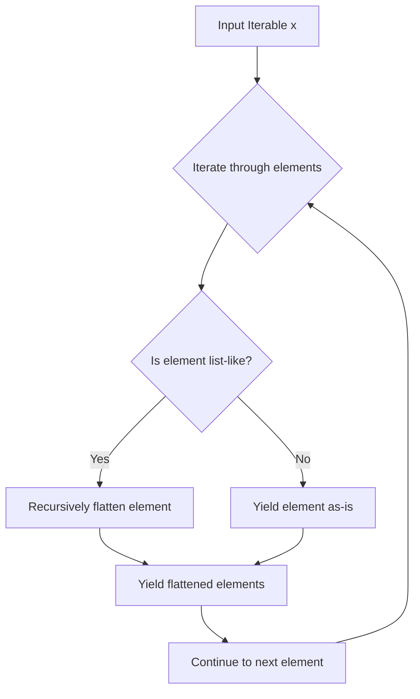

# `utils.py`

## `parsel.utils.flatten` · *function*

## Summary:
Converts a nested iterable structure into a flat list of elements.

## Description:
Flattens a nested iterable structure into a single-level list, preserving the order of elements. This function serves as a convenience wrapper around the `iflatten` generator function, converting its iterator output into a concrete list.

The function handles arbitrarily nested structures while avoiding flattening of strings and bytes, which are technically iterable but should be treated as atomic elements in most contexts.

## Args:
    x (Iterable[Any]): An iterable containing elements that may be nested iterables or atomic values.

## Returns:
    List[Any]: A flat list containing all elements from the nested structure in their original order.

## Raises:
    None: This function does not explicitly raise exceptions, though underlying iteration may raise exceptions from the input iterable.

## Constraints:
    Preconditions: The input must be an iterable object.
    Postconditions: The returned list will contain all elements from the nested structure in a flattened form.

## Side Effects:
    None: This function has no side effects beyond the iteration of the input iterable.

## Control Flow:
```mermaid
flowchart TD
    A[Input Iterable x] --> B[Call iflatten(x)]
    B --> C[Convert iterator to list]
    C --> D[Return flattened list]
```

## Examples:
    >>> flatten([1, [2, 3], [4, [5, 6]]])
    [1, 2, 3, 4, 5, 6]
    
    >>> flatten([[1, 2], [3, 4]])
    [1, 2, 3, 4]
    
    >>> flatten([1, 2, 3])
    [1, 2, 3]
    
    >>> flatten([1, [2, [3, [4]]]])
    [1, 2, 3, 4]
```

## `parsel.utils.iflatten` · *function*

## Summary:
Generates a flattened sequence from a nested iterable structure, yielding individual elements while preserving the order of elements in the original structure.

## Description:
This function recursively flattens nested iterable structures, producing a flat sequence of elements. It processes each element in the input iterable, and if an element is itself list-like (as determined by `_is_listlike`), it recursively flattens that element. Non-list-like elements are yielded as-is. This approach preserves the original ordering while eliminating nesting levels.

The function is designed to handle arbitrarily nested structures while avoiding flattening of strings and bytes, which are technically iterable but should be treated as atomic elements in most contexts.

## Args:
    x (Iterable[Any]): An iterable containing elements that may be nested iterables or atomic values.

## Returns:
    Iterator[Any]: A generator that yields individual elements from the flattened structure, maintaining the original order.

## Raises:
    None: This function does not explicitly raise exceptions, though underlying iteration may raise exceptions from the input iterable.

## Constraints:
    Preconditions: The input must be an iterable object.
    Postconditions: The returned iterator will yield all elements from the nested structure in a flattened form.

## Side Effects:
    None: This function has no side effects beyond the iteration of the input iterable.

## Control Flow:


## Examples:
    >>> list(iflatten([1, [2, 3], [4, [5, 6]]]))
    [1, 2, 3, 4, 5, 6]
    
    >>> list(iflatten([[1, 2], [3, 4]]))
    [1, 2, 3, 4]
    
    >>> list(iflatten([1, 2, 3]))
    [1, 2, 3]
    
    >>> list(iflatten([1, [2, [3, [4]]]]))
    [1, 2, 3, 4]
```

## `parsel.utils._is_listlike` · *function*

## Summary:
Determines whether an object is list-like (iterable but not a string or bytes).

## Description:
This utility function identifies objects that are iterable but should be treated as sequences rather than text. It excludes strings and bytes from being considered list-like, even though they are technically iterable in Python.

## Args:
    x (Any): The object to check for list-likeness.

## Returns:
    bool: True if the object has an __iter__ attribute and is not a str or bytes instance; False otherwise.

## Raises:
    None: This function does not raise any exceptions.

## Constraints:
    Preconditions: The input can be any Python object.
    Postconditions: Always returns a boolean value.

## Side Effects:
    None: This function has no side effects.

## Control Flow:
```mermaid
flowchart TD
    A[Input x] --> B{hasattr(x, "__iter__")?}
    B -- Yes --> C{isinstance(x, (str, bytes))?}
    C -- Yes --> D[Return False]
    C -- No --> D
    B -- No --> D[Return False]
    D --> E[Return True/False]
```

## Examples:
    >>> _is_listlike([1, 2, 3])
    True
    >>> _is_listlike((1, 2, 3))
    True
    >>> _is_listlike("hello")
    False
    >>> _is_listlike(b"hello")
    False
    >>> _is_listlike(42)
    False
```

## `parsel.utils.extract_regex` · *function*

## Summary:
Extracts strings from text using regular expressions, with support for named capture groups and HTML entity processing.

## Description:
This function provides a flexible way to extract text patterns from input text using regular expressions. It supports both string and compiled regex patterns, handles named capture groups specifically for extraction, and offers optional HTML entity decoding for the extracted results.

The function is designed to be a utility for parsing and extracting structured data from unstructured text, particularly useful in web scraping and data extraction scenarios where HTML entities need to be properly handled.

## Args:
    regex (Union[str, Pattern[str]]): A regular expression pattern as either a string or compiled Pattern object. If a string is provided, it will be compiled with UNICODE flag.
    text (str): The text string to search for matches.
    replace_entities (bool): When True (default), HTML entities like &lt;, &amp; are decoded in the extracted results. When False, raw text is returned.

## Returns:
    List[str]: A list of extracted strings. If the regex contains a named group called "extract", only that group's content is returned. Otherwise, all matching substrings are returned. Returns an empty list if no matches are found.

## Raises:
    None: This function does not explicitly raise exceptions, though underlying regex operations may raise exceptions from invalid patterns or text processing.

## Constraints:
    Preconditions: 
    - The `text` parameter must be a string
    - The `regex` parameter must be either a valid regex string or compiled Pattern object
    
    Postconditions:
    - Returns a list of strings (empty list if no matches)
    - If `replace_entities=True`, HTML entities are decoded in the result

## Side Effects:
    None: This function has no side effects beyond standard Python operations.

## Control Flow:
```mermaid
flowchart TD
    A[Input regex and text] --> B{Is regex string?}
    B -->|Yes| C[Compile regex with UNICODE flag]
    B -->|No| D[Use regex directly]
    D --> E{Is "extract" in groupindex?}
    E -->|Yes| F[Try regex.search()]
    F --> G{AttributeError?}
    G -->|Yes| H[Set strings = []]
    G -->|No| I{extracted is None?}
    I -->|Yes| J[Set strings = []]
    I -->|No| K[Set strings = [extracted]]
    E -->|No| L[Use regex.findall()]
    L --> M[Flatten results]
    M --> N{replace_entities=False?}
    N -->|Yes| O[Return strings]
    N -->|No| P[Process HTML entities]
    P --> Q[Return processed strings]
```

## Examples:
    >>> extract_regex(r'\\d+', 'Price: $123')
    ['123']
    
    >>> extract_regex(r'<a href="([^"]+)">(.+?)</a>', '<a href="/page">Link Text</a>')
    ['Link Text']
    
    >>> extract_regex(r'(?P<extract>\\w+)', 'Hello World')
    ['Hello', 'World']
    
    >>> extract_regex(r'&lt;tag&gt;', '<tag>', replace_entities=False)
    ['&lt;tag&gt;']
```

## `parsel.utils.shorten` · *function*

## Summary:
Truncates text to a specified width while preserving a suffix, returning either the original text or a shortened version with the suffix appended.

## Description:
This function is used to limit the length of text strings by truncating them to a maximum width while ensuring a suffix is preserved at the end. It's commonly used for displaying truncated text in user interfaces or logs where space is limited.

The function was extracted into its own utility to provide consistent text truncation behavior across the codebase, separating the logic of text manipulation from the business logic that might use it.

## Args:
    text (str): The input text string to be truncated
    width (int): Maximum allowed length of the returned string (excluding suffix)
    suffix (str): String to append when text is truncated, defaults to "..."

## Returns:
    str: Either the original text if it fits within the width, or a truncated version with suffix appended

## Raises:
    ValueError: When width is negative

## Constraints:
    Preconditions:
    - text must be a string
    - width must be a non-negative integer
    - suffix must be a string
    
    Postconditions:
    - Returned string length will be <= width + len(suffix)
    - If text is shorter than or equal to width, original text is returned unchanged
    - If text is longer than width, result will end with suffix

## Side Effects:
    None

## Control Flow:
```mermaid
flowchart TD
    A[shorten(text, width, suffix)] --> B{len(text) <= width?}
    B -- Yes --> C[return text]
    B -- No --> D{width > len(suffix)?}
    D -- Yes --> E[return text[:width-len(suffix)] + suffix]
    D -- No --> F{width >= 0?}
    F -- Yes --> G[return suffix[len(suffix)-width:]]
    F -- No --> H[raise ValueError]
```

## Examples:
    >>> shorten("Hello World", 5)
    'Hello...'
    
    >>> shorten("Short", 10)
    'Short'
    
    >>> shorten("Very long text", 8, "[...]")
    'Very [...]'
    
    >>> shorten("Test", 0)
    Traceback (most recent call last):
        ...
    ValueError: width must be equal or greater than 0
```

