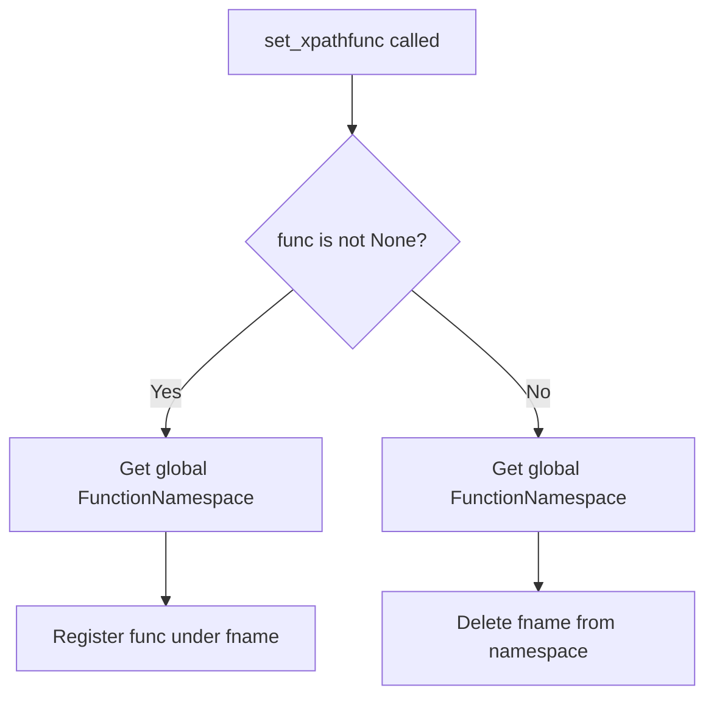
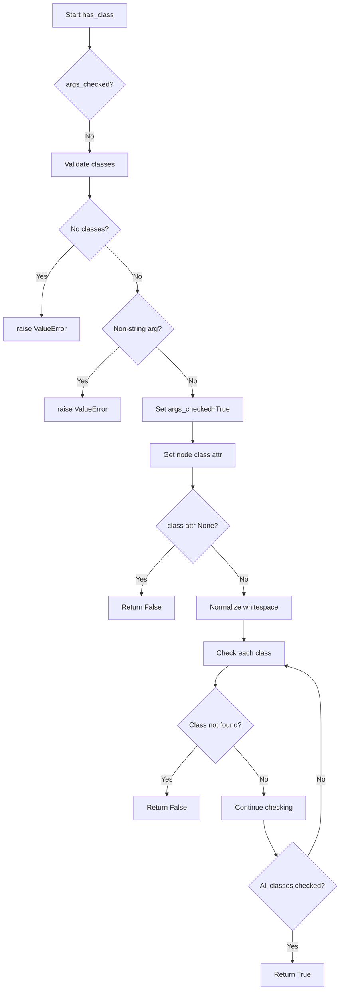

# `xpathfuncs.py`

## `parsel.xpathfuncs.set_xpathfunc` · *function*

## Summary:
Registers or unregisters a custom XPath function with the global lxml function namespace.

## Description:
This function provides a mechanism to add or remove custom XPath functions from lxml's global function namespace. When a function is provided, it registers the function under the specified name; when None is provided, it removes the function from the namespace. This enables users to extend XPath expressions with custom functionality.

## Args:
    fname (str): The name to register the XPath function under. This becomes the function identifier used in XPath expressions.
    func (Optional[Callable]): The callable function to register, or None to unregister a previously registered function.

## Returns:
    None: This function does not return any value.

## Raises:
    None: This function does not explicitly raise exceptions, though underlying lxml operations may raise exceptions.

## Constraints:
    Preconditions:
    - fname must be a string representing a valid XPath function name
    - func must be either a callable object or None
    
    Postconditions:
    - If func is not None, the function is registered in lxml's global namespace under fname
    - If func is None, the function is removed from lxml's global namespace if it existed

## Side Effects:
    - Modifies the global lxml function namespace
    - May affect subsequent XPath evaluations that reference the registered function name

## Control Flow:


## Examples:
```python
# Register a custom XPath function
def my_function(context, arg1, arg2):
    return arg1 + arg2

set_xpathfunc('myfunc', my_function)

# Unregister a custom XPath function  
set_xpathfunc('myfunc', None)
```

## `parsel.xpathfuncs.has_class` · *function*

## Summary:
Checks if an HTML element has all specified CSS classes in its class attribute, handling whitespace normalization and validation.

## Description:
This function is part of the parsel XPath function library and provides CSS class existence checking for HTML elements. It's designed to work within XPath evaluation contexts and normalizes whitespace in class attributes to ensure reliable matching. The function performs argument validation and caches validation results for efficiency.

## Args:
    context (Any): XPath evaluation context containing the node being evaluated and evaluation state
    *classes (str): Variable number of CSS class names to check for existence

## Returns:
    bool: True if the element has all specified classes, False otherwise

## Raises:
    ValueError: When no class arguments are provided or when any argument is not a string

## Constraints:
    Preconditions:
        - The context parameter must be a valid XPath evaluation context object
        - The context must have a context_node with a "class" attribute accessible via .get("class")
        - All class arguments must be strings
    Postconditions:
        - Returns boolean value indicating presence of all classes
        - The function caches argument validation in context.eval_context after first call
        - Class matching is performed with whitespace normalization to handle various HTML formatting

## Side Effects:
    - Modifies context.eval_context by setting "args_checked" flag after initial validation
    - No external I/O operations or state mutations beyond context modification

## Control Flow:


## Examples:
    # Check if element has "btn" class
    result = has_class(context, "btn")
    
    # Check if element has both "btn" and "primary" classes  
    result = has_class(context, "btn", "primary")
    
    # Element with no class attribute
    result = has_class(context, "btn")  # Returns False
    
    # Element with class="btn primary"
    result = has_class(context, "btn", "primary")  # Returns True
    
    # Element with class=" btn  primary " (extra whitespace)
    result = has_class(context, "btn", "primary")  # Returns True (whitespace normalized)
    
    # Usage in XPath expression within parsel
    # selector.xpath('//div[has-class("container", "fluid")]')

