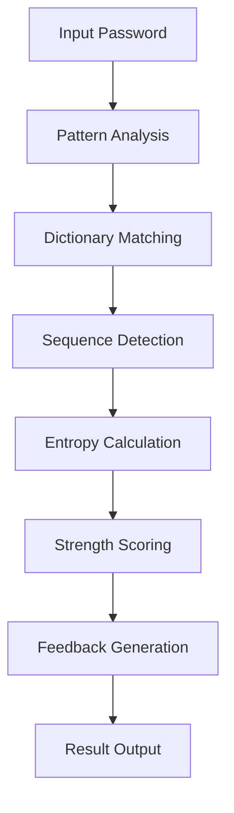

# `zxcvbn-python`

## Repository Overview

### Tree Structure
```
zxcvbn-python/
└── zxcvbn/
```

### Purpose
This repository contains a Python implementation of the zxcvbn password strength estimation algorithm. The zxcvbn algorithm was originally developed by Dropbox to provide more realistic password strength estimation compared to traditional methods that only check character variety and length.

The system analyzes passwords for common patterns, dictionary words, sequences, and other characteristics that humans tend to use when creating passwords, providing a more accurate assessment of password security.

### Target Users
- Security engineers building authentication systems
- Application developers implementing password policies  
- Security auditors evaluating password strength requirements
- Developers creating user-facing password strength indicators

### Position in Ecosystem
This is a standalone Python library designed to be easily integrated into applications. It can be imported as a module or used via command-line interface for testing and validation purposes.

### Architecture
The system follows a modular architecture where password analysis is broken down into several phases:
1. Pattern recognition and matching
2. Entropy calculation based on identified patterns
3. Strength scoring and feedback generation



### Entry Points
1. **Importable API**: `from zxcvbn import zxcvbn`
   - Provides main `zxcvbn(password, user_inputs)` function
   - Target audience: Library consumers integrating password strength checking

2. **Command Line Interface**: `python -m zxcvbn [password]`
   - Direct execution for testing and debugging
   - Target audience: Developers, security professionals, quick testing

### Core Features
1. **Password Strength Estimation** - Estimates password strength using entropy calculation
2. **Pattern Recognition** - Detects common patterns like sequences, repeated characters, keyboard patterns
3. **Dictionary Matching** - Checks against common passwords, words, and phrases
4. **Feedback Generation** - Provides actionable feedback for improving passwords

### Dependencies
- Python 3.6+
- No external dependencies (pure Python implementation)
- Standard library modules only

### Configuration
This library operates with default settings optimized for most use cases. Users can provide additional context through the `user_inputs` parameter to improve accuracy for domain-specific scenarios.

### Extension Points
The library is designed to be used as-is for most applications. For advanced customization, users can:
1. Provide custom user input lists for personalization
2. Extend functionality by subclassing or wrapping core components
3. Integrate with other security systems through the standardized API

