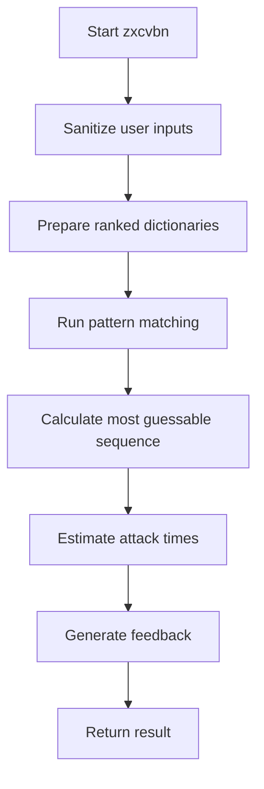

# `__init__.py`

## `zxcvbn.__init__.zxcvbn` · *function*

## Summary:
Estimates the strength of a password by calculating the number of guesses required to crack it and providing security feedback.

## Description:
The zxcvbn function serves as the main entry point for password strength estimation. It analyzes a password against various pattern matching strategies to determine how long it would take to crack it through brute force attacks, and provides actionable feedback to users about improving password security.

This function orchestrates the entire password analysis process by:
1. Sanitizing and preparing user input data
2. Running comprehensive pattern matching against the password
3. Calculating the most guessable match sequence
4. Estimating attack times for different cracking scenarios
5. Generating security feedback based on the analysis results

The function is designed to be the single interface for password strength checking in the zxcvbn library, encapsulating all the complex analysis logic into a simple, predictable API.

## Args:
    password (str): The password string to analyze for strength
    user_inputs (list[str], optional): Additional personal information to consider during analysis. Defaults to None, which is treated as an empty list.

## Returns:
    dict: A comprehensive analysis result containing:
        - 'password': The analyzed password
        - 'guesses': Number of guesses required to crack the password
        - 'guesses_log10': Log base 10 of the guesses
        - 'sequence': List of pattern matches found in the password
        - 'calc_time': Time taken to perform the calculation
        - 'crack_times_seconds': Dictionary of estimated cracking times for different attack scenarios
        - 'crack_times_display': Dictionary of human-readable cracking time estimates
        - 'score': Security score from 0-4 (0=very weak, 4=very strong)
        - 'feedback': Human-readable feedback about password strength

## Raises:
    None explicitly raised - All exceptions are handled internally by the chained functions

## Constraints:
    Preconditions:
        - Password must be a string
        - User inputs, if provided, should be iterable
    Postconditions:
        - Returns a dictionary with all analysis results
        - Calculation time is always included in the result
        - Feedback is always provided regardless of password strength

## Side Effects:
    None - This function is pure and doesn't modify external state or perform I/O operations

## Control Flow:

## Examples:
    >>> result = zxcvbn("password123")
    >>> print(result['score'])
    0
    >>> print(result['feedback']['warning'])
    "This is a commonly used password"
    
    >>> result = zxcvbn("MyP@ssw0rd!", ["john", "doe"])
    >>> print(result['score'])
    3
    >>> print(result['calc_time'])
    datetime.timedelta(microseconds=12345)
``

