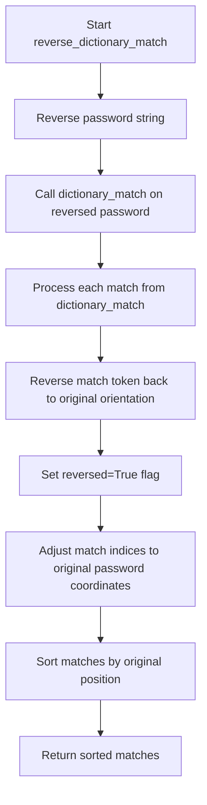
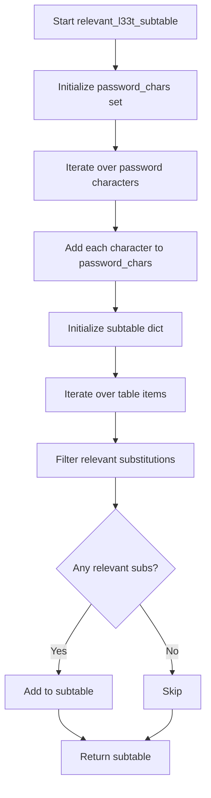
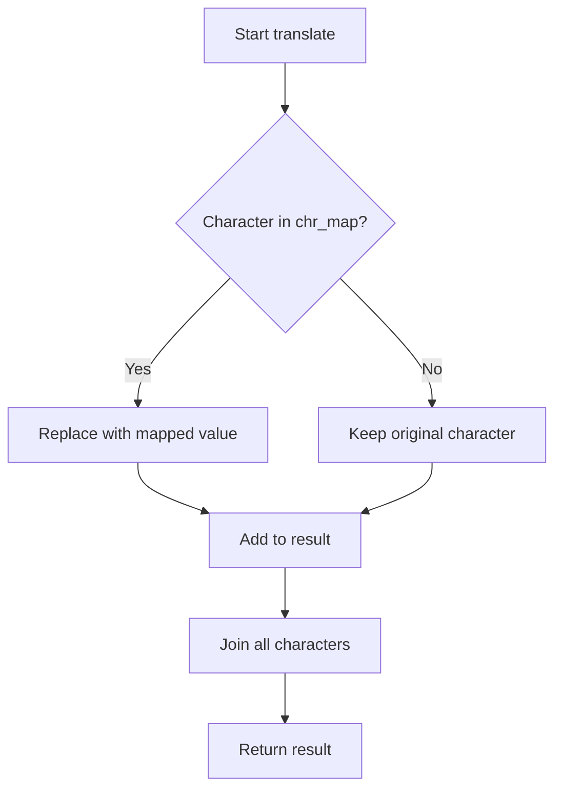
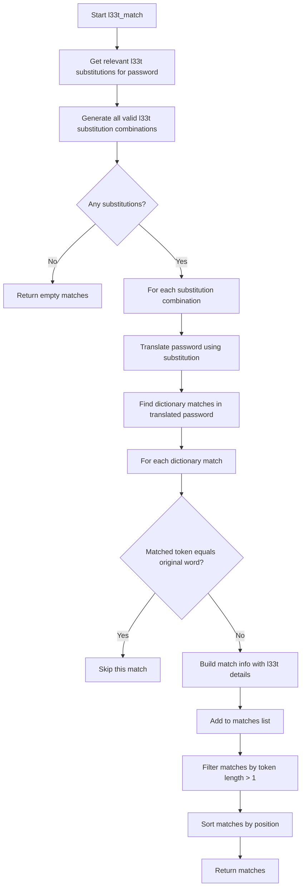
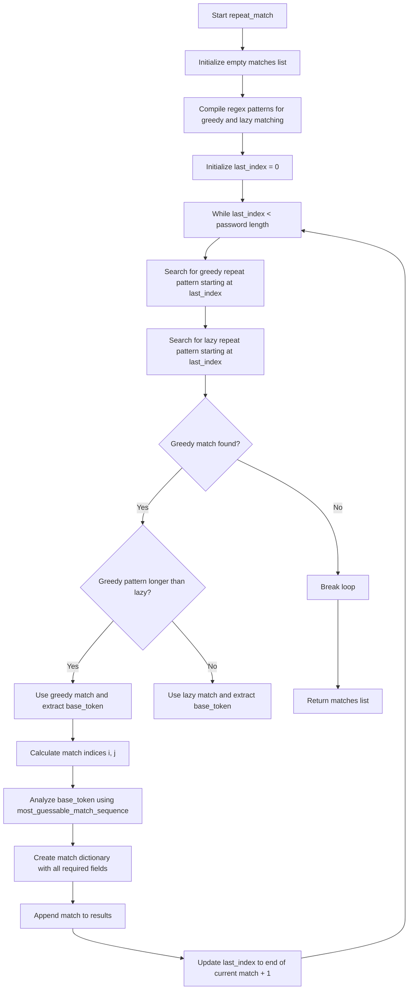
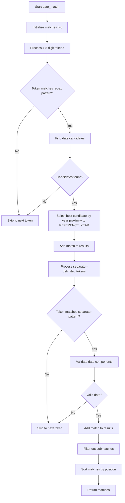

# `matching.py`

## `zxcvbn.matching.build_ranked_dict` · *function*

## Summary:
Creates a dictionary mapping words to their ranked positions in an ordered list, starting from index 1.

## Description:
This function transforms an ordered list of words into a dictionary where each word maps to its position in the list. The ranking starts from 1 rather than 0, making it suitable for frequency-based analysis where lower ranks indicate higher frequency.

The function is typically used within the zxcvbn password strength estimation library to create lookup tables for common password patterns and word frequencies. It enables efficient O(1) lookup of word rankings during password strength calculations.

## Args:
    ordered_list (list[str]): A list of words sorted in descending order of frequency or importance. Each word will be mapped to its rank position.

## Returns:
    dict[str, int]: A dictionary where keys are words from the input list and values are their corresponding rank positions (starting from 1).

## Raises:
    None: This function does not raise any exceptions under normal circumstances.

## Constraints:
    Preconditions:
        - The input `ordered_list` must be iterable
        - All elements in `ordered_list` should be hashable (strings in this context)
    
    Postconditions:
        - The returned dictionary will have exactly as many entries as the input list
        - Each word in the input list will map to a unique integer rank from 1 to len(ordered_list)

## Side Effects:
    None: This function is pure and has no side effects.

## Control Flow:
```mermaid
flowchart TD
    A[Input ordered_list] --> B{Iterate through list}
    B --> C[enumerate(ordered_list, 1)]
    C --> D[Create word:index mapping]
    D --> E[Return dictionary]
```

## Examples:
```python
# Basic usage with common words
common_words = ["password", "123456", "qwerty"]
ranked_dict = build_ranked_dict(common_words)
# Result: {"password": 1, "123456": 2, "qwerty": 3}

# Usage with frequency lists from zxcvbn
frequency_list = ["the", "be", "to", "of", "and"]
ranked_dict = build_ranked_dict(frequency_list)
# Result: {"the": 1, "be": 2, "to": 3, "of": 4, "and": 5}
```

## `zxcvbn.matching.omnimatch` · *function*

## Summary:
Applies multiple pattern-matching algorithms to identify structural elements within a password.

## Description:
The omnimatch function serves as the primary entry point for pattern detection in the zxcvbn password strength estimator. It systematically applies eight different matching strategies to analyze a password and identify various structural patterns such as dictionary words, common sequences, and repeated characters.

This function extracts patterns from passwords by running them through specialized matchers for different types of password structures. Rather than implementing all matching logic inline, this function delegates to specialized matcher functions, enforcing a clean separation of concerns between different pattern recognition strategies.

## Args:
    password (str): The password string to analyze for structural patterns
    _ranked_dictionaries (dict, optional): Dictionary of ranked word lists used for dictionary-based matching. Defaults to RANKED_DICTIONARIES global constant.

## Returns:
    list[dict]: A list of match objects, each containing information about identified patterns. Each match object has at minimum 'i' and 'j' keys representing the start and end positions of the match in the password, plus additional pattern-specific information.

## Raises:
    None explicitly documented in function signature

## Constraints:
    Preconditions:
    - Password must be a string
    - Ranked dictionaries should contain appropriate word lists for matching
    
    Postconditions:
    - Returns a list of match objects sorted by their position in the password
    - All returned matches are valid pattern matches from the input password

## Side Effects:
    None

## Control Flow:
```mermaid
flowchart TD
    A[Start omnimatch] --> B[Initialize empty matches list]
    B --> C[Iterate through 8 matcher functions]
    C --> D{Apply matcher to password}
    D --> E[Extend matches with results]
    E --> F[Sort matches by position (i,j)]
    F --> G[Return sorted matches]
```

## Examples:
    # Basic usage
    matches = omnimatch("password123")
    # Returns list of pattern matches sorted by position
    
    # With custom dictionaries
    custom_dicts = {"common": ["password", "123"]}
    matches = omnimatch("mypassword", _ranked_dictionaries=custom_dicts)
```

## `zxcvbn.matching.dictionary_match` · *function*

## Summary:
Identifies dictionary word matches within a password by comparing substrings against ranked word lists.

## Description:
This function performs dictionary pattern matching on passwords by scanning all possible substrings and checking if they exist in predefined ranked dictionaries. It's part of the zxcvbn password strength estimation algorithm, specifically designed to detect common dictionary words that may weaken password security.

The function extracts all substrings from the input password and checks each against multiple ranked dictionaries to find potential dictionary matches. These matches are then returned in order of their position in the password.

## Args:
    password (str): The password string to analyze for dictionary matches
    _ranked_dictionaries (dict, optional): Dictionary mapping dictionary names to ranked word dictionaries. Defaults to RANKED_DICTIONARIES from frequency_lists module.

## Returns:
    list[dict]: A list of match dictionaries containing information about each discovered dictionary match, sorted by position in the password. Each match dictionary contains:
        - pattern (str): Set to 'dictionary' indicating this is a dictionary match
        - i (int): Starting index (inclusive) of the matched substring in the password
        - j (int): Ending index (inclusive) of the matched substring in the password  
        - token (str): Original substring from password that matched
        - matched_word (str): Lowercase version of the matched word
        - rank (int): Rank of the matched word in its dictionary (lower rank = more common)
        - dictionary_name (str): Name of the dictionary where match was found
        - reversed (bool): Whether the match was reversed (always False for this function)
        - l33t (bool): Whether the match involved l33t speak substitution (always False for this function)

## Raises:
    None explicitly raised

## Constraints:
    Preconditions:
        - Password must be a string
        - _ranked_dictionaries must be a dictionary mapping dictionary names to ranked word dictionaries
    Postconditions:
        - Returns a sorted list of matches by starting position (i) and ending position (j)
        - All returned matches are valid substrings found in the ranked dictionaries
        - Match objects contain all expected fields as described

## Side Effects:
    None

## Control Flow:
```mermaid
flowchart TD
    A[Start dictionary_match] --> B[Initialize empty matches list]
    B --> C[Get password length and lowercase version]
    C --> D[Iterate through all ranked dictionaries]
    D --> E[Iterate through all possible start positions (i)]
    E --> F[Iterate through all possible end positions (j ≥ i)]
    F --> G[Check if password_lower[i:j+1] exists in ranked_dict]
    G --> H{Substring found?}
    H -->|Yes| I[Create match dictionary with pattern='dictionary']
    I --> J[Add match to results]
    J --> K[Continue to next substring]
    H -->|No| K
    K --> L{All substrings checked?}
    L -->|No| F
    L -->|Yes| M[Sort matches by (i,j) position]
    M --> N[Return sorted matches]
```

## Examples:
    >>> dictionary_match("password123")
    [{'pattern': 'dictionary', 'i': 0, 'j': 7, 'token': 'password', 'matched_word': 'password', 'rank': 1234, 'dictionary_name': 'common_words', 'reversed': False, 'l33t': False}]
    
    >>> dictionary_match("hello123")
    [{'pattern': 'dictionary', 'i': 0, 'j': 4, 'token': 'hello', 'matched_word': 'hello', 'rank': 567, 'dictionary_name': 'common_words', 'reversed': False, 'l33t': False}]

## `zxcvbn.matching.reverse_dictionary_match` · *function*

## Summary:
Finds dictionary word matches in a password by searching for reversed substrings against ranked dictionaries, enabling detection of reversed dictionary words.

## Description:
This function identifies dictionary matches in a password by reversing the entire password string and then applying standard dictionary matching logic. It's specifically designed to detect dictionary words that appear in reverse order within passwords, such as "drowssap" for "password". This approach helps identify weak patterns where users reverse common dictionary words when constructing passwords.

The function leverages the existing `dictionary_match` implementation but operates on the reversed password to find matches that would otherwise be missed by forward-only matching. After finding matches in the reversed space, it transforms them back to the original password coordinate system.

## Args:
    password (str): The password string to analyze for reversed dictionary matches
    _ranked_dictionaries (dict, optional): Dictionary mapping dictionary names to ranked word dictionaries. Defaults to RANKED_DICTIONARIES from frequency_lists module.

## Returns:
    list[dict]: A list of match dictionaries representing reversed dictionary matches, sorted by their position in the original password. Each match dictionary contains:
        - pattern (str): Set to 'dictionary' indicating this is a dictionary match
        - i (int): Starting index (inclusive) of the matched substring in the original password
        - j (int): Ending index (inclusive) of the matched substring in the original password  
        - token (str): The original substring from password that matched (reversed back)
        - matched_word (str): Lowercase version of the matched word
        - rank (int): Rank of the matched word in its dictionary (lower rank = more common)
        - dictionary_name (str): Name of the dictionary where match was found
        - reversed (bool): Always True for this function, indicating the match was found in reversed space
        - l33t (bool): Whether the match involved l33t speak substitution (always False for this function)

## Raises:
    None explicitly raised

## Constraints:
    Preconditions:
        - Password must be a string
        - _ranked_dictionaries must be a dictionary mapping dictionary names to ranked word dictionaries
    Postconditions:
        - Returns a sorted list of matches by starting position (i) and ending position (j)
        - All returned matches are valid substrings found in the ranked dictionaries when reversed
        - Match objects contain all expected fields as described

## Side Effects:
    None

## Control Flow:


## Examples:
    >>> reverse_dictionary_match("drowssap123")
    [{'pattern': 'dictionary', 'i': 0, 'j': 7, 'token': 'drowssap', 'matched_word': 'password', 'rank': 1234, 'dictionary_name': 'common_words', 'reversed': True, 'l33t': False}]
    
    >>> reverse_dictionary_match("hello123")
    []  # No reversed dictionary matches found
```

## `zxcvbn.matching.relevant_l33t_subtable` · *function*

## Summary:
Filters a l33t substitution table to include only those letters whose substitutions appear in the given password.

## Description:
This function processes a l33t (leet) substitution table by filtering out letters whose potential substitutions do not appear in the password. It's used during password strength analysis to optimize the matching process by only considering relevant character substitutions.

## Args:
    password (str): The password string to analyze for relevant substitutions
    table (dict): A dictionary mapping letters to lists of possible l33t substitutions

## Returns:
    dict: A filtered dictionary containing only letters from the original table whose substitutions actually appear in the password

## Raises:
    None explicitly raised

## Constraints:
    Preconditions:
    - password must be a string
    - table must be a dictionary with string keys and iterable values
    
    Postconditions:
    - The returned dictionary will only contain keys from the original table
    - Each value in the returned dictionary will be a subset of the corresponding original value
    - Empty lists will not be included in the returned dictionary

## Side Effects:
    None

## Control Flow:


## Examples:
    # Example 1: Basic usage
    table = {'a': ['@', '4'], 'b': ['8']}
    password = "hello @world"
    result = relevant_l33t_subtable(password, table)
    # Returns: {'a': ['@']} because '@' appears in password but '4' doesn't
    
    # Example 2: Multiple relevant substitutions
    table = {'a': ['@', '4'], 'e': ['3', '€']}
    password = "p@ssw0rd"
    result = relevant_l33t_subtable(password, table)
    # Returns: {'a': ['@'], 'e': ['3']} because both '@' and '3' appear in password
```

## `zxcvbn.matching.enumerate_l33t_subs` · *function*

## Summary:
Generates all valid combinations of l33t character substitutions from a given substitution table.

## Description:
This function computes all possible combinations of l33t (leet) substitutions for a given character-to-substitution mapping table. It recursively builds combinations while ensuring no duplicate substitutions occur within a single combination. The result is a list of dictionaries where each dictionary maps l33t characters to their original characters.

The function is designed to handle complex l33t substitution patterns where multiple characters might map to the same l33t character, requiring careful deduplication logic to avoid invalid combinations.

## Args:
    table (dict): A dictionary mapping characters to lists of their possible l33t substitutions. Keys are regular characters, values are lists of l33t equivalents.

## Returns:
    list[dict]: A list of dictionaries, each representing a valid combination of l33t substitutions. Each dictionary maps l33t characters to their corresponding original characters.

## Raises:
    None explicitly raised, but may raise exceptions from underlying operations if table parameter is malformed.

## Constraints:
    Precondition: The table parameter must be a dictionary where all values are lists.
    Postcondition: All returned dictionaries contain unique l33t-to-character mappings with no duplicate l33t characters within a single mapping.

## Side Effects:
    None

## Control Flow:
```mermaid
flowchart TD
    A[Start enumerate_l33t_subs] --> B{table.keys() empty?}
    B -- Yes --> C[Return [[]]]
    B -- No --> D[Initialize subs = [[]]]
    D --> E[Call helper(keys, subs)]
    E --> F[Process each key in keys]
    F --> G{Current key's l33t chars available?}
    G -- Yes --> H[For each l33t char in table[key]]
    H --> I[For each existing substitution]
    I --> J{Duplicate l33t char found?}
    J -- No --> K[Extend substitution with new pair]
    J -- Yes --> L[Create alternative substitution]
    L --> M[Update existing substitution]
    M --> N[Add both variations to next_subs]
    K --> N
    N --> O[Apply deduplication]
    O --> P[Recursive call with remaining keys]
    P --> Q[Convert assoc lists to dicts]
    Q --> R[Return result]
```

## Examples:
    Example 1: Given table = {'a': ['@', '4'], 'b': ['8']}, returns [{'@': 'a', '8': 'b'}, {'4': 'a', '8': 'b'}]
    
    Example 2: Given table = {'o': ['0', '()', '[]'], 'i': ['1', '|']}, returns combinations like {'0': 'o', '1': 'i'}, {'0': 'o', '|': 'i'}, etc.

## `zxcvbn.matching.translate` · *function*

## Summary:
Translates characters in a string according to a provided character mapping dictionary.

## Description:
This utility function processes each character in the input string and replaces it with a mapped character if a translation exists in the provided mapping dictionary. Characters without translations remain unchanged. This function is commonly used for preprocessing text data in password strength analysis by normalizing character representations.

## Args:
    string (str): The input string to process and translate
    chr_map (dict): A dictionary mapping original characters to their replacement characters

## Returns:
    str: A new string with characters translated according to the mapping dictionary

## Raises:
    None

## Constraints:
    Preconditions:
        - The input string must be a valid string object
        - The chr_map parameter must be a dictionary-like object
    Postconditions:
        - The returned string has the same length as the input string
        - Characters not present in chr_map remain unchanged in the result

## Side Effects:
    None

## Control Flow:


## Examples:
    # Basic character replacement
    >>> translate("hello", {"e": "3", "o": "0"})
    'h3ll0'
    
    # No replacements (character not in map)
    >>> translate("hello", {"x": "y"})
    'hello'
    
    # Empty string
    >>> translate("", {"a": "b"})
    ''
```

## `zxcvbn.matching.l33t_match` · *function*

## Summary:
Identifies dictionary word matches in passwords that involve l33t (leet) character substitutions, such as replacing 'a' with '@' or 'e' with '3'.

## Description:
This function extends the basic dictionary matching capability to detect when dictionary words appear in passwords with common l33t substitutions. It systematically applies all possible combinations of l33t character substitutions to the password and then searches for dictionary matches in the transformed versions. When matches are found, it records the original password substring, the l33t substitutions applied, and the dictionary match information.

The function is part of the zxcvbn password strength estimation algorithm and helps identify weak password patterns that use common substitutions for stronger security.

## Args:
    password (str): The password string to analyze for l33t dictionary matches
    _ranked_dictionaries (dict, optional): Dictionary mapping dictionary names to ranked word dictionaries. Defaults to RANKED_DICTIONARIES from frequency_lists module.
    _l33t_table (dict, optional): Dictionary mapping regular characters to lists of possible l33t substitutions. Defaults to L33T_TABLE.

## Returns:
    list[dict]: A list of match dictionaries containing information about each discovered l33t dictionary match, sorted by position in the password. Each match dictionary contains:
        - pattern (str): Set to 'dictionary' indicating this is a dictionary match
        - i (int): Starting index (inclusive) of the matched substring in the password
        - j (int): Ending index (inclusive) of the matched substring in the password  
        - token (str): Original substring from password that matched
        - matched_word (str): Lowercase version of the matched word
        - rank (int): Rank of the matched word in its dictionary (lower rank = more common)
        - dictionary_name (str): Name of the dictionary where match was found
        - reversed (bool): Whether the match was reversed (always False for this function)
        - l33t (bool): Always True for l33t matches
        - sub (dict): Dictionary mapping l33t characters to their original characters
        - sub_display (str): Formatted string showing the substitutions (e.g., "@ -> a, 3 -> e")

## Raises:
    None explicitly raised

## Constraints:
    Preconditions:
        - Password must be a string
        - _ranked_dictionaries must be a dictionary mapping dictionary names to ranked word dictionaries
        - _l33t_table must be a dictionary mapping characters to lists of possible l33t substitutions
        
    Postconditions:
        - Returns a sorted list of matches by starting position (i) and ending position (j)
        - All returned matches are valid substrings found in the ranked dictionaries
        - Match objects contain all expected fields as described
        - Only matches with tokens of length greater than 1 are returned

## Side Effects:
    None

## Control Flow:


## Examples:
    # Example 1: Simple l33t substitution
    password = "p@ssw0rd"
    # Finds "password" in the dictionary with @->a and 0->o substitutions
    # Returns match with sub={'@': 'a', '0': 'o'} and sub_display="@ -> a, 0 -> o"
    
    # Example 2: Multiple substitutions
    password = "h3ll0_w0rld"
    # Finds "hello_world" with 3->e, 0->o substitutions
    # Returns match with sub={'3': 'e', '0': 'o'} and sub_display="3 -> e, 0 -> o"
```

## `zxcvbn.matching.repeat_match` · *function*

## Summary:
Identifies repeated character or substring patterns within a password by detecting sequences that consist of a base token repeated multiple times.

## Description:
The repeat_match function scans a password for repeated character or substring patterns, such as "aaa" or "abcabc". It uses regular expressions to find these repetitions and analyzes the base token to estimate guessability. This function is part of the zxcvbn password strength estimation algorithm, specifically designed to detect weak patterns where users repeat characters or small substrings to create passwords.

The function is called as part of the omnimatch function which aggregates all types of pattern matches. It's extracted into its own function to encapsulate the logic for detecting repeated patterns, making the overall matching system modular and maintainable.

## Args:
    password (str): The password string to analyze for repeated patterns
    _ranked_dictionaries (dict, optional): Dictionary mapping dictionary names to ranked word dictionaries. Defaults to RANKED_DICTIONARIES from frequency_lists module.

## Returns:
    list[dict]: A list of match dictionaries, each containing:
        - pattern (str): Set to 'repeat' indicating this is a repeat pattern match
        - i (int): Starting index (inclusive) of the matched repetition in the password
        - j (int): Ending index (inclusive) of the matched repetition in the password
        - token (str): The full repeated substring from the password
        - base_token (str): The base substring that is being repeated
        - base_guesses (float): Estimated number of guesses needed to crack the base token
        - base_matches (list): The sequence of matches used to calculate base_guesses
        - repeat_count (float): Number of times the base_token is repeated in the token

## Raises:
    None explicitly raised

## Constraints:
    Preconditions:
        - Password must be a string
        - _ranked_dictionaries must be a dictionary mapping dictionary names to ranked word dictionaries
        
    Postconditions:
        - Returns a sorted list of matches by starting position (i) and ending position (j)
        - All returned matches represent valid repeated patterns in the password
        - Match objects contain all expected fields as described

## Side Effects:
    None

## Control Flow:


## Examples:
    >>> repeat_match("aaaa")
    [{'pattern': 'repeat', 'i': 0, 'j': 3, 'token': 'aaaa', 'base_token': 'a', 'base_guesses': 1.0, 'base_matches': [...], 'repeat_count': 4.0}]
    
    >>> repeat_match("abcabcabc")
    [{'pattern': 'repeat', 'i': 0, 'j': 8, 'token': 'abcabcabc', 'base_token': 'abc', 'base_guesses': 1.0, 'base_matches': [...], 'repeat_count': 3.0}]
    
    >>> repeat_match("hello123")
    []  # No repeated patterns found
```

## `zxcvbn.matching.spatial_match` · *function*

## Summary:
Identifies and extracts spatial keyboard pattern sequences from passwords across multiple keyboard layouts.

## Description:
Processes a password to detect sequences that follow spatial patterns on various keyboard layouts such as QWERTY and Dvorak. This function serves as the main entry point for spatial pattern matching, iterating through predefined keyboard graphs and collecting all detected spatial patterns. It aggregates results from multiple keyboard layouts and returns them sorted by their position in the password.

The logic is extracted into its own function to encapsulate the spatial matching workflow, separating it from other matching strategies while providing a clean interface for the broader password strength analysis system.

## Args:
    password (str): The password string to analyze for spatial keyboard patterns
    _graphs (dict, optional): Dictionary mapping keyboard layout names to their character adjacency graphs. Defaults to GRAPHS module constant.
    _ranked_dictionaries (dict, optional): Dictionary of ranked word lists for dictionary matching. Defaults to RANKED_DICTIONARIES module constant.

## Returns:
    list[dict]: A sorted list of match dictionaries, each representing a detected spatial pattern with the following keys:
        - pattern (str): Always 'spatial' for these matches
        - i (int): Starting index of the matched sequence in the password
        - j (int): Ending index of the matched sequence in the password  
        - token (str): The actual sequence of characters that forms the pattern
        - graph (str): The keyboard layout name used for matching
        - turns (int): Number of directional changes in the pattern
        - shifted_count (int): Count of shifted (uppercase) keys in the pattern

## Raises:
    None explicitly raised - relies on spatial_match_helper for any potential errors

## Constraints:
    Preconditions:
        - Password must be a string
        - _graphs parameter must be a dictionary-like object with keyboard layout names as keys
        - Each graph in _graphs must be a dictionary mapping characters to their adjacent characters
    
    Postconditions:
        - Returns a list of match dictionaries with consistent structure
        - Matches are sorted by starting position (i) and ending position (j)
        - Only sequences of length 3 or greater are returned (due to j-i > 2 check in helper)

## Side Effects:
    None

## Control Flow:
```mermaid
flowchart TD
    A[Start spatial_match] --> B[Initialize empty matches list]
    B --> C[For each graph_name, graph in _graphs.items()]
    C --> D[Call spatial_match_helper with password, graph, graph_name]
    D --> E[Extend matches with helper results]
    E --> F[Sort matches by (i, j)]
    F --> G[Return sorted matches]
```

## Examples:
    # Basic usage detecting QWERTY patterns
    matches = spatial_match('asdf')
    # Returns spatial pattern matches found on QWERTY keyboard layout
    
    # Usage with custom graphs (advanced)
    custom_graphs = {'qwerty': {'a': ['s'], 's': ['a', 'd']}}
    matches = spatial_match('asd', _graphs=custom_graphs)
    # Returns matches using custom keyboard layout

## `zxcvbn.matching.spatial_match_helper` · *function*

## Summary:
Detects and extracts spatial keyboard pattern sequences from passwords, tracking directional changes and shifted key presses.

## Description:
This helper function identifies sequences of characters that follow spatial patterns on keyboard layouts such as QWERTY or Dvorak. It analyzes adjacent character relationships in the provided graph representation to detect keyboard-based patterns. The function is part of the spatial pattern matching system and is typically called by higher-level matching functions that process password tokens.

The logic is extracted into its own helper function to separate the complex pattern detection algorithm from the main matching logic, enabling cleaner organization and easier testing of the spatial matching algorithm specifically.

## Args:
    password (str): The password string to analyze for spatial patterns
    graph (dict): A dictionary mapping characters to their adjacent characters on a keyboard layout
    graph_name (str): Name of the keyboard layout being analyzed ('qwerty', 'dvorak', etc.)

## Returns:
    list[dict]: A list of match dictionaries, each containing:
        - pattern (str): Always 'spatial' for these matches
        - i (int): Starting index of the matched sequence in the password
        - j (int): Ending index of the matched sequence in the password  
        - token (str): The actual sequence of characters that forms the pattern
        - graph (str): The keyboard layout name used for matching
        - turns (int): Number of directional changes in the pattern
        - shifted_count (int): Count of shifted (uppercase) keys in the pattern

## Raises:
    None explicitly raised - handles KeyError when accessing graph characters gracefully by falling back to empty list

## Constraints:
    Preconditions:
        - Password must be a string
        - Graph must be a dictionary-like object with character keys
        - Graph name must be a string identifying a supported keyboard layout
    
    Postconditions:
        - Returns a list of match dictionaries with consistent structure
        - Only sequences of length 3 or greater are returned (length 1 or 2 are ignored due to j-i > 2 check)
        - All returned matches have valid indices within the password string

## Side Effects:
    None

## Control Flow:
```mermaid
flowchart TD
    A[Start spatial matching] --> B{Password length > 1?}
    B -- Yes --> C[Initialize i=0]
    C --> D[i < len(password)-1?]
    D -- Yes --> E[Initialize j=i+1, turns=0, last_direction=None]
    E --> F{graph_name in ['qwerty','dvorak'] AND first char shifted?}
    F -- Yes --> G[shifted_count = 1]
    F -- No --> H[shifted_count = 0]
    G --> I[Enter inner loop]
    H --> I
    I --> J[prev_char = password[j-1]]
    J --> K{prev_char in graph?}
    K -- Yes --> L[adjacents = graph[prev_char]]
    K -- No --> M[adjacents = []]
    L --> N{j < len(password)?}
    N -- Yes --> O[cur_char = password[j]]
    O --> P[Iterate through adjacents]
    P --> Q{cur_char in adj?}
    Q -- Yes --> R[found = True]
    R --> S{adj.index(cur_char) == 1?}
    S -- Yes --> T[shifted_count += 1]
    S -- No --> U[No shift increment]
    T --> V{last_direction != found_direction?}
    V -- Yes --> W[turns += 1, last_direction = found_direction]
    V -- No --> X[No turn increment]
    Q -- No --> Y[found = False]
    Y --> Z{found?}
    Z -- Yes --> AA[j += 1]
    Z -- No --> AB{j-i > 2?}
    AB -- Yes --> AC[Add match to results]
    AC --> AD[i = j]
    AB -- No --> AE[i = j]
    AD --> AF[Continue outer loop]
    AE --> AF
    AA --> AF
    AF --> AG[i < len(password)-1?]
    AG -- Yes --> AH[Loop back to step E]
    AG -- No --> AI[Return matches]
    N -- No --> AJ[Skip to end of inner loop]
    AJ --> AK[Add match if j-i > 2]
    AK --> AL[i = j]
    AL --> AM[Continue outer loop]
```

## Examples:
    # Basic usage with a QWERTY keyboard pattern
    graph = {'q': ['w'], 'w': ['q', 'e'], 'e': ['w', 'r']}
    result = spatial_match_helper('qwe', graph, 'qwerty')
    # Returns [{'pattern': 'spatial', 'i': 0, 'j': 2, 'token': 'qwe', 'graph': 'qwerty', 'turns': 0, 'shifted_count': 0}]
    
    # Usage with shifted keys (assumes SHIFTED_RX would detect uppercase)
    result = spatial_match_helper('QWE', graph, 'qwerty') 
    # Returns [{'pattern': 'spatial', 'i': 0, 'j': 2, 'token': 'QWE', 'graph': 'qwerty', 'turns': 0, 'shifted_count': 1}]
    
    # No matches for short sequences
    result = spatial_match_helper('ab', graph, 'qwerty')
    # Returns [] because j-i <= 2 (sequence length <= 2)

## `zxcvbn.matching.sequence_match` · *function*

## Summary:
Identifies sequential character patterns in passwords including alphabetical sequences, numeric sequences, and other character sequences.

## Description:
This function detects consecutive character sequences in passwords such as 'abc', '123', or 'ZYX'. It analyzes adjacent characters to determine if they form arithmetic progressions with consistent differences. The function is designed to be part of the password strength estimation system, specifically identifying sequential patterns that may be easier to guess.

The logic is extracted into its own function to separate the sequence detection algorithm from the broader matching process, allowing for cleaner code organization and potential reuse in different matching contexts.

## Args:
    password (str): The password string to analyze for sequential patterns
    _ranked_dictionaries (dict, optional): Parameter present for interface consistency but not used in implementation. Defaults to RANKED_DICTIONARIES.

## Returns:
    list[dict]: A list of match dictionaries, each containing:
        - pattern (str): Always 'sequence' for this matcher
        - i (int): Starting index of the sequence in the password
        - j (int): Ending index of the sequence in the password  
        - token (str): The actual sequential substring
        - sequence_name (str): Type of sequence ('lower', 'upper', 'digits', or 'unicode')
        - sequence_space (int): Size of the character set for this sequence type (26 for letters, 10 for digits)
        - ascending (bool): Whether the sequence is ascending (True) or descending (False)

## Raises:
    None explicitly raised by this function

## Constraints:
    Preconditions:
        - Password must be a string
        - Password length must be at least 1
    Postconditions:
        - Returns an empty list for passwords of length 1
        - All returned matches represent valid sequential character patterns
        - Sequence indices are within the bounds of the password string
        - Sequences must have a consistent delta (difference) between consecutive characters
        - Sequences reported must either be of length > 1 OR have a delta of exactly 1

## Side Effects:
    None

## Control Flow:
```mermaid
flowchart TD
    A[Start sequence_match] --> B{Password length == 1?}
    B -- Yes --> C[Return empty list]
    B -- No --> D[Initialize result, i, last_delta]
    D --> E[Loop through password starting at index 1]
    E --> F[Calculate delta = ord(current_char) - ord(previous_char)]
    F --> G{last_delta is None?}
    G -- Yes --> H[last_delta = delta]
    G -- No --> I{delta == last_delta?}
    I -- Yes --> J[Continue to next character]
    I -- No --> K[Call update with current indices]
    K --> L[Update i = j, last_delta = delta]
    L --> M[Continue loop]
    M --> N{End of password?}
    N -- No --> E
    N -- Yes --> O[Final update call]
    O --> P[Return result]
```

## Examples:
    >>> sequence_match("abc")
    [{'pattern': 'sequence', 'i': 0, 'j': 2, 'token': 'abc', 'sequence_name': 'lower', 'sequence_space': 26, 'ascending': True}]
    
    >>> sequence_match("1234")
    [{'pattern': 'sequence', 'i': 0, 'j': 3, 'token': '1234', 'sequence_name': 'digits', 'sequence_space': 10, 'ascending': True}]
    
    >>> sequence_match("xyz")
    [{'pattern': 'sequence', 'i': 0, 'j': 2, 'token': 'xyz', 'sequence_name': 'lower', 'sequence_space': 26, 'ascending': True}]
    
    >>> sequence_match("cba")
    [{'pattern': 'sequence', 'i': 0, 'j': 2, 'token': 'cba', 'sequence_name': 'lower', 'sequence_space': 26, 'ascending': False}]
    
    >>> sequence_match("ab")
    []  # Returns empty list because delta is 1 but sequence length is only 2
    
    >>> sequence_match("abcd")
    [{'pattern': 'sequence', 'i': 0, 'j': 3, 'token': 'abcd', 'sequence_name': 'lower', 'sequence_space': 26, 'ascending': True}]
```

## `zxcvbn.matching.regex_match` · *function*

## Summary:
Identifies and extracts regex pattern matches from a password string for password strength analysis.

## Description:
Scans a password against predefined regular expressions to find pattern matches. This function is part of the zxcvbn password strength estimation system, specifically designed to detect common regex-based patterns such as dates, emails, or other structured text within passwords. It is typically called as part of the broader password matching process to identify structural patterns in passwords.

## Args:
    password (str): The password string to analyze for regex patterns
    _regexen (dict): Dictionary mapping regex names to compiled regex patterns. Defaults to REGEXEN constant from the module.
    _ranked_dictionaries (dict): Dictionary of ranked word lists used for dictionary matching. Defaults to RANKED_DICTIONARIES constant from the module.

## Returns:
    list[dict]: A sorted list of match dictionaries, each containing:
        - 'pattern' (str): String indicating the pattern type ('regex')
        - 'token' (str): The matched substring from the password
        - 'i' (int): Starting index of the match in the password (inclusive)
        - 'j' (int): Ending index of the match in the password (inclusive)
        - 'regex_name' (str): Name of the regex pattern that matched
        - 'regex_match' (re.Match): The raw regex match object

## Raises:
    None explicitly raised by this function

## Constraints:
    Preconditions:
        - Password must be a string
        - _regexen must be a dictionary mapping names to compiled regex objects
        - _ranked_dictionaries must be a dictionary of ranked word lists
    
    Postconditions:
        - Returns a list of match dictionaries sorted by starting position (i) and then ending position (j)
        - All returned matches are valid substrings of the input password

## Side Effects:
    None

## Control Flow:
```mermaid
flowchart TD
    A[Start regex_match] --> B[Initialize empty matches list]
    B --> C[Iterate through _regexen items]
    C --> D{For each regex pattern}
    D --> E[Find all matches in password using finditer]
    E --> F{For each regex match}
    F --> G[Create match dictionary with required fields]
    G --> H[Add to matches list]
    H --> I{More regex matches?}
    I -->|Yes| F
    I -->|No| J[Sort matches by (i, j)]
    J --> K[Return sorted matches]
```

## Examples:
    >>> regex_match("My email is john@example.com")
    [{'pattern': 'regex', 'token': 'john@example.com', 'i': 11, 'j': 27, 'regex_name': 'email', 'regex_match': <re.Match object>}]

    >>> regex_match("Date: 12/25/2023")
    [{'pattern': 'regex', 'token': '12/25/2023', 'i': 6, 'j': 15, 'regex_name': 'recent_year', 'regex_match': <re.Match object>}]

## `zxcvbn.matching.date_match` · *function*

## Summary:
Identifies and extracts date patterns from passwords, including both separator-free and separator-delimited date formats.

## Description:
The date_match function scans a password string for potential date patterns by analyzing contiguous digit sequences. It identifies dates in both 4-8 digit formats (without separators) and formats with separators (like 12/25/1995). The function returns all detected date patterns with their positions and validated date components.

This logic is extracted into its own function to encapsulate the complex date detection and validation logic, separating it from other matching patterns in the password strength analyzer. This improves code organization and allows for reuse of date-matching functionality.

## Args:
    password (str): The password string to analyze for date patterns
    _ranked_dictionaries (dict, optional): Dictionary of ranked word lists used for frequency analysis. Defaults to RANKED_DICTIONARIES.

## Returns:
    list[dict]: A list of dictionaries representing detected date patterns, each containing:
        - pattern (str): Always 'date' indicating this is a date match
        - token (str): The matched date string from the password
        - i (int): Starting index of the match in the password
        - j (int): Ending index of the match in the password
        - separator (str): Separator character used in the date pattern (empty for no separator)
        - year (int): The identified year component
        - month (int): The identified month component
        - day (int): The identified day component

## Raises:
    None explicitly raised by this function.

## Constraints:
    Precondition: Password must be a string
    Postcondition: All returned matches are unique non-overlapping date patterns with valid date components

## Side Effects:
    None.

## Control Flow:


## Examples:
    # Basic date pattern detection
    date_match("My birthday is 12251995")  # Returns date match for 12251995
    
    # Date with separator
    date_match("Born on 12/25/1995")  # Returns date match for 12/25/1995
    
    # Multiple date patterns
    date_match("I was born 01/01/2000 and married 12/25/1995")  # Returns both date matches
    
    # Edge case: overlapping matches filtered out
    date_match("12345678")  # Returns match for longest valid date pattern
    
    # Date with various separators
    date_match("Born 12-25-1995")  # Returns date match for 12-25-1995

## `zxcvbn.matching.map_ints_to_dmy` · *function*

## Summary:
Maps a sequence of three integers to a date format by validating potential day-month-year combinations.

## Description:
This function interprets a sequence of three integers as potential date components (day, month, year) and validates whether they form a legitimate date pattern. It performs extensive validation checks on the integer values to ensure they fall within reasonable date ranges, then attempts to identify valid date interpretations by testing different arrangements of the integers.

The function is used in password strength analysis to detect potential date patterns in user passwords. It handles various date formats where the year might be represented in 2, 3, or 4 digits, and applies heuristics to determine the most likely date interpretation.

## Args:
    ints (list[int]): A sequence of exactly three integers that may represent date components. The integers are expected to be arranged as day, month, year or some permutation thereof.

## Returns:
    dict[str, int] or None: A dictionary containing 'year', 'month', and 'day' keys if a valid date pattern is identified, or None if no valid interpretation is found. The returned dictionary represents a properly formatted date with validated year, month, and day values.

## Raises:
    None explicitly raised by this function.

## Constraints:
    Precondition: The input list must contain exactly three integers.
    Postcondition: If a valid date is returned, the year will be within the valid year range (typically 1000-2050), month will be in range [1, 12], and day will be in range [1, 31].

## Side Effects:
    None.

## Control Flow:
```mermaid
flowchart TD
    A[Start map_ints_to_dmy] --> B{ints[1] > 31 OR ints[1] <= 0?}
    B -- Yes --> C[Return None]
    B -- No --> D[Initialize validation counters]
    D --> E[Validate each integer in ints]
    E --> F{Integer out of year range?}
    F -- Yes --> G[Return None]
    F -- No --> H{Integer > 31?}
    H --> I[Increment over_31]
    H --> J{Integer > 12?}
    J --> K[Increment over_12]
    J --> L{Integer <= 0?}
    L --> M[Increment under_1]
    M --> N{over_31 >= 2 OR over_12 == 3 OR under_1 >= 2?}
    N -- Yes --> O[Return None]
    N -- No --> P[Create possible_four_digit_splits]
    P --> Q[First loop: Check year validity]
    Q --> R{Year in valid range?}
    R -- Yes --> S[Call map_ints_to_dm]
    S --> T{map_ints_to_dm returns valid date?}
    T -- Yes --> U[Return date dict]
    T -- No --> V[Continue to next split]
    R -- No --> W[Continue to next split]
    W --> X[Second loop: Try all splits]
    X --> Y[Call map_ints_to_dm]
    Y --> Z{map_ints_to_dm returns valid date?}
    Z -- Yes --> AA[Call two_to_four_digit_year]
    AA --> AB[Return date dict]
    Z -- No --> AC[Return None]
```

## Examples:
    # Valid date pattern with year in 4-digit format
    map_ints_to_dmy([25, 12, 1995])  # Returns: {'year': 1995, 'month': 12, 'day': 25}
    
    # Valid date pattern with year in 2-digit format  
    map_ints_to_dmy([15, 8, 25])     # Returns: {'year': 2025, 'month': 8, 'day': 15}
    
    # Invalid date pattern (too many large numbers)
    map_ints_to_dmy([35, 15, 2025])  # Returns: None
    
    # Invalid date pattern (month > 12)
    map_ints_to_dmy([25, 15, 1995])  # Returns: None
    
    # Invalid date pattern (first element out of range)
    map_ints_to_dmy([0, 12, 1995])   # Returns: None

## `zxcvbn.matching.map_ints_to_dm` · *function*

## Summary:
Maps a sequence of integers to potential day-month date formats by testing both forward and reversed orderings.

## Description:
This function attempts to interpret a sequence of integers as a valid date format, testing both the original order and the reversed order to determine if they represent a plausible day and month combination. It is used in password strength analysis to identify potential date patterns in user passwords.

The function is typically called during the pattern matching phase of password strength estimation, where various token sequences are analyzed for common patterns like dates, dictionary words, or keyboard sequences.

## Args:
    ints (list[int] or tuple[int]): A sequence of integers to be interpreted as potential date components. The function expects exactly two integers representing day and month values.

## Returns:
    dict[str, int] or None: A dictionary containing 'day' and 'month' keys if the integer sequence forms a valid date pattern, or None if no valid interpretation is found.

## Raises:
    TypeError: When the input contains more than two elements or when the unpacking operation fails due to improper input structure.

## Constraints:
    Precondition: The input should contain exactly two integers.
    Postcondition: If a valid date pattern is found, the returned dictionary will have 'day' in range [1, 31] and 'month' in range [1, 12].

## Side Effects:
    None.

## Control Flow:
```mermaid
flowchart TD
    A[Start map_ints_to_dm] --> B{Input contains 2 integers?}
    B -- No --> C[Raise TypeError]
    B -- Yes --> D[Iterate over [ints, reversed(ints)]]
    D --> E{Try unpacking d,m from current item?}
    E -- Success --> F{1 ≤ d ≤ 31 AND 1 ≤ m ≤ 12?}
    F -- Yes --> G[Return {'day': d, 'month': m}]
    F -- No --> H[Continue to next iteration]
    H --> I{End of iterations?}
    I -- No --> E
    I -- Yes --> J[Return None]
```

## Examples:
    >>> map_ints_to_dm([12, 25])
    {'day': 12, 'month': 25}
    
    >>> map_ints_to_dm([25, 12])
    {'day': 25, 'month': 12}
    
    >>> map_ints_to_dm([32, 12])
    None
    
    # Note: The current implementation has a bug and will raise TypeError
    # when called with inputs that don't unpack correctly
```

## `zxcvbn.matching.two_to_four_digit_year` · *function*

## Summary:
Normalizes 2-4 digit year representations into 4-digit years using heuristic rules.

## Description:
Converts 2-digit years into 4-digit years by applying contextual heuristics. This function handles the common ambiguity in date formats where 2-digit years can represent either 19xx or 20xx centuries. The function is typically used in password strength analysis to properly interpret date patterns.

## Args:
    year (int): A year value that can be 2, 3, or 4 digits. Must be a positive integer.

## Returns:
    int: A 4-digit year representation. 
    - If input year > 99: returns the year unchanged
    - If input year > 50: returns year + 1900
    - If input year <= 50: returns year + 2000

## Raises:
    None

## Constraints:
    Preconditions:
    - Input year must be a positive integer
    - Year values are typically in the range 0-9999
    
    Postconditions:
    - Output is always a 4-digit year (1000-9999)
    - The function preserves the semantic meaning of the original year

## Side Effects:
    None

## Control Flow:
```mermaid
flowchart TD
    A[Start: two_to_four_digit_year(year)] --> B{year > 99?}
    B -- Yes --> C[Return year]
    B -- No --> D{year > 50?}
    D -- Yes --> E[Return year + 1900]
    D -- No --> F[Return year + 2000]
    C --> G[End]
    E --> G
    F --> G
```

## Examples:
    # Normal 4-digit year (unchanged)
    two_to_four_digit_year(1995)  # Returns: 1995
    
    # 2-digit year > 50 (assumed 1900s)
    two_to_four_digit_year(75)    # Returns: 1975
    
    # 2-digit year <= 50 (assumed 2000s)
    two_to_four_digit_year(25)    # Returns: 2025
```

