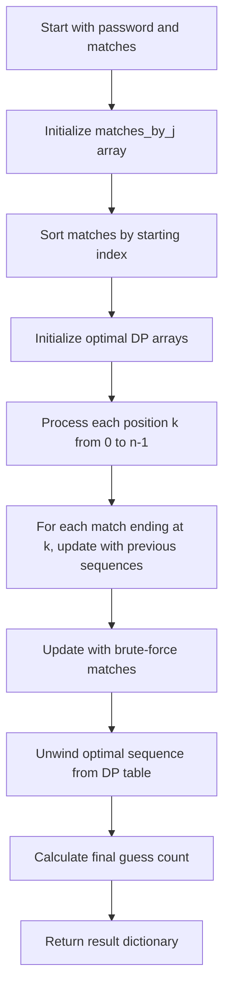

# `scoring.py`

## `zxcvbn.scoring.calc_average_degree` · *function*

## Summary:
Calculates the average degree of nodes in a graph structure by counting non-empty neighbors for each node.

## Description:
This function computes the average degree of a graph by iterating through all nodes and counting their non-empty neighbors. It's commonly used in password strength estimation algorithms to analyze keyboard patterns or character relationship graphs.

## Args:
    graph (dict): A dictionary-like object representing a graph where keys are nodes and values are lists of neighboring nodes. The graph must support .items() iteration.

## Returns:
    float: The average number of non-empty neighbors per node in the graph. Returns 0.0 for empty graphs.

## Raises:
    None explicitly raised, but may raise exceptions from graph.items() or len() operations if graph is not properly structured.

## Constraints:
    Preconditions:
        - The graph parameter must be iterable with .items() method
        - Each node's neighbor list should be iterable
        - Graph should not be None
    
    Postconditions:
        - Returns a float value representing average degree
        - Returns 0.0 when graph is empty

## Side Effects:
    None

## Control Flow:
```mermaid
flowchart TD
    A[Start calc_average_degree] --> B{graph.items()}
    B --> C[Initialize average = 0]
    C --> D[For each key, neighbors in graph.items()]
    D --> E{neighbors list}
    E --> F[Count non-empty neighbors]
    F --> G[Add count to average]
    G --> H[Loop to next node]
    H --> I{All nodes processed?}
    I -->|No| D
    I -->|Yes| J[average /= len(graph.items())]
    J --> K[Return average]
```

## Examples:
    >>> graph = {'a': ['b', 'c'], 'b': ['a'], 'c': ['a']}
    >>> calc_average_degree(graph)
    1.3333333333333333
    
    >>> empty_graph = {}
    >>> calc_average_degree(empty_graph)
    0.0

## `zxcvbn.scoring.nCk` · *function*

## Summary:
Calculates the binomial coefficient C(n,k) representing the number of ways to choose k items from n items without repetition and without order.

## Description:
This function computes the mathematical combination formula C(n,k) = n!/(k!(n-k)!), which represents the number of ways to select k elements from a set of n elements. It's implemented using an optimized iterative approach that avoids computing large factorials directly, making it more numerically stable and efficient.

## Args:
    n (int): Total number of items in the set, must be non-negative
    k (int): Number of items to choose from the set, must be non-negative

## Returns:
    float: The binomial coefficient C(n,k), representing the number of combinations
    - Returns 0 when k > n (impossible selection)
    - Returns 1 when k = 0 (one way to choose zero items)
    - Returns the calculated combination value otherwise

## Raises:
    None

## Constraints:
    Preconditions:
    - Both n and k must be non-negative integers
    - k should not exceed n for meaningful results (though function handles k > n gracefully)
    
    Postconditions:
    - Returns a non-negative numeric value
    - For valid inputs, result represents the mathematical combination C(n,k)

## Side Effects:
    None

## Control Flow:
```mermaid
flowchart TD
    A[nCk(n,k)] --> B{k > n?}
    B -->|Yes| C[return 0]
    B -->|No| D{k == 0?}
    D -->|Yes| E[return 1]
    D -->|No| F[r = 1]
    F --> G[for d in range(1, k+1)]
    G --> H[r *= n]
    H --> I[r /= d]
    I --> J[n -= 1]
    J --> K[r]
    K --> L[return r]
```

## Examples:
    >>> nCk(5, 2)
    10.0
    
    >>> nCk(10, 0)
    1.0
    
    >>> nCk(3, 5)
    0.0
```

## `zxcvbn.scoring.most_guessable_match_sequence` · *function*

## Summary:
Computes the most guessable match sequence for a password by finding the optimal combination of pattern matches that minimizes total guess count.

## Description:
This function implements a dynamic programming algorithm to determine the optimal sequence of pattern matches that would be used by the most guessable attack strategy. It analyzes all possible ways to partition a password into pattern matches and selects the sequence that results in the lowest total number of guesses required to crack the password.

The function processes pattern matches by their ending positions and uses dynamic programming to track the minimum guess count for sequences of different lengths ending at each position. It considers both direct matches from the input and brute-force matches for all possible substrings.

## Args:
    password (str): The password string to analyze for pattern matches
    matches (list[dict]): List of pattern match dictionaries, each containing at least 'i' and 'j' indices indicating the match position in the password
    _exclude_additive (bool): Internal flag to control additive factor in guess calculation, defaults to False

## Returns:
    dict: A dictionary containing:
        - 'password' (str): The input password
        - 'guesses' (Decimal): The minimum number of guesses required for the most guessable sequence
        - 'guesses_log10' (float): Base-10 logarithm of the guess count
        - 'sequence' (list[dict]): The optimal sequence of pattern matches

## Raises:
    None explicitly raised, though underlying operations may raise exceptions from:
    - TypeError when processing matches (caught and ignored)
    - KeyError when accessing match dictionary keys
    - ValueError from mathematical operations

## Constraints:
    Preconditions:
        - password must be a string
        - matches must be iterable with match objects having 'i' and 'j' keys
        - Each match must have valid indices such that 0 ≤ i ≤ j < len(password)
        
    Postconditions:
        - Returns a dictionary with all required keys populated
        - The sequence contains valid match objects with proper indices
        - Guesses value is always positive (at least 1 for empty passwords)

## Side Effects:
    None - This function is pure and doesn't modify external state or perform I/O operations.

## Control Flow:


## Examples:
    # Basic usage with simple matches
    password = "password123"
    matches = [
        {'pattern': 'bruteforce', 'token': 'p', 'i': 0, 'j': 0},
        {'pattern': 'bruteforce', 'token': 'assword', 'i': 1, 'j': 6},
        {'pattern': 'bruteforce', 'token': '123', 'i': 7, 'j': 9}
    ]
    result = most_guessable_match_sequence(password, matches)
    # Returns optimal sequence with guess count and logarithmic value
    
    # Empty password case
    result = most_guessable_match_sequence("", [])
    # Returns {'password': '', 'guesses': 1, 'guesses_log10': 0.0, 'sequence': []}
```

## `zxcvbn.scoring.estimate_guesses` · *function*

## Summary:
Estimates the number of guesses required to crack a password pattern match using pattern-specific algorithms and applies minimum guess thresholds.

## Description:
This function serves as the central estimation engine for computing brute-force guess counts for various password patterns identified by the zxcvbn algorithm. It acts as a dispatcher that routes to appropriate pattern-specific estimation functions based on the match pattern type, ensuring minimum guess thresholds are applied to prevent underestimation of very short patterns.

The function is called during the password strength analysis phase when individual pattern matches have been identified and need their guess counts computed for overall strength calculation.

## Args:
    match (dict): A dictionary containing pattern matching information with keys:
        - 'pattern' (str): The type of pattern matched (e.g., 'bruteforce', 'dictionary', 'spatial')
        - 'token' (str): The matched password substring
        - 'guesses' (optional, str/int/float): Cached guess count if already computed
        - Additional pattern-specific keys required by the respective estimation functions
    password (str): The full password being analyzed, used to determine if token is partial

## Returns:
    Decimal: The estimated number of guesses required to crack the pattern match, with a minimum threshold applied based on token length

## Raises:
    KeyError: If required keys are missing from the match dictionary for the specific pattern type
    TypeError: If match is not a dictionary-like object or if pattern type is unrecognized

## Constraints:
    Preconditions:
        - match must be a dictionary containing at least 'pattern' and 'token' keys
        - match['pattern'] must be one of the recognized pattern types: 'bruteforce', 'dictionary', 'spatial', 'repeat', 'sequence', 'regex', 'date'
        - match['token'] must be a string
        - password must be a string
        
    Postconditions:
        - Returns a Decimal value representing the minimum number of guesses
        - The match dictionary is updated with 'guesses' and 'guesses_log10' keys
        - The returned value is at least the minimum threshold based on token length

## Side Effects:
    - Modifies the input match dictionary by adding 'guesses' and 'guesses_log10' keys
    - Calls pattern-specific estimation functions which may have their own side effects

## Control Flow:
```mermaid
flowchart TD
    A[estimate_guesses called] --> B{guesses already cached?}
    B -->|Yes| C[Return cached guesses as Decimal]
    B -->|No| D[Set min_guesses based on token length]
    D --> E{token length < password length?}
    E -->|Yes| F{token length == 1?}
    F -->|Yes| G[min_guesses = MIN_SUBMATCH_GUESSES_SINGLE_CHAR]
    F -->|No| H[min_guesses = MIN_SUBMATCH_GUESSES_MULTI_CHAR]
    E -->|No| I[min_guesses = 1]
    G --> J
    H --> J
    I --> J
    J --> K[Select estimation function by pattern]
    K --> L[Call estimation function with match]
    L --> M[Apply max(guesses, min_guesses)]
    M --> N[Update match with guesses and guesses_log10]
    N --> O[Return Decimal(guesses)]
```

## Examples:
    # Basic usage with a dictionary match
    match = {
        'pattern': 'dictionary',
        'token': 'password',
        'rank': 1000,
        'reversed': False
    }
    password = 'mypassword123'
    guesses = estimate_guesses(match, password)
    # Returns Decimal representing estimated guesses for the dictionary match
    
    # Usage with cached guesses
    match = {
        'pattern': 'bruteforce',
        'token': 'a',
        'guesses': '1000'
    }
    password = 'a'
    guesses = estimate_guesses(match, password)
    # Returns Decimal('1000') without recomputing

## `zxcvbn.scoring.bruteforce_guesses` · *function*

## Summary:
Calculates the number of brute force guesses required to crack a password token based on its length and character set cardinality.

## Description:
This function estimates the minimum number of guesses needed to brute-force a password token by computing the theoretical maximum combinations based on character set size and token length, then applying minimum guess thresholds to prevent underestimation for very short tokens. It is used in password strength estimation algorithms to quantify the difficulty of guessing a particular token.

## Args:
    match (dict): A dictionary containing at least a 'token' key with the password substring being analyzed. The token value should be a string.

## Returns:
    int: The estimated number of brute force guesses required to crack the token, which is the maximum of:
         - BRUTEFORCE_CARDINALITY raised to the power of token length (theoretical combinations)
         - Minimum guess threshold based on token length (to prevent underestimation)

## Constraints:
    - Input match dictionary must contain a 'token' key with a string value
    - Token length must be non-negative integer
    - BRUTEFORCE_CARDINALITY must be a positive integer representing the size of the character set
    - MIN_SUBMATCH_GUESSES_SINGLE_CHAR and MIN_SUBMATCH_GUESSES_MULTI_CHAR must be non-negative integers

## Side Effects:
    None

## Control Flow:
```mermaid
flowchart TD
    A[Start bruteforce_guesses] --> B{Token length == 1?}
    B -->|Yes| C[Set min_guesses = MIN_SUBMATCH_GUESSES_SINGLE_CHAR + 1]
    B -->|No| D[Set min_guesses = MIN_SUBMATCH_GUESSES_MULTI_CHAR + 1]
    C --> E[guesses = BRUTEFORCE_CARDINALITY ^ len(token)]
    D --> E
    E --> F[Return max(guesses, min_guesses)]
```

## `zxcvbn.scoring.dictionary_guesses` · *function*

*No documentation generated.*

## `zxcvbn.scoring.repeat_guesses` · *function*

## Summary:
Calculates the number of guesses required for a repeated character pattern by multiplying base guesses with the repeat count.

## Description:
This function computes the guess count for repeated character patterns in password strength estimation. It's used in the zxcvbn password strength estimator to calculate how many attempts an attacker would need to make to guess a repeated character sequence.

The function extracts base_guesses and repeat_count from a match dictionary, converts the repeat_count to Decimal for precision, and returns their product. This calculation is essential for accurately estimating the strength of passwords containing repeated characters.

## Args:
    match (dict): A dictionary containing match information with keys 'base_guesses' and 'repeat_count'
        - base_guesses (float or int): The base number of guesses required for the pattern
        - repeat_count (int or float): The number of times the character is repeated

## Returns:
    Decimal: The total number of guesses required for the repeated character pattern, calculated as base_guesses * repeat_count

## Raises:
    KeyError: If either 'base_guesses' or 'repeat_count' keys are missing from the match dictionary
    TypeError: If match is not a dictionary-like object or if base_guesses/repeat_count cannot be converted to numbers

## Constraints:
    Preconditions:
        - match must be a dictionary-like object containing 'base_guesses' and 'repeat_count' keys
        - base_guesses must be convertible to a numeric type
        - repeat_count must be convertible to a numeric type
    
    Postconditions:
        - Returns a Decimal value representing the total guess count
        - The result is the product of base_guesses and repeat_count

## Side Effects:
    None

## Control Flow:
```mermaid
flowchart TD
    A[repeat_guesses called] --> B{match has keys?}
    B -->|No| C[KeyError raised]
    B -->|Yes| D[Convert repeat_count to Decimal]
    D --> E[Multiply base_guesses × Decimal(repeat_count)]
    E --> F[Return result]
```

## Examples:
    >>> match = {'base_guesses': 10, 'repeat_count': 3}
    >>> repeat_guesses(match)
    Decimal('30')
    
    >>> match = {'base_guesses': 5.5, 'repeat_count': 2}
    >>> repeat_guesses(match)
    Decimal('11')

## `zxcvbn.scoring.sequence_guesses` · *function*

## Summary:
Calculates the number of possible guesses needed to crack a sequential character pattern in a password.

## Description:
This function computes the guess count for sequential character sequences by determining the base set of possible starting characters and adjusting for sequence direction. It's used in password strength estimation to quantify how many attempts an attacker would need to make to guess a sequential pattern.

The function is called as part of the zxcvbn password strength estimation algorithm, specifically when analyzing sequential character patterns such as 'abc', '123', 'zyx', etc.

## Args:
    match (dict): A dictionary containing pattern matching information with keys:
        - 'token' (str): The sequential character string being analyzed
        - 'ascending' (bool): Whether the sequence is in ascending order

## Returns:
    int: The estimated number of possible guesses needed to crack the sequential pattern

## Raises:
    KeyError: If the match dictionary doesn't contain required keys ('token' or 'ascending')
    TypeError: If match is not a dictionary or token is not a string

## Constraints:
    Preconditions:
        - match must be a dictionary containing 'token' and 'ascending' keys
        - match['token'] must be a string
        - match['ascending'] must be a boolean
    
    Postconditions:
        - Returns a positive integer representing guess count
        - The result accounts for character set size and sequence length

## Side Effects:
    None

## Control Flow:
```mermaid
flowchart TD
    A[Start sequence_guesses] --> B{First char in ['a','A','z','Z','0','1','9']}
    B -- Yes --> C[base_guesses = 4]
    B -- No --> D{First char is digit}
    D -- Yes --> E[base_guesses = 10]
    D -- No --> F[base_guesses = 26]
    C --> G{Not ascending}
    E --> G
    F --> G
    G -- Yes --> H[base_guesses *= 2]
    G -- No --> I
    H --> I[Return base_guesses * len(token)]
    I --> J[End]
```

## Examples:
    >>> match = {'token': 'abc', 'ascending': True}
    >>> sequence_guesses(match)
    78
    
    >>> match = {'token': '321', 'ascending': False}
    >>> sequence_guesses(match)
    20

## `zxcvbn.scoring.regex_guesses` · *function*

## Summary:
Calculates the number of possible guesses needed to crack a regex-matched pattern in password strength estimation.

## Description:
This function computes the entropy (guess count) for password patterns identified by regular expressions. It handles two main cases: character class patterns and recent year patterns. The function is part of the zxcvbn password strength estimation algorithm, which estimates how long it would take to crack passwords through brute force guessing.

## Args:
    match (dict): A dictionary containing regex matching information with the following required keys:
        - 'regex_name' (str): Name of the regex pattern matched
        - 'token' (str): The matched string token (for character class patterns)
        - 'regex_match' (re.Match): The regex match object (for recent_year case)

## Returns:
    int: The estimated number of guesses required to crack the pattern:
        - For character class patterns: base^length where base is the character set size (26, 52, 62, 10, or 33)
        - For recent year patterns: absolute difference from a reference year, with a minimum space constraint

## Raises:
    KeyError: If required keys ('regex_name', 'token') are missing from match dict
    ValueError: If 'regex_match' group conversion fails for recent_year case
    TypeError: If match parameter is not a dictionary or contains invalid types

## Constraints:
    Preconditions:
        - match must be a dictionary with required keys
        - 'regex_name' must be one of the supported pattern types
        - 'token' must be a string for character class calculations
        - 'regex_match' must be a valid regex match object for recent_year case
    
    Postconditions:
        - Returns a positive integer representing guess count
        - For character classes, result is at least 1
        - For recent years, result is at least the minimum year space threshold

## Side Effects:
    None

## Control Flow:
```mermaid
flowchart TD
    A[Start regex_guesses] --> B{regex_name in char_class_bases?}
    B -- Yes --> C[Calculate base^len(token)]
    B -- No --> D{regex_name == 'recent_year'?}
    D -- Yes --> E[Get year from regex_match.group(0)]
    E --> F[Calculate absolute difference from REFERENCE_YEAR]
    F --> G[Apply max(year_space, MIN_YEAR_SPACE)]
    G --> H[Return year_space]
    D -- No --> I[Return 0 or raise error]
    C --> J[Return result]
```

## Examples:
    # Character class pattern
    match = {'regex_name': 'digits', 'token': '123'}
    guesses = regex_guesses(match)  # Returns 10^3 = 1000
    
    # Recent year pattern  
    match = {'regex_name': 'recent_year', 'regex_match': re.match(r'\d{4}', '2015')}
    guesses = regex_guesses(match)  # Returns absolute difference from REFERENCE_YEAR
```

## `zxcvbn.scoring.date_guesses` · *function*

## Summary:
Calculates the number of possible guesses needed to crack a date pattern in a password based on year differences.

## Description:
Estimates the computational effort required to brute-force a date pattern by calculating the number of potential year combinations, multiplied by days in a year (365), and optionally adjusted for separators. This function is part of the zxcvbn password strength estimation algorithm that analyzes common patterns in passwords.

## Args:
    match (dict): A dictionary containing at least a 'year' key with an integer year value, and optionally a 'separator' key indicating if a separator character was used in the date pattern.

## Returns:
    int: The estimated number of guesses required to crack the date pattern, representing the search space size for brute-force attacks.

## Raises:
    KeyError: If the 'year' key is missing from the match dictionary.

## Constraints:
    Preconditions:
        - The match dictionary must contain a 'year' key with a numeric value
        - REFERENCE_YEAR and MIN_YEAR_SPACE constants must be defined in the module scope
    Postconditions:
        - Returns a positive integer representing the estimated guess count
        - The result accounts for at least MIN_YEAR_SPACE years even if the actual difference is smaller

## Side Effects:
    None: This function has no side effects and is purely computational.

## Control Flow:
```mermaid
flowchart TD
    A[Start date_guesses] --> B[Calculate year_space = max(abs(match['year'] - REFERENCE_YEAR), MIN_YEAR_SPACE)]
    B --> C[Calculate guesses = year_space * 365]
    C --> D{match.get('separator', False)}
    D -- True --> E[guesses *= 4]
    D -- False --> F[Return guesses]
    E --> F
```

## `zxcvbn.scoring.spatial_guesses` · *function*

## Summary:
Calculates the number of possible guesses for a spatial pattern match based on keyboard layout and typing patterns.

## Description:
Computes the estimated number of guesses required to crack a password token that follows a spatial pattern (such as keyboard sequences). This function accounts for different keyboard layouts (QWERTY, DVORAK, keypad) and considers the number of turns made while typing the sequence, as well as shifted key variations.

The function uses mathematical combinations to estimate the number of possible paths on a keyboard layout, taking into account:
- Starting positions on the keyboard
- Average degree of connectivity between keys
- Number of turns in the pattern
- Shifted vs unshifted key variations

## Args:
    match (dict): A dictionary containing match information with the following required keys:
        - 'graph' (str): The keyboard layout used ('qwerty', 'dvorak', or other for keypad)
        - 'token' (str): The matched token string
        - 'turns' (int): Number of turns made while typing the sequence
        - 'shifted_count' (int): Number of shifted keys in the token (0 if none)

## Returns:
    float: The estimated number of possible guesses for this spatial pattern match

## Raises:
    None

## Constraints:
    Preconditions:
    - The match dictionary must contain 'graph', 'token', 'turns', and 'shifted_count' keys
    - 'token' must be a string
    - 'turns' must be a non-negative integer
    - 'shifted_count' must be a non-negative integer

    Postconditions:
    - Returns a positive numeric value representing the guess count
    - The returned value reflects the complexity of the spatial pattern

## Side Effects:
    None

## Control Flow:
```mermaid
flowchart TD
    A[spatial_guesses(match)] --> B{match['graph'] in ['qwerty','dvorak']}
    B -->|True| C[s = KEYBOARD_STARTING_POSITIONS, d = KEYBOARD_AVERAGE_DEGREE]
    B -->|False| D[s = KEYPAD_STARTING_POSITIONS, d = KEYPAD_AVERAGE_DEGREE]
    C --> E[guesses = 0]
    D --> E
    E --> F[L = len(match['token']), t = match['turns']]
    F --> G[i = 2 to L+1]
    G --> H[possible_turns = min(t, i-1) + 1]
    H --> I[j = 1 to possible_turns]
    I --> J[guesses += nCk(i-1,j-1) * s * pow(d,j)]
    J --> K{match['shifted_count'] > 0}
    K -->|True| L[S = shifted_count, U = L - S]
    L --> M{S == 0 OR U == 0}
    M -->|True| N[guesses *= 2]
    M -->|False| O[shifted_variations = sum(nCk(S+U,i) for i=1 to min(S,U))]
    O --> P[guesses *= shifted_variations]
    K -->|False| Q[Return guesses]
    N --> Q
    P --> Q
```

## `zxcvbn.scoring.uppercase_variations` · *function*

*No documentation generated.*

## `zxcvbn.scoring.l33t_variations` · *function*

## Summary:
Calculates the number of possible variations for l33t speak character substitutions in a matched token.

## Description:
This function computes the combinatorial possibilities of l33t speak substitutions (like replacing 'a' with '@') in a matched password token. It's used in the zxcvbn password strength estimation algorithm to account for the complexity introduced by character substitutions.

The function processes each l33t substitution pair (subbed character, unsubbed character) and calculates how many different ways those substitutions could have occurred in the original token. This helps estimate the entropy increase due to such substitutions.

## Args:
    match (dict): A dictionary containing match information with the following keys:
        - 'l33t' (bool): Indicates if the match involves l33t speak substitutions (defaults to False if key missing)
        - 'sub' (dict): Mapping of substituted characters to their original forms
        - 'token' (str): The matched token being analyzed

## Returns:
    int: The total number of possible variation combinations for all l33t substitutions in the token.
         Returns 1 if no l33t substitutions are present in the match or if 'l33t' key is False.

## Raises:
    None

## Constraints:
    Preconditions:
    - The match parameter must be a dictionary
    - The 'sub' key must be a dictionary mapping substituted characters to original characters
    - The 'token' key must be a string
    
    Postconditions:
    - Returns a positive integer representing the number of variation possibilities
    - If no l33t substitutions are detected, returns 1 (neutral multiplier)

## Side Effects:
    None

## Control Flow:
```mermaid
flowchart TD
    A[Start l33t_variations] --> B{match.get('l33t', False) is False?}
    B -->|Yes| C[return 1]
    B -->|No| D[Initialize variations = 1]
    D --> E[For each subbed, unsubbed in match['sub'].items()]
    E --> F[Convert token to lowercase]
    F --> G[Count occurrences of subbed character]
    G --> H[Count occurrences of unsubbed character]
    H --> I{S == 0 OR U == 0?}
    I -->|Yes| J[variations *= 2]
    I -->|No| K[p = min(U, S)]
    K --> L[possibilities = 0]
    L --> M[for i in range(1, p+1)]
    M --> N[possibilities += nCk(U+S, i)]
    N --> O[variations *= possibilities]
    O --> P[End loop]
    P --> Q[return variations]
```

## Examples:
    >>> match = {
    ...     'l33t': True,
    ...     'sub': {'@': 'a'},
    ...     'token': 'p@ssw0rd'
    ... }
    >>> l33t_variations(match)
    2
    
    >>> match = {
    ...     'l33t': True,
    ...     'sub': {'@': 'a', '0': 'o'},
    ...     'token': 'p@ssw0rd'
    ... }
    >>> l33t_variations(match)
    # Returns the number of possible combinations for both substitutions

