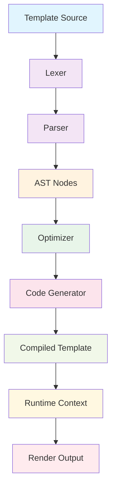

# `Jinja2`

## Repository Overview

### Purpose
Jinja2 is a modern and designer-friendly templating engine for Python. It provides a rich set of features for generating HTML, XML, or any other markup format from templates. The engine emphasizes performance, security, and flexibility while maintaining an intuitive syntax that is familiar to designers and front-end developers.

Jinja2 serves as a core dependency for many web frameworks (like Flask, Django) and static site generators, making it essential for dynamic content generation in Python applications.

### Target Users
- Web developers building web applications with Python frameworks
- Static site generators requiring template processing
- Backend developers needing to generate dynamic content
- Designers working with Python-based templating systems

### Position in Ecosystem
Jinja2 functions as a standalone templating library that can be used independently or integrated into larger web frameworks. It's designed to be lightweight yet powerful, providing both basic templating capabilities and advanced features like template inheritance, macros, and sandboxed execution.

## Architecture

### Key Abstractions and Patterns
- **Template Engine Pipeline**: The standard flow follows lexer → parser → AST → optimization → code generation → runtime execution
- **Node-Based AST System**: Templates are represented as abstract syntax trees with various node types
- **Extensible Environment**: Customizable environments allow for different behaviors and extensions
- **Sandbox Security Model**: Sandboxed environments provide secure template execution
- **Lazy Evaluation**: Values are computed only when needed during rendering

## Entry Points

### Importable APIs
- `jinja2.Environment` - Main entry point for creating template environments
- `jinja2.Template` - Direct template instantiation  
- `jinja2.Template.render()` - Render a template with context
- `jinja2.from_string()` - Create template from string
- `jinja2.FileSystemLoader` - Load templates from filesystem
- `jinja2.Environment.from_string()` - Create environment with template from string

### CLI Commands
- `jinja2` command-line utility for template processing (when installed)
- Available via `pip install jinja2-cli` package

## Core Modules Structure

Based on the source code organization, Jinja2 consists of several core modules:

### src/jinja2/
- **environment.py** - Contains Environment and Template classes, core template execution logic
- **lexer.py** - Lexical analysis and tokenization of template source code
- **parser.py** - Parses tokens into abstract syntax tree (AST) nodes
- **ast.py** - Abstract syntax tree node definitions and visitor patterns
- **optimizer.py** - Optimizes AST nodes for better performance
- **compiler.py** - Generates Python bytecode from AST nodes
- **runtime.py** - Runtime context management and execution
- **filters.py** - Built-in template filters
- **tests.py** - Built-in template tests
- **utils.py** - Utility functions and classes
- **sandbox.py** - Sandboxed execution environment for secure template rendering
- **constants.py** - Constant definitions
- **exceptions.py** - Custom exception classes
- **debug.py** - Debugging utilities and traceback handling

## Core Features

1. **Template Inheritance** - Extend and override base templates
2. **Macros** - Reusable template fragments with parameters
3. **Filters** - Transform data within templates
4. **Tests** - Conditional logic in templates
5. **Control Structures** - Loops, conditionals, and blocks
6. **Sandboxed Execution** - Secure template execution environment
7. **Async Support** - Asynchronous template rendering
8. **Custom Extensions** - Extend template syntax and behavior
9. **Caching** - Template and fragment caching mechanisms
10. **Internationalization** - Built-in gettext support

## Dependencies

### Core Dependencies
- Python 3.7+ (officially supported)
- MarkupSafe (for HTML escaping)
- typing_extensions (for type annotations)

### Optional Dependencies
- async-timeout (for async operations)
- setuptools (for installation)

## Configuration

### Environment Variables
- `JINJA2_CACHE_SIZE` - Controls internal cache sizes
- `JINJA2_AUTOESCAPE` - Controls automatic escaping behavior

### Runtime Parameters
- `autoescape` - Enable/disable automatic HTML escaping
- `trim_blocks` - Remove leading whitespace from blocks
- `lstrip_blocks` - Remove leading whitespace from lines
- `newline_sequence` - Control line ending handling

## Extension Points

### Custom Extensions
- Implement `Extension` class to add new syntax elements
- Override `parse()` method to handle custom syntax
- Add custom filters, tests, and global functions

### Environment Customization
- Subclass `Environment` to modify behavior
- Override `get_template()` to customize template loading
- Customize `code_generator_class` for different code generation strategies

### Template Loading Strategies
- Implement custom `Loader` classes
- Support for filesystem, package, database, or remote loading
- Template caching and invalidation mechanisms

### Security Controls
- Custom `SandboxedEnvironment` for restricted execution
- Attribute and callable safety controls
- Custom security policies and restrictions

---

## Modules

- [`docs`](docs.md)
- [`docs/examples`](docs/examples.md)
- [`scripts`](scripts.md)
- [`src`](src.md)
- [`src/jinja2`](src/jinja2.md)

