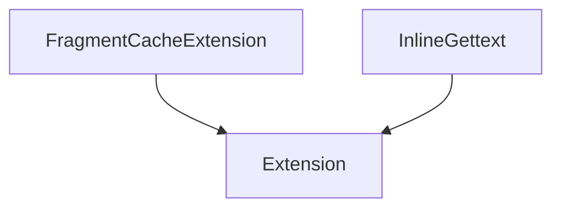

# `docs`

## Tree:
```
docs/
└── examples/
    ├── cache_extension.py
    └── inline_gettext_extension.py
```

## Role:
Provides example implementations of custom Jinja2 template extensions for caching and internationalization functionality.

## Description:
This module serves as a collection of example extensions for the Jinja2 templating engine. It demonstrates how to create custom extensions that implement fragment-level caching and inline gettext functionality for internationalization. These examples illustrate advanced template extension patterns and are designed to showcase best practices for extending Jinja2's capabilities.

The examples are part of the documentation and serve as reference implementations for developers working with Jinja2 extensions. They demonstrate practical applications of template parsing, filtering, and caching mechanisms.

## Components:
- `FragmentCacheExtension` (class): Implements a fragment-level caching mechanism for Jinja2 templates
- `InlineGettext` (class): Provides inline gettext functionality for internationalizing template content



## Public API:
- `FragmentCacheExtension`: Custom Jinja2 extension for caching template fragments
  - Usage: Add to Jinja2 environment to enable `` template tags
- `InlineGettext`: Custom Jinja2 extension for inline translation support  
  - Usage: Add to Jinja2 environment to enable inline gettext expressions

## Dependencies:
- Internal: None
- External: 
  - `jinja2` (for Extension base class and template parsing)
  - `jinja2.nodes` (for AST manipulation)
  - `jinja2.exceptions` (for TemplateSyntaxError)

## Constraints:
- Both extensions require proper initialization in a Jinja2 environment
- `FragmentCacheExtension` requires `fragment_cache` and `fragment_cache_prefix` to be set on the environment
- `InlineGettext` requires regular expression patterns to be properly defined
- Extensions must be added to the Jinja2 environment before template compilation

