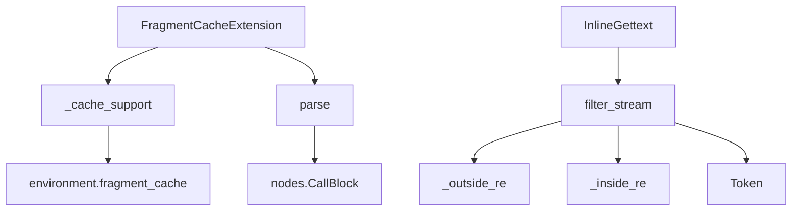

# `docs.examples`

## Tree:
examples/
├── cache_extension.py
└── inline_gettext_extension.py

## Role:
Provides example implementations of custom Jinja2 template extensions for caching and internationalization functionality.

## Description:
This module contains example implementations of Jinja2 custom extensions that demonstrate how to extend template functionality. These extensions showcase common patterns for creating reusable template features in Jinja2-based applications.

The module serves as educational material for developers who want to understand how to create custom extensions for Jinja2 templates, particularly for caching and internationalization use cases.

## Components:
*   **FragmentCacheExtension**: Implements a template tag for caching fragment output with configurable timeouts
*   **InlineGettext**: Provides inline gettext functionality for translating template content

## Public API:
*   **FragmentCacheExtension**: Custom Jinja2 extension class that adds `` template tag functionality for caching template fragments
*   **InlineGettext**: Custom Jinja2 extension class that enables inline gettext expressions in templates for translation

## Dependencies:
*   **Internal**: Uses Jinja2's Extension base class and nodes module for AST manipulation
*   **External**: Depends on Jinja2 templating engine for extension framework and token processing

## Constraints:
*   Callers must register the extension with a Jinja2 environment using `env.add_extension()`
*   For FragmentCacheExtension, the Jinja2 environment must have `fragment_cache` and `fragment_cache_prefix` attributes properly configured
*   The `InlineGettext` extension requires proper regex patterns (`_outside_re`, `_inside_re`) and token handling setup
*   Both extensions require Jinja2's parsing and compilation infrastructure to be available

---

## Files

- [`cache_extension.py`](examples/cache_extension.md)
- [`inline_gettext_extension.py`](examples/inline_gettext_extension.md)

