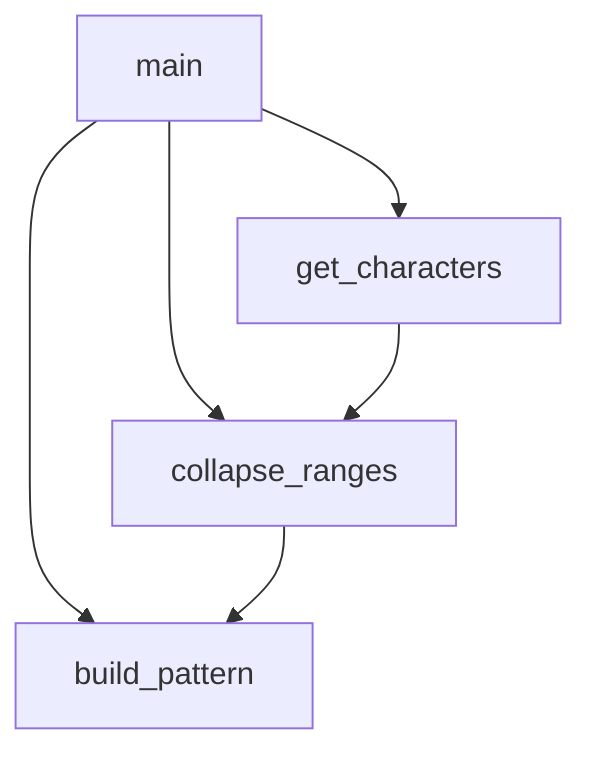

# `scripts`

## Tree:
scripts/
└── generate_identifier_pattern.py

## Role:
Generates a regular expression pattern for valid Python identifier characters

## Description:
This module is responsible for generating a compiled regular expression pattern that matches valid Python identifier characters. It analyzes Unicode characters to determine which ones can be part of Python identifiers and creates an optimized regex pattern for this purpose. The generated pattern is written to a source file for use by the Jinja2 templating engine.

## Components:
- build_pattern(ranges): Converts character ranges into a compact string representation
- collapse_ranges(data): Groups consecutive characters into ranges
- get_characters(): Identifies valid identifier-start characters from Unicode space
- main(): Orchestrates the generation process and writes output to source file

## Public API:
- main(): Entry point that generates and writes the identifier pattern to a source file
- get_characters(): Generator yielding valid identifier-start characters
- collapse_ranges(data): Generator yielding character ranges from sorted characters
- build_pattern(ranges): Converts ranges into compact regex pattern string

## Dependencies:
- itertools: Used for grouping consecutive characters
- os: For file path manipulation
- re: For regular expression operations
- sys: For accessing maximum Unicode value
- src.jinja2._identifier: Target file where the generated pattern is written

## Constraints:
- Must be run from the scripts directory
- Requires write permissions to the src/jinja2 directory
- Depends on Python's Unicode handling capabilities
- The generated pattern is intended for internal use by Jinja2

---

## Files

- [`generate_identifier_pattern.py`](scripts/generate_identifier_pattern.md)

