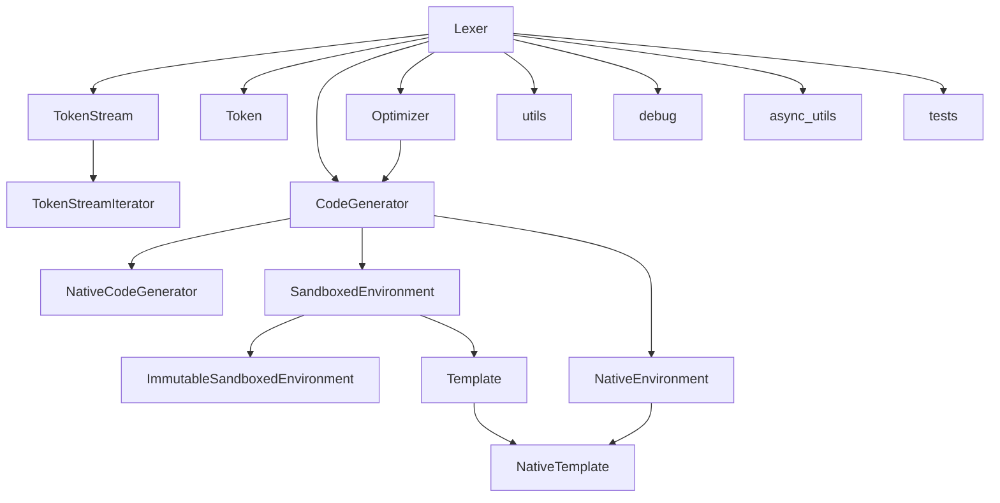

# `src`

## Tree:
    src/
    └── jinja2/
        ├── async_utils.py
        ├── debug.py
        ├── lexer.py
        ├── nativetypes.py
        ├── optimizer.py
        ├── sandbox.py
        ├── tests.py
        └── utils.py

## Role:
    - Provides core template engine functionality for Jinja2, including lexing, parsing, compilation, and rendering of templates

## Description:
    - This module serves as the core engine of the Jinja2 templating system, handling all aspects of template processing from lexical analysis to code generation and execution
    - It provides the foundational infrastructure for template parsing, compilation, and rendering, supporting both synchronous and asynchronous operations
    - Primary consumers include the main Environment class and various template processing components throughout the application
    - The module is organized around the layered architecture of template processing: lexical analysis (lexer), parsing, optimization, code generation, and execution

## Components:
    - Lexer: Tokenizes template source code into meaningful units for parsing
    - Token: Represents a single token in the template stream
    - TokenStream: Manages iteration over tokens with peeking and lookahead capabilities
    - TokenStreamIterator: Iterator for token streams
    - Optimizer: Performs optimizations on parsed template ASTs
    - CodeGenerator: Generates Python bytecode from template ASTs
    - NativeCodeGenerator: Specialized code generator for native types
    - NativeEnvironment: Environment optimized for native types
    - NativeTemplate: Template implementation for native environments
    - SandboxedEnvironment: Secure environment with restricted operations
    - ImmutableSandboxedEnvironment: Sandboxed environment with immutable objects
    - async_utils: Utilities for asynchronous template processing
    - debug: Debugging tools for template errors and tracebacks
    - tests: Built-in template tests
    - utils: Various utility functions and classes

## Public API:
    - `get_lexer(environment)`: Returns a cached lexer instance for the given environment
    - `Lexer`: Main class for tokenizing template source code
    - `Token`: Named tuple representing a token with line number, type, and value
    - `TokenStream`: Stream of tokens with peeking and lookahead capabilities
    - `TokenStreamIterator`: Iterator for token streams
    - `CodeGenerator`: Base class for generating Python code from templates
    - `NativeCodeGenerator`: Optimized code generator for native types
    - `NativeEnvironment`: Environment optimized for native types
    - `NativeTemplate`: Template implementation for native environments
    - `SandboxedEnvironment`: Secure environment with restricted operations
    - `ImmutableSandboxedEnvironment`: Sandboxed environment with immutable objects
    - `Optimizer`: Optimizes template ASTs for better performance
    - `async_variant`: Decorator for creating async variants of sync functions
    - `auto_aiter`: Converts iterables to async iterators
    - `auto_await`: Awaits values that may be awaitable
    - `auto_to_list`: Converts iterables to lists asynchronously
    - `rewrite_traceback_stack`: Rewrites traceback stacks for better error reporting
    - `get_template_locals`: Extracts template-local variables from frame locals
    - `fake_traceback`: Creates fake tracebacks for template errors
    - `test_*`: Built-in template test functions
    - `pass_context`, `pass_environment`, `pass_eval_context`: Decorators for passing context information
    - `LRUCache`, `Cycler`, `Joiner`, `Namespace`: Utility classes for common operations

## Dependencies:
    - Internal imports: 
        - `src.jinja2.nodes`: AST node definitions
        - `src.jinja2.constants`: Constants used throughout the engine
        - `src.jinja2.runtime`: Runtime components like Undefined and Context
        - `src.jinja2.exceptions`: Exception definitions
    - External imports:
        - `typing`: Type hints and annotations
        - `re`: Regular expressions for pattern matching
        - `collections.deque`: Double-ended queue for efficient token management
        - `ast`: Abstract syntax tree manipulation
        - `json`: JSON serialization for HTML-safe output
        - `markupsafe`: Markup handling for HTML escaping
        - `operator`: Standard operators for expression evaluation
        - `types`: Type checking utilities
        - `itertools`: Iteration utilities
        - `inspect`: Function inspection utilities

## Constraints:
    - All template processing must be thread-safe when using shared environments
    - Lexers are cached per environment configuration to avoid redundant creation
    - Template rendering requires proper context setup with variables and filters
    - Sandboxed environments enforce security restrictions on operations
    - Async operations require the environment to be configured with async mode enabled
    - Token streams must be consumed completely to prevent resource leaks

