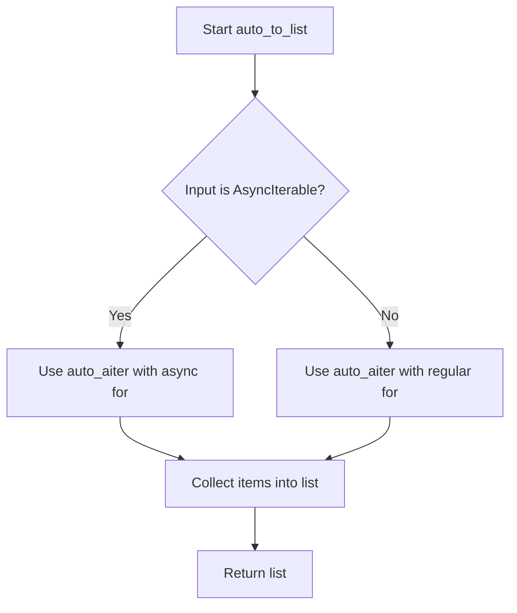

# `async_utils.py`

## `src.jinja2.async_utils.async_variant` · *function*

## Summary:
Creates a decorator that enables switching between synchronous and asynchronous function implementations based on execution context.

## Description:
The `async_variant` function is a decorator factory designed to support both synchronous and asynchronous versions of the same function within Jinja2 templates. It allows a single interface to work in both async and sync contexts by automatically selecting the appropriate implementation based on the environment's async capability.

This abstraction is particularly useful in template engines where the same operation might need to be performed either synchronously or asynchronously depending on whether the rendering context is async-capable. The decorator handles the complexity of determining which version to invoke based on runtime context.

## Args:
    normal_func (Callable): The synchronous version of the function to be wrapped. This function serves as the base implementation that will be called when the execution context is synchronous.

## Returns:
    Callable: A decorator function that accepts an asynchronous version of the function and returns a wrapper that intelligently routes calls to either the synchronous or asynchronous implementation.

## Raises:
    None explicitly raised by this function. However, the underlying functions being decorated may raise exceptions.

## Constraints:
    Preconditions:
    - The `normal_func` parameter must be a callable that can be properly wrapped
    - The async function passed to the returned decorator must be compatible with the normal function signature
    - The function objects must have proper metadata for the wrapping process to work correctly
    - The normal function should be designed to work in both sync and async contexts
    
    Postconditions:
    - The returned wrapper function maintains the signature and metadata of both the normal and async functions
    - The wrapper function will execute either the synchronous or asynchronous version based on the execution context
    - The wrapper function will have a `jinja_async_variant` attribute set to `True`
    - The wrapper function will properly handle argument passing based on the `_PassArg` configuration

## Side Effects:
    None directly caused by this function. However, the wrapper function it produces may cause side effects depending on the functions it wraps.

## Control Flow:
```mermaid
flowchart TD
    A[async_variant called with normal_func] --> B[Returns decorator]
    B --> C[decorator called with async_func]
    C --> D[Get pass_arg from normal_func using _PassArg.from_obj]
    D --> E[Set need_eval_context = (pass_arg is None)]
    E --> F[Define is_async function based on pass_arg]
    F --> G[Create wrapper function with wraps decorators]
    G --> H[In wrapper: call is_async(args) to determine context]
    H --> I{is_async returns True?}
    I -->|Yes| J[If need_eval_context: args = args[1:] then call async_func(*args, **kwargs)]
    I -->|No| K[If need_eval_context: args = args[1:] then call normal_func(*args, **kwargs)]
    J --> L[Return async result]
    K --> L
    L --> M[Return result]
```

## Examples:
```python
# Define a synchronous function that may be used in both sync and async contexts
@async_variant
def render_template(name, context):
    # Synchronous implementation
    return f"Rendered {name} with {context}"

# Create async variant using the decorator
@render_template.async_variant
async def render_template_async(name, context):
    # Asynchronous implementation  
    return f"Async rendered {name} with {context}"

# When called in sync context:
result = render_template("test.html", {"user": "john"})  # Calls sync version

# When called in async context:
result = await render_template("test.html", {"user": "john"})  # Calls async version

# The wrapper automatically detects the execution context and chooses appropriately
```

## `src.jinja2.async_utils.auto_await` · *function*

## Summary:
Asynchronously resolves awaitable values while preserving regular values, enabling seamless handling of mixed sync/async contexts.

## Description:
This utility function provides a unified interface for processing values that may be either synchronous values or awaitable objects. It automatically detects and awaits awaitable objects while returning non-awaitable values unchanged. This pattern is commonly used in template engines like Jinja2 where expressions might evaluate to either regular values or coroutines that need to be resolved.

The function is extracted into its own utility to provide a clean abstraction for handling mixed sync/async workflows without requiring callers to manually check for awaitability.

## Args:
    value (Union[Awaitable[V], V]): A value that may be either an awaitable object or a regular value of type V. The type V represents the expected return type.

## Returns:
    V: The resolved value, either the original value if it was not awaitable, or the result of awaiting the awaitable value. The return type matches the input type V.

## Raises:
    None explicitly raised by this function, though underlying await operations may raise exceptions during execution.

## Constraints:
    Preconditions:
    - The input value must be compatible with the type system expectations
    - If the value is an awaitable, it must be a valid awaitable object that can be awaited
    
    Postconditions:
    - The returned value will be of the same type as the input value (type V)
    - If the input was awaitable, the returned value will be the awaited result
    - If the input was not awaitable, the returned value will be identical to the input

## Side Effects:
    None - This function is pure and doesn't modify external state

## Control Flow:
```mermaid
flowchart TD
    A[Start auto_await] --> B{type(value) in _common_primitives?}
    B -- Yes --> C[Return value casted to V]
    B -- No --> D{inspect.isawaitable(value)?}
    D -- Yes --> E[await value and return result]
    D -- No --> F[Return value casted to V]
```

## Examples:
```python
# Usage with regular values
result = await auto_await(42)  # Returns 42

# Usage with awaitable values  
async def get_value():
    return "hello"
    
result = await auto_await(get_value())  # Returns "hello" after awaiting
```

## `src.jinja2.async_utils.auto_aiter` · *function*

*No documentation generated.*

## `src.jinja2.async_utils.auto_to_list` · *function*

## Summary:
Converts an async or synchronous iterable into a list asynchronously.

## Description:
This function provides a unified interface for converting both async and synchronous iterables into lists. It leverages `auto_aiter` internally to handle the complexity of determining whether the input is an async iterable or a regular iterable, then collects all items into a list.

## Args:
    value (Union[AsyncIterable[V], Iterable[V]]): An async iterable or regular iterable to convert to a list.

## Returns:
    List[V]: A list containing all items from the input iterable.

## Raises:
    None explicitly raised - relies on underlying iterator behavior.

## Constraints:
    Precondition: The input must be either an async iterable (has `__aiter__` method) or a regular iterable.
    Postcondition: The returned value is always a list containing all elements from the input iterable.

## Side Effects:
    None - this function is pure and doesn't cause any I/O or external state mutations.

## Control Flow:


## Examples:
```python
# With async iterable
async def async_generator():
    for i in range(3):
        yield i

result = await auto_to_list(async_generator())  # Returns [0, 1, 2]

# With regular iterable
result = await auto_to_list([1, 2, 3])  # Returns [1, 2, 3]
```

