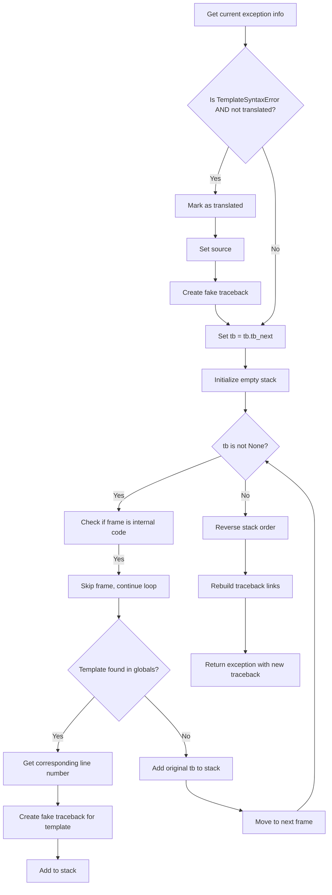

# `debug.py`

## `src.jinja2.debug.rewrite_traceback_stack` · *function*

## Summary:
Rewrites traceback information to provide clearer debugging context for Jinja2 template errors by filtering internal frames and mapping template line numbers to source locations.

## Description:
This function processes exception tracebacks to improve debugging experience when Jinja2 templates fail. It removes internal implementation frames from the traceback, maps template line numbers to actual source line numbers, and constructs a cleaner traceback that points to user-facing template code rather than Jinja2's internal machinery.

The function is typically called when handling exceptions during template rendering to provide more meaningful error messages to developers. It's extracted into its own function to encapsulate the complex traceback manipulation logic and maintain clean separation between template execution and error reporting.

## Args:
    source (str, optional): The source code of the template being processed. Defaults to None.

## Returns:
    BaseException: The exception with its traceback rewritten to provide better debugging information.

## Raises:
    None explicitly raised - delegates to underlying exception handling mechanisms.

## Constraints:
    Preconditions:
    - Must be called within an exception handler (sys.exc_info() must contain an active exception)
    - The exception must be either a TemplateSyntaxError or a regular exception
    
    Postconditions:
    - The returned exception has a cleaned-up traceback chain
    - TemplateSyntaxError instances are marked as translated
    - Internal Jinja2 frames are filtered out from the traceback

## Side Effects:
    None - This function only manipulates traceback objects and doesn't perform I/O or modify external state.

## Control Flow:


## Examples:
```python
try:
    # Template rendering code that might raise an exception
    template.render(context)
except Exception as e:
    # Rewrite traceback for better debugging
    raise rewrite_traceback_stack(template_source) from e
```

## `src.jinja2.debug.fake_traceback` · *function*

*No documentation generated.*

## `src.jinja2.debug.get_template_locals` · *function*

*No documentation generated.*

