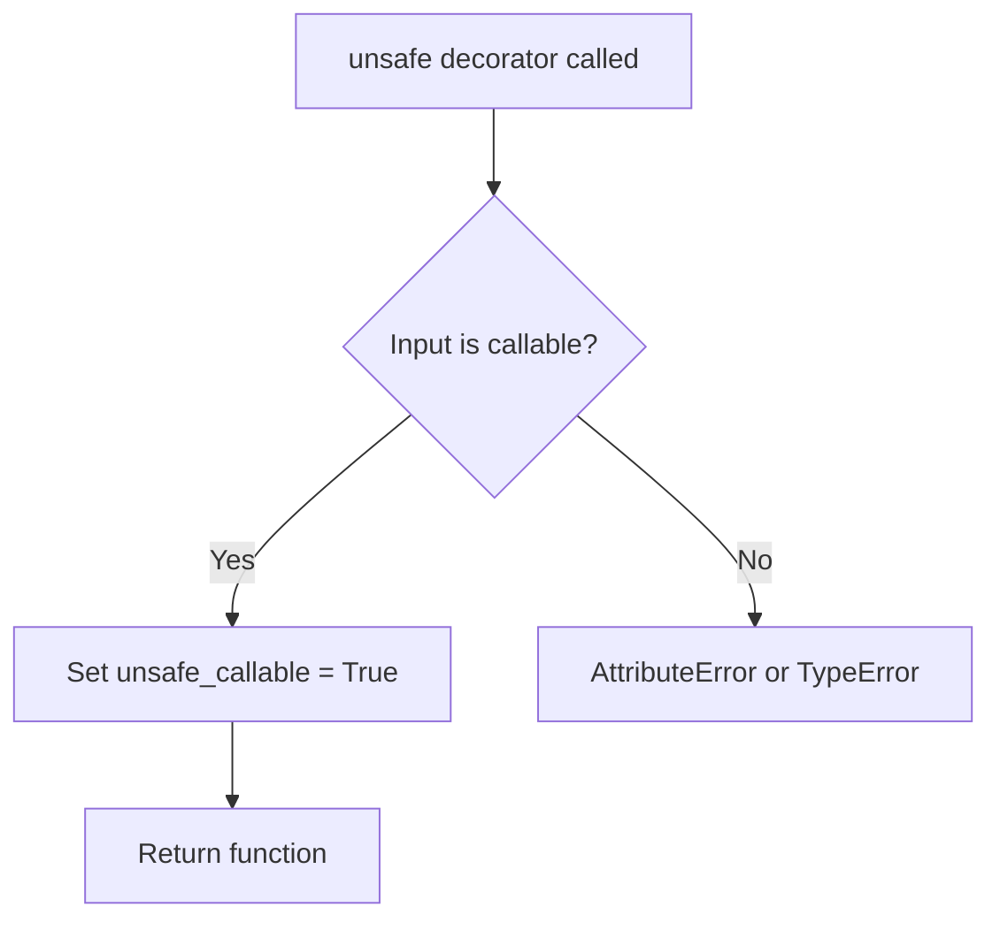

# `sandbox.py`

## `src.jinja2.sandbox.inspect_format_method` · *function*

*No documentation generated.*

## `src.jinja2.sandbox.safe_range` · *function*

*No documentation generated.*

## `src.jinja2.sandbox.unsafe` · *function*

## Summary:
Decorator that marks a callable as unsafe for use in Jinja2's sandboxed environment.

## Description:
This decorator is used to indicate that a function should be treated as potentially dangerous or unrestricted in Jinja2's sandbox security model. When applied to a function, it sets an `unsafe_callable` attribute to `True`, which signals to the sandbox runtime that this function should bypass certain security restrictions that would normally apply to user-defined functions.

The function is typically applied to built-in functions or methods that are considered safe for unrestricted execution but would otherwise be subject to sandboxing rules.

## Args:
    f (F): A callable object (function, method, or other callable) to be marked as unsafe.

## Returns:
    F: The same callable object, with the `unsafe_callable` attribute set to `True`.

## Raises:
    None: This function does not raise any exceptions.

## Constraints:
    Preconditions:
    - The input `f` must be a callable object that supports attribute assignment.
    
    Postconditions:
    - The returned object is identical to the input `f`.
    - The returned object has an `unsafe_callable` attribute set to `True`.

## Side Effects:
    None: This function does not perform any I/O operations or mutate external state beyond setting an attribute on the input function.

## Control Flow:


## Examples:
```python
from jinja2.sandbox import unsafe

@unsafe
def dangerous_function():
    # This function will be treated as unsafe in sandboxed contexts
    return "dangerous operation"

# Alternative usage:
def my_function():
    return "safe operation"

my_function = unsafe(my_function)
```

## `src.jinja2.sandbox.is_internal_attribute` · *function*

*No documentation generated.*

## `src.jinja2.sandbox.modifies_known_mutable` · *function*

*No documentation generated.*

## `src.jinja2.sandbox.SandboxedEnvironment` · *class*

*No documentation generated.*

### `src.jinja2.sandbox.SandboxedEnvironment.__init__` · *method*

*No documentation generated.*

### `src.jinja2.sandbox.SandboxedEnvironment.is_safe_attribute` · *method*

## Summary:
Determines whether accessing an attribute on an object is safe in a sandboxed environment by checking for private attributes and internal attributes.

## Description:
This method performs security checks to determine if an attribute access should be permitted in a sandboxed Jinja2 environment. It prevents access to private attributes (those starting with "_") and internal attributes that could expose sensitive implementation details or allow unauthorized operations. The method is called by both `getattr` and `getitem` methods during template rendering to enforce security boundaries.

## Args:
    obj (Any): The object whose attribute is being accessed
    attr (str): The name of the attribute being accessed
    value (Any): The value of the attribute being accessed (unused in the current implementation)

## Returns:
    bool: True if the attribute access is considered safe, False otherwise

## Raises:
    None: This method does not raise exceptions directly

## State Changes:
    Attributes READ: None
    Attributes WRITTEN: None

## Constraints:
    Preconditions: 
    - The `obj` parameter must be a valid Python object
    - The `attr` parameter must be a string representing an attribute name
    - The `value` parameter is passed but not used in the current implementation
    
    Postconditions:
    - Returns a boolean indicating whether the attribute access is safe
    - The returned value is the negation of whether the attribute is either private (starts with "_") or internal

## Side Effects:
    None: This method performs only local computations and has no side effects

### `src.jinja2.sandbox.SandboxedEnvironment.is_safe_callable` · *method*

## Summary:
Determines whether an object is safe to invoke within a sandboxed template environment by checking for unsafe callable markers.

## Description:
This method evaluates if a callable object should be permitted in a sandboxed Jinja2 environment. It examines two specific attributes on the object: "unsafe_callable" and "alters_data". If either attribute exists and evaluates to True, the object is considered unsafe for execution in the sandbox. This security mechanism prevents potentially dangerous operations from being executed within template contexts.

## Args:
    obj (Any): The object to evaluate for safety in the sandboxed environment

## Returns:
    bool: True if the object is safe to call (neither unsafe_callable nor alters_data is set to True), False otherwise

## Raises:
    None explicitly raised

## State Changes:
    Attributes READ: None - this method only reads attributes from the input object
    Attributes WRITTEN: None - this method does not modify any instance attributes

## Constraints:
    Preconditions: The input object may be any Python object, though typically it would be a callable
    Postconditions: Returns a boolean value indicating the safety status of the object for sandboxed execution

## Side Effects:
    None - this method performs only attribute lookups and returns a computed value

### `src.jinja2.sandbox.SandboxedEnvironment.call_binop` · *method*

## Summary:
Executes a binary operation on two operands using a registered operator handler from the sandboxed environment's binary operation table.

## Description:
This method serves as a secure interface for executing binary operations within a sandboxed Jinja2 environment. It retrieves the appropriate binary operation function from the environment's `binop_table` based on the provided operator string and applies it to the left and right operands. This design allows for controlled execution of binary operations while maintaining security restrictions enforced by the sandbox.

## Args:
    context (Context): The Jinja2 rendering context in which the operation occurs
    operator (str): The string identifier of the binary operator to execute (e.g., '+', '-', '*', '/')
    left (Any): The left operand for the binary operation
    right (Any): The right operand for the binary operation

## Returns:
    Any: The result of applying the binary operation to the left and right operands

## Raises:
    KeyError: When the specified operator is not found in the `binop_table`
    TypeError: When the operation cannot be performed on the provided operands (propagated from the underlying operator function)

## State Changes:
    Attributes READ: self.binop_table
    Attributes WRITTEN: None

## Constraints:
    Preconditions: 
    - The `operator` must exist as a key in `self.binop_table`
    - Both `left` and `right` must be compatible with the operation function
    - The `context` parameter must be a valid Jinja2 Context instance
    
    Postconditions:
    - Returns the result of executing the binary operation
    - Does not modify any state in the SandboxedEnvironment instance

## Side Effects:
    None - This method performs no I/O operations or external service calls. It only executes operations defined in the `binop_table` which are typically standard Python operators.

### `src.jinja2.sandbox.SandboxedEnvironment.call_unop` · *method*

## Summary:
Executes a unary operation on a value using the sandboxed environment's operator table.

## Description:
Invokes a unary operator (such as negation or positive conversion) on the provided argument using the environment's configured operator table. This method serves as a secure interface for executing unary operations within sandboxed templates, ensuring only predefined safe operations are permitted.

## Args:
    context (Context): The template execution context
    operator (str): The unary operator to apply (e.g., "-", "+")
    arg (Any): The value to apply the unary operator to

## Returns:
    Any: The result of applying the unary operator to the argument

## Raises:
    KeyError: When the specified operator is not found in the unop_table
    TypeError: When the operator function cannot be called with the provided argument

## State Changes:
    Attributes READ: self.unop_table
    Attributes WRITTEN: None

## Constraints:
    Preconditions: 
    - The operator must exist in self.unop_table
    - The argument must be compatible with the operator function
    - The context parameter must be a valid Context instance
    
    Postconditions:
    - Returns the result of applying the unary operator to the argument
    - Does not modify any instance state

## Side Effects:
    None

### `src.jinja2.sandbox.SandboxedEnvironment.getitem` · *method*

## Summary:
Retrieves an item or attribute from an object with security checks, returning either the value or an undefined placeholder.

## Description:
This method implements safe item and attribute access for the sandboxed Jinja2 environment. It attempts to access an object using bracket notation first (`obj[argument]`), falling back to attribute access (`getattr(obj, argument)`) if that fails with TypeError or LookupError. Security checks are performed to ensure only safe attributes are accessed, preventing access to private or internal attributes. This method is part of the sandboxing mechanism that protects against unsafe object access in template rendering.

## Args:
    obj (Any): The object to access items/attributes from
    argument (Union[str, Any]): The key/index or attribute name to access

## Returns:
    Union[Any, Undefined]: The accessed value if successful, or an Undefined instance if access fails or is unsafe. Specifically:
    - Returns the value from `obj[argument]` if successful
    - Returns the value from `getattr(obj, argument)` if attribute access succeeds and is safe
    - Returns `self.unsafe_undefined(obj, argument)` if attribute access succeeds but is deemed unsafe
    - Returns `self.undefined(obj=obj, name=argument)` if all access attempts fail

## Raises:
    None explicitly raised - exceptions are caught and handled internally

## State Changes:
    Attributes READ: self.is_safe_attribute, self.unsafe_undefined, self.undefined
    Attributes WRITTEN: None

## Constraints:
    Preconditions: 
    - obj must be a valid object that supports indexing or attribute access
    - argument must be a valid key/index or attribute name
    
    Postconditions:
    - Returns either the accessed value or an Undefined instance
    - If attribute access occurs, security checks are applied via `self.is_safe_attribute(obj, argument, value)`
    - When attribute access is attempted but unsafe, returns `self.unsafe_undefined` result
    - When all access attempts fail, returns `self.undefined` result

## Side Effects:
    None - This method performs no I/O operations or external service calls

### `src.jinja2.sandbox.SandboxedEnvironment.getattr` · *method*

## Summary:
Retrieves an attribute from an object with security validation, falling back to item access when attribute access fails.

## Description:
This method implements secure attribute access for the SandboxedEnvironment by attempting to retrieve attributes using standard Python getattr() first, then falling back to dictionary-style item access if attribute access raises AttributeError. All retrieved values undergo security validation to ensure they are safe to access within the sandboxed context. This method prevents access to internal/private attributes and potentially dangerous attributes identified by the security framework.

## Args:
    obj (Any): The object from which to retrieve the attribute
    attribute (str): The name of the attribute to retrieve

## Returns:
    Union[Any, Undefined]: The retrieved attribute value if it passes security checks, otherwise an Undefined instance representing the failed access. Returns the actual value if it's accessible and safe, otherwise returns an Undefined object that will raise a SecurityError when accessed.

## Raises:
    None explicitly raised - handles all exceptions internally

## State Changes:
    Attributes READ: self.is_safe_attribute, self.unsafe_undefined, self.undefined
    Attributes WRITTEN: None

## Constraints:
    Preconditions: 
    - obj must be a valid Python object
    - attribute must be a string
    - The SandboxedEnvironment instance must be properly initialized
    
    Postconditions:
    - Returns either the actual attribute value (if safe) or an Undefined instance
    - Never raises AttributeError from the attribute access itself
    - Always returns a value that is either a valid attribute value or an Undefined object

## Side Effects:
    None - does not perform I/O or mutate external state

## Implementation Details:
The method follows this logic:
1. Attempt to get attribute using getattr(obj, attribute)
2. If AttributeError occurs, attempt item access obj[attribute]
3. If item access succeeds, check if the attribute is safe using self.is_safe_attribute()
4. If safe, return the value; otherwise return self.unsafe_undefined()
5. If all attempts fail, return self.undefined() to create an Undefined instance

### `src.jinja2.sandbox.SandboxedEnvironment.unsafe_undefined` · *method*

## Summary:
Creates an undefined object representing an unsafe attribute access attempt on a given object.

## Description:
This method is invoked when the sandboxed environment detects that accessing a particular attribute on an object would be unsafe. It generates a descriptive error message indicating the specific attribute access that was blocked due to security concerns, and returns an Undefined object configured with a SecurityError exception.

The method is called internally by the `getitem` and `getattr` methods of the SandboxedEnvironment when attribute access is detected as potentially dangerous (e.g., starting with underscore or being an internal attribute).

## Args:
    obj (Any): The object on which the unsafe attribute access was attempted
    attribute (str): The name of the attribute that was inaccessible due to security restrictions

## Returns:
    Undefined: An Undefined object configured with a descriptive error message and SecurityError exception

## Raises:
    None: This method itself doesn't raise exceptions, but the returned Undefined object will raise SecurityError when accessed

## State Changes:
    Attributes READ: None - this method only reads its parameters
    Attributes WRITTEN: None - this method doesn't modify any instance attributes

## Constraints:
    Preconditions: 
    - The `obj` parameter must be a valid object that can be inspected for attributes
    - The `attribute` parameter must be a string representing a valid attribute name
    
    Postconditions:
    - Returns an Undefined object with appropriate error messaging
    - The returned object is configured to raise SecurityError when evaluated

## Side Effects:
    None: This method performs no I/O operations or external service calls

### `src.jinja2.sandbox.SandboxedEnvironment.format_string` · *method*

*No documentation generated.*

### `src.jinja2.sandbox.SandboxedEnvironment.call` · *method*

## Summary:
Invokes an object within a sandboxed environment, either through string formatting or safe callable execution.

## Description:
This method serves as the primary entry point for executing objects within a SandboxedEnvironment. It implements a two-tier approach: first attempting to format the object as a string if it has a supported format method, then falling back to safe callable execution. This design prevents arbitrary code execution while supporting common formatting operations.

The method is called during template rendering when expressions need to be evaluated or when callable objects are encountered.

## Args:
    __self: The SandboxedEnvironment instance (bound method)
    __context: The execution context for variable resolution and function calls
    __obj: The callable object to invoke or format
    *args: Positional arguments to pass to the callable or format method
    **kwargs: Keyword arguments to pass to the callable or format method

## Returns:
    The result of either string formatting (when format method is detected) or direct callable execution

## Raises:
    SecurityError: When the object is not marked as safely callable via the is_safe_callable check

## State Changes:
    Attributes READ: None
    Attributes WRITTEN: None

## Constraints:
    Preconditions: 
    - The context must be properly initialized
    - The object must either be safely callable or have a supported format method
    
    Postconditions:
    - If the object has a format method, returns formatted string result
    - If the object is safely callable, returns result of execution
    - If neither condition is met, raises SecurityError

## Side Effects:
    - May perform string formatting operations when object has format method
    - May invoke external callables with provided arguments when object is safely callable
    - May raise SecurityError if object is not marked as safe

## `src.jinja2.sandbox.ImmutableSandboxedEnvironment` · *class*

## Summary:
An immutable sandboxed Jinja2 environment that prevents modification of mutable objects through attribute access.

## Description:
This class implements a secure Jinja2 environment that extends the security of the base `SandboxedEnvironment` by preventing access to attributes that would modify known mutable objects. When evaluating attribute access safety, it first performs the standard security checks inherited from `SandboxedEnvironment`, then applies additional validation to ensure that the attribute access won't modify mutable objects.

This environment is particularly useful when rendering templates where template authors should not be able to modify mutable objects through attribute access patterns, providing an additional layer of security beyond the standard sandboxed environment.

## State:
- Inherits from `SandboxedEnvironment` class (as indicated by class declaration)
- No additional instance attributes defined in this class
- All instance attributes are inherited from the parent class

## Lifecycle:
- Creation: Instantiate using standard class constructor, passing any arguments accepted by `SandboxedEnvironment.__init__()`
- Usage: Use like any Jinja2 environment for template rendering
- Destruction: Cleanup handled by Python's garbage collector

## Method Map:
```mermaid
graph TD
    A[ImmutableSandboxedEnvironment] --> B[SandboxedEnvironment]
    B --> C[Environment]
    A.is_safe_attribute --> A.super().is_safe_attribute
    A.is_safe_attribute --> D[modifies_known_mutable]
```

## Raises:
- May raise `SecurityError` when attempting to access attributes that modify mutable objects
- Inherits all other exceptions from `SandboxedEnvironment`

## Example:
```python
from jinja2.sandbox import ImmutableSandboxedEnvironment

# Create an immutable sandboxed environment
env = ImmutableSandboxedEnvironment()

# This environment will prevent access to attributes that modify mutable objects
template = env.from_string("{{ obj.some_attr }}")
```

### `src.jinja2.sandbox.ImmutableSandboxedEnvironment.is_safe_attribute` · *method*

*No documentation generated.*

## `src.jinja2.sandbox.SandboxedFormatter` · *class*

*No documentation generated.*

### `src.jinja2.sandbox.SandboxedFormatter.__init__` · *method*

*No documentation generated.*

### `src.jinja2.sandbox.SandboxedFormatter.get_field` · *method*

## Summary:
Parses a field name and retrieves a value along with the first component identifier.

## Description:
Processes a formatted field name string to extract a value by parsing nested attribute/item access patterns. This method is part of the Jinja2 sandboxed formatter implementation that safely accesses nested object properties.

The method uses `formatter_field_name_split` to break down the field name into a first component and a sequence of (is_attr, index) tuples representing subsequent access operations. It then retrieves the initial value using `self.get_value` and applies any nested access operations using `self._env.getattr` or `self._env.getitem`.

## Args:
    field_name (str): A field name string that may contain nested attribute/item access patterns like "a.b.c" or "a[0].b"
    args (Sequence[Any]): Positional arguments passed to the formatter
    kwargs (Mapping[str, Any]): Keyword arguments passed to the formatter

## Returns:
    Tuple[Any, str]: A tuple containing (resolved_object, first_component) where resolved_object is the value found by traversing the field path and first_component is the first part of the field name

## Raises:
    None explicitly documented - depends on underlying implementations of get_value, getattr, and getitem

## State Changes:
    Attributes READ: self._env, self.get_value
    Attributes WRITTEN: None

## Constraints:
    Preconditions: 
    - field_name must be a valid string
    - args and kwargs must be properly initialized sequences/mappings
    - self._env must be a valid Environment instance
    - self.get_value must be callable with the given parameters
    
    Postconditions:
    - Returns a tuple with the resolved value and first field component
    - The returned value represents the result of processing the field name

## Side Effects:
    None directly - delegates to other methods that may have side effects

## `src.jinja2.sandbox.SandboxedEscapeFormatter` · *class*

*No documentation generated.*

