# `tests.py`

## `src.jinja2.tests.test_odd` · *function*

## Summary:
Determines whether a given integer is odd by checking if it has a remainder of 1 when divided by 2.

## Description:
This function evaluates whether an integer is odd using the modulo operator. It's designed as a test helper function to validate odd-number conditions in template rendering and expression evaluation contexts.

## Args:
    value (int): The integer to test for oddness. Must be a whole number.

## Returns:
    bool: True if the value is odd (remainder 1 when divided by 2), False if even (remainder 0 when divided by 2).

## Raises:
    This function does not raise any exceptions under normal circumstances.

## Constraints:
    Preconditions:
    - Input must be an integer type (or convertible to integer)
    - Behavior is undefined for non-numeric inputs
    
    Postconditions:
    - Always returns a boolean value (True or False)
    - Result is mathematically correct for all integer inputs

## Side Effects:
    None. This function has no side effects and is pure.

## Control Flow:
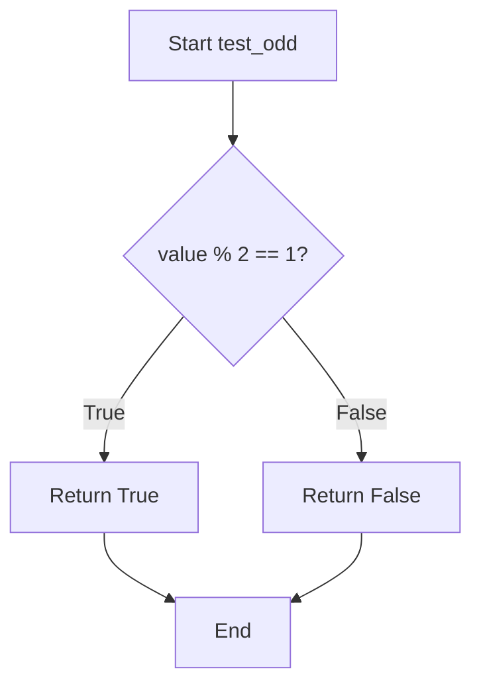

## Examples:
    >>> test_odd(3)
    True
    >>> test_odd(4)
    False
    >>> test_odd(-1)
    True
    >>> test_odd(0)
    False
```

## `src.jinja2.tests.test_even` · *function*

## Summary:
Determines whether a given integer is an even number.

## Description:
This function evaluates if the provided integer value is divisible by 2 without remainder. It serves as a utility for testing and validation purposes, particularly in template rendering contexts where even number checks are required.

## Args:
    value (int): The integer to test for evenness. Must be a whole number.

## Returns:
    bool: True if the value is evenly divisible by 2 (i.e., the remainder is 0), False otherwise.

## Raises:
    No exceptions are raised by this function under normal operation.

## Constraints:
    Preconditions:
        - The input value must be an integer type
        - The function assumes integer arithmetic
    
    Postconditions:
        - Always returns a boolean value (True or False)
        - The result accurately reflects mathematical evenness of the input

## Side Effects:
    None - this function has no side effects.

## Control Flow:
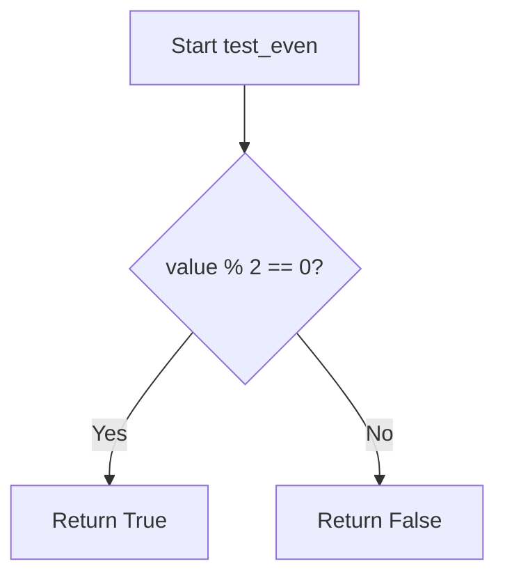

## Examples:
    >>> test_even(4)
    True
    >>> test_even(7)
    False
    >>> test_even(0)
    True
    >>> test_even(-2)
    True
    >>> test_even(-3)
    False
```

## `src.jinja2.tests.test_divisibleby` · *function*

## Summary:
Checks whether one integer is evenly divisible by another integer.

## Description:
This function determines if the dividend value is perfectly divisible by the divisor number, returning a boolean result. It's designed to be used as a Jinja2 template test function for conditional logic in templates. The function performs a modulo operation to check if there is no remainder.

## Args:
    value (int): The number to be tested for divisibility (dividend).
    num (int): The number to divide by (divisor).

## Returns:
    bool: True if value is evenly divisible by num (i.e., value % num == 0), False otherwise.

## Raises:
    ZeroDivisionError: When num is zero, causing a division by zero error in the modulo operation.

## Constraints:
    Preconditions:
        - Both value and num must be integers
        - num must not be zero (division by zero is undefined)
    
    Postconditions:
        - Returns a boolean value indicating divisibility
        - The mathematical relationship value = num * quotient + remainder holds where remainder is 0

## Side Effects:
    None

## Control Flow:
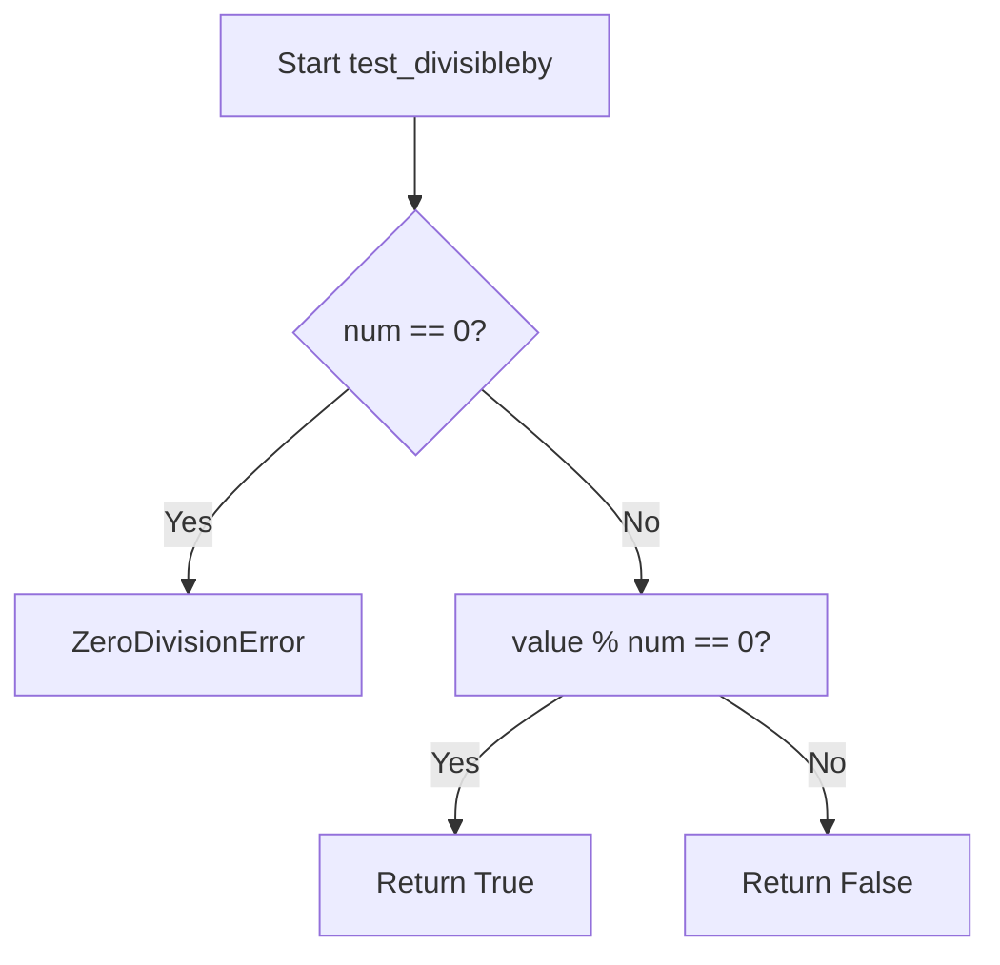

## Examples:
    # Basic usage
    test_divisibleby(10, 2)  # Returns True (10 is divisible by 2)
    test_divisibleby(10, 3)  # Returns False (10 is not divisible by 3)
    test_divisibleby(15, 5)  # Returns True (15 is divisible by 5)
    test_divisibleby(7, 0)   # Raises ZeroDivisionError (division by zero)
```

## `src.jinja2.tests.test_defined` · *function*

## Summary:
Determines whether a value is defined (not undefined) in Jinja2 template context.

## Description:
This test function evaluates whether a given value is an instance of the Undefined class. In Jinja2 templating, undefined values are represented by the Undefined class, typically when accessing non-existent template variables or attributes. This function provides a way to check if a value has been properly defined in the template context.

## Args:
    value (Any): The value to test for definition status. Can be any Python object including Undefined instances.

## Returns:
    bool: Returns True if the value is not an instance of Undefined (i.e., it is defined), False if the value is an instance of Undefined (i.e., it is undefined).

## Raises:
    None: This function does not raise any exceptions under normal circumstances.

## Constraints:
    Preconditions: The function accepts any Python object as input.
    Postconditions: The return value is always a boolean indicating the definition status of the input value.

## Side Effects:
    None: This function has no side effects and is purely a predicate check.

## Control Flow:
```mermaid
flowchart TD
    A[Start test_defined] --> B{isinstance(value, Undefined)?}
    B -- Yes --> C[Return False]
    B -- No --> D[Return True]
```

## Examples:
```python
# Testing with a defined value
result = test_defined("hello")  # Returns True

# Testing with an undefined value
undefined_val = Undefined()  # Assuming Undefined can be instantiated
result = test_defined(undefined_val)  # Returns False

# Testing with None
result = test_defined(None)  # Returns True
```

## `src.jinja2.tests.test_undefined` · *function*

## Summary:
Checks whether a given value is an instance of the Undefined class used in Jinja2 template rendering.

## Description:
This utility function determines if a provided value represents an undefined variable in Jinja2's templating system. It serves as a predicate to identify when a template variable has not been defined or has been explicitly marked as undefined during template processing.

## Args:
    value (Any): The value to test for being undefined. Can be any Python object.

## Returns:
    bool: True if the value is an instance of Undefined class, False otherwise.

## Raises:
    None: This function does not raise any exceptions.

## Constraints:
    Preconditions: The function accepts any Python object as input.
    Postconditions: Always returns a boolean value (True or False).

## Side Effects:
    None: This function has no side effects and is purely a type checking operation.

## Control Flow:
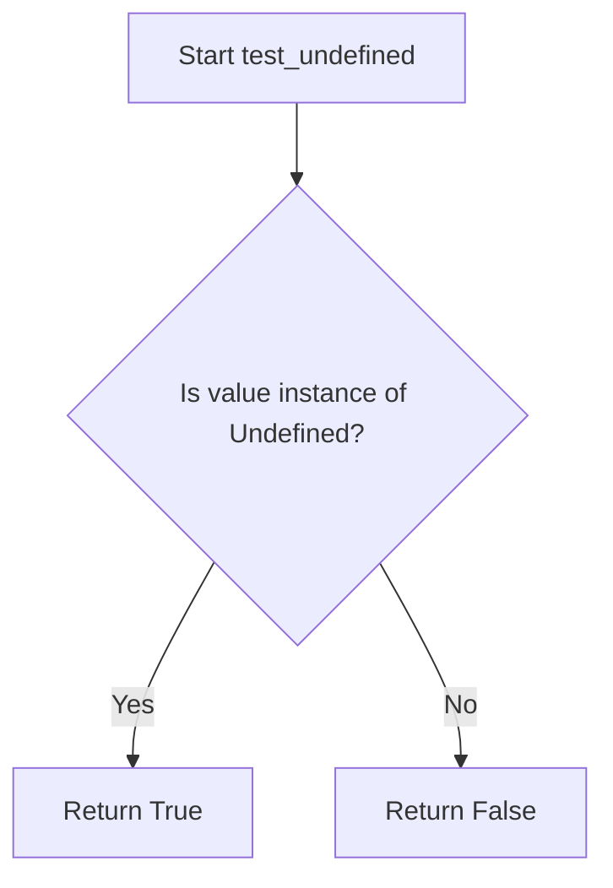

## Examples:
```python
# Basic usage
from runtime import Undefined

# Test with an undefined value
undefined_val = Undefined()
result = test_undefined(undefined_val)  # Returns True

# Test with a regular value
regular_val = "hello"
result = test_undefined(regular_val)  # Returns False

# Test with None
result = test_undefined(None)  # Returns False
```

## `src.jinja2.tests.test_filter` · *function*

## Summary:
Tests whether a given filter name exists in the environment's filter registry.

## Description:
Checks if a specified filter name is registered in the Jinja2 environment's filters collection. This function is used to validate filter names before attempting to use them in template processing, ensuring that only valid filters are applied.

## Args:
    env (Environment): The Jinja2 environment instance containing registered filters.
    value (str): The name of the filter to test for existence in the environment's filter registry.

## Returns:
    bool: True if the filter name exists in env.filters, False otherwise.

## Raises:
    None explicitly raised.

## Constraints:
    Preconditions:
        - env must be a valid Environment instance
        - env.filters must support the 'in' operator for membership testing
        - value must be a string type

    Postconditions:
        - The function does not modify the environment or any of its state
        - The function returns a boolean value indicating membership

## Side Effects:
    None.

## Control Flow:
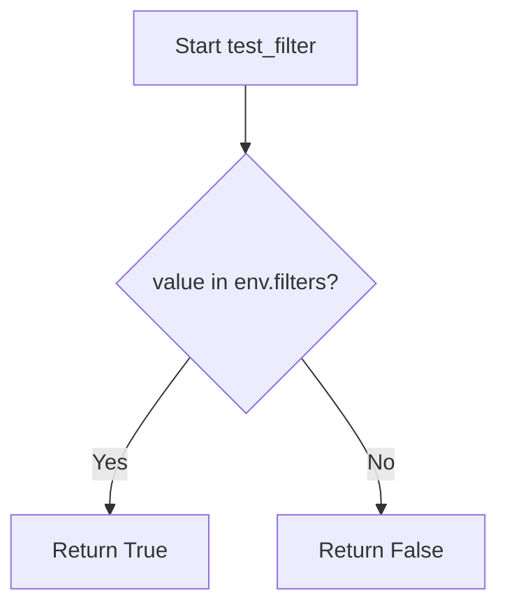

## Examples:
```python
# Basic usage to validate a filter exists
env = Environment()
if test_filter(env, "upper"):
    print("Filter 'upper' is available")
else:
    print("Filter 'upper' is not available")

# Checking for a custom filter
custom_env = Environment()
custom_env.filters['my_custom_filter'] = lambda x: x.upper()
result = test_filter(custom_env, "my_custom_filter")
# Returns True
```

## `src.jinja2.tests.test_test` · *function*

## Summary:
Checks whether a given test name exists in the Jinja2 environment's test registry.

## Description:
This function serves as a lookup mechanism to determine if a specific test identifier is registered within the Jinja2 environment's collection of available tests. It's commonly used during template compilation and execution to validate test names before applying them to template expressions.

## Args:
    env (Environment): The Jinja2 environment instance containing registered tests
    value (str): The test name to check for existence in the environment's test registry

## Returns:
    bool: True if the test name exists in env.tests, False otherwise

## Raises:
    None explicitly raised

## Constraints:
    Preconditions:
    - The env parameter must be a valid Environment instance
    - The value parameter must be a string
    - The env.tests attribute must support the 'in' operator for membership testing
    
    Postconditions:
    - Returns a boolean value indicating test existence
    - Does not modify the environment or test registry

## Side Effects:
    None

## Control Flow:
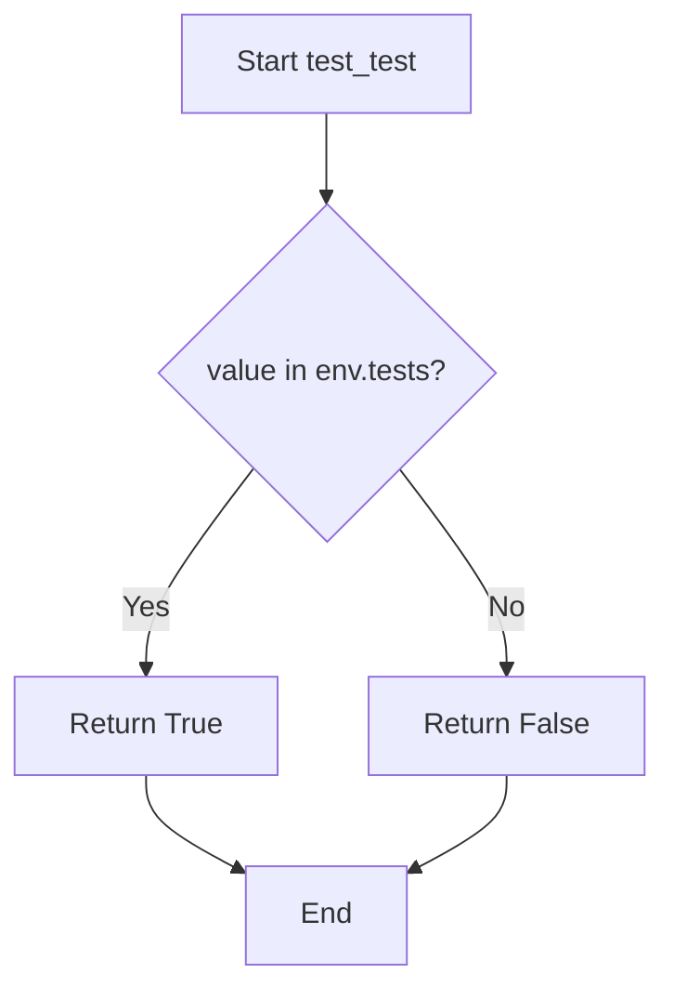

## Examples:
    # Check if 'equalto' test exists
    result = test_test(environment, 'equalto')  # Returns True if 'equalto' is registered
    
    # Check if custom test exists
    result = test_test(environment, 'custom_test')  # Returns False if not registered

## `src.jinja2.tests.test_none` · *function*

## Summary:
Checks whether the provided value is explicitly None.

## Description:
This function performs an identity check to determine if the given value is the None singleton. It is commonly used in Jinja2 template expressions to test for null values.

## Args:
    value (Any): The value to test for None equality. Can be any Python object including None itself.

## Returns:
    bool: True if the value is None, False otherwise.

## Raises:
    None: This function does not raise any exceptions.

## Constraints:
    Preconditions: The function accepts any Python object as input.
    Postconditions: The return value is always a boolean indicating None equality.

## Side Effects:
    None: This function has no side effects.

## Control Flow:
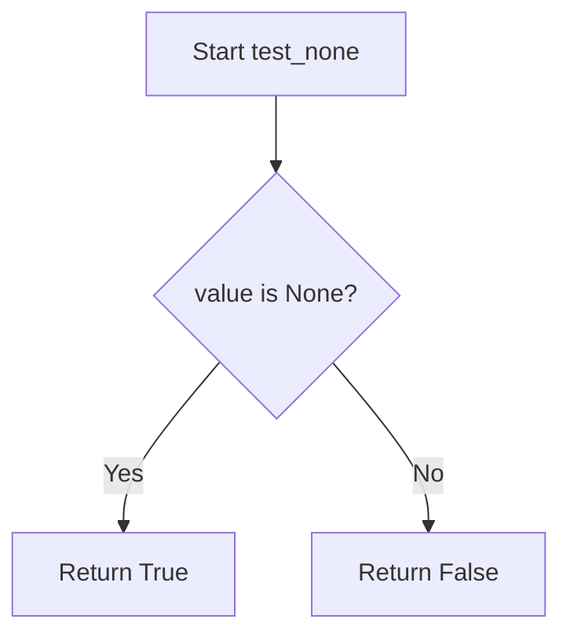

## Examples:
    # Basic usage
    result = test_none(None)  # Returns True
    result = test_none("hello")  # Returns False
    result = test_none(0)  # Returns False
    result = test_none([])  # Returns False
```

## `src.jinja2.tests.test_boolean` · *function*

## Summary:
Tests whether a value is exactly the boolean True or False object.

## Description:
This function performs an identity check to determine if the provided value is specifically the Python boolean object True or False. Unlike truthiness evaluation, this function distinguishes between boolean objects and other truthy/falsy values such as 1, 0, non-empty strings, etc.

## Args:
    value (Any): The value to test for boolean identity. Can be any Python object.

## Returns:
    bool: True if the value is exactly the boolean object True or False; False otherwise.

## Raises:
    None: This function does not raise any exceptions.

## Constraints:
    Preconditions: The function accepts any Python object as input.
    Postconditions: The return value is always a boolean (True or False).

## Side Effects:
    None: This function has no side effects.

## Control Flow:
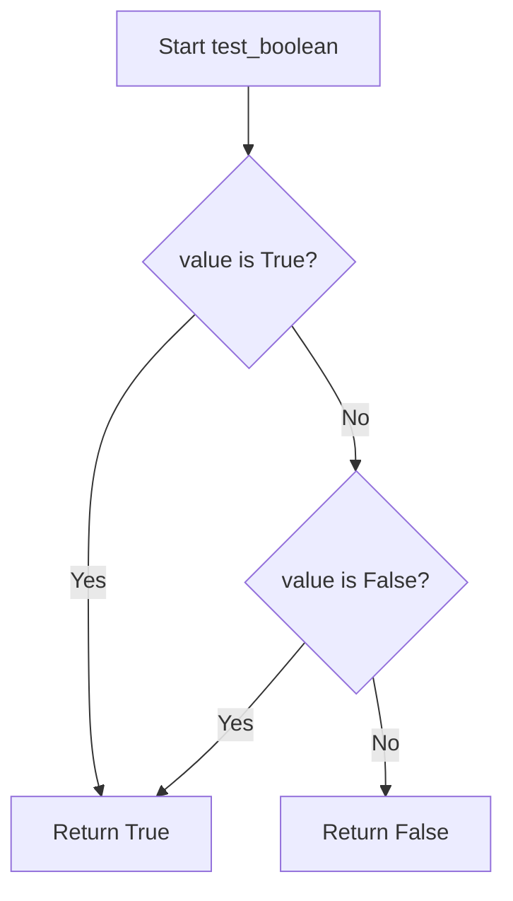

## Examples:
    >>> test_boolean(True)
    True
    >>> test_boolean(False)
    True
    >>> test_boolean(1)
    False
    >>> test_boolean(0)
    False
    >>> test_boolean("True")
    False
```

## `src.jinja2.tests.test_false` · *function*

## Summary:
Checks if a value is exactly the boolean False object.

## Description:
This function performs an identity check to determine if the provided value is exactly the boolean False object. It uses the `is` operator rather than `==` to ensure strict identity comparison, which distinguishes between the boolean False and other falsy values like 0, None, empty containers, etc.

## Args:
    value (Any): The value to test for being exactly False.

## Returns:
    bool: True if the value is exactly the boolean False object, False otherwise.

## Raises:
    None: This function does not raise any exceptions.

## Constraints:
    Preconditions: The function accepts any type of input value.
    Postconditions: The return value is always a boolean indicating identity with the False object.

## Side Effects:
    None: This function has no side effects.

## Control Flow:
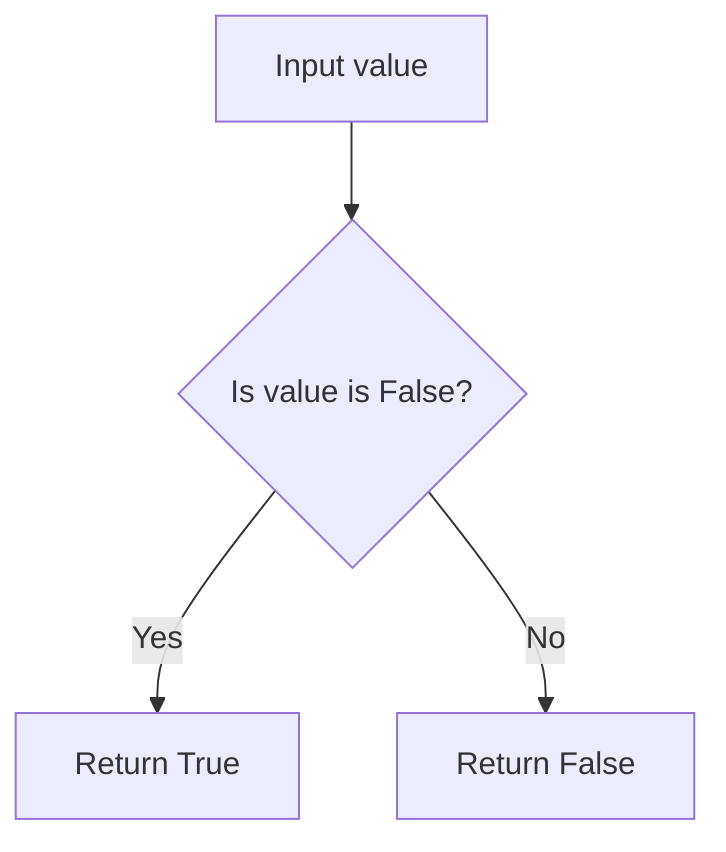

## Examples:
    # Basic usage
    test_false(False)  # Returns True
    test_false(0)      # Returns False
    test_false(None)   # Returns False
    test_false("")     # Returns False
    test_false([])     # Returns False

## `src.jinja2.tests.test_true` · *function*

## Summary:
Checks if a value is exactly the boolean True using identity comparison.

## Description:
This function determines whether the provided value is strictly identical to the boolean True object. Unlike equality comparison (==), this function distinguishes between True and truthy values such as 1, non-empty strings, or non-empty containers. It is typically used in Jinja2 template conditionals to test for exact boolean True values.

## Args:
    value (Any): The value to test for being exactly True. Can be any type including booleans, numbers, strings, containers, or None.

## Returns:
    bool: True if the value is exactly the boolean True object; False otherwise.

## Raises:
    No exceptions are raised by this function.

## Constraints:
    Preconditions:
    - The function accepts any type of input without validation
    - The function does not modify the input value
    
    Postconditions:
    - Always returns a boolean value (True or False)
    - The result is determined solely by identity comparison with the boolean True object

## Side Effects:
    None - This function has no side effects.

## Control Flow:
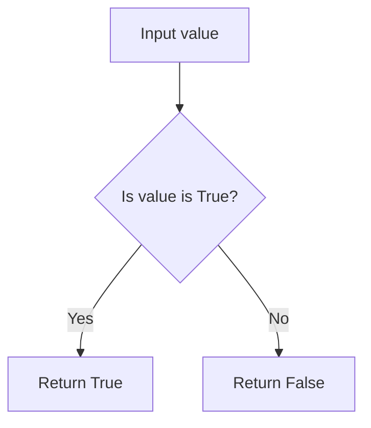

## Examples:
    # Basic usage
    test_true(True)        # Returns: True
    test_true(False)       # Returns: False
    test_true(1)           # Returns: False
    test_true("hello")     # Returns: False
    test_true([])          # Returns: False
    test_true(None)        # Returns: False
```

## `src.jinja2.tests.test_integer` · *function*

## Summary:
Tests whether a value is specifically an integer type, excluding boolean values.

## Description:
This function determines if a given value is an instance of the built-in `int` type while explicitly excluding boolean values (`True` and `False`), which are technically instances of `int` in Python. This is commonly needed in template engines like Jinja2 where boolean and integer types need to be distinguished.

## Args:
    value (Any): The value to test for integer type membership

## Returns:
    bool: True if the value is an instance of int and is not True or False, False otherwise

## Raises:
    None

## Constraints:
    Preconditions: None
    Postconditions: Always returns a boolean value

## Side Effects:
    None

## Control Flow:
```mermaid
flowchart TD
    A[Start test_integer] --> B{isinstance(value, int)?}
    B -- No --> C[Return False]
    B -- Yes --> D{value is True?}
    D -- Yes --> E[Return False]
    D -- No --> F{value is False?}
    F -- Yes --> G[Return False]
    F -- No --> H[Return True]
```

## Examples:
    >>> test_integer(42)
    True
    >>> test_integer(True)
    False
    >>> test_integer(False)
    False
    >>> test_integer(3.14)
    False
    >>> test_integer("123")
    False
```

## `src.jinja2.tests.test_float` · *function*

## Summary:
Checks whether a given value is of type float.

## Description:
This function performs a type check to determine if the provided value is specifically a float instance. It returns True for float values and False for all other types, including numeric types like int or complex numbers.

## Args:
    value (t.Any): The value to be tested for float type. Can be any Python object.

## Returns:
    bool: True if the value is an instance of float, False otherwise.

## Raises:
    None: This function does not raise any exceptions.

## Constraints:
    Preconditions: The function accepts any Python object as input.
    Postconditions: The return value is always a boolean (True or False).

## Side Effects:
    None: This function has no side effects and does not modify any external state.

## Control Flow:
```mermaid
flowchart TD
    A[Start test_float] --> B{isinstance(value, float)?}
    B -- Yes --> C[Return True]
    B -- No --> D[Return False]
```

## Examples:
    >>> test_float(3.14)
    True
    >>> test_float(42)
    False
    >>> test_float("3.14")
    False
    >>> test_float(None)
    False
```

## `src.jinja2.tests.test_lower` · *function*

## Summary:
Checks if a string value is entirely lowercase.

## Description:
This function determines whether the string representation of a given value contains only lowercase characters. It is typically used in Jinja2 template conditionals to test string properties.

## Args:
    value: The input value to test. Will be converted to string if not already a string.

## Returns:
    bool: True if the string representation of value contains only lowercase characters, False otherwise. Empty strings return True.

## Raises:
    None

## Constraints:
    Preconditions: The input value can be of any type that can be converted to string.
    Postconditions: Always returns a boolean value indicating lowercase status.

## Side Effects:
    None

## Control Flow:
```mermaid
flowchart TD
    A[Input value] --> B{Convert to str}
    B --> C{islower() check}
    C --> D[Return boolean result]
```

## Examples:
    >>> test_lower("hello")
    True
    >>> test_lower("Hello")
    False
    >>> test_lower("HELLO")
    False
    >>> test_lower("")
    True
    >>> test_lower(123)
    False
```

## `src.jinja2.tests.test_upper` · *function*

## Summary:
Checks if a given value is an uppercase string after conversion to string representation.

## Description:
This function validates whether the string representation of a value consists entirely of uppercase characters. It is designed to work with various input types by converting them to strings before performing the uppercase check.

## Args:
    value (str): The input value to test for uppercase characters. This parameter can accept any type that can be converted to a string.

## Returns:
    bool: True if the string representation of the value contains only uppercase letters, False otherwise. Empty strings return False.

## Raises:
    None: This function does not raise any exceptions under normal operation.

## Constraints:
    Preconditions:
        - The function accepts any input type due to the str() conversion
        - Input is not validated beyond string conversion
    
    Postconditions:
        - Always returns a boolean value
        - The returned value accurately reflects whether the string representation is all uppercase

## Side Effects:
    None: This function has no side effects and is pure.

## Control Flow:
```mermaid
flowchart TD
    A[Input value] --> B{Convert to str}
    B --> C[Call .isupper()]
    C --> D[Return result]
```

## Examples:
    >>> test_upper("HELLO")
    True
    >>> test_upper("Hello")
    False
    >>> test_upper("hello")
    False
    >>> test_upper(123)
    False
    >>> test_upper("")
    False
```

## `src.jinja2.tests.test_string` · *function*

## Summary:
Checks whether a given value is an instance of the string type.

## Description:
This function serves as a type test utility that determines if the provided value is a string instance. It is commonly used in Jinja2 template processing to validate data types during template rendering or filtering operations.

## Args:
    value (Any): The value to be tested for string type. Can be any Python object.

## Returns:
    bool: True if the value is an instance of str, False otherwise.

## Raises:
    None: This function does not raise any exceptions.

## Constraints:
    Preconditions: The function accepts any Python object as input.
    Postconditions: The return value is always a boolean indicating type membership.

## Side Effects:
    None: This function has no side effects and is purely a type checking operation.

## Control Flow:
```mermaid
flowchart TD
    A[Input value] --> B{isinstance(value, str)?}
    B -- Yes --> C[Return True]
    B -- No --> D[Return False]
```

## Examples:
    >>> test_string("hello")
    True
    >>> test_string(123)
    False
    >>> test_string(None)
    False
```

## `src.jinja2.tests.test_mapping` · *function*

## Summary:
Tests whether a value is a mapping type (such as dict or other dictionary-like objects).

## Description:
This function determines if the provided value implements the mapping interface defined in collections.abc. It is commonly used in template engines to identify dictionary-like objects that support key-based access.

## Args:
    value (Any): The value to test for mapping type compatibility

## Returns:
    bool: True if the value is an instance of collections.abc.Mapping, False otherwise

## Raises:
    None

## Constraints:
    Preconditions: None
    Postconditions: Always returns a boolean value

## Side Effects:
    None

## Control Flow:
```mermaid
flowchart TD
    A[Input value] --> B{isinstance(value, abc.Mapping)?}
    B -->|Yes| C[Return True]
    B -->|No| D[Return False]
```

## Examples:
    >>> test_mapping({'a': 1, 'b': 2})
    True
    >>> test_mapping([1, 2, 3])
    False
    >>> test_mapping("hello")
    False
    >>> test_mapping({})
    True
```

## `src.jinja2.tests.test_number` · *function*

## Summary:
Tests whether a given value is an instance of Python's Number abstract base class.

## Description:
This function determines if the provided value is a numeric type by checking if it is an instance of Python's Number abstract base class from the numbers module. It serves as a utility for validating numeric inputs in template processing contexts.

## Args:
    value (Any): The value to test for being a numeric type. Can be any Python object.

## Returns:
    bool: True if the value is an instance of Number (including int, float, complex, Decimal, Fraction, etc.), False otherwise.

## Raises:
    None: This function does not raise any exceptions.

## Constraints:
    Preconditions: The function accepts any Python object as input.
    Postconditions: The return value is always a boolean indicating the numeric nature of the input.

## Side Effects:
    None: This function has no side effects and is purely a predicate check.

## Control Flow:
```mermaid
flowchart TD
    A[Input Value] --> B{isinstance(value, Number)?}
    B -- Yes --> C[Return True]
    B -- No --> D[Return False]
```

## Examples:
    >>> test_number(42)
    True
    >>> test_number(3.14)
    True
    >>> test_number("42")
    False
    >>> test_number(None)
    False
```

## `src.jinja2.tests.test_sequence` · *function*

## Summary:
Tests whether a value implements the sequence protocol by verifying it has both length and item access capabilities.

## Description:
Determines if a given value behaves like a sequence by attempting to invoke the built-in `len()` function and accessing the `__getitem__` method. This function uses duck-typing to identify sequence-like objects without requiring explicit type checking.

## Args:
    value (Any): The object to test for sequence compatibility. Can be any Python object.

## Returns:
    bool: True if the value has both `len()` and `__getitem__` methods, False otherwise.

## Raises:
    None: This function catches all exceptions and returns False if either test fails.

## Constraints:
    Preconditions: The value parameter can be any Python object.
    Postconditions: Always returns a boolean value (True or False).

## Side Effects:
    None: This function performs no I/O operations or external state mutations.

## Control Flow:
```mermaid
flowchart TD
    A[Start test_sequence] --> B{Can call len(value)?}
    B -- Yes --> C{Can access __getitem__?}
    C -- Yes --> D[Return True]
    C -- No --> E[Return False]
    B -- No --> F[Return False]
```

## Examples:
    >>> test_sequence([1, 2, 3])
    True
    >>> test_sequence("hello")
    True
    >>> test_sequence(42)
    False
    >>> test_sequence({})
    False
```

## `src.jinja2.tests.test_sameas` · *function*

## Summary:
Tests whether two values refer to the exact same object in memory.

## Description:
This function performs an identity comparison using Python's `is` operator to determine if two values are the identical object in memory, rather than just equal values. It's commonly used in Jinja2 template tests to verify object identity, particularly useful for checking singleton objects or ensuring that variables reference the same instance.

## Args:
    value (Any): The first value to compare for identity
    other (Any): The second value to compare for identity

## Returns:
    bool: True if both arguments refer to the exact same object in memory, False otherwise

## Raises:
    None: This function does not raise any exceptions

## Constraints:
    Preconditions: Both arguments can be any Python objects
    Postconditions: Always returns a boolean value (True or False)

## Side Effects:
    None: This function has no side effects

## Control Flow:
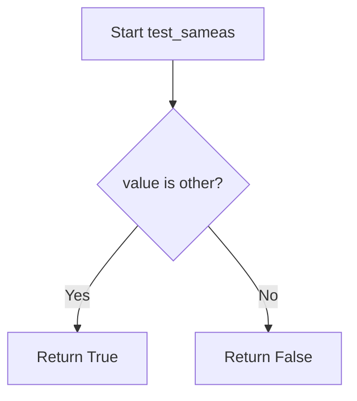

## Examples:
    # Basic usage
    result = test_sameas([1, 2, 3], [1, 2, 3])  # Returns False (different list objects)
    
    # Identity check
    my_list = [1, 2, 3]
    result = test_sameas(my_list, my_list)  # Returns True (same object reference)
    
    # Comparison with None
    result = test_sameas(None, None)  # Returns True (None is a singleton)
```

## `src.jinja2.tests.test_iterable` · *function*

## Summary:
Determines whether a given value is iterable by attempting to create an iterator from it.

## Description:
This function tests if a value can be iterated over by calling the built-in `iter()` function. It serves as a utility for checking iterable compatibility in Jinja2 template processing and similar contexts where dynamic type checking is required.

## Args:
    value (typing.Any): The value to test for iterability. Can be any Python object.

## Returns:
    bool: True if the value is iterable (i.e., `iter(value)` succeeds), False otherwise.

## Raises:
    None: This function does not raise any exceptions directly; it catches and handles TypeError internally.

## Constraints:
    Preconditions: The function accepts any Python object as input.
    Postconditions: Always returns a boolean value (True or False).

## Side Effects:
    None: This function has no side effects beyond the internal call to `iter()` which may trigger object-specific behavior but doesn't modify external state.

## Control Flow:
```mermaid
flowchart TD
    A[Start test_iterable] --> B{Can iter() be called?}
    B -- Yes --> C[Return True]
    B -- No --> D[Return False]
```

## Examples:
    >>> test_iterable([1, 2, 3])
    True
    >>> test_iterable("hello")
    True
    >>> test_iterable(42)
    False
    >>> test_iterable(None)
    False
```

## `src.jinja2.tests.test_escaped` · *function*

## Summary:
Checks whether a value has an HTML escape method, indicating it's already escaped and safe for direct insertion into templates.

## Description:
This function determines if a given value possesses an `__html__` method, which is used in Jinja2 templates to identify values that are already HTML-escaped and should not be escaped again during template rendering. This is part of Jinja2's automatic escaping system that prevents XSS vulnerabilities by escaping untrusted content.

## Args:
    value (Any): The value to check for HTML escaping capability. Can be any Python object.

## Returns:
    bool: True if the value has an `__html__` method, False otherwise.

## Raises:
    None: This function does not raise any exceptions.

## Constraints:
    Preconditions: The function accepts any Python object as input.
    Postconditions: Always returns a boolean value indicating the presence of the `__html__` attribute.

## Side Effects:
    None: This function performs no I/O operations or external state mutations.

## Control Flow:
```mermaid
flowchart TD
    A[Start test_escaped] --> B{Has __html__ attribute?}
    B -->|Yes| C[Return True]
    B -->|No| D[Return False]
```

## Examples:
    >>> test_escaped("hello")
    False
    
    >>> class SafeHtml:
    ...     def __html__(self):
    ...         return "<p>Safe HTML</p>"
    ...
    >>> test_escaped(SafeHtml())
    True

## `src.jinja2.tests.test_in` · *function*

## Summary:
Checks if a value exists within a container or sequence.

## Description:
Implements the membership test operator (`in`) for Jinja2 template testing. This function determines whether a given value is contained within a sequence, container, or iterable object.

## Args:
    value (Any): The value to search for within the sequence.
    seq (Container): The container or sequence to search within.

## Returns:
    bool: True if the value exists within the sequence, False otherwise.

## Raises:
    None: This function does not raise any exceptions under normal operation.

## Constraints:
    Preconditions:
        - The `seq` parameter must support the `in` operator (i.e., implement `__contains__`).
        - Both parameters should be compatible with Python's membership testing semantics.
    
    Postconditions:
        - The function returns a boolean value indicating membership status.
        - No modifications are made to either input parameter.

## Side Effects:
    None: This function has no side effects and is purely functional.

## Control Flow:
```mermaid
flowchart TD
    A[Start test_in] --> B{value in seq?}
    B -->|Yes| C[Return True]
    B -->|No| D[Return False]
```

## Examples:
    # Basic usage
    result = test_in(2, [1, 2, 3])  # Returns True
    
    # String membership
    result = test_in('a', 'abc')  # Returns True
    
    # Membership in set
    result = test_in(5, {1, 2, 3, 4})  # Returns False
```

