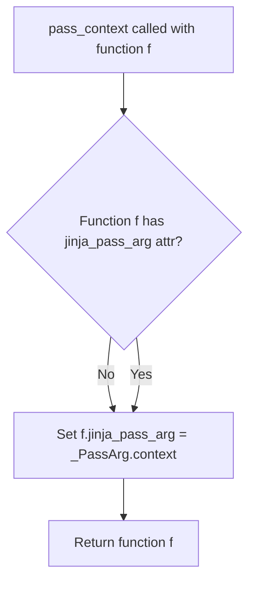
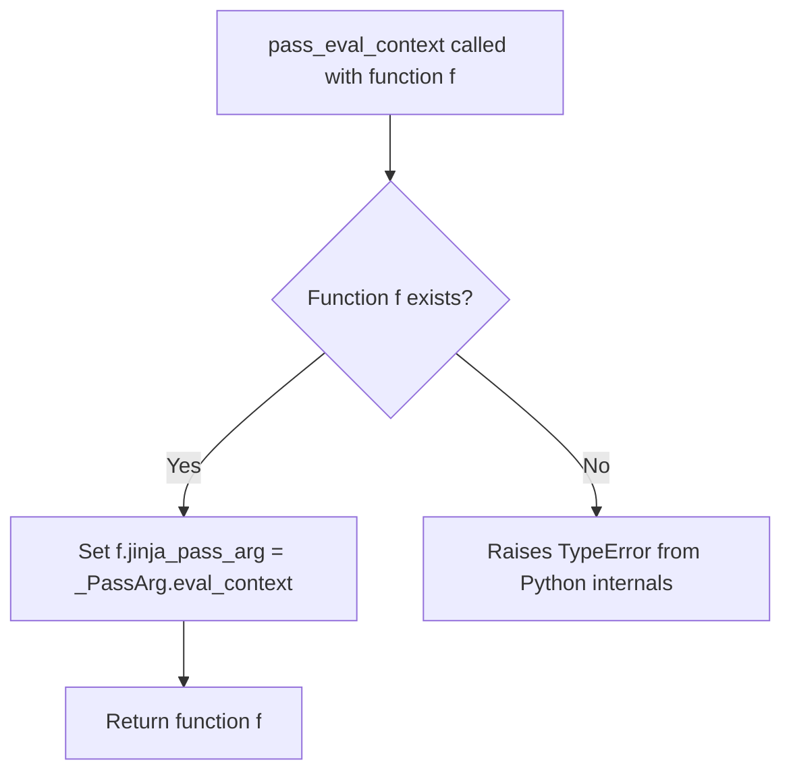
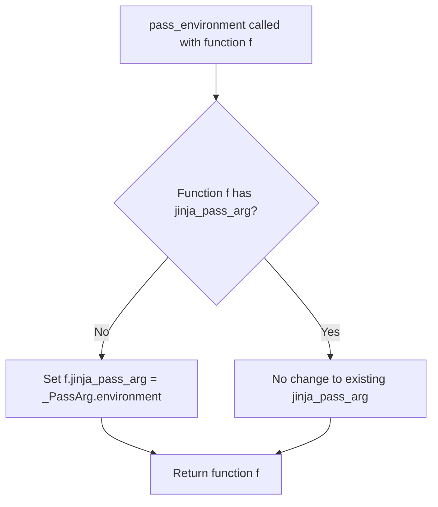
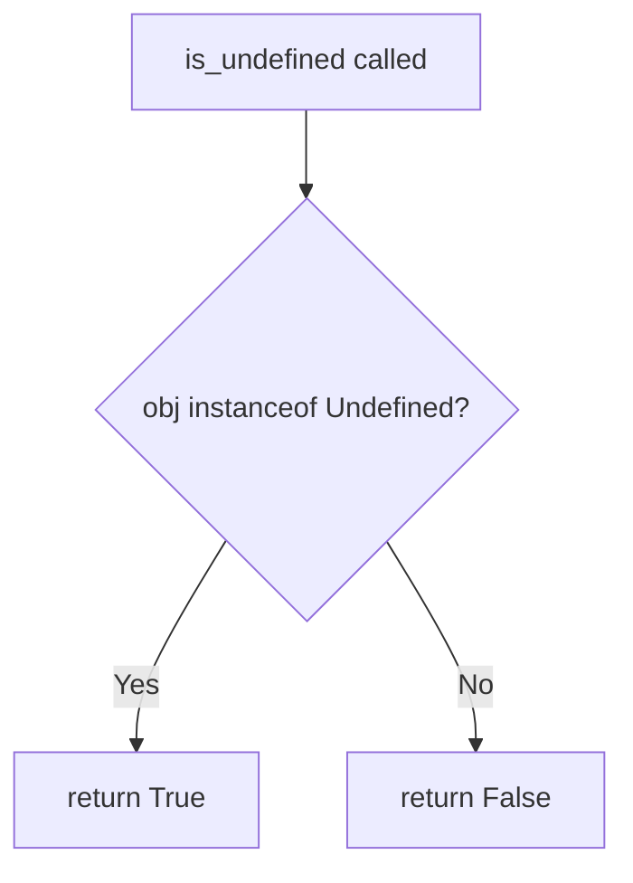
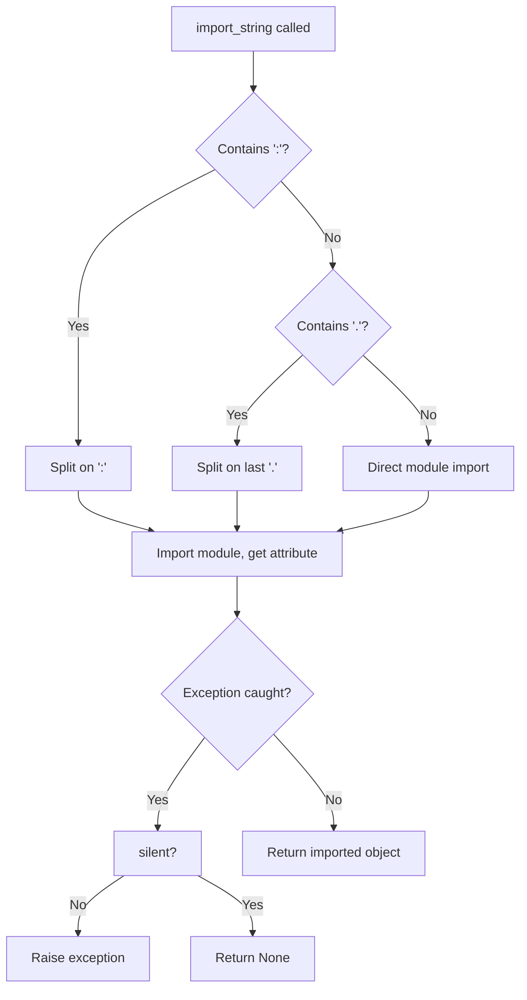
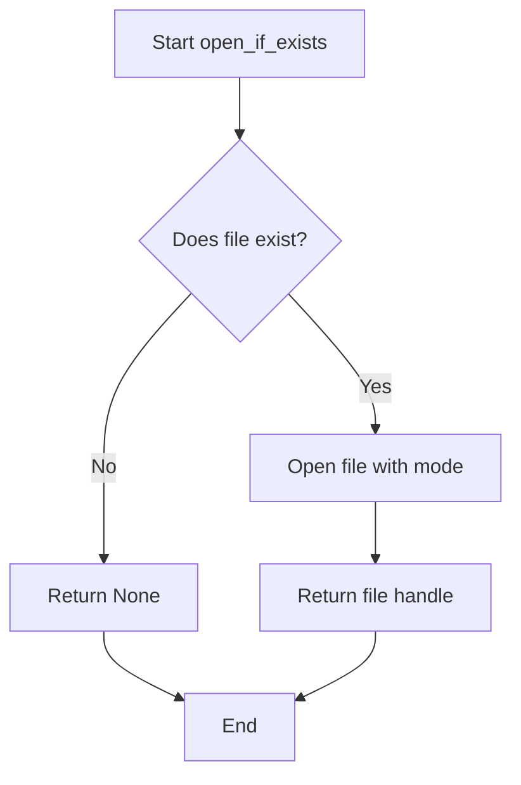
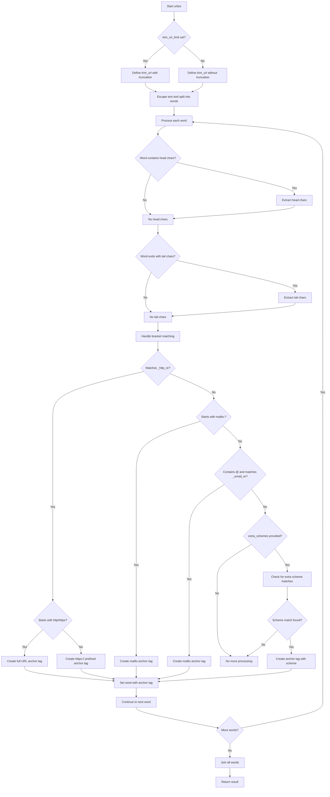
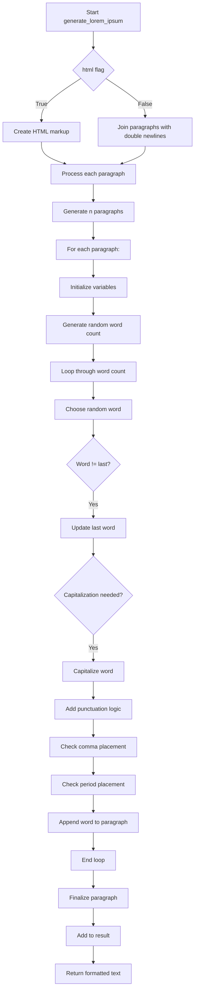
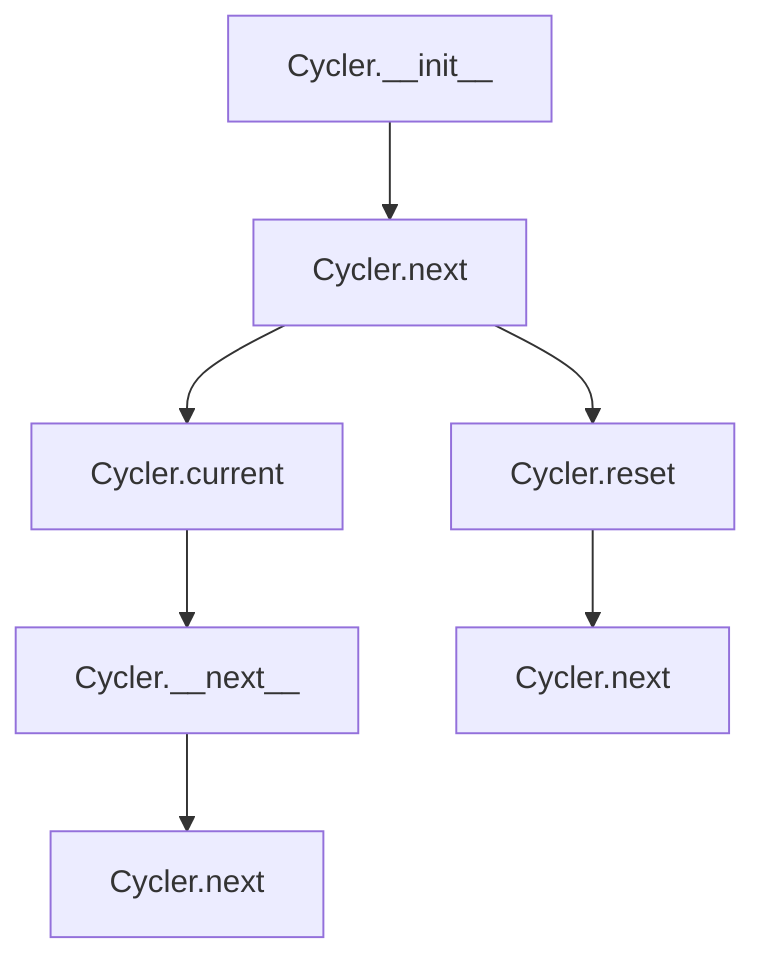

```mermaid
flowchart TD
    A[Start htmlsafe_json_dumps] --> B{dumps is None?}
    B -- Yes --> C[Set dumps = json.dumps]
    B -- No --> D[Use provided dumps function]
    C --> E[Serialize obj to JSON]
    D --> E
    E --> F[Escape &lt; to \\u003c]
    F --> G[Escape &gt; to \\u003e]
    G --> H[Escape &amp; to \\u0026]
    H --> I[Escape &#39; to \\u0027]
    I --> J[Wrap result in markupsafe.Markup]
    J --> K[Return Markup object]
```

# `utils.py`

## `src.jinja2.utils.pass_context` · *function*

## Summary:
Decorator that marks a function to receive the template context as its first argument when called from Jinja2 templates.

## Description:
This decorator is used to indicate to the Jinja2 template engine that a function should automatically receive the template context object as its first argument when invoked from within a template. It sets an internal attribute (`jinja_pass_arg`) on the decorated function to signal this requirement to the template execution system.

The function is part of a family of decorators (`pass_context`, `pass_eval_context`, `pass_environment`) that control what contextual information is automatically passed to template functions.

## Args:
    f (F): The function to be decorated. The type F represents a generic callable type used throughout the Jinja2 codebase.

## Returns:
    F: The same function object, with the `jinja_pass_arg` attribute set to `_PassArg.context`.

## Raises:
    None: This function does not raise any exceptions.

## Constraints:
    Preconditions:
    - The function being decorated must be callable
    - The function should be intended for use in Jinja2 templates
    
    Postconditions:
    - The returned function has the `jinja_pass_arg` attribute set to `_PassArg.context`
    - The original function object is returned unchanged except for the added attribute

## Side Effects:
    None: This function only modifies the metadata of the input function by adding an attribute.

## Control Flow:


## Examples:
```python
from jinja2.utils import pass_context

@pass_context
def my_template_function(context, arg1, arg2):
    # When called from a template, context will be automatically provided as the first argument
    return f"Context: {context.name}, Arg1: {arg1}, Arg2: {arg2}"

# Usage in template:
# {{ my_template_function('value1', 'value2') }}
# Would internally become:
# my_template_function(template_context, 'value1', 'value2')
```

## `src.jinja2.utils.pass_eval_context` · *function*

## Summary:
Decorator that marks a function to receive the Jinja2 evaluation context as an argument.

## Description:
This decorator is used to indicate that a function should be called with the Jinja2 evaluation context as its first argument. It sets an internal attribute (`jinja_pass_arg`) on the decorated function to signal to the Jinja2 template engine that the evaluation context should be passed when invoking the function.

## Args:
    f (F): The function to be decorated, where F is a callable type that will receive the evaluation context.

## Returns:
    F: The same function with the `jinja_pass_arg` attribute set to `_PassArg.eval_context`.

## Raises:
    None explicitly raised by this function.

## Constraints:
    Preconditions:
    - The function `f` must be callable
    - The global `_PassArg` must be defined with an `eval_context` member
    
    Postconditions:
    - The returned function has the attribute `jinja_pass_arg` set to `_PassArg.eval_context`
    - The original function `f` is unchanged except for the added attribute

## Side Effects:
    None - This function only modifies the metadata of the input function by adding an attribute.

## Control Flow:


## Examples:
```python
@pass_eval_context
def my_template_function(eval_ctx, arg1, arg2):
    # This function will receive the evaluation context as first argument
    return eval_ctx.resolve(arg1) + arg2

# Usage in Jinja2 template:
# {{ my_template_function("variable_name", 42) }}
```

## `src.jinja2.utils.pass_environment` · *function*

## Summary:
Decorator that marks a function to receive the Jinja2 environment as its first argument.

## Description:
This decorator is used to indicate that a function should receive the Jinja2 environment object as its first argument when called within a template context. It sets an internal attribute (`jinja_pass_arg`) on the decorated function to signal to the Jinja2 runtime that the environment should be passed to this function.

## Args:
    f (F): The function to be decorated, which will receive the environment as its first argument.

## Returns:
    F: The same function, with the `jinja_pass_arg` attribute set to `_PassArg.environment`.

## Raises:
    None

## Constraints:
    Preconditions:
    - The function `f` must be callable
    - The function `f` must be a valid Python function object
    
    Postconditions:
    - The returned function maintains the same behavior as the input function
    - The returned function has the attribute `jinja_pass_arg` set to `_PassArg.environment`

## Side Effects:
    None

## Control Flow:


## Examples:
```python
from jinja2.utils import pass_environment

@pass_environment
def my_function(environment, other_args):
    # This function will receive the Jinja2 environment as first argument
    return environment

# Usage in Jinja2 template context
# The environment will be automatically passed when this function is called
```

## `src.jinja2.utils._PassArg` · *class*

*No documentation generated.*

### `src.jinja2.utils._PassArg.from_obj` · *method*

## Summary:
Retrieves a Jinja2 pass argument enum from an object if it has the appropriate attribute.

## Description:
This class method checks if the provided object has a `jinja_pass_arg` attribute and returns its value if present. It serves as a utility for extracting pass argument information from objects in Jinja2 template processing contexts. The method is typically used to determine what arguments should be passed to template functions based on object metadata.

## Args:
    obj: Any object that may contain a `jinja_pass_arg` attribute

## Returns:
    _PassArg enum value if the object has a `jinja_pass_arg` attribute, otherwise None

## Raises:
    None explicitly raised

## State Changes:
    Attributes READ: None (this is a class method that doesn't modify instance state)
    Attributes WRITTEN: None

## Constraints:
    Preconditions: The object must be a valid Python object that can be checked with hasattr()
    Postconditions: Returns either a _PassArg enum value or None, with no side effects

## Side Effects:
    None

## `src.jinja2.utils.internalcode` · *function*

## Summary:
Decorator that marks a function as internal by tracking its code object in a global registry.

## Description:
This decorator is used to identify and track functions that are considered internal to the Jinja2 system. When applied to a function, it records the function's code object in a global set called `internal_code`. This allows the system to distinguish between internal implementation functions and user-facing functions, which may be useful for debugging, security, or optimization purposes.

The function is designed to be used as a decorator, taking a callable and returning it unchanged while performing the registration side effect.

## Args:
    f (F): A callable function or other callable object to be marked as internal. The type `F` represents a generic function type.

## Returns:
    F: The same function object that was passed in, unchanged.

## Raises:
    None explicitly raised by this function.

## Constraints:
    Preconditions:
    - The input `f` must be a callable object that has a `__code__` attribute
    - The global variable `internal_code` must be initialized as a set-like object
    
    Postconditions:
    - The function's code object is added to the global `internal_code` set
    - The returned function is identical to the input function

## Side Effects:
    - Modifies the global `internal_code` set by adding the function's code object
    - No other side effects (no I/O operations, no external state mutations)

## Control Flow:
```mermaid
flowchart TD
    A[Call internalcode(f)] --> B{f has __code__?}
    B -- Yes --> C[Add f.__code__ to internal_code]
    C --> D[Return f]
    B -- No --> E[Raise AttributeError]
```

## Examples:
```python
# Basic usage as a decorator
@internalcode
def my_internal_function():
    return "internal"

# Usage with lambda
internalcode(lambda x: x * 2)

# The decorated function behaves identically to the original
result = my_internal_function()  # Returns "internal"
```

## `src.jinja2.utils.is_undefined` · *function*

## Summary:
Checks whether an object is an instance of the Jinja2 Undefined class, indicating an undefined template variable.

## Description:
This utility function determines if a given object represents an undefined value in Jinja2 templating. In Jinja2, when a template variable is referenced but not defined in the context, it becomes an instance of the Undefined class rather than None or a default value. This function provides a reliable way to detect such undefined values.

The function is extracted into its own utility to provide a clean, reusable interface for checking undefined status without requiring direct imports of the Undefined class throughout the codebase.

## Args:
    obj (Any): The object to test for being undefined

## Returns:
    bool: True if the object is an instance of Undefined class, False otherwise

## Raises:
    None: This function does not raise any exceptions

## Constraints:
    Preconditions: The function accepts any object as input
    Postconditions: Always returns a boolean value

## Side Effects:
    None: This function has no side effects

## Control Flow:


## Examples:
```python
# Check if a template variable is undefined
from jinja2.runtime import Undefined
from jinja2.utils import is_undefined

# Example usage
undefined_var = Undefined()
result = is_undefined(undefined_var)  # Returns True

defined_var = "some_value"
result = is_undefined(defined_var)  # Returns False
```

## `src.jinja2.utils.consume` · *function*

## Summary:
Discards all elements from an iterable by consuming it completely.

## Description:
This utility function iterates through all elements of the provided iterable and discards them, effectively exhausting the iterator. It's commonly used to force evaluation of lazy iterators or generators without storing the results.

## Args:
    iterable (t.Iterable[t.Any]): An iterable object whose elements should be consumed.

## Returns:
    None: This function does not return any value.

## Raises:
    No exceptions are explicitly raised by this function.

## Constraints:
    Preconditions:
    - The input must be an iterable object (implements __iter__ or __getitem__).
    - The iterable should be finite, as infinite iterables will cause the function to run indefinitely.

    Postconditions:
    - All elements of the input iterable have been processed.
    - The iterable is exhausted after this operation.

## Side Effects:
    None: This function has no side effects beyond consuming the input iterable.

## Control Flow:
```mermaid
flowchart TD
    A[Start consume()] --> B{iterable provided?}
    B -->|Yes| C[Iterate through elements]
    C --> D{More elements?}
    D -->|Yes| E[Discard element]
    E --> D
    D -->|No| F[End iteration]
    F --> G[Return None]
    B -->|No| H[Raise TypeError]
```

## Examples:
    # Consume a generator expression
    consume(x for x in range(5))  # Consumes all elements
    
    # Consume a list
    consume([1, 2, 3, 4])  # Consumes all elements
    
    # Consume a string
    consume("hello")  # Consumes all characters
```

## `src.jinja2.utils.clear_caches` · *function*

## Summary:
Clears internal caching mechanisms used by the Jinja2 template engine to reset cached environment and lexer states.

## Description:
This function provides a centralized mechanism to clear two internal caches within the Jinja2 templating system: the spontaneous environment cache and the lexer cache. It serves as a utility function to invalidate cached data and ensure fresh state during template processing operations.

The function extracts the cache-clearing logic from inline usage to provide a clean, reusable interface for cache management. This separation ensures that cache invalidation is handled consistently throughout the application and makes testing and debugging easier.

## Args:
    None

## Returns:
    None

## Raises:
    None

## Constraints:
    Preconditions:
    - The function assumes that `get_spontaneous_environment` is a callable that supports the `cache_clear()` method
    - The function assumes that `_lexer_cache` is an object that supports the `clear()` method
    
    Postconditions:
    - Both caches are emptied
    - No cached data remains in either cache

## Side Effects:
    None

## Control Flow:
```mermaid
flowchart TD
    A[clear_caches()] --> B[Import get_spontaneous_environment from .environment]
    B --> C[Import _lexer_cache from .lexer]
    C --> D[Call get_spontaneous_environment.cache_clear()]
    D --> E[Call _lexer_cache.clear()]
    E --> F[Return None]
```

## Examples:
```python
# Clear all caches before starting a new template rendering session
clear_caches()

# Clear caches when environment configuration changes
clear_caches()
```

## `src.jinja2.utils.import_string` · *function*

## Summary:
Dynamically imports a Python object from a string representation, supporting module-only, dot-separated, and colon-separated import formats.

## Description:
This function provides a flexible way to import Python objects dynamically from string specifications. It supports three import formats: module names only (e.g., "os"), dot-separated module and attribute (e.g., "collections.defaultdict"), and colon-separated module and object (e.g., "myapp.views:home"). The function is commonly used in Jinja2 template systems where configuration or plugin loading requires dynamic imports.

## Args:
    import_name (str): String representation of the import, supporting three formats:
        - Module name only (e.g., "json")
        - Dot-separated module.attribute (e.g., "collections.defaultdict")  
        - Colon-separated module:attribute (e.g., "myapp.views:home")
    silent (bool): If True, suppresses ImportErrors and AttributeErrors. Defaults to False.

## Returns:
    Any: The imported Python object matching the import specification. When import_name contains only a module name, returns the module itself. When import_name specifies an attribute, returns that attribute from the module.

## Raises:
    ImportError: When the specified module cannot be imported and silent=False
    AttributeError: When the specified attribute cannot be found in the module and silent=False

## Constraints:
    Preconditions:
        - import_name must be a non-empty string
        - The specified module and attribute must exist if silent=False
    Postconditions:
        - Returns the imported object or raises appropriate exceptions when silent=False

## Side Effects:
    None

## Control Flow:


## Examples:
    # Import a module
    json_module = import_string('json')
    
    # Import a nested attribute
    defaultdict_class = import_string('collections.defaultdict')
    
    # Import with colon separator
    view_function = import_string('myapp.views:home')
    
    # Silent import (no exception raised)
    result = import_string('nonexistent.module', silent=True)
```

## `src.jinja2.utils.open_if_exists` · *function*

## Summary:
Attempts to open a file only if it exists, returning None if the file does not exist.

## Description:
This utility function provides a safe way to open files by first checking if they exist. It prevents errors that would occur when trying to open non-existent files. This function is typically used in template processing and file handling contexts where graceful handling of missing files is required.

## Args:
    filename (str): Path to the file to be opened
    mode (str): File opening mode, defaults to "rb" (read binary)

## Returns:
    IO or None: A file handle if the file exists and can be opened, None otherwise

## Raises:
    None explicitly raised

## Constraints:
    Preconditions:
        - filename must be a valid path string
        - mode must be a valid file opening mode string
    Postconditions:
        - If file exists, returns an open file handle with the specified mode
        - If file does not exist, returns None

## Side Effects:
    - May perform file I/O operations when file exists and is opened
    - No external state mutations

## Control Flow:


## Examples:
```python
# Safe file opening
file_handle = open_if_exists("config.json")
if file_handle:
    # Process file
    data = json.load(file_handle)
    file_handle.close()
else:
    # Handle missing file gracefully
    print("Config file not found")

# Opening in text mode
text_file = open_if_exists("README.md", "r")
if text_file:
    content = text_file.read()
    text_file.close()
```

## `src.jinja2.utils.object_type_repr` · *function*

## Summary:
Returns a human-readable string representation of an object's type, distinguishing between built-in and custom types.

## Description:
This utility function converts an object into a descriptive string that indicates its type. It provides special handling for None and Ellipsis objects, while formatting regular objects differently based on whether they originate from Python's built-in module or custom modules. This function is primarily used for debugging, error messages, and type introspection in Jinja2 template processing.

The function extracts type information by examining the object's class and module attributes, providing clear and consistent type representations that help developers understand object types during development and debugging.

## Args:
    obj (Any): The object whose type representation is to be generated. Can be any Python object including None and Ellipsis.

## Returns:
    str: A string describing the object's type. For None, returns "None". For Ellipsis, returns "Ellipsis". For built-in types, returns "{type_name} object". For custom types, returns "{module}.{type_name} object".

## Raises:
    No exceptions are raised by this function under normal circumstances.

## Constraints:
    Preconditions:
    - The function accepts any Python object as input
    - No validation is performed on the input object
    
    Postconditions:
    - Always returns a string value
    - The returned string follows a consistent format pattern

## Side Effects:
    None - This function is pure and has no side effects.

## Control Flow:
```mermaid
flowchart TD
    A[Start: object_type_repr] --> B{obj is None?}
    B -- Yes --> C[Return "None"]
    B -- No --> D{obj is Ellipsis?}
    D -- Yes --> E[Return "Ellipsis"]
    D -- No --> F[Get type(obj)]
    F --> G{cls.__module__ == "builtins"?}
    G -- Yes --> H[Return "{cls.__name__} object"]
    G -- No --> I[Return "{cls.__module__}.{cls.__name__} object"]
```

## Examples:
    >>> object_type_repr(None)
    'None'
    
    >>> object_type_repr(...)
    'Ellipsis'
    
    >>> object_type_repr(42)
    'int object'
    
    >>> object_type_repr("hello")
    'str object'
    
    >>> object_type_repr([1, 2, 3])
    'list object'
    
    >>> object_type_repr(object())
    '__main__.object object'
```

## `src.jinja2.utils.pformat` · *function*

## Summary:
Formats any Python object into a pretty-printed string representation for debugging and logging purposes.

## Description:
This function provides a convenient wrapper around Python's standard library `pprint.pformat` function. It takes any Python object and returns a formatted string representation that is suitable for debugging, logging, or displaying complex nested data structures in a readable format.

## Args:
    obj (Any): Any Python object to be formatted. This can be any valid Python data structure including dictionaries, lists, custom objects, etc.

## Returns:
    str: A formatted string representation of the input object with proper indentation and line breaks for readability.

## Raises:
    None: This function does not raise any exceptions under normal circumstances. However, if the underlying `pprint.pformat` encounters issues with the object (such as circular references that cannot be handled), it may raise exceptions from the standard library.

## Constraints:
    - Preconditions: The input object must be serializable by the pprint module
    - Postconditions: The returned string will be a valid pretty-printed representation of the input object

## Side Effects:
    None: This function has no side effects beyond the standard library's pprint behavior.

## Control Flow:
```mermaid
flowchart TD
    A[Call pformat with obj] --> B{Check if obj is valid}
    B --> C[Import pprint.pformat]
    C --> D[Call pprint.pformat(obj)]
    D --> E[Return formatted string]
```

## Examples:
```python
# Basic usage with a dictionary
data = {'name': 'John', 'age': 30, 'hobbies': ['reading', 'swimming']}
formatted = pformat(data)
print(formatted)
# Output:
# {'age': 30,
#  'hobbies': ['reading', 'swimming'],
#  'name': 'John'}

# Usage with nested structures
nested_data = {'users': [{'id': 1, 'profile': {'name': 'Alice'}}]}
formatted = pformat(nested_data)
print(formatted)
# Output:
# {'users': [{'id': 1, 'profile': {'name': 'Alice'}}]}
```

## `src.jinja2.utils.urlize` · *function*

## Summary:
Converts URLs and email addresses in text to HTML anchor tags while maintaining proper HTML escaping and handling edge cases.

## Description:
Processes input text to identify and convert URLs (HTTP/HTTPS/mailto) and email addresses into HTML anchor tags. This function is specifically designed for use in templating environments where HTML escaping is critical for security. It handles various edge cases including nested brackets, parentheses, and punctuation marks that commonly surround URLs and email addresses. The function extracts URLs and emails from text and wraps them in appropriate HTML anchor tags with configurable attributes.

## Args:
    text (str): The input text to process for URL/email detection and conversion.
    trim_url_limit (int, optional): Maximum length of URL to display. URLs exceeding this limit will be truncated with an ellipsis. Defaults to None.
    rel (str, optional): Value for the rel attribute in generated anchor tags. Defaults to None.
    target (str, optional): Value for the target attribute in generated anchor tags. Defaults to None.
    extra_schemes (Iterable[str], optional): Additional URL schemes to recognize beyond standard HTTP/HTTPS/mailto. Defaults to None.

## Returns:
    str: The processed text with URLs and email addresses converted to HTML anchor tags.

## Raises:
    None explicitly raised by this function.

## Constraints:
    Preconditions:
    - Input text must be convertible to string
    - All attribute values (rel, target) must be safe for HTML attributes
    - Regex patterns `_http_re` and `_email_re` must be available in scope
    
    Postconditions:
    - Output text is properly escaped for HTML safety using markupsafe.escape()
    - All detected URLs and emails are wrapped in anchor tags
    - Whitespace is preserved in original positions
    - Nested brackets and parentheses are handled appropriately

## Side Effects:
    None

## Control Flow:


## Examples:
    >>> urlize("Visit https://example.com for more info")
    'Visit <a href="https://example.com">https://example.com</a> for more info'
    
    >>> urlize("Contact us at test@example.com", trim_url_limit=10)
    'Contact us at <a href="mailto:test@example.com">test@...</a>'
    
    >>> urlize("Go to http://example.com", rel="nofollow", target="_blank")
    'Go to <a href="http://example.com" rel="nofollow" target="_blank">http://example.com</a>'

## `src.jinja2.utils.generate_lorem_ipsum` · *function*

## Summary:
Generates randomized lorem ipsum text paragraphs with proper punctuation and capitalization.

## Description:
Creates randomized placeholder text consisting of lorem ipsum words with grammatical structure including sentences, commas, and periods. The function can return either plain text or HTML markup format. This utility is commonly used for generating sample content in templates.

## Args:
    n (int): Number of paragraphs to generate. Defaults to 5.
    html (bool): Whether to return HTML markup with paragraph tags. Defaults to True.
    min (int): Minimum number of words per paragraph. Defaults to 20.
    max (int): Maximum number of words per paragraph. Defaults to 100.

## Returns:
    str: Generated lorem ipsum text. If html=True, returns HTML markup with <p> tags; otherwise returns plain text separated by double newlines.

## Raises:
    None explicitly raised.

## Constraints:
    Preconditions:
    - n must be a non-negative integer
    - min and max must be positive integers with min <= max
    - LOREM_IPSUM_WORDS constant must contain space-separated words
    
    Postconditions:
    - Returns a string with proper sentence structure
    - Paragraphs end with periods or commas appropriately
    - First word of each paragraph is capitalized

## Side Effects:
    None.

## Control Flow:


## Examples:
    # Generate 3 paragraphs in HTML format
    html_text = generate_lorem_ipsum(n=3, html=True)
    
    # Generate 2 paragraphs in plain text format
    plain_text = generate_lorem_ipsum(n=2, html=False, min=15, max=50)
    
    # Generate default 5 paragraphs with default settings
    default_text = generate_lorem_ipsum()

## `src.jinja2.utils.url_quote` · *function*

## Summary:
URL-encodes an object for use in URLs or query strings, handling various input types and special formatting requirements.

## Description:
This function provides a robust mechanism for URL encoding objects of various types (strings, bytes, or other objects convertible to strings) while properly handling special cases for query string parameters. It converts the input to bytes using the specified character encoding, applies URL encoding with appropriate safe characters, and handles query string formatting by replacing spaces with plus signs.

## Args:
    obj (Any): The object to encode. Can be a string, bytes, or any object that can be converted to a string.
    charset (str): The character encoding to use when converting non-byte/string objects to bytes. Defaults to "utf-8".
    for_qs (bool): When True, formats the result for use in URL query strings by replacing "%20" with "+". Defaults to False.

## Returns:
    str: The URL-encoded representation of the input object.

## Raises:
    UnicodeEncodeError: If the object cannot be encoded using the specified charset.

## Constraints:
    Preconditions:
        - The charset parameter must be a valid character encoding recognized by Python's encode() method
        - The obj parameter must be convertible to a string or bytes
    
    Postconditions:
        - The returned string is properly URL-encoded
        - When for_qs=True, spaces are represented as "+" instead of "%20"

## Side Effects:
    None

## Control Flow:
```mermaid
flowchart TD
    A[Start url_quote] --> B{obj is bytes?}
    B -- Yes --> C[Use obj directly]
    B -- No --> D{obj is str?}
    D -- No --> E[obj = str(obj)]
    E --> F[obj = obj.encode(charset)]
    D -- Yes --> G[obj = obj.encode(charset)]
    F --> H[Goto C]
    C --> I[safe = b"" if for_qs else b"/"]
    I --> J[rv = quote_from_bytes(obj, safe)]
    J --> K{for_qs?}
    K -- Yes --> L[rv = rv.replace("%20", "+")]
    K -- No --> M[Return rv]
    L --> M
```

## Examples:
    >>> url_quote("hello world")
    'hello%20world'
    
    >>> url_quote("hello world", for_qs=True)
    'hello+world'
    
    >>> url_quote(b"hello world")
    'hello%20world'
    
    >>> url_quote(123)
    '123'
    
    >>> url_quote("café", charset="utf-8")
    'caf%C3%A9'

## `src.jinja2.utils.LRUCache` · *class*

*No documentation generated.*

### `src.jinja2.utils.LRUCache.__init__` · *method*

*No documentation generated.*

### `src.jinja2.utils.LRUCache._postinit` · *method*

## Summary:
Initializes performance-optimized method references and thread synchronization primitives for the LRU cache.

## Description:
This method performs post-initialization setup for the LRUCache instance by caching method references from the internal queue and creating a write lock for thread safety. It is called automatically during object initialization and should not be called manually by users.

## Args:
    self: The LRUCache instance being initialized

## Returns:
    None

## Raises:
    None

## State Changes:
    Attributes READ: self._queue
    Attributes WRITTEN: self._popleft, self._pop, self._remove, self._wlock, self._append

## Constraints:
    Preconditions: The LRUCache instance must have been initialized with a _queue attribute containing a deque object
    Postconditions: The instance will have cached method references and a write lock available for thread-safe operations

## Side Effects:
    None

### `src.jinja2.utils.LRUCache.__getstate__` · *method*

## Summary:
Returns the internal state of the LRU cache for serialization purposes.

## Description:
This method implements Python's pickle protocol by returning a dictionary containing the essential internal state of the LRUCache instance. It is called automatically during the pickling process to serialize the cache's capacity, mapping, and queue data structures. This allows the cache to be properly reconstructed when unpickled.

## Args:
    None

## Returns:
    Mapping[str, Any]: A dictionary containing the cache's state with keys:
        - "capacity": The maximum size of the cache
        - "_mapping": Dictionary mapping cache keys to values
        - "_queue": Deque representing the access order of cache entries

## Raises:
    None

## State Changes:
    Attributes READ: 
        - self.capacity
        - self._mapping  
        - self._queue
    Attributes WRITTEN: None

## Constraints:
    Preconditions:
        - The LRUCache instance must be properly initialized
        - All internal attributes (capacity, _mapping, _queue) must exist and be accessible
    
    Postconditions:
        - Returns a dictionary with exactly the three specified keys
        - The returned dictionary contains valid representations of the internal state

## Side Effects:
    None

### `src.jinja2.utils.LRUCache.__setstate__` · *method*

## Summary:
Restores the internal state of an LRUCache instance after unpickling by updating instance attributes and reinitializing non-serializable components.

## Description:
This method is part of Python's pickle protocol and is automatically called during object deserialization. It restores the cache's state by updating the instance dictionary with the provided serialized data, then reinitializes non-serializable attributes that were excluded from serialization.

## Args:
    d (Mapping[str, Any]): Dictionary containing serialized state data from the cache's __getstate__ method

## Returns:
    None: This method modifies the instance in-place and does not return a value

## Raises:
    None: This method doesn't explicitly raise exceptions, though underlying operations may raise exceptions

## State Changes:
    Attributes READ: The input dictionary `d` (used to update `self.__dict__`)
    Attributes WRITTEN: All attributes in the input dictionary `d`, plus reinitializes `_popleft`, `_pop`, `_remove`, `_wlock`, and `_append` via `_postinit()`

## Constraints:
    Preconditions: The input dictionary `d` must contain valid state data that matches the structure expected by the LRUCache class
    Postconditions: The LRUCache instance will have restored all its state and be fully functional with all runtime attributes properly initialized

## Side Effects:
    None: This method only modifies the internal state of the object and doesn't perform I/O or external service calls

### `src.jinja2.utils.LRUCache.__getnewargs__` · *method*

## Summary:
Returns the arguments needed to reconstruct the LRU cache during unpickling.

## Description:
This method implements Python's pickle protocol by returning the constructor arguments required to recreate the LRUCache instance. It is called automatically during the unpickling process to determine how to reconstruct the object from its serialized state.

## Args:
    None

## Returns:
    tuple: A single-element tuple containing the cache capacity (self.capacity)

## Raises:
    None

## State Changes:
    Attributes READ: self.capacity
    Attributes WRITTEN: None

## Constraints:
    Preconditions: The LRUCache instance must be properly initialized with a capacity
    Postconditions: The returned tuple contains exactly one element - the capacity value

## Side Effects:
    None

### `src.jinja2.utils.LRUCache.copy` · *method*

## Summary:
Creates a shallow copy of the LRU cache with identical capacity, mapping, and queue contents.

## Description:
This method implements a copy operation for LRUCache instances, creating a new cache with the same capacity and duplicated internal data structures. It's designed to support both explicit calls to copy() and implicit copying via copy.copy() due to the assignment `__copy__ = copy`.

## Args:
    None

## Returns:
    LRUCache: A new LRUCache instance with the same capacity and copied internal state.

## Raises:
    None

## State Changes:
    Attributes READ: self.capacity, self._mapping, self._queue
    Attributes WRITTEN: rv._mapping, rv._queue (in the new instance)

## Constraints:
    Preconditions: The LRUCache instance must be properly initialized with capacity, _mapping, and _queue attributes.
    Postconditions: The returned cache has identical capacity and contents to the original, but is a separate instance.

## Side Effects:
    None

### `src.jinja2.utils.LRUCache.get` · *method*

## Summary:
Retrieves a value from the LRU cache by key, returning a default value if the key is not present.

## Description:
This method provides dictionary-like access to retrieve cached values while maintaining LRU (Least Recently Used) cache semantics. When a key is accessed, the method updates the cache's internal ordering to reflect that this item was recently used. If the key is not found in the cache, the specified default value is returned instead of raising a KeyError.

## Args:
    key (Any): The key to look up in the cache
    default (Any, optional): The value to return if key is not found. Defaults to None

## Returns:
    Any: The cached value associated with the key, or the default value if key is not present

## Raises:
    None: This method never raises exceptions directly, though underlying operations may raise exceptions

## State Changes:
    Attributes READ: 
    - self._mapping: Used to check key existence and retrieve values
    - self._queue: Used to track access order for LRU behavior
    
    Attributes WRITTEN:
    - self._queue: Modified when a key is accessed to update its position in the LRU queue

## Constraints:
    Preconditions:
    - The LRUCache instance must be properly initialized with a positive capacity
    - The key parameter should be hashable (as required by Python dictionaries)
    
    Postconditions:
    - If key exists, the value is returned and the key's position in the LRU queue is updated
    - If key doesn't exist, the default value is returned without modifying the cache state
    - Thread safety is maintained through the internal lock mechanism

## Side Effects:
    - Updates internal LRU queue ordering when key exists (thread-safe)
    - May modify the cache state when key exists (removing/reordering elements)
    - No external I/O or service calls

### `src.jinja2.utils.LRUCache.setdefault` · *method*

## Summary:
Retrieves a value from the cache or sets and returns a default value if the key is not present.

## Description:
This method implements the standard `setdefault` pattern for the LRU cache. It attempts to retrieve a value associated with the given key from the cache. If the key exists, it returns the cached value. If the key does not exist, it adds the key with the specified default value to the cache and returns that default value. This operation maintains the LRU ordering by updating the usage queue appropriately.

## Args:
    key (Any): The cache key to look up or set
    default (Any, optional): The default value to set if the key is not present. Defaults to None

## Returns:
    Any: The cached value if the key exists, otherwise the default value that was set

## Raises:
    None explicitly raised

## State Changes:
    Attributes READ: self._mapping, self._queue, self._wlock
    Attributes WRITTEN: self._mapping, self._queue

## Constraints:
    Preconditions: The LRUCache instance must be properly initialized with a valid capacity
    Postconditions: If the key didn't exist, it will be added to the cache with the default value, maintaining cache size limits

## Side Effects:
    Mutates the cache state by potentially adding a new key-value pair
    May modify the LRU usage queue to reflect the most recent access
    Acquires and releases a thread lock during operations

### `src.jinja2.utils.LRUCache.clear` · *method*

## Summary:
Clears all cached entries from the LRU cache, resetting both the key-value mapping and LRU ordering queue.

## Description:
Removes all key-value pairs from the cache and resets the internal queue tracking LRU order. This method ensures thread safety by acquiring the write lock before clearing both the mapping dictionary and the queue deque.

## Args:
    None

## Returns:
    None

## Raises:
    None

## State Changes:
    Attributes READ: self._wlock, self._mapping, self._queue
    Attributes WRITTEN: self._mapping, self._queue

## Constraints:
    Preconditions: The LRUCache instance must be properly initialized with _mapping, _queue, and _wlock attributes
    Postconditions: Both self._mapping and self._queue will be empty after execution

## Side Effects:
    None

### `src.jinja2.utils.LRUCache.__contains__` · *method*

## Summary:
Checks if a key exists in the LRU cache without modifying the cache's order or access pattern.

## Description:
This special method enables the use of the `in` operator with LRUCache instances, allowing developers to test membership of keys in the cache. The method delegates to the underlying dictionary's containment check, making it efficient and consistent with standard Python dictionary behavior.

## Args:
    key (Any): The key to search for in the cache. Can be any hashable type.

## Returns:
    bool: True if the key exists in the cache, False otherwise.

## State Changes:
    Attributes READ: self._mapping
    Attributes WRITTEN: None

## Constraints:
    Preconditions: The cache instance must be properly initialized with a valid `_mapping` dictionary.
    Postconditions: The cache's internal state remains unchanged, preserving the LRU ordering and capacity constraints.

## Side Effects:
    None: This method performs no I/O operations or external service calls. It only accesses the internal `_mapping` dictionary.

### `src.jinja2.utils.LRUCache.__len__` · *method*

## Summary:
Returns the number of items currently stored in the LRU cache.

## Description:
This method implements the Python built-in `len()` protocol for the LRUCache class. It provides the count of cached items by returning the size of the internal mapping dictionary that stores the cache entries. This method is automatically invoked when `len()` is called on an LRUCache instance.

## Args:
    None

## Returns:
    int: The number of key-value pairs currently stored in the cache.

## Raises:
    None

## State Changes:
    Attributes READ: self._mapping
    Attributes WRITTEN: None

## Constraints:
    Preconditions: The LRUCache instance must be properly initialized with a valid capacity and internal structures.
    Postconditions: The method returns an integer representing the current cache size without modifying the cache contents.

## Side Effects:
    None

### `src.jinja2.utils.LRUCache.__repr__` · *method*

*No documentation generated.*

### `src.jinja2.utils.LRUCache.__getitem__` · *method*

*No documentation generated.*

### `src.jinja2.utils.LRUCache.__setitem__` · *method*

*No documentation generated.*

### `src.jinja2.utils.LRUCache.__delitem__` · *method*

*No documentation generated.*

### `src.jinja2.utils.LRUCache.items` · *method*

## Summary:
Returns all key-value pairs from the LRU cache in least-recently-used order.

## Description:
This method provides access to all cached items in the order they were least recently used, with the oldest items appearing first in the returned sequence. It's particularly useful for cache inspection, debugging, or implementing cache eviction policies that prioritize older entries.

## Args:
    None

## Returns:
    Iterable[Tuple[Any, Any]]: An iterable of key-value pairs (key, value) ordered from least recently used to most recently used.

## Raises:
    None

## State Changes:
    Attributes READ: self._mapping, self._queue
    Attributes WRITTEN: None

## Constraints:
    Preconditions: The LRUCache instance must be properly initialized with _mapping and _queue attributes.
    Postconditions: The returned iterable contains all key-value pairs currently in the cache, maintaining LRU ordering.

## Side Effects:
    None

### `src.jinja2.utils.LRUCache.values` · *method*

## Summary:
Returns an iterable of all values stored in the LRU cache in insertion order.

## Description:
This method provides read-only access to all cached values without modifying the cache state. It internally calls `self.items()` to retrieve all key-value pairs and returns just the values portion (second element of each pair). This is particularly useful when you need to process or iterate over all stored values without requiring key-based access. In LRU cache implementations, the returned values maintain their insertion order or most-recently-used order.

## Args:
    None

## Returns:
    typing.Iterable[typing.Any]: An iterable containing all values currently stored in the cache, preserving their insertion order.

## Raises:
    None explicitly raised

## State Changes:
    Attributes READ: self.items()
    Attributes WRITTEN: None

## Constraints:
    Preconditions: The object must be a valid LRUCache instance with a working `items()` method that returns an iterable of key-value pairs
    Postconditions: The cache remains completely unchanged; no values are removed, added, or modified

## Side Effects:
    None

### `src.jinja2.utils.LRUCache.keys` · *method*

## Summary:
Returns a list of cache keys in most-recently-used order.

## Description:
Provides access to all keys currently stored in the LRU cache. The returned list contains keys in the order they were most recently accessed, with the most recently used key at the beginning of the list. This method enables iteration over cache keys and allows for inspection of the cache's current contents.

## Args:
    None

## Returns:
    list[t.Any]: A list containing all cache keys in most-recently-used order (most recent first).

## Raises:
    None

## State Changes:
    Attributes READ: self._queue, self._mapping
    Attributes WRITTEN: None

## Constraints:
    Preconditions: The LRUCache instance must be properly initialized.
    Postconditions: The returned list is a copy of the current keys and does not affect the cache state.

## Side Effects:
    None

### `src.jinja2.utils.LRUCache.__iter__` · *method*

*No documentation generated.*

### `src.jinja2.utils.LRUCache.__reversed__` · *method*

## Summary:
Returns an iterator over the cache keys in least-recently-used order.

## Description:
Implements Python's `__reversed__` special method to provide iteration over cache keys in the reverse order of their usage (least recently used first). This method is called when `reversed()` is applied to an LRUCache instance.

## Args:
    self: The LRUCache instance being operated on

## Returns:
    Iterator[Any]: An iterator that yields cache keys in least-recently-used order (oldest first)

## Raises:
    None: This method does not raise any exceptions

## State Changes:
    Attributes READ: self._queue
    Attributes WRITTEN: None

## Constraints:
    Preconditions: The LRUCache instance must be properly initialized with a valid capacity
    Postconditions: The returned iterator provides keys in the same order as the underlying queue deque

## Side Effects:
    None: This method performs no I/O operations or external service calls

## `src.jinja2.utils.select_autoescape` · *function*

## Summary:
Creates a function that determines whether autoescaping should be enabled for Jinja2 templates based on file extensions.

## Description:
This function serves as a factory for creating autoescape selection functions. It allows configuring which template file extensions should have autoescaping enabled by default, which should have it disabled, and what the fallback behavior should be for unrecognized extensions or string templates.

The function is designed to be used with Jinja2's Environment configuration to set up automatic escaping behavior based on template file types. This approach centralizes the logic for determining autoescape behavior and makes it easy to configure different escaping policies for different template types.

## Args:
    enabled_extensions (Collection[str]): File extensions that should have autoescaping enabled by default. Defaults to ("html", "htm", "xml").
    disabled_extensions (Collection[str]): File extensions that should have autoescaping disabled by default. Defaults to ().
    default_for_string (bool): Whether to enable autoescaping for string templates (when template_name is None). Defaults to True.
    default (bool): Default autoescape setting for templates with unrecognized extensions. Defaults to False.

## Returns:
    Callable[[Optional[str]], bool]: A function that takes a template name (or None) and returns a boolean indicating whether autoescaping should be enabled.

## Raises:
    No explicit exceptions raised by this function.

## Constraints:
    Preconditions:
    - All extension strings should be valid file extensions (they can start with or without the dot)
    - The returned function expects template names to be strings or None
    
    Postconditions:
    - The returned function will always return a boolean value
    - Template names are compared in lowercase for case-insensitive matching

## Side Effects:
    None - This function has no side effects and is purely functional.

## Control Flow:
```mermaid
flowchart TD
    A[select_autoescape called] --> B{enabled_extensions}
    B --> C{disabled_extensions}
    C --> D[Create enabled_patterns]
    D --> E[Create disabled_patterns]
    E --> F[Return autoescape function]
    
    G[autoescape called] --> H{template_name is None?}
    H -->|Yes| I[return default_for_string]
    H -->|No| J[template_name.lower()]
    J --> K{ends with enabled_patterns?}
    K -->|Yes| L[return True]
    K -->|No| M{ends with disabled_patterns?}
    M -->|Yes| N[return False]
    M -->|No| O[return default]
```

## Examples:
```python
# Create an autoescape function for HTML/XML templates
autoescape_func = select_autoescape(
    enabled_extensions=("html", "htm", "xml"),
    disabled_extensions=("txt", "md"),
    default_for_string=True,
    default=False
)

# Test various template names
print(autoescape_func("index.html"))     # True (enabled extension)
print(autoescape_func("style.css"))      # False (unrecognized extension, uses default)
print(autoescape_func("document.txt"))   # False (disabled extension)
print(autoescape_func(None))             # True (string template, uses default_for_string)

# Create a more restrictive autoescape policy
strict_autoescape = select_autoescape(
    enabled_extensions=("html",),
    disabled_extensions=(),
    default_for_string=False,
    default=False
)
print(strict_autoescape("page.htm"))     # False (extension not in enabled list)
print(strict_autoescape("page.html"))    # True (extension in enabled list)
```

## `src.jinja2.utils.htmlsafe_json_dumps` · *function*

## Summary:
Converts a Python object to a JSON string with HTML character escaping for safe template rendering.

## Description:
Serializes a Python object to JSON format and escapes HTML special characters (&lt;, &gt;, &amp;, &#39;) to prevent XSS vulnerabilities when embedding JSON data in HTML templates. This function ensures that serialized JSON data can be safely injected into HTML contexts without breaking markup or introducing security issues.

## Args:
    obj (Any): The Python object to serialize to JSON format
    dumps (Callable[..., str], optional): Custom JSON serialization function. Defaults to json.dumps if None
    **kwargs (Any): Additional keyword arguments passed to the dumps function

## Returns:
    markupsafe.Markup: A Markup object containing the escaped JSON string, marked as safe for HTML rendering

## Raises:
    Any exceptions raised by the underlying json.dumps function or custom dumps function

## Constraints:
    Preconditions:
    - The obj parameter must be serializable to JSON
    - If a custom dumps function is provided, it must accept the same parameters as json.dumps
    
    Postconditions:
    - The returned value is always a markupsafe.Markup object
    - All HTML special characters (<, >, &, ') are escaped using Unicode escape sequences

## Side Effects:
    None

## Control Flow:


## Examples:
```python
# Basic usage with a dictionary
data = {"name": "John", "message": "<script>alert('xss')</script>"}
result = htmlsafe_json_dumps(data)
# Returns: markupsafe.Markup object containing escaped JSON

# With custom dumps function
import json
def custom_dumps(obj):
    return json.dumps(obj, indent=2)

result = htmlsafe_json_dumps({"key": "value"}, dumps=custom_dumps)
# Returns: markupsafe.Markup object with indented JSON and escaped HTML
```

## `src.jinja2.utils.Cycler` · *class*

## Summary:
A cyclic iterator that cycles through a fixed set of items, returning each item in sequence and looping back to the beginning when reaching the end.

## Description:
The Cycler class provides a mechanism to iterate through a collection of items in a circular fashion. It's designed to maintain a position pointer that advances through the items, wrapping around to the beginning once the end is reached. This class is particularly useful in templating contexts where repeated patterns or sequences need to be generated.

The class is typically instantiated with a set of items that will be cycled through. Common use cases include generating alternating row colors in tables, cycling through color schemes, or creating repetitive patterns in templates.

## State:
- items: tuple of t.Any
  - Type: tuple containing arbitrary objects
  - Valid range: Must contain at least one item (checked in __init__)
  - Invariant: Cannot be empty after initialization
  
- pos: int
  - Type: integer representing current position index in the items sequence
  - Valid range: [0, len(items) - 1]
  - Invariant: Always points to a valid index in the items tuple

## Lifecycle:
- Creation: Instantiate with one or more items using Cycler(*items)
  - Required arguments: At least one item (variadic arguments)
  - Factory methods: None (direct instantiation only)
  
- Usage: Call methods in sequence:
  1. Initialize with items
  2. Access current item via .current property
  3. Advance to next item via .next() or __next__() methods
  4. Reset position via .reset() method
  
- Destruction: No special cleanup required; standard Python garbage collection handles destruction

## Method Map:


## Raises:
- RuntimeError: Raised during __init__ when no items are provided (empty argument list)

## Example:
```python
# Create a cycler with color names
color_cycler = Cycler('red', 'green', 'blue')

# Get current item
print(color_cycler.current)  # Output: 'red'

# Advance to next item
print(color_cycler.next())   # Output: 'red'
print(color_cycler.current)  # Output: 'green'

# Use as iterator
for i, color in enumerate(color_cycler):
    if i >= 5: break
    print(color)
# Output: red, green, blue, red, green

# Reset position
color_cycler.reset()
print(color_cycler.current)  # Output: 'red'
```

### `src.jinja2.utils.Cycler.__init__` · *method*

*No documentation generated.*

### `src.jinja2.utils.Cycler.reset` · *method*

## Summary:
Resets the iterator position of the Cycler back to the beginning.

## Description:
This method resets the internal position counter of the Cycler object to zero, effectively allowing the iterator to restart from the first element in its sequence. This is commonly used when a cycling sequence needs to be repeated from the beginning, such as when rendering templates that require repeated patterns.

## Args:
    None

## Returns:
    None

## Raises:
    None

## State Changes:
    Attributes READ: None
    Attributes WRITTEN: self.pos

## Constraints:
    Preconditions: The Cycler object must be initialized and have a pos attribute
    Postconditions: The pos attribute is set to 0

## Side Effects:
    None

### `src.jinja2.utils.Cycler.current` · *method*

## Summary:
Returns the current item from the cyclic iterator without advancing the position.

## Description:
This property provides access to the item at the current position in the Cycler's items sequence. It is commonly used in template rendering contexts where the current value needs to be accessed without modifying the iteration state. The method is typically called as part of a loop or iteration pattern where the position is managed by the `next()` method.

## Args:
    None

## Returns:
    t.Any: The item at the current position in the Cycler's items sequence.

## Raises:
    None

## State Changes:
    Attributes READ: self.items, self.pos
    Attributes WRITTEN: None

## Constraints:
    Preconditions: The Cycler instance must have been initialized with at least one item, and self.pos must be a valid index within the range [0, len(self.items)).
    Postconditions: The method does not modify the Cycler's internal state (pos attribute remains unchanged).

## Side Effects:
    None

### `src.jinja2.utils.Cycler.next` · *method*

## Summary:
Returns the current item from the cycler and advances to the next item in the cycle.

## Description:
This method retrieves the item at the current position in the cycler's sequence, increments the internal position counter, and returns the retrieved item. It implements circular iteration through the items, wrapping around to the beginning when the end is reached.

## Args:
    None

## Returns:
    t.Any: The current item from the cycler's sequence before advancing the position.

## Raises:
    None

## State Changes:
    Attributes READ: self.current, self.pos, self.items
    Attributes WRITTEN: self.pos

## Constraints:
    Preconditions: The Cycler instance must have been initialized with at least one item.
    Postconditions: The internal position pointer is advanced to the next item in the sequence, wrapping around to index 0 when reaching the end.

## Side Effects:
    None

## `src.jinja2.utils.Joiner` · *class*

*No documentation generated.*

### `src.jinja2.utils.Joiner.__init__` · *method*

*No documentation generated.*

### `src.jinja2.utils.Joiner.__call__` · *method*

*No documentation generated.*

## `src.jinja2.utils.Namespace` · *class*

*No documentation generated.*

### `src.jinja2.utils.Namespace.__init__` · *method*

## Summary:
Initializes a Namespace instance with attribute key-value pairs stored in an internal dictionary.

## Description:
The `__init__` method sets up the internal `__attrs` dictionary that stores all attributes for the Namespace instance. It accepts a single iterable of key-value pairs (such as a dictionary or list of tuples) and/or keyword arguments, combining them into a single dictionary that becomes the internal storage for the namespace.

## Args:
    *args: Variable length argument list containing either a single iterable of key-value pairs or multiple key-value pairs as separate arguments.
    **kwargs: Arbitrary keyword arguments representing key-value pairs to store in the namespace.

## Returns:
    None: This method does not return any value.

## Raises:
    TypeError: If the arguments cannot be converted to a dictionary (e.g., invalid argument types).

## State Changes:
    Attributes READ: None
    Attributes WRITTEN: Sets `self.__attrs` to a dictionary containing all provided key-value pairs.

## Constraints:
    Preconditions: The arguments must be compatible with the `dict()` constructor.
    Postconditions: After execution, `self.__attrs` contains all key-value pairs from both positional and keyword arguments.

## Side Effects:
    None: This method performs no I/O operations or external service calls.

### `src.jinja2.utils.Namespace.__getattribute__` · *method*

*No documentation generated.*

### `src.jinja2.utils.Namespace.__setitem__` · *method*

*No documentation generated.*

### `src.jinja2.utils.Namespace.__repr__` · *method*

*No documentation generated.*

