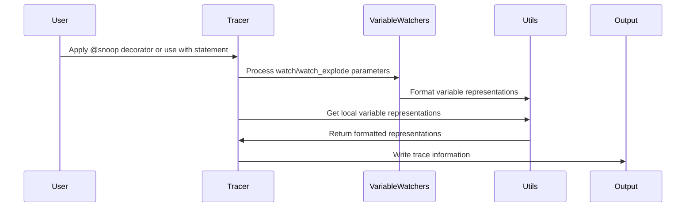

# `PySnooper`

## PySnooper Module Documentation

### Overview:
The pysnooper module is the core of the PySnooper debugging library. It provides the main tracing functionality through the Tracer class and supporting components for variable watching, representation handling, and utility functions.

### Responsibilities:
- Provide the main tracing interface through the Tracer class
- Handle function wrapping and tracing using Python's sys.settrace mechanism
- Manage variable monitoring and representation formatting
- Support various output destinations and formatting options
- Implement compatibility layers for different Python versions

### Core Components:
1. **Tracer**: Main tracing class that implements the core tracing logic
2. **BaseVariable**: Abstract base class for variable watching mechanisms
3. **CommonVariable**: Base class for common variable watching patterns
4. **Exploding**: Variable watcher that automatically expands containers
5. **Keys/Indices/Attrs**: Specific variable watching implementations for dict/list/object properties
6. **utils**: Utility functions for representation, formatting, and compatibility
7. **pycompat**: Cross-version Python compatibility utilities

### Component Interactions:

### Key Data Structures:
- `frame_to_local_reprs`: Dictionary mapping frames to their variable representations
- `target_codes`: Set of code objects being traced
- `target_frames`: Set of frames being traced
- `start_times`: Dictionary tracking function start times for duration calculation
- `custom_repr`: Tuple of custom representation functions

### Implementation Details:
The module uses Python's built-in tracing mechanism (`sys.settrace`) to intercept function calls, returns, and exceptions. It maintains state about currently executing frames and their variable values, then formats and outputs this information according to user preferences.

The variable watching system supports several modes:
- Simple variable watching with `watch` parameter
- Automatic expansion of containers with `watch_explode` parameter
- Custom representations via `custom_repr` parameter

---

## Modules

- [`misc`](misc.md)
- [`pysnooper`](pysnooper.md)

