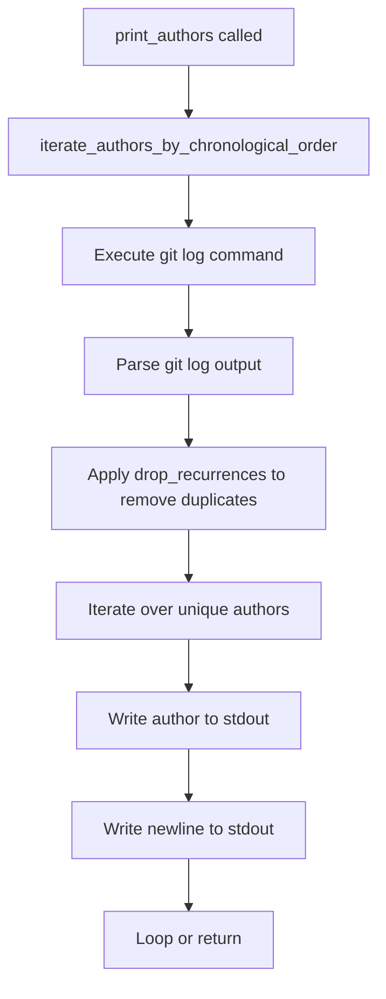

# `generate_authors.py`

## `misc.generate_authors.drop_recurrences` · *function*

*No documentation generated.*

## `misc.generate_authors.iterate_authors_by_chronological_order` · *function*

*No documentation generated.*

## `misc.generate_authors.print_authors` · *function*

## Summary:
Prints unique authors from a Git repository branch in chronological order to standard output.

## Description:
This function retrieves all unique authors who have made commits to the specified Git branch, ordered chronologically from oldest to newest, and writes each author name to standard output followed by a newline character. The function is designed to be used in command-line tools for generating author lists from Git repositories.

## Args:
    branch (str): The Git branch name or reference from which to extract author information.

## Returns:
    None: This function does not return any value.

## Raises:
    subprocess.CalledProcessError: If the underlying git command fails during execution.

## Constraints:
    Preconditions:
        - The branch parameter must refer to a valid Git branch or commit reference
        - Git must be installed and accessible in the system PATH
        - The current working directory must be a Git repository
        
    Postconditions:
        - All unique authors from the specified branch are written to stdout in chronological order
        - Each author name is followed by a newline character

## Side Effects:
    - Writes to standard output (stdout) with binary encoding
    - Executes a subprocess command using the git CLI
    - May cause performance impact when processing large repositories due to git log operations

## Control Flow:


## Examples:
```python
# Print authors from the main branch
print_authors("main")

# Print authors from a feature branch
print_authors("feature/new-feature")
```

