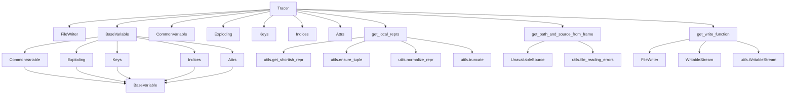

# `pysnooper`

## Tree:
    pysnooper/
    ├── pycompat.py
    ├── tracer.py
    ├── utils.py
    └── variables.py

## Role:
    Provides runtime function tracing and variable inspection capabilities for debugging Python code

## Description:
    The pysnooper module enables developers to debug Python functions and classes by automatically tracing their execution and displaying variable values at each step. It serves as a lightweight alternative to traditional debuggers, offering detailed insights into function execution flow and variable states without requiring interactive debugging sessions.

    This module is primarily used by developers who want to understand program behavior during execution, particularly for troubleshooting complex logic flows or tracking variable changes over time. It's especially valuable in production environments where interactive debugging isn't feasible.

    The module is organized around the core Tracer class which handles the tracing mechanism, with supporting components for variable inspection, output formatting, and cross-platform compatibility.

## Components:
    * `Tracer` - Main class that implements the tracing functionality and can be used as a decorator or context manager
    * `FileWriter` - Handles writing traced output to files
    * `BaseVariable` - Abstract base class for variable inspection strategies
    * `CommonVariable` - Base class for common variable inspection patterns
    * `Exploding` - Variable inspector that automatically detects and expands container types
    * `Keys` - Inspects dictionary-like objects by their keys
    * `Indices` - Inspects sequence-like objects by their indices
    * `Attrs` - Inspects object attributes
    * `WritableStream` - Abstract base class for writable output streams
    * `UnavailableSource` - Placeholder for unavailable source code
    * `get_local_reprs` - Gets formatted representations of local variables
    * `get_path_and_source_from_frame` - Retrieves source file path and content from a frame
    * `get_write_function` - Factory function for creating appropriate write functions
    * `ensure_tuple` - Ensures an input is converted to a tuple
    * `get_shortish_repr` - Gets a short representation of an object
    * `normalize_repr` - Normalizes representation strings
    * `truncate` - Truncates strings to maximum length
    * `shitcode` - Sanitizes strings for display
    * `needs_parentheses` - Determines if parentheses are needed for variable expressions

## Public API:
    * `Tracer(output=None, watch=(), watch_explode=(), depth=1, prefix='', overwrite=False, thread_info=False, custom_repr=(), max_variable_length=100, normalize=False, relative_time=False, color=True)` - Constructor for the main tracing class
    * `Tracer.__call__(function_or_class)` - Decorator interface for tracing functions or classes
    * `Tracer.__enter__()` - Context manager entry point
    * `Tracer.__exit__(exc_type, exc_value, exc_traceback)` - Context manager exit point
    * `Tracer.write(s)` - Writes formatted trace output to the configured destination
    * `Tracer.trace(frame, event, arg)` - Core tracing callback invoked by Python's tracing mechanism for each execution event
    * `Exploding(source, exclude=())` - Variable inspector for expanding containers like lists, dicts, etc.
    * `Keys(source, exclude=())` - Variable inspector for dictionary-like objects by their keys
    * `Indices(source, exclude=())` - Variable inspector for sequence-like objects by their indices
    * `Attrs(source, exclude=())` - Variable inspector for object attributes
    * `get_local_reprs(frame, watch=(), custom_repr=(), max_length=None, normalize=False)` - Gets formatted representations of local variables for tracing
    * `get_path_and_source_from_frame(frame)` - Retrieves source file path and content from a frame for display
    * `get_write_function(output, overwrite)` - Factory function for creating appropriate write functions based on output configuration

## Dependencies:
    * Internal imports:
        * `pycompat` - Cross-platform compatibility utilities
        * `utils` - Utility functions for string manipulation and variable handling
        * `variables` - Variable inspection classes and helper functions
    * External imports:
        * `inspect` - Standard library for introspecting live objects
        * `sys` - Standard library for system-specific parameters
        * `threading` - Standard library for thread management
        * `functools` - Standard library for higher-order functions
        * `collections` - Standard library for container data types
        * `collections.abc` - Standard library for abstract base classes
        * `traceback` - Standard library for exception traceback handling
        * `itertools` - Standard library for efficient looping
        * `os` - Standard library for operating system interfaces
        * `re` - Standard library for regular expressions
        * `abc` - Standard library for abstract base classes
        * `datetime` - Standard library for date and time handling
        * `opcode` - Standard library for bytecode operations

## Constraints:
    * The Tracer class must be properly initialized before use
    * When using `thread_info=True`, `normalize=False` must also be set (not supported together)
    * The `overwrite` parameter can only be used when writing to files
    * Custom representation functions must handle their own exceptions gracefully
    * The module is not thread-safe for concurrent tracing operations without proper synchronization
    * When using `normalize=True`, thread_info is not supported
    * The `relative_time` option requires proper time tracking setup

---

## Files

- [`pycompat.py`](pysnooper/pycompat.md)
- [`tracer.py`](pysnooper/tracer.md)
- [`utils.py`](pysnooper/utils.md)
- [`variables.py`](pysnooper/variables.md)

