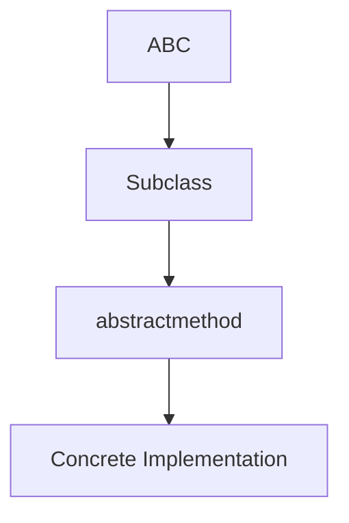
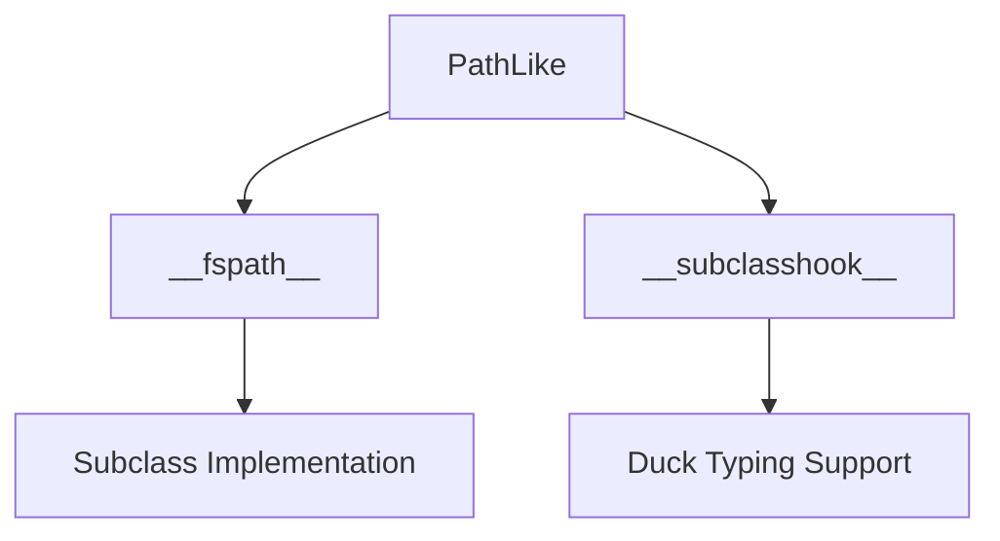
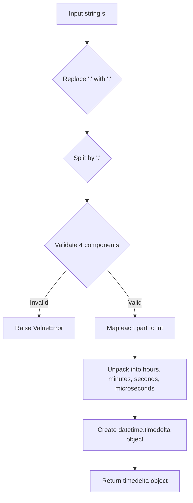

# `pycompat.py`

## `pysnooper.pycompat.ABC` · *class*

## Summary:
A compatibility base class for Abstract Base Classes that enables abstract method functionality across Python versions.

## Description:
This class serves as a compatibility shim for creating abstract base classes in Python environments where the `abc.ABC` class isn't available or when supporting older Python versions. By setting `__metaclass__ = abc.ABCMeta`, it transforms the class into an abstract base class that prevents instantiation of subclasses that don't implement all required abstract methods.

This class is designed to provide consistent abstract base class behavior regardless of Python version, allowing developers to write code that works across different Python implementations.

## State:
- No instance attributes: The class uses `__slots__ = ()` indicating it doesn't store any instance variables
- No constructor parameters: The `__init__` method is inherited from `object` with no special requirements
- Class invariant: As an abstract base class, it enforces that subclasses must implement all abstract methods defined in the hierarchy through the `abc` module

## Lifecycle:
- Creation: Instantiate by inheriting from this class in a subclass
- Usage: Subclasses should define abstract methods using the `@abstractmethod` decorator from the `abc` module
- Destruction: No special cleanup required - follows standard Python object lifecycle

## Method Map:


## Raises:
- None explicitly raised by `__init__` as it inherits default object initialization
- Runtime TypeError occurs when attempting to instantiate a subclass that hasn't implemented all abstract methods

## Example:
```python
from pysnooper.pycompat import ABC
import abc

class MyAbstractClass(ABC):
    @abc.abstractmethod
    def my_method(self):
        pass

# This will raise TypeError if instantiated directly
# my_instance = MyAbstractClass()  # TypeError

# This works fine
class ConcreteClass(MyAbstractClass):
    def my_method(self):
        return "implemented"

concrete = ConcreteClass()  # Works fine
```

## `pysnooper.pycompat.PathLike` · *class*

## Summary:
Abstract base class defining the filesystem path protocol for objects that can be converted to filesystem paths.

## Description:
This class implements the abstract base class interface for the filesystem path protocol defined in PEP 519. It serves as a base for objects that can be converted to filesystem paths using the `__fspath__` method. The class provides the abstract interface required by the filesystem path protocol.

## State:
- No instance attributes are defined in this abstract base class
- The `__fspath__` method is an abstract method that must be implemented by subclasses
- The `__subclasshook__` class method is defined to support duck typing detection

## Lifecycle:
- Creation: Instances cannot be created directly due to the abstract nature of the class
- Usage: Subclasses must implement `__fspath__` to provide filesystem path conversion functionality
- Destruction: No special cleanup required as this is an abstract base class

## Method Map:


## Raises:
- NotImplementedError: When `__fspath__` is called on the abstract base class itself
- TypeError: When attempting to instantiate the abstract base class directly

## Example:
```python
from pysnooper.pycompat import PathLike

class MyPath(PathLike):
    def __init__(self, path):
        self.path = path
    
    def __fspath__(self):
        return self.path

# Usage
mypath = MyPath("/tmp/example.txt")
path_str = mypath.__fspath__()  # Returns "/tmp/example.txt"
```

### `pysnooper.pycompat.PathLike.__fspath__` · *method*

## Summary:
Returns a string representation of the path-like object, implementing Python's path protocol.

## Description:
This method implements the `__fspath__` protocol introduced in Python's PEP 3143, which allows objects to be converted to filesystem paths. The method is declared as abstract in the `PathLike` base class and must be implemented by subclasses to provide a string representation of the path. When called, it raises `NotImplementedError` to indicate that the concrete implementation must be provided by subclasses.

## Args:
    self: The instance of the path-like object implementing this method.

## Returns:
    str: A string representation of the path. This is the expected return type according to the path protocol specification.

## Raises:
    NotImplementedError: Always raised by this base implementation to enforce that subclasses must provide their own implementation.

## State Changes:
    Attributes READ: None
    Attributes WRITTEN: None

## Constraints:
    Preconditions: The object must be an instance of a subclass of `PathLike` that properly implements this method.
    Postconditions: When properly implemented, the method should return a string that represents a valid filesystem path.

## Side Effects:
    None: This method does not perform any I/O operations or mutate external state.

### `pysnooper.pycompat.PathLike.__subclasshook__` · *method*

## Summary:
Determines if a class qualifies as a path-like object by checking for required methods and naming conventions.

## Description:
This method implements the Abstract Base Class (ABC) protocol for determining subclass relationships. It allows classes to be recognized as subclasses of PathLike without explicit inheritance, based on the presence of specific methods and naming patterns. This enables duck-typing compatibility with path-like objects in the pysnooper library.

## Args:
    cls (type): The PathLike class itself (passed automatically by Python's ABC mechanism)
    subclass (type): The class being tested for subclass relationship with PathLike

## Returns:
    bool: True if the subclass implements the path-like interface (has __fspath__ method OR has 'open' method and 'path' in its name), False otherwise

## Raises:
    None: This method does not raise exceptions

## State Changes:
    Attributes READ: None - this method only uses parameters and built-in functions
    Attributes WRITTEN: None - this method is read-only

## Constraints:
    Preconditions: 
    - cls must be the PathLike class
    - subclass must be a class object being tested
    - Both parameters must be valid type objects
    
    Postconditions:
    - Returns a boolean value indicating subclass relationship
    - Does not modify any object state

## Side Effects:
    None: This method performs only attribute checks and string operations with no I/O or external service calls

## `pysnooper.pycompat.timedelta_format` · *function*

*No documentation generated.*

## `pysnooper.pycompat.timedelta_parse` · *function*

## Summary:
Parses a time duration string into a datetime.timedelta object.

## Description:
Converts a string representation of time duration (in format HH:MM:SS.mmmmmm) into a datetime.timedelta object. The function expects the input string to contain exactly 4 numeric components separated by colons or periods, representing hours, minutes, seconds, and microseconds respectively. Internally uses datetime_module.timedelta constructor.

## Args:
    s (str): Time duration string in format "HH:MM:SS.mmmmmm" or "HH.MM.SS.mmmmmm" with exactly 4 numeric components

## Returns:
    datetime.timedelta: A timedelta object representing the parsed time duration

## Raises:
    ValueError: When the input string cannot be parsed due to invalid format, non-numeric values, or incorrect number of components

## Constraints:
    Precondition: Input string must contain exactly 4 numeric components separated by colons or periods
    Postcondition: Returns a valid datetime.timedelta object with the specified time components

## Side Effects:
    None

## Control Flow:


## Examples:
    >>> timedelta_parse("1:30:45.123456")
    datetime.timedelta(hours=1, minutes=30, seconds=45, microseconds=123456)
    
    >>> timedelta_parse("0:0:0.0")
    datetime.timedelta(0)
    
    >>> timedelta_parse("25:0:0.0")
    datetime.timedelta(days=1, hours=1)

