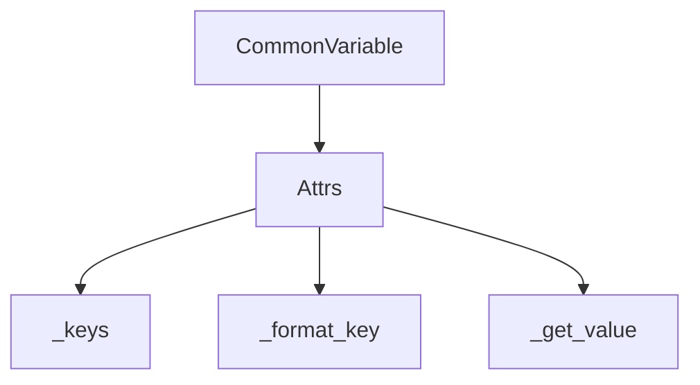

# `variables.py`

## `pysnooper.variables.needs_parentheses` · *function*

*No documentation generated.*

## `pysnooper.variables.BaseVariable` · *class*

*No documentation generated.*

### `pysnooper.variables.BaseVariable.__init__` · *method*

*No documentation generated.*

### `pysnooper.variables.BaseVariable.items` · *method*

## Summary:
Evaluates a stored variable expression in the given frame context and retrieves key-value representations of the variable's state.

## Description:
This method is the primary interface for extracting variable information during debugging sessions in the pysnooper library. It attempts to evaluate the compiled Python expression stored in `self.code` within the provided frame's local and global scope. When evaluation succeeds, it delegates to the subclass-specific `_items` method to generate appropriate key-value pairs representing the variable's state. This method is typically invoked during tracing operations to capture variable values at specific execution points.

## Args:
    frame: Frame object containing execution context where the variable expression should be evaluated
    normalize: bool, optional flag controlling normalization of representation strings (default: False)

## Returns:
    tuple: A tuple of (key, value) pairs representing variable state. Returns empty tuple when evaluation fails due to exception.

## Raises:
    None explicitly raised - all exceptions during evaluation are caught internally and result in empty tuple return

## State Changes:
    Attributes READ: self.code, self.source, self.exclude
    Attributes WRITTEN: None

## Constraints:
    Preconditions: 
    - The frame parameter must be a valid frame object with f_globals and f_locals attributes
    - The self.code must be a valid Python expression that compiles successfully from self.source
    - The expression must be evaluatable in the given frame context
    
    Postconditions:
    - Always returns a tuple (empty or populated with key-value pairs)
    - Does not modify any instance state or external objects

## Side Effects:
    None - performs no I/O operations or external mutations

### `pysnooper.variables.BaseVariable._items` · *method*

*No documentation generated.*

### `pysnooper.variables.BaseVariable._fingerprint` · *method*

## Summary:
Returns a unique fingerprint tuple identifying this variable instance for hashing and equality comparisons.

## Description:
This property generates a fingerprint consisting of the variable's type, source code, and exclusion configuration. It serves as the foundation for implementing `__hash__` and `__eq__` methods in the BaseVariable class, enabling proper object identity comparison and use in hash-based collections.

## Args:
    None

## Returns:
    tuple: A 3-element tuple containing:
        - type(self): The concrete class type of this variable instance
        - self.source: The source code string used to evaluate this variable
        - self.exclude: The exclusion configuration tuple for this variable

## Raises:
    None

## State Changes:
    - Attributes READ: self.source, self.exclude
    - Attributes WRITTEN: None

## Constraints:
    - Preconditions: The BaseVariable instance must be properly initialized with source and exclude attributes
    - Postconditions: The returned tuple uniquely identifies this variable instance for equality and hashing purposes

## Side Effects:
    None

### `pysnooper.variables.BaseVariable.__hash__` · *method*

*No documentation generated.*

### `pysnooper.variables.BaseVariable.__eq__` · *method*

*No documentation generated.*

## `pysnooper.variables.CommonVariable` · *class*

*No documentation generated.*

### `pysnooper.variables.CommonVariable._items` · *method*

*No documentation generated.*

### `pysnooper.variables.CommonVariable._safe_keys` · *method*

*No documentation generated.*

### `pysnooper.variables.CommonVariable._keys` · *method*

*No documentation generated.*

### `pysnooper.variables.CommonVariable._format_key` · *method*

*No documentation generated.*

### `pysnooper.variables.CommonVariable._get_value` · *method*

*No documentation generated.*

## `pysnooper.variables.Attrs` · *class*

## Summary:
Handles variable inspection for objects with attributes by extracting and formatting their __dict__ and __slots__ entries.

## Description:
The Attrs class is a specialized variable handler that provides functionality for inspecting object attributes. It extends CommonVariable to handle objects that store their attributes in either __dict__ or __slots__, making it suitable for introspecting custom objects and built-in types that support these attribute storage mechanisms.

This class is typically used internally by the pysnooper library when analyzing variables that represent objects with attribute structures, allowing for detailed examination of object state during debugging sessions. It enables the inspection of both regular instance attributes (__dict__) and slot-based attributes (__slots__).

## State:
- Inherits all state from CommonVariable parent class
- No additional instance attributes defined beyond the inherited ones

## Lifecycle:
- Creation: Instantiated automatically by pysnooper when encountering objects with attributes during variable inspection
- Usage: Called internally by the variable inspection system when processing objects with __dict__ or __slots__
- Destruction: Managed by Python's garbage collection

## Method Map:


## Raises:
- No explicit exceptions raised by __init__ (inherits from CommonVariable)
- AttributeError: Raised by _get_value when attempting to access non-existent attributes
- TypeError: May be raised by getattr() if main_value is not a valid object

## Example:
```python
# Typically used internally by pysnooper
# When inspecting an object like:
class Person:
    def __init__(self, name, age):
        self.name = name
        self.age = age

person = Person("Alice", 30)
# Attrs._keys(person) would return an iterator over ['name', 'age']
# Attrs._format_key('name') would return '.name'  
# Attrs._get_value(person, 'name') would return 'Alice'
```

### `pysnooper.variables.Attrs._keys` · *method*

*No documentation generated.*

### `pysnooper.variables.Attrs._format_key` · *method*

*No documentation generated.*

### `pysnooper.variables.Attrs._get_value` · *method*

*No documentation generated.*

## `pysnooper.variables.Keys` · *class*

*No documentation generated.*

### `pysnooper.variables.Keys._keys` · *method*

## Summary:
Returns the keys iterator from a dictionary-like object for variable inspection.

## Description:
This method extracts the keys from a dictionary-like object (an object with a `.keys()` method) to enable iteration over its key-value pairs. It is part of the Keys class, which specializes in handling mapping-type variables in the pysnooper library's variable inspection system.

The method is called by `_safe_keys()` in the parent class to enumerate keys for processing, and is specifically designed for objects that support the dictionary interface. It provides a clean abstraction for accessing keys regardless of the specific mapping implementation.

## Args:
    main_value (object): A dictionary-like object that implements the `.keys()` method. This includes standard dicts, collections.OrderedDict, and other mapping types that conform to the collections.abc.Mapping interface.

## Returns:
    collections.abc.KeysView: An iterator-like object containing the keys of the main_value, as returned by `main_value.keys()`. This is typically a dict_keys object in Python 3.

## Raises:
    AttributeError: If main_value does not have a `.keys()` method.

## State Changes:
    Attributes READ: None
    Attributes WRITTEN: None

## Constraints:
    Preconditions: main_value must be an object that implements the `.keys()` method (e.g., dict, collections.OrderedDict, collections.defaultdict, etc.)
    Postconditions: The returned object supports iteration over keys and maintains the same order as the original mapping

## Side Effects:
    None

### `pysnooper.variables.Keys._format_key` · *method*

## Summary:
Formats a dictionary key for display in debug output by wrapping it in square brackets with a shortened representation.

## Description:
This method is part of the Keys class implementation in pysnooper's variable inspection system. It takes a dictionary key and formats it for display in debug output by creating a bracketed representation using the key's shortish representation. This method is called during the visualization of dictionary-like objects in debugging sessions.

## Args:
    key (any): The dictionary key to format for display. Can be any hashable type.

## Returns:
    str: A formatted string representation of the key wrapped in square brackets, e.g., "[key_value]".

## Raises:
    None: This method does not explicitly raise exceptions, though underlying `utils.get_shortish_repr` may raise exceptions that propagate up.

## State Changes:
    Attributes READ: None - this method only reads its input parameter
    Attributes WRITTEN: None - this method does not modify any instance attributes

## Constraints:
    Preconditions: The method expects a valid key that can be processed by `utils.get_shortish_repr()`
    Postconditions: The returned string will always be in the format "[{formatted_key}]"

## Side Effects:
    None: This method performs no I/O operations or external service calls. It only processes the input key and returns a formatted string.

### `pysnooper.variables.Keys._get_value` · *method*

## Summary:
Retrieves a value from a container using the specified key.

## Description:
This method is part of the Keys variable inspection system in pysnooper. It retrieves values from containers (like dictionaries, lists, or other sequence types) using the provided key. The method is called during variable inspection to extract individual values from containers for display purposes.

## Args:
    main_value (Any): The container object (dictionary, list, etc.) from which to retrieve the value
    key (Any): The key used to index into the container

## Returns:
    Any: The value retrieved from the container using the provided key

## Raises:
    KeyError: When the key does not exist in the container
    TypeError: When main_value is not a container type that supports indexing with the provided key

## State Changes:
    Attributes READ: None
    Attributes WRITTEN: None

## Constraints:
    Preconditions: 
    - main_value must support indexing operations (e.g., dict, list, tuple)
    - key must be a valid index/key for the main_value container
    - Both arguments must be of appropriate types for the operation
    
    Postconditions:
    - Returns the value associated with key in main_value
    - Does not modify either main_value or key

## Side Effects:
    None

## `pysnooper.variables.Indices` · *class*

## Summary:
Represents a slice-based indexer for sequence-type variables, enabling creation of new indexed views through slice operations.

## Description:
The `Indices` class is designed to handle indexed access to sequence objects (lists, tuples, etc.) using slice notation. It extends the `Keys` class to provide slice-based indexing capabilities rather than dictionary-style key access. This class is typically used internally by the pysnooper library to track and display indexed elements of sequence variables during debugging sessions.

The class provides a `__getitem__` method that accepts slice objects and returns new `Indices` instances with updated slice specifications. This enables fluent slicing operations where each call creates a new view of the indexed data.

## State:
- `_slice`: slice object representing the current slicing operation; defaults to `slice(None)` which selects all elements
- Inherited attributes from `BaseVariable`: `source` (the variable name expression), `exclude` (excluded keys), and `code` (compiled expression)
- Inherited attributes from `CommonVariable`: various formatting and access methods

## Lifecycle:
- Creation: Instantiated directly or through slice operations via `__getitem__` with slice arguments
- Usage: Typically used internally by pysnooper during variable inspection; users interact by applying slice notation to create new instances
- Destruction: Managed automatically by Python's garbage collection; no explicit cleanup required

## Method Map:
```mermaid
graph TD
    A[Indices.__getitem__(slice)] --> B[assert isinstance(item, slice)]
    B --> C[deepcopy(self)]
    C --> D[result._slice = item]
    D --> E[return result]
    
    A --> F[_keys(main_value)]
    F --> G[range(len(main_value))[self._slice]]
```

## Raises:
- AssertionError: When `__getitem__` is called with a non-slice argument

## Example:
```python
# Create an Indices instance for a sequence variable
indices = Indices('my_list')

# Apply slicing to create a new Indices instance with a sliced view
subset = indices[1:5]  # Returns a new Indices instance with slice(1, 5, None)

# The _keys method would return indices 1, 2, 3, 4 for a list of length >= 5
# This new instance can be further sliced: subset[::2] for every other element
```

### `pysnooper.variables.Indices._keys` · *method*

## Summary:
Returns a sliced range of indices for sequence-type variables, enabling indexed access to elements.

## Description:
This method overrides the parent Keys class implementation to provide index-based key access for sequence-like objects (lists, tuples, etc.). It generates a range of valid indices based on the sequence length and applies the internal slice object to filter which indices should be returned. This enables efficient iteration over subsequences when inspecting variables.

The method is called during the variable inspection process when pysnooper encounters sequence-type variables that need indexed access for display purposes.

## Args:
    main_value (Sequence): A sequence-like object (list, tuple, etc.) whose indices are to be generated

## Returns:
    range: A range object containing indices that correspond to valid positions in the sequence, filtered by the internal slice specification

## Raises:
    None explicitly raised, but may propagate exceptions from len() or range operations

## State Changes:
    Attributes READ: self._slice
    Attributes WRITTEN: None

## Constraints:
    Preconditions:
        - main_value must be a sequence-like object that supports len() operation
        - main_value must support indexing operations
    Postconditions:
        - Returned range contains valid indices for the main_value sequence
        - The slice applied ensures only requested indices are included

## Side Effects:
    None

### `pysnooper.variables.Indices.__getitem__` · *method*

## Summary:
Creates a new Indices instance with a sliced view of the original indices.

## Description:
This method enables slicing operations on Indices objects, allowing users to create a new Indices instance that represents a subset of the original indices using Python's slice notation. It's part of the standard Python sequence protocol implementation.

## Args:
    item (slice): A slice object defining the range of indices to select

## Returns:
    Indices: A new Indices instance with the same properties as self but with the _slice attribute updated to the provided slice

## Raises:
    AssertionError: When the provided item is not a slice object

## State Changes:
    Attributes READ: self._slice
    Attributes WRITTEN: result._slice

## Constraints:
    Preconditions: The item parameter must be a slice object
    Postconditions: The returned Indices instance has identical properties to self except for the _slice attribute which is replaced with the provided slice

## Side Effects:
    None

## `pysnooper.variables.Exploding` · *class*

## Summary:
A variable explorer that dynamically dispatches to appropriate inspection strategies based on the type of the evaluated value.

## Description:
The Exploding class serves as a polymorphic dispatcher that determines the appropriate inspection strategy for a variable based on its runtime type. When a variable is evaluated and its value is inspected, Exploding automatically selects the most suitable subclass (Keys, Indices, or Attrs) to handle the specific data structure type.

This class enables uniform inspection of variables regardless of whether they contain dictionaries, sequences, or arbitrary objects, making it a key component in the variable exploration system.

## State:
- Inherits from BaseVariable which maintains:
  - `source` (str): The source code string used to evaluate the variable
  - `exclude` (tuple): Tuple of keys/attributes to exclude from inspection
  - `code` (compiled): Compiled version of the source for evaluation
  - `unambiguous_source` (str): Source with parentheses added if needed for unambiguity

## Lifecycle:
- Creation: Instantiated with a source string and optional exclude tuple
- Usage: Determines the appropriate variable exploration class based on the data type of the main value and delegates to that class's _items method
- Destruction: No special cleanup required; relies on Python's garbage collection

## Method Map:
```mermaid
graph TD
    A[BaseVariable.items()] --> B[Exploding._items()]
    B --> C{isinstance(main_value, Mapping)?}
    C -->|Yes| D[Keys._items()]
    C -->|No| E{isinstance(main_value, Sequence)?}
    E -->|Yes| F[Indices._items()]
    E -->|No| G[Attrs._items()]
```

## Raises:
- No explicit exceptions raised by _items method itself
- Exceptions may occur during evaluation of source code or during inspection operations in delegated classes

## Example:
```python
# When inspecting a dictionary
exploding_var = Exploding("my_dict")
# _items() dispatches to Keys._items() for dictionary inspection

# When inspecting a list
exploding_var = Exploding("my_list")  
# _items() dispatches to Indices._items() for sequence inspection

# When inspecting an object
exploding_var = Exploding("my_object")
# _items() dispatches to Attrs._items() for attribute inspection
```

### `pysnooper.variables.Exploding._items` · *method*

## Summary:
Determines the appropriate variable exploration class based on the data type of the main value and delegates to that class's _items method.

## Description:
This method acts as a dispatcher that selects the correct variable exploration strategy based on the type of the main_value parameter. It is part of the Exploding class and routes variable inspection to the appropriate specialized handler (Keys for mappings, Indices for sequences, or Attrs for general objects). This design enables type-specific handling of different data structures while maintaining a unified interface for variable exploration.

## Args:
    main_value (Any): The value being inspected, which determines which exploration class will be used
    normalize (bool): Whether to normalize the representation of the values (default: False)

## Returns:
    list[tuple[str, str]]: A list of (key, value) pairs representing the variable's items, where each key is a formatted string and each value is a string representation of the corresponding item

## Raises:
    None explicitly raised - exceptions from delegated methods are propagated

## State Changes:
    Attributes READ: self.source, self.exclude
    Attributes WRITTEN: None

## Constraints:
    Preconditions: main_value must be a valid object that can be processed by the respective exploration classes
    Postconditions: Returns a list of key-value pairs representing the variable's items according to the appropriate exploration strategy

## Side Effects:
    None - this method doesn't perform I/O or mutate external state, though the delegated methods may call eval() internally through the items() method

