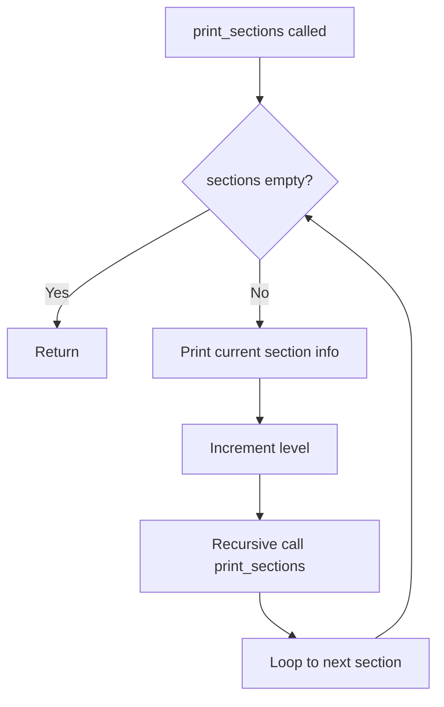
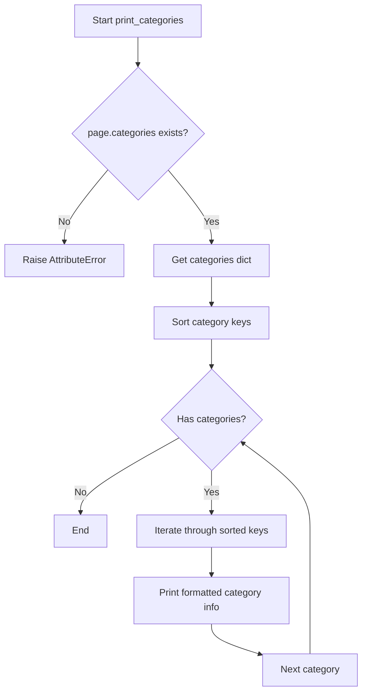
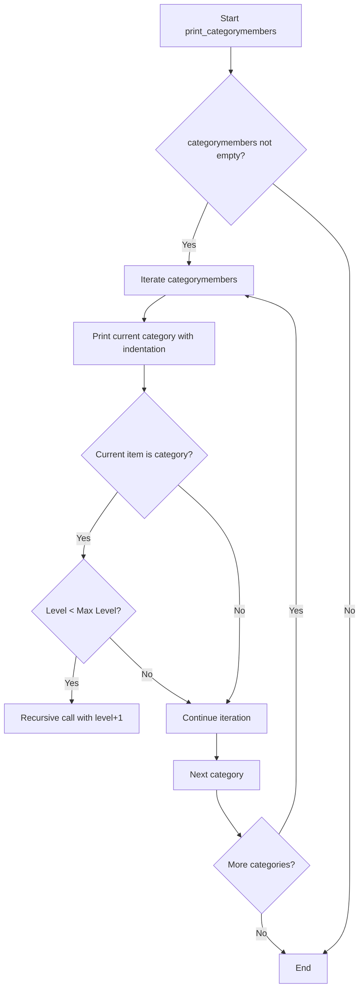

# `example.py`

## `print_sections` · *function*

## Summary:
Recursively prints hierarchical Wikipedia article sections with indentation and title-text information.

## Description:
Recursively prints Wikipedia article sections with increasing indentation levels, displaying section titles and first 40 characters of section text. This function separates presentation logic from data extraction, allowing article processing pipelines to focus on content retrieval while delegating display concerns to this utility function.

## Args:
    sections (list): List of section objects with 'title' and 'text' attributes
    level (int): Current nesting level for indentation calculation, defaults to 0

## Returns:
    None: This function performs I/O operations but returns no value

## Raises:
    AttributeError: If any section object lacks 'title' or 'text' attributes
    TypeError: If sections parameter is not iterable or contains non-section objects

## Constraints:
    Preconditions:
    - sections parameter must be iterable (list-like structure)
    - Each section object must have 'title' and 'text' string attributes
    - level parameter must be a non-negative integer
    
    Postconditions:
    - All sections and their subsections are printed to standard output
    - Function terminates when all sections are processed

## Side Effects:
    - Writes formatted text to standard output (stdout)
    - No external state mutations or I/O beyond console output

## Control Flow:


## Examples:
```python
# Basic usage with Wikipedia sections
sections = wiki_page.sections  # From wikipediaapi
print_sections(sections)

# With custom starting level
print_sections(sections, level=1)
```

## `print_langlinks` · *function*

## Summary:
Prints language links from a Wikipedia page in a formatted manner.

## Description:
This function extracts and displays language links associated with a Wikipedia page, showing the language code, target language name, page title, and full URL for each link. It's designed to provide a readable output of multilingual references for a given Wikipedia article.

## Args:
    page (wikipediaapi.Page): A Wikipedia page object containing language links data.

## Returns:
    None: This function doesn't return any value; it prints output directly to stdout.

## Raises:
    AttributeError: If the page object doesn't have a langlinks attribute, or if langlinks[key] objects don't have language, title, or fullurl attributes.

## Constraints:
    Preconditions:
    - The page parameter must be a valid wikipediaapi.Page object
    - The page object must have a langlinks attribute that behaves like a dictionary
    - Keys in langlinks must be sortable (strings or comparable types)
    - Each langlinks[key] must have language, title, and fullurl attributes
    
    Postconditions:
    - All language links from the page are printed to standard output in alphabetical order by language code

## Side Effects:
    - Prints formatted text to standard output (stdout)
    - No external state mutations or I/O operations beyond printing

## Control Flow:
```mermaid
flowchart TD
    A[Start print_langlinks] --> B[Get page.langlinks]
    B --> C[Sort langlinks keys]
    C --> D{Has entries?}
    D -->|Yes| E[Iterate through sorted keys]
    E --> F[Get langlinks[key]]
    F --> G[Print formatted string]
    G --> H[Next key]
    H --> D
    D -->|No| I[End]
```

## Examples:
    # Assuming a wikipediaapi page object exists
    page = wiki_wiki.page("Python (programming language)")
    print_langlinks(page)
    # Output would be something like:
    # de: Deutsch - Python (Programmiersprache): https://de.wikipedia.org/wiki/Python_(Programmiersprache)
    # es: español - Python: https://es.wikipedia.org/wiki/Python
    # fr: français - Python: https://fr.wikipedia.org/wiki/Python

## `print_links` · *function*

## Summary:
Prints all links from a Wikipedia page in alphabetical order.

## Description:
This function extracts and displays all hyperlinks found on a given Wikipedia page, sorting them alphabetically by title before printing. It serves as a utility for inspecting the internal linking structure of Wikipedia articles.

## Args:
    page: A Wikipedia page object containing a `links` attribute. The page object must have a `links` property that behaves like a dictionary mapping link titles to link targets.

## Returns:
    None: This function does not return any value. It performs I/O operations by printing to standard output.

## Raises:
    AttributeError: If the provided `page` object does not have a `links` attribute.
    TypeError: If `page.links` is not a dictionary-like object with keys() method.

## Constraints:
    Preconditions:
    - The `page` parameter must be a valid Wikipedia page object from the wikipediaapi library
    - The `page.links` attribute must be accessible and iterable
    - The keys of `page.links` must be sortable (support comparison operations)
    
    Postconditions:
    - All links from the page are printed to stdout in alphabetical order
    - The original page object remains unmodified

## Side Effects:
    - Prints formatted output to standard output (stdout)
    - No external state mutations or I/O operations beyond printing

## Control Flow:
```mermaid
flowchart TD
    A[Start print_links] --> B{page.links exists?}
    B -- Yes --> C[Sort links.keys()]
    C --> D[Iterate through sorted titles]
    D --> E[Print "%s: %s" format]
    E --> F[End]
    B -- No --> G[AttributeError]
    G --> H[End]
```

## Examples:
```python
# Basic usage with a Wikipedia page
wiki_wiki = wikipediaapi.Wikipedia('en')
page = wiki_wiki.page("Python (programming language)")
print_links(page)
# Output would be sorted links like:
# Algorithms: https://en.wikipedia.org/wiki/Algorithm
# Array data structure: https://en.wikipedia.org/wiki/Array_data_structure
# ...
```

## `print_categories` · *function*

## Summary:
Prints the categorized titles and their associated metadata from a Wikipedia page in alphabetical order.

## Description:
This function extracts category information from a Wikipedia page object and displays it in a formatted manner. It is designed to be used in Wikipedia data analysis or exploration workflows where category information needs to be displayed to users.

## Args:
    page (wikipediaapi.Page): A Wikipedia page object containing category information. This object must have a `categories` attribute that behaves like a dictionary.

## Returns:
    None: This function does not return any value. It performs I/O operations by printing to standard output.

## Raises:
    AttributeError: If the provided page object does not have a `categories` attribute or if `categories` is not dictionary-like.

## Constraints:
    Preconditions:
    - The `page` parameter must be a valid wikipediaapi.Page object
    - The `page.categories` attribute must be accessible and behave like a dictionary with string keys
    
    Postconditions:
    - All category titles from the page are printed to stdout in alphabetical order
    - The original page object remains unmodified

## Side Effects:
    - Prints formatted output to standard output (stdout)
    - No modifications to the input page object or external state

## Control Flow:


## Examples:
    # Basic usage with a Wikipedia page object
    wiki_wiki = wikipediaapi.Wikipedia('en')
    page = wiki_wiki.page("Python (programming language)")
    print_categories(page)
    # Output would display categories like:
    # Computer programming: Category:Computer programming
    # Programming languages: Category:Programming languages
```

## `print_categorymembers` · *function*

## Summary:
Prints a hierarchical representation of Wikipedia categories with indentation showing nesting levels.

## Description:
This function recursively traverses and displays Wikipedia category hierarchies, showing the relationship between parent and child categories. It prints each category with appropriate indentation based on its nesting level and only recurses into subcategories to avoid infinite loops in deeply nested structures.

## Args:
    categorymembers (dict-like): Dictionary containing Wikipedia category objects with title, namespace, and categorymembers attributes
    level (int): Current nesting level for indentation (default: 0)
    max_level (int): Maximum recursion depth to prevent excessive nesting (default: 2)

## Returns:
    None: This function performs I/O operations and does not return any value

## Raises:
    AttributeError: If categorymembers items don't have required attributes (title, ns, categorymembers)
    RecursionError: If max_level is set too high and category hierarchy is very deep

## Constraints:
    Preconditions:
        - categorymembers must be iterable with .values() method
        - Each item in categorymembers must have title, ns, and categorymembers attributes
        - level and max_level must be non-negative integers
    
    Postconditions:
        - All categories up to max_level will be printed with proper indentation
        - Function terminates when max_level is reached or no more categories exist

## Side Effects:
    - Prints formatted output to standard output (stdout)
    - No external state mutations or I/O operations beyond console output

## Control Flow:


## Examples:
```python
# Basic usage
print_categorymembers(categories_dict)

# With custom depth limit
print_categorymembers(categories_dict, max_level=3)
```

