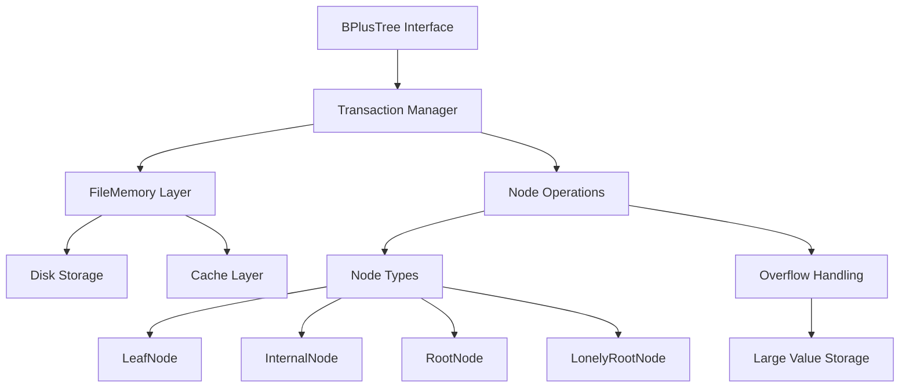

# `bplustree`

## Repository Overview

### Tree Structure
```
bplustree/
└── bplustree/
```

### Purpose
This repository implements a high-performance B+ tree data structure designed for efficient key-value storage and retrieval. It provides a persistent, disk-backed storage solution that maintains sorted order of records and supports range queries, making it ideal for database systems, indexing engines, and applications requiring fast sequential access to ordered data.

The implementation is optimized for modern storage systems with features like write-ahead logging, memory caching, and overflow handling for large values, making it suitable for production environments where data durability and performance are critical.

### Target Users
- Database engine developers needing efficient indexing structures
- Systems engineers building storage solutions
- Application developers requiring persistent key-value stores
- Data processing pipelines requiring ordered data access

### Position in Ecosystem
This is a standalone library that can be integrated into larger systems as a core data structure component. It provides low-level persistence and indexing capabilities that can serve as the foundation for higher-level database or caching systems.

### Architecture


### Entry Points
1. **Importable API**: `from bplustree import BPlusTree`
   - Direct instantiation: `tree = BPlusTree('data.db')`
   - Supports context manager protocol: `with BPlusTree('data.db') as tree: ...`

2. **Configuration Options**:
   - `page_size`: Size of disk pages (default: 4096 bytes)
   - `order`: Maximum number of children per node (default: 100)
   - `key_size`: Size of keys in bytes (default: 8)
   - `value_size`: Size of values in bytes (default: 32)
   - `cache_size`: Number of cached pages (default: 64)
   - `serializer`: Custom serializer for keys/values

### Core Features
1. **Persistent Storage**: Disk-backed B+ tree with WAL (Write-Ahead Logging) support
2. **Range Queries**: Efficient iteration over key ranges using slice notation
3. **Overflow Handling**: Automatic handling of large values that exceed page size
4. **Memory Caching**: Configurable LRU cache for improved performance
5. **Transaction Support**: ACID-compliant read/write transactions with proper locking
6. **Batch Insertion**: Optimized bulk insertion for sorted data
7. **Automatic Splitting**: Self-balancing through automatic node splitting during insertions
8. **Dictionary Interface**: Standard Python dict-like operations (get, set, delete, contains)
9. **Memory-Efficient**: Supports large datasets through page-based storage and overflow chains
10. **Thread-Safe Operations**: Through transaction management and proper locking mechanisms

### Dependencies
- Python 3.7+
- Standard library modules only (no external dependencies)
- Uses `typing` for type hints
- Uses `collections.abc` for abstract base classes
- Uses `contextlib` for context manager support
- Uses `functools.partial` for creating node types with configurations

### Extension Points
1. **Custom Serializers**: Implement `Serializer` interface for custom key/value formats
2. **Node Types**: Extend node classes for specialized behavior
3. **Memory Management**: Override `FileMemory` for custom caching strategies
4. **Storage Backends**: Create alternative implementations of the memory layer

---

## Modules

- [`bplustree`](bplustree.md)

