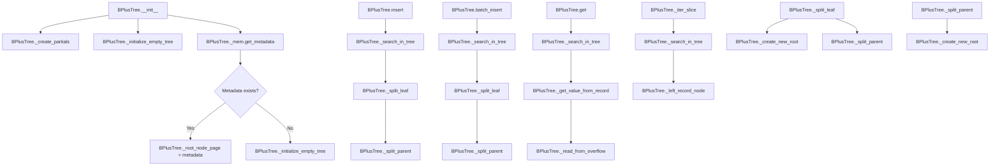

# `tree.py`

## `bplustree.tree.BPlusTree` · *class*

## Summary:
A B+ tree implementation that provides persistent key-value storage with automatic tree balancing and support for large values through overflow pages.

## Description:
The BPlusTree class implements a B+ tree data structure for efficient key-value storage and retrieval. It provides a persistent storage solution that maintains data in a balanced tree structure, enabling fast search, insertion, and deletion operations. The tree automatically handles node splitting during insertions to maintain balance and supports values larger than the configured page size by storing them in overflow pages linked through reference chains.

This class is designed to be used as a persistent key-value store where keys are stored in sorted order and values are stored as bytes. It supports various operations like insertion, retrieval, iteration, and batch insertion while automatically managing tree balancing through node splitting operations.

## State:
- `_filename` (str): Path to the underlying file storage
- `_tree_conf` (TreeConf): Configuration object containing page size, order, key size, value size, and serializer
- `_mem` (FileMemory): Memory manager for file-based storage with caching
- `_root_node_page` (int): Page number of the root node
- `_is_open` (bool): Flag indicating whether the tree is currently open for operations
- `LonelyRootNode`, `RootNode`, `InternalNode`, `LeafNode`, `Record`, `Reference`: Partially applied node and entry classes configured with tree configuration

## Lifecycle:
- Creation: Instantiate with filename and optional configuration parameters. The tree initializes automatically from existing data or creates a new empty tree.
- Usage: Use context manager (`with` statement) or manually call `close()` to properly manage resources. Operations include insert, get, batch_insert, and iteration methods.
- Destruction: Automatically closes file resources when exiting context manager or calling `close()` method.

## Method Map:


## Raises:
- `ValueError`: When attempting to insert a non-bytes value, inserting duplicate keys without replacement, or when batch insertion keys are not properly sorted
- `KeyError`: When trying to access a non-existent key via `__getitem__`
- `ValueError`: When iterating with custom step or backwards slice

## Example:
```python
# Create a new B+ tree
tree = BPlusTree("my_tree.db", page_size=4096, order=100)

# Insert data
tree.insert(1, b"hello")
tree.insert(2, b"world")

# Retrieve data
value = tree.get(1)  # Returns b"hello"
value = tree[2]      # Returns b"world"

# Batch insert
data = [(3, b"data3"), (4, b"data4")]
tree.batch_insert(data)

# Iterate over keys
for key in tree:
    print(key)

# Check existence
if 1 in tree:
    print("Key exists")

# Close the tree
tree.close()
```

### `bplustree.tree.BPlusTree.__init__` · *method*

## Summary:
Initializes a B+ tree instance by setting up configuration parameters, memory management, and loading or creating the tree structure from persistent storage.

## Description:
This constructor method initializes a B+ tree data structure by configuring its parameters, establishing memory management with caching, and either loading existing tree metadata from disk or initializing a new empty tree. The method serves as the entry point for creating or reopening a B+ tree instance, ensuring all internal state is properly configured for subsequent operations.

## Args:
    filename (str): Path to the file where the tree data will be stored.
    page_size (int): Size of each page in bytes. Defaults to 4096.
    order (int): Maximum number of children for internal nodes. Defaults to 100.
    key_size (int): Size of keys in bytes. Defaults to 8.
    value_size (int): Size of values in bytes. Defaults to 32.
    cache_size (int): Number of pages to cache in memory. Defaults to 64.
    serializer (Optional[Serializer]): Serializer for key/value data. Defaults to IntSerializer().

## Returns:
    None: This is a constructor method that initializes the object state.

## Raises:
    ValueError: When metadata cannot be loaded from the file, triggering initialization of an empty tree.

## State Changes:
    Attributes READ: None
    Attributes WRITTEN: _filename, _tree_conf, _mem, _root_node_page, _is_open

## Constraints:
    Preconditions: The filename must be a valid path where the tree data can be stored and accessed.
    Postconditions: The tree instance is fully initialized with configuration, memory management, and either existing tree state or a fresh empty tree.

## Side Effects:
    I/O: File operations to read/write tree metadata and data pages.
    Memory allocation: Cache initialization for managing pages in memory.

### `bplustree.tree.BPlusTree.close` · *method*

## Summary:
Closes the B+ tree by releasing its memory resources and updating its open state flag.

## Description:
This method safely closes the B+ tree by ending any active write transactions, closing the underlying memory manager, and marking the tree as closed. It is designed to be idempotent, meaning it can be called multiple times without adverse effects.

## Args:
    None

## Returns:
    None

## Raises:
    None explicitly raised

## State Changes:
    Attributes READ: self._is_open, self._mem
    Attributes WRITTEN: self._is_open

## Constraints:
    Preconditions: The method can be called regardless of the current open/closed state
    Postconditions: The tree's memory manager is closed and the _is_open flag is set to False

## Side Effects:
    I/O operations: Closes the underlying memory manager which likely involves file I/O operations
    External service calls: None
    Mutations to objects outside self: None

### `bplustree.tree.BPlusTree.__enter__` · *method*

## Summary:
Returns the BPlusTree instance to enable usage in context managers.

## Description:
Implements Python's context manager protocol by returning `self` when entering a `with` statement. This allows BPlusTree instances to be used in context managers, ensuring proper resource cleanup when exiting the context via the `__exit__` method.

## Args:
    None

## Returns:
    BPlusTree: The BPlusTree instance itself, enabling context manager usage.

## Raises:
    None

## State Changes:
    Attributes READ: None
    Attributes WRITTEN: None

## Constraints:
    Preconditions: None
    Postconditions: The method always returns the same instance (`self`) without modifying any state.

## Side Effects:
    None

### `bplustree.tree.BPlusTree.__exit__` · *method*

## Summary:
Closes the B+ tree database connection and releases associated resources when exiting a context manager.

## Description:
This method implements the context manager protocol's `__exit__` magic method, allowing the BPlusTree instance to be used in `with` statements. When the context is exited, this method ensures proper cleanup by closing the underlying file memory and marking the tree as closed.

## Args:
    exc_type (type): Exception type if an exception was raised in the with block, or None if no exception occurred.
    exc_val (Exception): Exception value if an exception was raised in the with block, or None if no exception occurred.
    exc_tb (traceback): Traceback object if an exception was raised in the with block, or None if no exception occurred.

## Returns:
    None: This method does not return any value.

## Raises:
    None: This method does not explicitly raise exceptions, though underlying operations may raise exceptions.

## State Changes:
    Attributes READ: self._is_open, self._mem
    Attributes WRITTEN: self._is_open

## Constraints:
    Preconditions: The BPlusTree instance must be initialized and accessible.
    Postconditions: The underlying file memory is closed and the tree is marked as closed.

## Side Effects:
    I/O operations: Writes to disk via the memory manager's close operation.
    Resource cleanup: Releases file handles and other system resources associated with the tree.

### `bplustree.tree.BPlusTree.checkpoint` · *method*

## Summary:
Performs a checkpoint operation on the underlying memory manager to flush pending writes and optionally reopen the WAL.

## Description:
This method initiates a checkpoint operation on the B+ tree's memory manager, ensuring that all pending write operations are committed to disk. It uses a write transaction context to guarantee atomicity of the checkpoint operation. The method is typically used to synchronize the in-memory state with persistent storage and manage the write-ahead log.

## Args:
    None

## Returns:
    None

## Raises:
    Exception: Propagates any exceptions raised by the underlying FileMemory.perform_checkpoint() method.

## State Changes:
    Attributes READ: self._mem
    Attributes WRITTEN: None

## Constraints:
    Preconditions: The B+ tree must be open (self._is_open = True) and the memory manager must be properly initialized.
    Postconditions: All pending writes are flushed to persistent storage, and the write-ahead log is either reopened or managed according to the reopen_wal parameter.

## Side Effects:
    I/O operations: Writes data to the underlying storage medium through the FileMemory instance.
    External service calls: Calls FileMemory.perform_checkpoint() which likely interacts with the file system and database engine.

### `bplustree.tree.BPlusTree.insert` · *method*

## Summary:
Inserts a key-value pair into the B+ tree, creating a new record or updating an existing one based on the replace flag.

## Description:
This method adds a key-value pair to the B+ tree structure. It first searches for the appropriate leaf node where the key should be inserted. If the key already exists and replace=False, it raises a ValueError. If replace=True or the key doesn't exist, it creates a new record with the provided value. Large values are stored in overflow pages to maintain node size constraints. The method handles splitting leaf nodes when necessary to maintain tree balance.

## Args:
    key (any): The key to insert into the tree
    value (bytes): The value associated with the key, must be a bytes object
    replace (bool): If True, replaces existing values for the same key; if False, raises ValueError for duplicate keys

## Returns:
    None: This method does not return a value

## Raises:
    ValueError: When replace=False and the key already exists in the tree, or when value is not a bytes object

## State Changes:
    Attributes READ: self._mem, self._root_node, self._tree_conf
    Attributes WRITTEN: self._mem (through set_node calls), potentially self._root_node_page if new root is created

## Constraints:
    Preconditions: 
    - Value must be a bytes object
    - Tree must be open (self._is_open = True)
    - Keys must be properly ordered for batch operations (when applicable)
    
    Postconditions:
    - The key-value pair is stored in the tree
    - If replace=True, existing entries are updated
    - Tree maintains its structural properties (balanced B+ tree)
    - Overflow pages are created for large values

## Side Effects:
    - Modifies the underlying storage through write transactions
    - May create new pages in the file memory for overflow records
    - May split leaf nodes to maintain capacity constraints
    - May create new root nodes when splitting the original root

### `bplustree.tree.BPlusTree.batch_insert` · *method*

## Summary:
Inserts multiple key-value pairs into the B+ tree in a single batch operation, maintaining sorted order and handling overflow values.

## Description:
This method performs batch insertion of key-value pairs into the B+ tree structure. It processes the input iterable sequentially, ensuring that keys are inserted in ascending order and are greater than any existing keys in the tree. The method optimizes performance by reusing the same leaf node for consecutive insertions when possible, and automatically handles large values by creating overflow pages. This method is typically called during bulk data loading operations where performance is critical.

## Args:
    iterable (Iterable): An iterable of (key, value) pairs to insert into the tree. Keys must be sortable and values must be bytes objects.

## Returns:
    None: This method does not return a value.

## Raises:
    ValueError: If keys in the iterable are not sorted in ascending order or are less than or equal to existing keys in the tree.

## State Changes:
    Attributes READ: 
        - self._mem (FileMemory): For write transaction management and node operations
        - self._root_node (Node): Root node of the tree for searching
        - self._tree_conf (TreeConf): Configuration for value size limits
    
    Attributes WRITTEN:
        - self._mem: Through set_node operations to persist modified nodes
        - self._root_node_page: Updated when new root is created during splitting

## Constraints:
    Preconditions:
        - The tree must be open and accessible
        - Keys in the iterable must be sorted in ascending order
        - Each key must be greater than all existing keys in the tree
        - Values must be bytes objects
        - All values must be smaller than or equal to the configured value_size limit, or handled via overflow mechanism
    
    Postconditions:
        - All key-value pairs from the iterable are inserted into the tree
        - The tree maintains its B+ tree properties (sorted order, balanced structure)
        - Overflow pages are created for large values as needed
        - The tree structure is updated to accommodate new entries

## Side Effects:
    - Modifies the underlying storage through write transactions
    - May create new pages in the file-based memory system
    - Updates node structures in memory and persists them to disk
    - May split leaf nodes to maintain tree balance

### `bplustree.tree.BPlusTree.get` · *method*

## Summary:
Retrieves the byte value associated with a given key from the B+ tree, returning a default value if the key is not found.

## Description:
This method performs a read operation on the B+ tree to fetch the value stored under the specified key. It traverses the tree structure using the internal search mechanism and handles both regular records and overflow pages for large values. The method is designed to be thread-safe through the use of read transactions.

## Args:
    key (int): The key to search for in the tree
    default (Any, optional): The default value to return if the key is not found. Defaults to None

## Returns:
    bytes: The value associated with the key if found, otherwise the default value

## Raises:
    ValueError: Raised when the key is not found in the tree (caught internally and handled by returning default)

## State Changes:
    Attributes READ: 
    - self._mem (for read_transaction and get_node operations)
    - self._root_node_page (accessed via _root_node property)
    Attributes WRITTEN: None

## Constraints:
    Preconditions:
    - The B+ tree must be open (self._is_open must be True)
    - The key must be compatible with the tree's configured key size
    - The tree must have valid metadata and root node
    
    Postconditions:
    - The method returns either the value bytes or the default value
    - No modifications are made to the tree structure
    - The read transaction is properly managed

## Side Effects:
    - Accesses disk I/O through the FileMemory layer
    - May trigger page reads from storage when traversing the tree
    - Uses read transaction management for consistency

### `bplustree.tree.BPlusTree.__contains__` · *method*

*No documentation generated.*

### `bplustree.tree.BPlusTree.__setitem__` · *method*

## Summary:
Sets a key-value pair in the B+ tree, replacing any existing value for the key.

## Description:
Implements the Python mapping protocol's `__setitem__` method, enabling assignment to tree entries using bracket notation (e.g., `tree[key] = value`). This method internally calls the `insert` method with `replace=True`, ensuring that if a key already exists, its associated value will be overwritten with the new value.

## Args:
    key: The key to set (type depends on tree configuration)
    value: The value to associate with the key (must be bytes object)

## Returns:
    None

## Raises:
    ValueError: If the value parameter is not a bytes object, or if the key already exists and replace=False (though this case is prevented by the replace=True parameter in __setitem__)

## State Changes:
    Attributes READ: None
    Attributes WRITTEN: None

## Constraints:
    Preconditions: The tree must be open and accessible
    Postconditions: The key-value pair is stored in the tree, overwriting any previous value for the same key

## Side Effects:
    I/O operations: Writes to the underlying storage via the memory manager's write transaction
    External service calls: None
    Mutations to objects outside self: The underlying file-based storage is modified through the memory manager

### `bplustree.tree.BPlusTree.__getitem__` · *method*

## Summary:
Retrieves values from the B+ tree by key or slice, raising KeyError for missing keys.

## Description:
Provides dictionary-style access to the B+ tree, supporting both single key lookups and slice-based range queries. When a single key is provided, it returns the associated value or raises KeyError if not found. When a slice is provided, it returns a dictionary mapping keys to values within the specified range.

This method encapsulates the core lookup logic for the B+ tree, separating concerns between single-key and range queries while maintaining consistency with standard Python container protocols.

## Args:
    item (Union[int, slice]): Either a single key (int) or a slice object defining a range of keys

## Returns:
    Union[bytes, dict]: For single keys, returns the associated bytes value; for slices, returns a dictionary mapping keys to values

## Raises:
    KeyError: When attempting to access a single key that does not exist in the tree
    ValueError: When a slice with a custom step is provided, or when slice start >= stop

## State Changes:
    Attributes READ: 
        - self._mem (FileMemory): Used for read transaction management
        - self._root_node (Node): Accessed via property to find leaf nodes
    Attributes WRITTEN: None

## Constraints:
    Preconditions:
        - Tree must be open (self._is_open = True)
        - Read transaction must be available
        - Slice arguments must conform to valid Python slice semantics
    Postconditions:
        - Single key access returns bytes value or raises KeyError
        - Slice access returns dictionary with matching keys and values
        - No modifications to tree state occur

## Side Effects:
    - Acquires read transaction from self._mem
    - Reads from disk/memory pages through self._mem interface
    - May trigger page loading from storage when traversing tree nodes

### `bplustree.tree.BPlusTree.__len__` · *method*

## Summary:
Returns the total number of records stored in the B+ tree by traversing all leaf nodes.

## Description:
This method efficiently computes the total count of records in the B+ tree by following the linked list structure of leaf nodes. It starts from the leftmost leaf node and accumulates the entry counts from each node until reaching the end of the linked list. The method uses a read transaction to ensure consistency during the traversal.

## Args:
    None

## Returns:
    int: The total number of records stored in the tree.

## Raises:
    None explicitly raised

## State Changes:
    Attributes READ: 
    - self._mem: Used for accessing the memory manager and performing node lookups
    - self._left_record_node: Used as the starting point for traversal
    - node.entries: Used to get the count of entries in each node
    - node.next_page: Used to traverse to the next leaf node
    
    Attributes WRITTEN: None

## Constraints:
    Preconditions:
    - The tree must be open (self._is_open must be True)
    - The tree structure must be valid (nodes must be properly linked)
    - All nodes accessed must exist in memory
    
    Postconditions:
    - The method returns an integer representing the total number of records
    - The tree structure remains unchanged
    - No modifications are made to any tree nodes or metadata

## Side Effects:
    - Performs read operations on the underlying file/memory storage through self._mem
    - Uses a read transaction to ensure consistency
    - May trigger disk I/O when retrieving nodes from storage

### `bplustree.tree.BPlusTree.__length_hint__` · *method*

## Summary:
Provides an estimated count of records in the B+ tree for use with iterator length hints.

## Description:
This special Python method (`__length_hint__`) returns a hint about the approximate number of records contained in the B+ tree. It's designed to support Python's iterator protocol and length hinting mechanism, allowing iterators to optimize their behavior when the exact size is not immediately available. The method implements different calculation strategies based on the current root node type to provide an efficient estimate without traversing the entire tree.

When the root node is a `LonelyRootNode`, it returns a simple estimation based on the maximum children capacity. Otherwise, it estimates the total records by calculating the number of leaf nodes (70% of total pages) multiplied by the average number of records per leaf node.

## Args:
    None

## Returns:
    int: An estimated count of records in the tree. This is a hint, not necessarily the exact count, and may vary based on tree structure and page utilization.

## Raises:
    None explicitly raised

## State Changes:
    Attributes READ: 
    - self._mem (FileMemory instance)
    - self._root_node (property accessing the root node)
    - self._mem.last_page (property accessing the last page number)
    - node.max_children (property of the root node)
    - node.min_children (property of the root node)

## Constraints:
    Preconditions:
    - The tree must be open (self._is_open should be True)
    - The memory system must be properly initialized
    - The root node must be accessible
    
    Postconditions:
    - The method returns a non-negative integer representing an estimated count
    - No modifications are made to the tree's state

## Side Effects:
    - Acquires a read transaction from self._mem
    - Reads from memory pages via self._mem.get_node() and self._mem.last_page
    - Does not modify any persistent data

### `bplustree.tree.BPlusTree.__iter__` · *method*

## Summary:
Returns an iterator over all keys in the B+ tree, optionally filtered by a slice range.

## Description:
This method enables iteration over keys stored in the B+ tree in ascending order. It internally uses the `_iter_slice` method to efficiently traverse the tree structure, visiting leaf nodes in order and yielding keys that fall within the specified slice range. When no slice is provided, it iterates over all keys in the tree.

## Args:
    slice_ (Optional[slice], optional): A slice object defining the range of keys to iterate over. Defaults to None, which means iterate over all keys. The slice can specify start and stop bounds but not custom steps.

## Returns:
    Iterator: An iterator yielding the keys from the tree in ascending order.

## Raises:
    ValueError: When a slice with a custom step is provided, or when start is greater than or equal to stop in a slice.

## State Changes:
    Attributes READ: 
        - self._mem (FileMemory instance)
        - self._iter_slice (method)
    Attributes WRITTEN: None

## Constraints:
    Preconditions:
        - The tree must be open (self._is_open must be True)
        - The slice parameters must be valid (no custom step, start < stop when both defined)
    Postconditions:
        - The method returns an iterator that yields keys in ascending order
        - The tree remains unchanged during iteration

## Side Effects:
    - Acquires a read transaction from self._mem to ensure consistency
    - Reads from disk/memory pages through self._mem.get_node() and self._mem.get_page()
    - May perform multiple memory/page reads during iteration

### `bplustree.tree.BPlusTree.items` · *method*

## Summary:
Returns an iterator of (key, value) tuples from the BPlusTree, optionally filtered by a slice range.

## Description:
This method provides a way to iterate over all key-value pairs stored in the BPlusTree. It supports optional slicing to limit the range of items returned, making it useful for partial iteration. The method operates within a read transaction to ensure consistency with concurrent operations.

## Args:
    slice_ (Optional[slice]): A slice object defining the range of keys to iterate over. If None, all items are returned. Defaults to None.

## Returns:
    Iterator[tuple]: An iterator yielding (key, value) tuples where key is the stored key and value is the associated byte string.

## Raises:
    ValueError: When a slice with a custom step is provided, or when start >= stop in a slice.
    StopIteration: When reaching the end of the iteration range.

## State Changes:
    Attributes READ: 
        - self._mem (FileMemory instance)
        - self._root_node_page
    Attributes WRITTEN: None

## Constraints:
    Preconditions:
        - The BPlusTree must be open (self._is_open must be True)
        - The slice parameters must be valid (no custom step, start < stop when both defined)
    Postconditions:
        - Returns an iterator that yields key-value pairs in ascending key order
        - All yielded values are byte strings representing the stored data

## Side Effects:
    - Accesses the underlying storage through self._mem.read_transaction
    - May read from disk pages via self._mem.get_node() and self._mem.get_page()

### `bplustree.tree.BPlusTree.values` · *method*

## Summary:
Returns an iterator over byte values stored in the B+ tree, optionally filtered by a slice range.

## Description:
This method provides a way to iterate over all values stored in the B+ tree or a subset of values within a specified key range. It's part of the standard iteration interface alongside `keys()` and `items()`. The method operates within a read transaction to ensure consistency and thread safety.

## Args:
    slice_ (Optional[slice], optional): A slice object defining the range of keys to iterate over. If None, all values in the tree are returned. Defaults to None.

## Returns:
    Iterator[bytes]: An iterator yielding byte values stored in the tree records.

## Raises:
    ValueError: When a slice with a custom step is provided (slice_.step is not None).
    ValueError: When a slice defines a backward iteration (start >= stop).

## State Changes:
    Attributes READ: 
        - self._mem (FileMemory instance)
        - self._root_node_page
        - self._tree_conf
    
    Attributes WRITTEN: None

## Constraints:
    Preconditions:
        - The B+ tree must be open (self._is_open must be True)
        - The slice parameter must be valid (no custom steps, no backward ranges)
    
    Postconditions:
        - Returns an iterator that yields bytes objects
        - Iterator is safe for concurrent reads due to read transaction

## Side Effects:
    - Acquires a read transaction from self._mem
    - Reads from disk via self._mem.get_node() and self._mem.get_page()
    - May read overflow pages if values exceed inline storage capacity

### `bplustree.tree.BPlusTree.__bool__` · *method*

## Summary:
Returns True if the BPlusTree contains any records, False otherwise.

## Description:
Implements the Python special method `__bool__` to determine the truthiness of the BPlusTree instance. This method checks whether the tree has any stored records by performing a read transaction and attempting to iterate through the tree's contents. The implementation leverages the tree's existing iteration mechanism to efficiently determine emptiness.

## Args:
    None

## Returns:
    bool: True if the tree contains at least one record, False if the tree is empty.

## Raises:
    None explicitly raised

## State Changes:
    Attributes READ: 
    - self._mem: Used to access the memory manager and its read transaction context
    - self: Used to iterate through the tree's contents via __iter__ method

    Attributes WRITTEN: None

## Constraints:
    Preconditions:
    - The tree must be open (self._is_open should be True)
    - The underlying memory manager must be properly initialized
    
    Postconditions:
    - The method does not modify the tree's state
    - The read transaction is properly managed

## Side Effects:
    - Acquires a read transaction from the memory manager
    - Iterates through the tree's records (which may involve disk I/O)
    - May trigger lazy loading of nodes from disk during iteration

### `bplustree.tree.BPlusTree.__repr__` · *method*

## Summary:
Returns a string representation of the BPlusTree object showing its filename and configuration.

## Description:
This method provides a concise textual representation of a BPlusTree instance, displaying the tree's filename and configuration details. It's intended for debugging and development purposes to quickly identify tree instances.

## Args:
    None

## Returns:
    str: A formatted string in the pattern '&lt;BPlusTree: {filename} {tree_conf}&gt;'

## Raises:
    None

## State Changes:
    Attributes READ: _filename, _tree_conf
    Attributes WRITTEN: None

## Constraints:
    Preconditions: The BPlusTree instance must have _filename and _tree_conf attributes initialized
    Postconditions: The method returns a string representation without modifying the tree state

## Side Effects:
    None

### `bplustree.tree.BPlusTree._initialize_empty_tree` · *method*

## Summary:
Initializes an empty B+ tree by setting up the root node as a lonely root node and storing initial metadata.

## Description:
This method is responsible for initializing an empty B+ tree structure when no existing metadata is found during tree creation. It creates a new lonely root node at the next available memory page and stores the tree's metadata, effectively establishing the foundation for a new empty tree.

## Args:
    None

## Returns:
    None

## Raises:
    None explicitly raised

## State Changes:
    Attributes READ: 
    - self._mem.next_available_page
    - self._tree_conf
    
    Attributes WRITTEN:
    - self._root_node_page

## Constraints:
    Preconditions:
    - The tree must be in an uninitialized state (no existing metadata)
    - The memory manager must be available and ready for writing
    
    Postconditions:
    - self._root_node_page is set to the page number of the newly created lonely root node
    - A lonely root node is stored in memory at the assigned page
    - Metadata containing the root page and tree configuration is written to memory

## Side Effects:
    - Writes to memory through self._mem.write_transaction
    - Creates a new node in memory
    - Sets metadata in memory

### `bplustree.tree.BPlusTree._create_partials` · *method*

## Summary:
Creates partial function factories for node and entry classes bound with the tree configuration.

## Description:
This method initializes partial functions for various node and entry classes, pre-binding the tree configuration to each class constructor. This allows these classes to be instantiated later without needing to repeatedly pass the tree configuration parameter. The method is called during BPlusTree initialization to set up convenient factory methods for creating different types of nodes and entries.

## Args:
    None

## Returns:
    None

## Raises:
    None

## State Changes:
    Attributes READ: self._tree_conf
    Attributes WRITTEN: self.LonelyRootNode, self.RootNode, self.InternalNode, self.LeafNode, self.Record, self.Reference

## Constraints:
    Preconditions: The BPlusTree instance must have a valid _tree_conf attribute
    Postconditions: All six partial functions (LonelyRootNode, RootNode, InternalNode, LeafNode, Record, Reference) are set as instance attributes

## Side Effects:
    None

### `bplustree.tree.BPlusTree._root_node` · *method*

## Summary:
Returns the root node of the B+ tree, which is either a LonelyRootNode or RootNode.

## Description:
This property provides access to the root node of the B+ tree by retrieving it from memory using the stored root node page number. It serves as a central access point for tree operations and is used extensively throughout the B+ tree implementation.

The property is designed as a cached accessor to avoid repeated memory lookups and ensures type safety by asserting that the returned node is either a LonelyRootNode or RootNode.

## Args:
    None

## Returns:
    Union['LonelyRootNode', 'RootNode']: The root node of the B+ tree, which can be either a LonelyRootNode (when the tree has only one node) or a RootNode (when the tree has grown beyond a single node).

## Raises:
    AssertionError: If the node retrieved from memory is not an instance of either LonelyRootNode or RootNode.

## State Changes:
    Attributes READ: 
        - self._mem: Memory manager used to retrieve nodes
        - self._root_node_page: Page number of the root node in memory
    
    Attributes WRITTEN: None

## Constraints:
    Preconditions:
        - The B+ tree must be initialized and opened
        - The root node page number must be valid
        - The memory manager must be properly initialized
    
    Postconditions:
        - Returns a valid root node of the correct type
        - The returned node is cached in memory and can be modified

## Side Effects:
    None

### `bplustree.tree.BPlusTree._left_record_node` · *method*

## Summary:
Returns the leftmost leaf node or lonely root node in the B+ tree by traversing from the root node through smallest_entry.before references.

## Description:
This method performs a leftward traversal of the B+ tree structure starting from the root node, following the smallest entry's before reference until it reaches either a LeafNode or LonelyRootNode. This is commonly used to find the first record in the tree for iteration purposes.

The traversal logic is essential for implementing tree iteration and maintaining ordered access to records. This method is separated from inline logic to provide a clean abstraction for accessing the leftmost record location in the tree structure.

## Args:
    None

## Returns:
    Union['LonelyRootNode', 'LeafNode']: The leftmost node in the tree, which will be either a LeafNode containing records or a LonelyRootNode that serves as the root when the tree has only one node.

## Raises:
    None explicitly raised

## State Changes:
    Attributes READ: 
    - self._root_node (via property)
    - self._mem (FileMemory instance)
    
    Attributes WRITTEN: 
    - None

## Constraints:
    Preconditions:
    - The tree must be properly initialized and opened
    - The root node must be accessible via self._root_node property
    - All nodes in the traversal path must exist in memory
    
    Postconditions:
    - Returns either a LeafNode or LonelyRootNode instance
    - The returned node is guaranteed to be the leftmost node in the tree structure

## Side Effects:
    - Reads from disk/memory through self._mem.get_node() calls
    - May cause page faults or memory allocation if nodes are not cached

### `bplustree.tree.BPlusTree._iter_slice` · *method*

*No documentation generated.*

### `bplustree.tree.BPlusTree._search_in_tree` · *method*

*No documentation generated.*

### `bplustree.tree.BPlusTree._split_leaf` · *method*

*No documentation generated.*

### `bplustree.tree.BPlusTree._split_parent` · *method*

*No documentation generated.*

### `bplustree.tree.BPlusTree._create_new_root` · *method*

*No documentation generated.*

### `bplustree.tree.BPlusTree._create_overflow` · *method*

*No documentation generated.*

### `bplustree.tree.BPlusTree._read_from_overflow` · *method*

*No documentation generated.*

### `bplustree.tree.BPlusTree._get_value_from_record` · *method*

*No documentation generated.*

