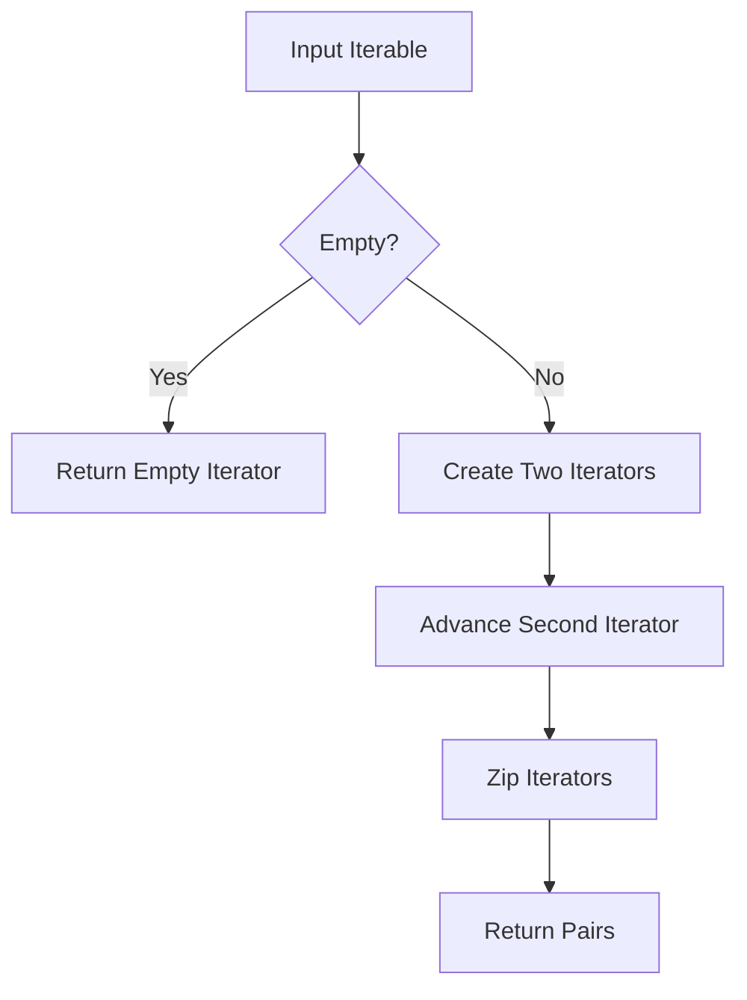

# `utils.py`

## `bplustree.utils.pairwise` · *function*

## Summary:
Creates pairs of consecutive elements from an iterable.

## Description:
Generates tuples containing pairs of adjacent elements from the input iterable. This utility function is commonly used to implement sliding window operations or to process sequential data in pairs.

## Args:
    iterable (Iterable): An iterable object containing elements to be paired consecutively.

## Returns:
    zip: An iterator of tuples, where each tuple contains two consecutive elements from the input iterable. The length of the returned iterator is one less than the input iterable's length.

## Raises:
    None: This function does not raise any exceptions under normal circumstances.

## Constraints:
    Preconditions:
        - Input must be an iterable object
        - Empty iterables will produce empty results
        - Single-element iterables will produce empty results
    
    Postconditions:
        - Output iterator will contain n-1 tuples for an input with n elements
        - Each tuple will contain exactly two elements (except possibly in edge cases)

## Side Effects:
    None: This function has no side effects and is pure.

## Control Flow:


## Examples:
```python
# Basic usage
list(pairwise([1, 2, 3, 4]))  # [(1, 2), (2, 3), (3, 4)]

# Empty iterable
list(pairwise([]))  # []

# Single element
list(pairwise([1]))  # []

# String input
list(pairwise("abc"))  # [('a', 'b'), ('b', 'c')]
```

## `bplustree.utils.iter_slice` · *function*

## Summary:
Splits a bytes iterable into fixed-size chunks and indicates which chunk is the final one.

## Description:
This function divides a bytes object into sequential chunks of a specified size, yielding each chunk along with a boolean flag that is True when the chunk is the last one in the sequence. It's designed to process large binary data efficiently by breaking it into manageable pieces.

## Args:
    iterable (bytes): The bytes object to be split into chunks
    n (int): The size of each chunk in bytes

## Returns:
    Generator[tuple[bytes, bool]]: A generator that yields tuples containing:
        - bytes: A slice of the original iterable of size n (or less for the final chunk)
        - bool: True if this is the last chunk, False otherwise

## Raises:
    None explicitly raised

## Constraints:
    Preconditions:
        - iterable must be a bytes object
        - n must be a positive integer
    Postconditions:
        - All elements of the original iterable are yielded exactly once
        - The final chunk may be smaller than n if the length of iterable is not divisible by n

## Side Effects:
    None

## Control Flow:
```mermaid
flowchart TD
    A[Start] --> B{start >= final_offset?}
    B -- Yes --> C[Break loop]
    B -- No --> D[Slice iterable[start:stop]]
    D --> E[Update start = stop]
    E --> F[Update stop = start + n]
    F --> G[Yield (rv, start >= final_offset)]
    G --> B
```

## Examples:
```python
# Basic usage
data = b"hello world this is a test"
for chunk, is_last in iter_slice(data, 5):
    print(f"Chunk: {chunk}, Is Last: {is_last}")

# Output:
# Chunk: b'hello', Is Last: False
# Chunk: b' worl', Is Last: False
# Chunk: b'd thi', Is Last: False
# Chunk: b' is a', Is Last: False
# Chunk: b' tes', Is Last: False
# Chunk: b't', Is Last: True
```

