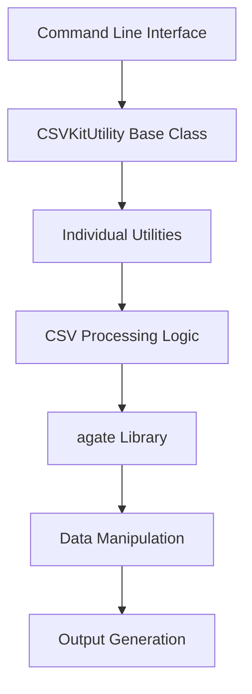

# `csvkit`

## Repository Overview

### Tree
```
csvkit/
└── csvkit/
    ├── __init__.py
    ├── utilities/
    │   ├── __init__.py
    │   ├── csvgrep.py
    │   ├── csvjoin.py
    │   ├── csvjson.py
    │   ├── csvlook.py
    │   ├── csvpy.py
    │   ├── csvsort.py
    │   ├── csvsql.py
    │   ├── csvstack.py
    │   ├── csvstat.py
    │   ├── in2csv.py
    │   └── sql2csv.py
    └── __main__.py
```

### Purpose
csvkit is a suite of command-line utilities designed to facilitate working with CSV (Comma-Separated Values) files. It provides powerful tools for filtering, joining, converting, sorting, and analyzing CSV data from the terminal. The system addresses the need for efficient CSV manipulation without requiring complex programming or GUI applications.

### Target Users
- Data analysts and scientists who work with CSV datasets
- Developers who need command-line tools for CSV processing
- System administrators managing tabular data
- Anyone needing quick CSV transformations and analysis

### Position in Ecosystem
csvkit serves as a standalone command-line toolset that integrates well with Unix/Linux pipelines and shell scripting. It acts as a bridge between simple text processing tools and more complex data analysis frameworks, providing a lightweight alternative to spreadsheet applications for CSV manipulation.

### Architecture


The system follows a pipeline architecture where each utility processes CSV data through a standardized interface built on top of the agate library for robust data handling.

### Entry Points
1. **CLI Commands**: `csvgrep`, `csvjoin`, `csvjson`, `csvlook`, `csvpy`, `csvsort`, `csvsql`, `csvstack`, `csvstat`, `in2csv`, `sql2csv`
   - Target audience: Command-line users, automation scripts
   - Required arguments: Varies by utility, typically input file paths or stdin

2. **Importable APIs**: Direct imports from `csvkit.utilities.*`
   - Target audience: Developers integrating CSV processing into applications
   - Usage: `from csvkit.utilities.csvgrep import CSVGrep`

### Core Features
1. **Filtering**: Search CSV data using patterns, regex, or file matching (csvgrep)
2. **Joining**: Perform SQL-like joins on multiple CSV files (csvjoin)
3. **Conversion**: Convert CSV to JSON, GeoJSON, or other formats (csvjson)
4. **Visualization**: Render CSV data as formatted tables in console (csvlook)
5. **Interactive Analysis**: Load CSV into Python shell for exploration (csvpy)
6. **Sorting**: Sort CSV data by column values (csvsort)
7. **Database Integration**: Generate SQL or execute queries on CSV data (csvsql)
8. **Stacking**: Combine multiple CSV files vertically (csvstack)
9. **Statistics**: Calculate descriptive statistics for CSV columns (csvstat)
10. **Format Conversion**: Convert between various tabular formats (in2csv)
11. **SQL Execution**: Execute SQL queries on databases and output results as CSV (sql2csv)

### Dependencies
- **agate**: Core data processing library for CSV manipulation
- **SQLAlchemy**: Database connectivity for csvsql functionality
- **openpyxl**: Excel file support for in2csv and csvsql
- **xlrd**: Legacy Excel (.xls) support for in2csv
- **json**: Standard library for JSON processing
- **argparse**: Standard library for command-line argument parsing

### Configuration
Configuration is primarily handled through command-line arguments for each utility. Some utilities support:
- Input/output file paths
- Encoding specifications
- Format-specific options
- Database connection strings
- Column selection parameters

### Extension Points
1. **Plugin Architecture**: New utilities can inherit from CSVKitUtility
2. **Custom Processing**: Extend existing utilities by subclassing
3. **Argument Parsing**: Add custom command-line options
4. **Output Formats**: Implement new output handlers

---

## Modules

- [`csvkit`](csvkit.md)
- [`csvkit/convert`](csvkit/convert.md)
- [`csvkit/utilities`](csvkit/utilities.md)

