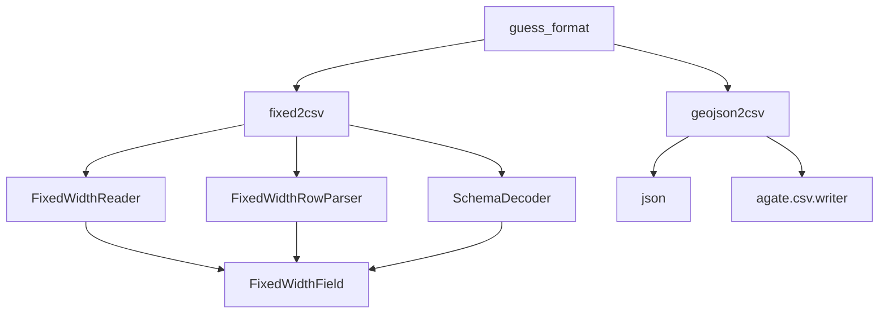

# `csvkit.convert`

## Tree:
convert/
├── __init__.py
├── fixed.py
└── geojs.py

## Role:
Provides format conversion utilities for transforming data between fixed-width text, CSV, and GeoJSON formats.

## Description:
This module encapsulates the core functionality for converting between various data interchange formats, particularly focusing on fixed-width formatted text files and GeoJSON data. It serves as a foundational component for data processing pipelines that require format transformations.

The module is primarily consumed by the csvkit command-line tools and other data processing components that need to transform data from one format to another. The cohesive principle behind this module is the shared responsibility of format conversion and data transformation operations.

## Components:
*   `guess_format(filename)` - Determines file format based on extension
*   `FixedWidthReader(f, schema, encoding=None)` - Iterator for reading fixed-width formatted files
*   `FixedWidthRowParser(schema)` - Parses individual rows from fixed-width files according to a schema
*   `SchemaDecoder(header)` - Decodes schema definitions for fixed-width parsing
*   `fixed2csv(f, schema, output=None, skip_lines=0, **kwargs)` - Converts fixed-width files to CSV format
*   `geojson2csv(f, key=None, **kwargs)` - Converts GeoJSON files to CSV format

## Public API:
*   `guess_format(filename)` - Guesses file format from extension. Returns format string or None.
*   `fixed2csv(f, schema, output=None, skip_lines=0, **kwargs)` - Converts fixed-width file to CSV. Takes file handle, schema, optional output stream, and skip lines count.
*   `geojson2csv(f, key=None, **kwargs)` - Converts GeoJSON file to CSV. Takes file handle and optional key parameter.

## Dependencies:
*   Internal: `agate.csv` - For CSV writing operations
*   Internal: `iterdecode` - For character encoding handling
*   External: `json` - For JSON parsing operations
*   External: `collections.OrderedDict` - For maintaining key order in JSON objects
*   External: `StringIO` - For in-memory string handling

## Constraints:
*   The `fixed2csv` function expects a properly formatted schema file for fixed-width parsing
*   The `geojson2csv` function requires valid GeoJSON FeatureCollection format
*   All functions assume proper file handles are provided
*   Thread safety is not guaranteed for these utility functions

---

## Files

- [`__init__.py`](convert/__init__.md)
- [`fixed.py`](convert/fixed.md)
- [`geojs.py`](convert/geojs.md)

