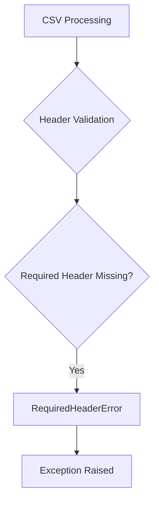

# `exceptions.py`

## `csvkit.exceptions.CustomException` · *class*

*No documentation generated.*

### `csvkit.exceptions.CustomException.__init__` · *method*

*No documentation generated.*

### `csvkit.exceptions.CustomException.__unicode__` · *method*

## Summary:
Returns the exception message string representation for Unicode contexts.

## Description:
This method provides the Unicode string representation of the custom exception. It is part of the CustomException class that extends Python's built-in Exception class. The method returns the message stored in the instance's `msg` attribute, making it compatible with Python 2's Unicode handling while maintaining consistency with Python 3's string representation.

## Args:
    None

## Returns:
    str: The exception message stored in `self.msg`

## Raises:
    None

## State Changes:
    Attributes READ: self.msg
    Attributes WRITTEN: None

## Constraints:
    Preconditions: The instance must have been initialized with a message via `__init__`
    Postconditions: The returned value is identical to the message originally provided to the constructor

## Side Effects:
    None

### `csvkit.exceptions.CustomException.__str__` · *method*

*No documentation generated.*

## `csvkit.exceptions.ColumnIdentifierError` · *class*

*No documentation generated.*

## `csvkit.exceptions.CSVTestException` · *class*

*No documentation generated.*

### `csvkit.exceptions.CSVTestException.__init__` · *method*

*No documentation generated.*

## `csvkit.exceptions.LengthMismatchError` · *class*

*No documentation generated.*

### `csvkit.exceptions.LengthMismatchError.__init__` · *method*

*No documentation generated.*

### `csvkit.exceptions.LengthMismatchError.length` · *method*

## Summary:
Returns the number of columns in the CSV row that caused the length mismatch error.

## Description:
This property provides convenient access to the column count of the problematic CSV row. It is used primarily for error reporting and debugging purposes to understand the extent of the column mismatch. The property accesses the row attribute that was stored during initialization of the LengthMismatchError.

## Args:
    None

## Returns:
    int: The number of columns (elements) in the CSV row that triggered this error.

## Raises:
    None

## State Changes:
    Attributes READ: self.row
    Attributes WRITTEN: None

## Constraints:
    Preconditions: The instance must have been initialized with a valid row parameter
    Postconditions: The returned value is always a non-negative integer representing the row length

## Side Effects:
    None

## `csvkit.exceptions.InvalidValueForTypeException` · *class*

## Summary:
Represents an exception thrown when a value cannot be converted to a specified data type at a given index.

## Description:
This exception is raised when csvkit encounters a value that cannot be converted to the expected data type during processing. It provides detailed information about the problematic value, the target type, and its position in the data stream. The exception serves as a clear indicator of data type conversion failures in CSV processing operations.

## State:
- index (int): The zero-based position in the data where the conversion failed
- value (str): The string representation of the value that could not be converted
- normal_type (str): The target data type that the value was expected to convert to

## Lifecycle:
- Creation: Instantiate with index, value, and normal_type parameters
- Usage: Raise during CSV data processing when type conversion fails
- Destruction: Automatically cleaned up by Python's exception handling mechanism

## Method Map:
```mermaid
graph TD
    A[InvalidValueForTypeException.__init__] --> B[Sets index, value, normal_type]
    A --> C[Constructs error message]
    A --> D[Calls super().__init__(msg)]
```

## Raises:
- None explicitly raised by __init__, but inherits behavior from CustomException

## Example:
```python
try:
    # Attempt to convert a non-numeric string to integer
    raise InvalidValueForTypeException(5, "not_a_number", "int")
except InvalidValueForTypeException as e:
    print(f"Error at index {e.index}: {e.value} cannot be converted to {e.normal_type}")
    # Output: Error at index 5: not_a_number cannot be converted to int
```

### `csvkit.exceptions.InvalidValueForTypeException.__init__` · *method*

*No documentation generated.*

## `csvkit.exceptions.RequiredHeaderError` · *class*

## Summary:
Represents an exception raised when a required header field is missing from input data.

## Description:
The RequiredHeaderError exception is thrown when processing CSV or tabular data that requires specific header fields, but those fields are not present in the input. This exception serves as a clear indicator that data validation has failed due to missing essential column names.

## State:
- Inherits from CustomException which contains a message string
- No additional instance attributes beyond what's inherited from CustomException
- The exception message should clearly indicate which header is missing

## Lifecycle:
- Creation: Instantiated with an appropriate error message indicating the missing header
- Usage: Raised during CSV processing when header validation fails
- Destruction: Standard Python exception cleanup occurs

## Method Map:


## Raises:
- Raised during CSV parsing/validation when a required header field is not found
- Triggered by data validation logic that expects specific column names

## Example:
```python
# When processing CSV data that requires a 'name' column
try:
    process_csv_file('data.csv')
except RequiredHeaderError as e:
    print(f"Missing required header: {e}")
    # Output: Missing required header: Column 'name' is required but not found
```

