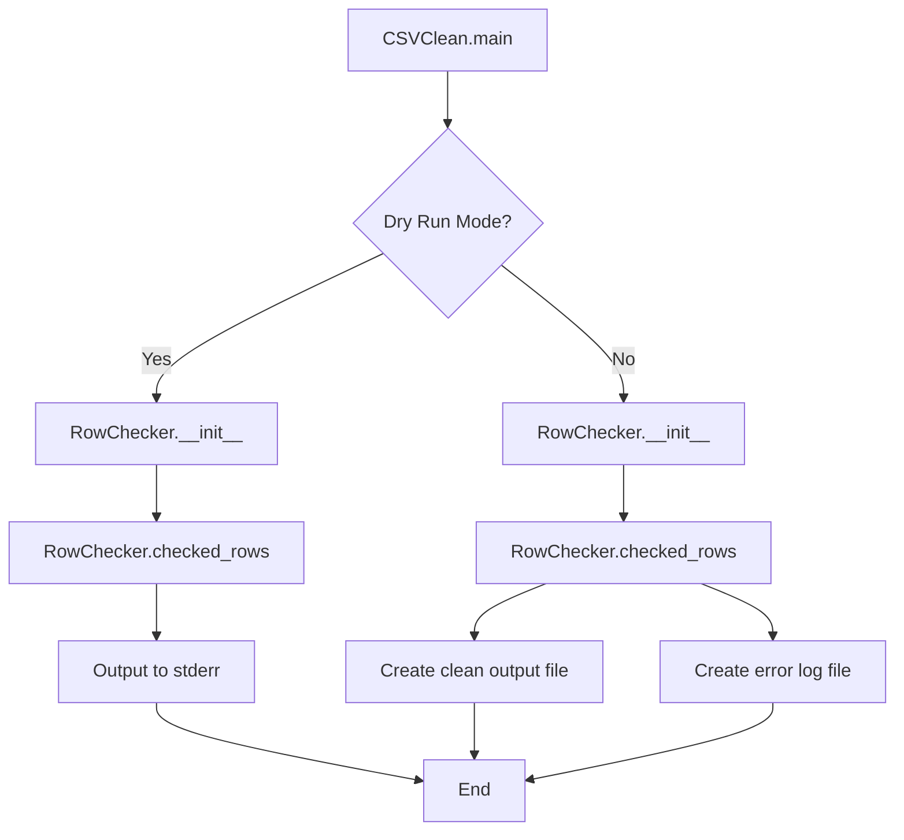

# `csvclean.py`

## `csvkit.utilities.csvclean.CSVClean` · *class*

## Summary:
CSVClean is a command-line utility that fixes common formatting errors in CSV files, including handling malformed rows and reporting issues.

## Description:
CSVClean is designed to process CSV files and correct common formatting problems such as inconsistent row lengths, missing fields, and internal line breaks that cause parsing issues. It operates in two modes: dry-run mode for inspection without creating output files, or normal mode for actually cleaning and producing corrected CSV files. The utility inherits from CSVKitUtility for command-line argument parsing and file handling functionality.

## State:
- `args`: Command-line arguments parsed by the parent CSVKitUtility class
- `output_file`: Output stream for writing results (defaults to stdout)
- `reader_kwargs`: Keyword arguments for CSV reader configuration
- `writer_kwargs`: Keyword arguments for CSV writer configuration
- `input_file`: Input file handle for reading the source CSV
- `dryrun`: Boolean flag indicating whether to perform a dry run (default False)
- `column_names`: Column names extracted from the CSV header row
- `errors`: List of RowChecker error objects found during processing
- `rows_joined`: Count of rows that were joined due to line break issues
- `joins`: Count of join operations performed to fix row issues

## Lifecycle:
- Creation: Instantiated automatically by the csvkit command-line framework when invoked with appropriate arguments
- Usage: Called via the `main()` method which processes input CSV data and either reports errors or creates cleaned output files
- Destruction: Managed by the parent CSVKitUtility framework which handles file closing and resource cleanup

## Method Map:


## Raises:
- `LengthMismatchError`: Raised when CSV rows have inconsistent column counts
- `CSVTestException`: Raised when CSV parsing encounters validation errors
- `StopIteration`: Raised when attempting to read from empty CSV files
- Various exceptions from underlying file I/O operations

## Example:
```python
# Dry run mode - inspect potential issues without creating files
csvclean -n input.csv

# Normal mode - create cleaned output files
csvclean input.csv

# With custom delimiter
csvclean -d ';' input.csv

# With custom encoding
csvclean -e latin1 input.csv
```

### `csvkit.utilities.csvclean.CSVClean.add_arguments` · *method*

*No documentation generated.*

### `csvkit.utilities.csvclean.CSVClean.main` · *method*

## Summary:
Validates CSV data for structural integrity and optionally cleans it by writing processed output and error logs.

## Description:
This method implements the core CSV validation and cleaning logic for the csvclean utility. It processes CSV data through a RowChecker to detect structural issues such as length mismatches, and either reports these issues in dry-run mode or actually cleans the data by writing validated rows to an output file and error information to a separate error file. The method handles both file input and stdin input appropriately.

## Args:
    self: The CSVClean instance containing configuration and state

## Returns:
    None: This method operates through side effects on file I/O and stdout

## Raises:
    None explicitly raised: The method delegates error handling to the underlying RowChecker and CSV processing libraries

## State Changes:
    Attributes READ:
        - self.args.dryrun: Controls whether to perform actual processing or just validation
        - self.input_file: Source of CSV data (can be stdin or file)
        - self.output_file: Destination for status messages and error summaries
        - self.reader_kwargs: Configuration for CSV reader
        - self.writer_kwargs: Configuration for CSV writer
        - self.additional_input_expected(): Checks if stdin is expected but not provided
        - self.skip_lines(): Skips initial lines from input file
    
    Attributes WRITTEN:
        - None directly modified: Output is written to files and stdout

## Constraints:
    Preconditions:
        - Input data must be available (either from file or stdin)
        - CSV reader/writer configurations must be properly initialized
        - Output directory must be writable
        - When using stdin, special handling is applied due to filename restrictions
        
    Postconditions:
        - Error information is written to stdout or error files
        - Cleaned CSV data is written to output file when not in dryrun mode
        - Error log file is created when errors are detected
        - Status messages are written to output file indicating processing results

## Side Effects:
    - Writes to stdout: Status messages about processing results, error counts, and row joining statistics
    - Creates files: Output CSV file with "_out.csv" suffix and error CSV file with "_err.csv" suffix
    - Reads from stdin or input file: Processes CSV data stream
    - May write to stderr: Warning message when waiting for standard input (when no input file is provided)

### `csvkit.utilities.csvclean.CSVClean._format_error_row` · *method*

*No documentation generated.*

## `csvkit.utilities.csvclean.launch_new_instance` · *function*

*No documentation generated.*

