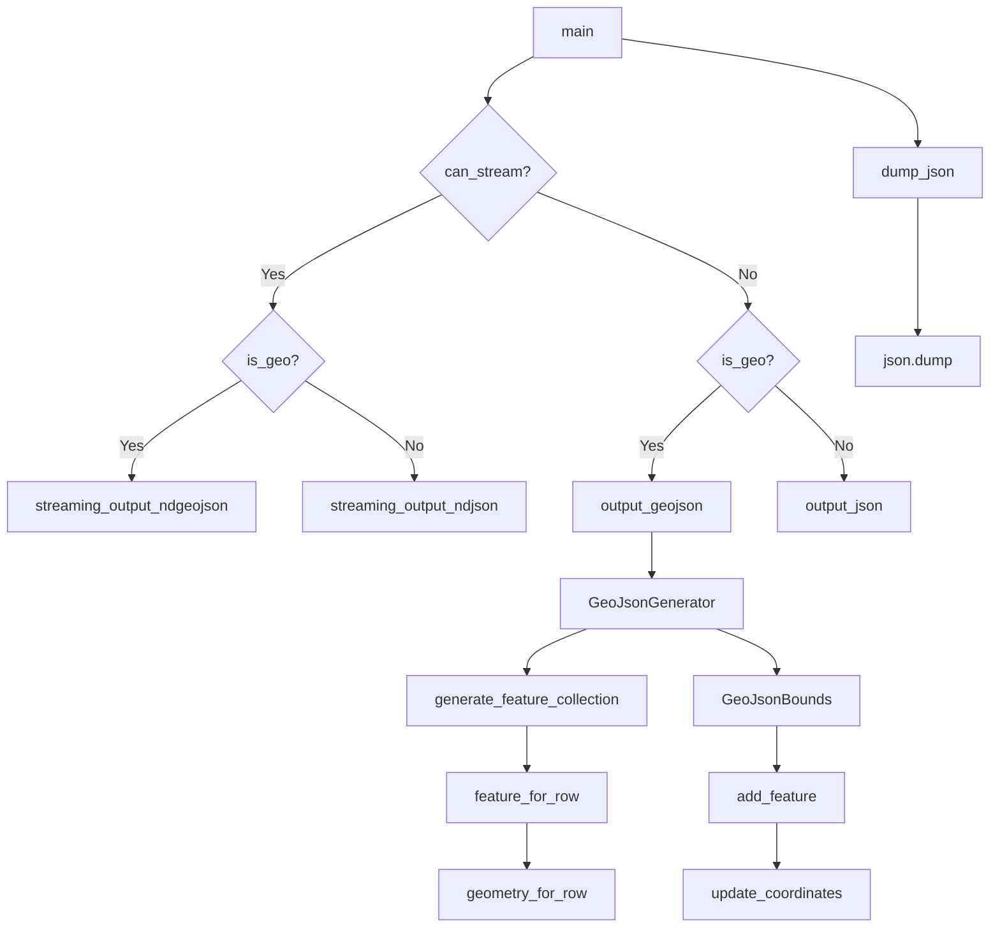

# `csvjson.py`

## `csvkit.utilities.csvjson.CSVJSON` · *class*

## Summary:
Converts CSV files into JSON or GeoJSON format with support for various formatting options and geographic data handling.

## Description:
The CSVJSON class is a command-line utility that transforms CSV data into JSON or GeoJSON representations. It supports standard JSON output with optional indentation, key-based object output, and streaming modes. When geographic coordinates are provided via --lat and --lon flags, it generates GeoJSON output including Point geometries, bounding boxes, and coordinate reference systems.

This class is designed to be instantiated by the csvkit command-line framework and handles all conversion logic internally through its main() method and supporting helper methods.

## State:
- `args`: Parsed command-line arguments from argparse
- `json_kwargs`: Dictionary containing JSON formatting parameters (indentation)
- `input_file`: File handle for input CSV data (stdin or file)
- `output_file`: File handle for output JSON data (stdout or file)
- `reader_kwargs`: CSV reader configuration parameters
- `writer_kwargs`: CSV writer configuration parameters

## Lifecycle:
- Creation: Instantiated automatically by csvkit CLI framework with parsed arguments
- Usage: Called via the `run()` method inherited from CSVKitUtility, which invokes `main()`
- Destruction: Managed by Python garbage collection after execution completes

## Method Map:


## Raises:
- `argparse.ArgumentTypeError`: Raised when command-line arguments don't meet validation requirements
- `SystemExit`: Raised by `argparser.error()` when validation fails
- `ValueError`: Raised during coordinate conversion when lat/lon values are invalid
- `json.JSONEncodeError`: Raised during JSON serialization if data cannot be serialized

## Example:
```python
# Basic CSV to JSON conversion
csvjson input.csv

# With indentation
csvjson -i 2 input.csv

# Keyed output
csvjson -k id input.csv

# GeoJSON conversion with coordinates
csvjson --lat latitude --lon longitude input.csv

# Streaming output
csvjson --stream input.csv

# GeoJSON with CRS
csvjson --lat lat --lon lon --crs "EPSG:4326" input.csv
```

### `csvkit.utilities.csvjson.CSVJSON.add_arguments` · *method*

## Summary:
Configures command-line argument parser with options for JSON output formatting and GeoJSON conversion.

## Description:
This method extends the argument parser with various command-line options that control how CSV data is converted to JSON format. It enables users to specify output indentation, key columns for object-based output, GeoJSON-specific parameters, streaming output, and CSV parsing behavior. The method is called during the initialization phase of the CSVJSON CLI utility to set up available command-line options.

## Args:
    None directly - operates on self.argparser

## Returns:
    None

## Raises:
    None explicitly raised

## State Changes:
    Attributes READ: None
    Attributes WRITTEN: self.argparser (modifies the argument parser instance)

## Constraints:
    Preconditions: 
    - self.argparser must be initialized and accessible
    - This method should only be called during object initialization/setup phase
    
    Postconditions:
    - The argument parser contains all defined command-line options
    - All argument definitions are properly registered with the parser

## Side Effects:
    - Modifies the self.argparser instance by adding new arguments
    - No external I/O operations or service calls

### `csvkit.utilities.csvjson.CSVJSON.main` · *method*

## Summary:
Validates command-line arguments, configures JSON output settings, and dispatches to appropriate output methods based on data type and streaming preferences.

## Description:
This method serves as the primary execution entry point for the CSV to JSON conversion utility. It performs comprehensive validation of geographic coordinate arguments (--lat, --lon, --crs, --type, --geometry) and streaming options (--stream), then determines the appropriate output strategy based on whether the data represents geographic features and whether streaming is enabled. The method delegates to specialized output functions for different scenarios: regular JSON, GeoJSON, streaming formats, and various combinations thereof.

## Args:
    self: The CSVJSON instance containing parsed command-line arguments and configuration.

## Returns:
    None: This method performs side effects through output operations rather than returning values.

## Raises:
    SystemExit: Raised by self.argparser.error() when command-line argument validation fails.

## State Changes:
    Attributes READ: 
    - self.args.lat, self.args.lon, self.args.crs, self.args.type, self.args.geometry, self.args.key, self.args.streamOutput, self.args.indent
    - self.args.no_inference, self.args.sniff_limit, self.args.skip_lines, self.args.input_path
    
    Attributes WRITTEN:
    - self.json_kwargs: Dictionary containing JSON formatting options (indentation)

## Constraints:
    Preconditions:
    - Command-line arguments must be properly parsed and available via self.args
    - Input file or piped data must be accessible via self.input_file
    - Geographic arguments (--lat, --lon) must be used together when any geographic options are specified
    - Streaming options require specific conditions to be met (no_inference, sniff_limit=0, no skip_lines)
    
    Postconditions:
    - self.json_kwargs is initialized with indentation settings
    - Appropriate output method is called based on data type and streaming configuration

## Side Effects:
    - Writes to stderr when waiting for standard input (sys.stderr.write)
    - Writes JSON/GeoJSON output to self.output_file
    - May raise SystemExit for invalid argument combinations
    - Reads from stdin when no input file is provided and input is expected

### `csvkit.utilities.csvjson.CSVJSON.dump_json` · *method*

*No documentation generated.*

### `csvkit.utilities.csvjson.CSVJSON.can_stream` · *method*

## Summary:
Determines whether the CSV to JSON conversion can be performed in streaming mode for memory-efficient processing.

## Description:
Checks if all prerequisites are met to enable streaming output for CSV to JSON conversion. This method evaluates four critical conditions that must all be satisfied for streaming mode to be safe and effective. When streaming is enabled, the conversion processes data line-by-line rather than loading the entire dataset into memory, making it suitable for large files.

This method exists as a separate utility to encapsulate the complex decision logic for streaming eligibility, allowing the main conversion process to cleanly separate concerns and avoid duplicating this conditional check throughout the codebase.

## Args:
    self: The instance of the CSVJSON utility class

## Returns:
    bool: True if all streaming conditions are met (streamOutput=True, no_inference=True, sniff_limit=0, skip_lines=None/0), False otherwise

## Raises:
    None explicitly raised

## State Changes:
    Attributes READ: 
    - self.args.streamOutput: Whether streaming output is requested
    - self.args.no_inference: Whether type inference is disabled 
    - self.args.sniff_limit: Maximum number of rows to sniff for type inference (0 = full sniffing)
    - self.args.skip_lines: Number of initial lines to skip (None/0 = no skipping)

## Constraints:
    Preconditions:
    - The instance must have initialized arguments via CSVKitUtility's argument parser
    - All referenced arguments must be properly defined in the argument parser
    
    Postconditions:
    - Returns a boolean indicating whether streaming mode is safe and appropriate for use

## Side Effects:
    None

### `csvkit.utilities.csvjson.CSVJSON.is_geo` · *method*

## Summary:
Determines whether the CSV input contains geographic coordinate columns for GeoJSON output.

## Description:
Checks if both latitude and longitude arguments have been specified to determine if the CSV data should be converted to GeoJSON format instead of regular JSON. This method is used throughout the CSVJSON utility to make routing decisions for output formatting.

## Args:
    None

## Returns:
    bool: True if both `self.args.lat` and `self.args.lon` are truthy (non-empty), False otherwise.

## Raises:
    None

## State Changes:
    Attributes READ: self.args.lat, self.args.lon
    Attributes WRITTEN: None

## Constraints:
    Preconditions: The CSVJSON instance must have been initialized with command-line arguments containing lat and lon parameters.
    Postconditions: Returns a boolean indicating whether geographic coordinate columns are specified.

## Side Effects:
    None

### `csvkit.utilities.csvjson.CSVJSON.read_csv_to_table` · *method*

## Summary:
Converts CSV input data into an agate Table object with automatic column type inference.

## Description:
This method reads CSV data from the input file and constructs an agate Table object, applying column type inference and various formatting options based on command-line arguments. It serves as the primary data ingestion method for the CSVJSON utility, transforming raw CSV data into a structured format suitable for JSON conversion.

The method encapsulates the CSV parsing logic to provide a clean abstraction layer, separating data ingestion concerns from the JSON conversion process. It leverages the agate library's robust CSV parsing capabilities with custom type inference rules.

## Args:
    None - This is a method that operates on the instance's internal state

## Returns:
    agate.Table: An agate Table object containing the parsed CSV data with column types automatically inferred according to the utility's configuration

## Raises:
    None explicitly documented - May raise exceptions from agate.Table.from_csv or underlying file operations

## State Changes:
    Attributes READ: 
    - self.args.sniff_limit
    - self.args.skip_lines  
    - self.input_file
    - self.reader_kwargs
    - self.get_column_types() (method call)
    
    Attributes WRITTEN: None

## Constraints:
    Preconditions:
    - self.input_file must be a valid file-like object opened for reading
    - self.args must contain the expected CSV parsing arguments (sniff_limit, skip_lines)
    - self.reader_kwargs must be properly initialized via _extract_csv_reader_kwargs()
    - self.get_column_types() must return a valid agate.TypeTester instance
    
    Postconditions:
    - Returns a properly initialized agate Table with parsed CSV data
    - The table contains columns with automatically inferred types based on the utility's configuration
    - Column type inference respects date/time format specifications and null value handling

## Side Effects:
    - Reads from self.input_file (file I/O operation)
    - Performs CSV parsing using agate.Table.from_csv
    - Uses the agate library for type inference and CSV parsing

### `csvkit.utilities.csvjson.CSVJSON.output_json` · *method*

## Summary:
Converts CSV data to JSON format and writes it to the output file.

## Description:
This method serves as the core JSON output handler for the CSV to JSON conversion utility. It reads CSV data from the input file using the `read_csv_to_table` method and converts it to JSON format, writing the result to the configured output file. The method supports both standard JSON array output and streaming newline-delimited JSON based on command-line arguments. This method is invoked during the main execution flow when standard JSON output is requested, as opposed to GeoJSON or streaming formats.

## Args:
    None directly - uses instance attributes from self.args

## Returns:
    None - performs I/O operation directly to self.output_file

## Raises:
    Exception - may raise exceptions from file I/O operations or the underlying agate.Table.to_json implementation

## State Changes:
    Attributes READ: 
    - self.args.key (determines if output is keyed by a column)
    - self.args.streamOutput (determines if output is streamed as NDJSON)
    - self.args.indent (determines JSON indentation level)
    - self.input_file (source of CSV data)
    - self.output_file (destination for JSON output)
    
    Attributes WRITTEN: None

## Constraints:
    Preconditions:
    - self.input_file must be readable and contain valid CSV data
    - self.output_file must be writable
    - Command-line arguments must be properly parsed and validated
    - The CSV data must be compatible with JSON serialization
    
    Postconditions:
    - JSON output is written to self.output_file in the configured format
    - Output format follows the specification set by command-line arguments

## Side Effects:
    - Writes to self.output_file (file I/O operation)
    - Reads from self.input_file (file I/O operation)
    - Calls agate.Table.to_json() for the actual JSON conversion
    - May raise exceptions from file I/O or JSON serialization operations

### `csvkit.utilities.csvjson.CSVJSON.output_geojson` · *method*

## Summary:
Converts CSV data to GeoJSON format, either as a FeatureCollection or as a stream of individual GeoJSON Features.

## Description:
This method transforms tabular CSV data into GeoJSON format by creating GeoJSON Feature objects for each row. It supports two output modes: batch processing of all rows into a single FeatureCollection, or streaming individual features as newline-delimited JSON objects. The method leverages the GeoJsonGenerator class to handle the conversion logic and uses the CSVKit utility's built-in JSON dumping capabilities.

## Args:
    None

## Returns:
    None

## Raises:
    None explicitly raised

## State Changes:
    Attributes READ: 
    - self.args (used to determine streamOutput flag and other GeoJSON configuration)
    - self.input_file (read to obtain CSV data)
    - self.output_file (written to during JSON dumping)
    - self.json_kwargs (used for JSON formatting options)
    
    Attributes WRITTEN: 
    - None

## Constraints:
    Preconditions:
    - CSV data must be available through self.input_file
    - When using GeoJSON features, both --lat and --lon arguments must be specified
    - The CSV data must contain the required columns for GeoJSON generation
    - The method assumes that the CSV data has already been validated for GeoJSON compatibility
    
    Postconditions:
    - GeoJSON output is written to self.output_file
    - Output format depends on self.args.streamOutput flag
    - The method properly handles both streaming and batch output modes

## Side Effects:
    - Writes JSON-formatted GeoJSON data to self.output_file
    - Reads CSV data from self.input_file
    - Performs JSON serialization operations

### `csvkit.utilities.csvjson.CSVJSON.streaming_output_ndjson` · *method*

## Summary:
Converts CSV rows to newline-delimited JSON objects and writes them to output.

## Description:
Processes CSV data line-by-line, converting each row into a JSON object with column names as keys. This method is used when streaming output is enabled (--stream) and the data is not GeoJSON formatted. It reads from self.input_file, processes each row, and outputs each row as a separate JSON object followed by a newline character.

## Args:
    None

## Returns:
    None

## Raises:
    None explicitly raised

## State Changes:
    Attributes READ: self.input_file, self.reader_kwargs, self.output_file, self.json_kwargs
    Attributes WRITTEN: None

## Constraints:
    Preconditions: 
    - self.input_file must be opened and readable
    - self.reader_kwargs must contain valid CSV reader parameters
    - The CSV file must have at least one row (column headers)
    - Streaming output must be enabled via --stream flag
    
    Postconditions:
    - Each CSV row is converted to a JSON object with proper column mapping
    - Missing columns are handled gracefully by setting them to None
    - Output is written as newline-delimited JSON to self.output_file

## Side Effects:
    - Reads from self.input_file (file I/O)
    - Writes to self.output_file (file I/O)
    - Calls self.dump_json() which performs JSON serialization and writes to output file

### `csvkit.utilities.csvjson.CSVJSON.streaming_output_ndgeojson` · *method*

## Summary:
Processes CSV input and outputs newline-delimited GeoJSON features for geographic data.

## Description:
Converts CSV rows containing geographic coordinates into GeoJSON Feature objects, writing each feature as a separate JSON object followed by a newline character. This method is specifically designed for streaming output of GeoJSON data when geographic columns (latitude/longitude) are specified.

This method is called during the main execution flow when the CSVKit utility is configured to output GeoJSON in streaming mode (using --stream flag) with geographic data (--lat and --lon flags).

## Args:
    None

## Returns:
    None

## Raises:
    None explicitly raised

## State Changes:
    Attributes READ: 
    - self.input_file: Input file handle for CSV reading
    - self.reader_kwargs: CSV reader configuration parameters
    - self.args: Command-line arguments containing geographic column specifications
    
    Attributes WRITTEN:
    - self.output_file: Output file handle where JSON features are written

## Constraints:
    Preconditions:
    - Geographic columns must be specified via --lat and --lon command-line arguments
    - Input file must contain valid CSV data with geographic coordinate columns
    - Streaming output must be enabled via --stream flag
    - No inference and sniff limit must be disabled for streaming capability
    
    Postconditions:
    - Each row from CSV input is converted to a GeoJSON Feature object
    - Features are written to output file as newline-delimited JSON objects
    - Output maintains proper GeoJSON Feature structure with geometry and properties

## Side Effects:
    - Reads from self.input_file (CSV input)
    - Writes to self.output_file (JSON output)
    - Uses agate.csv.reader for CSV parsing
    - Calls self.dump_json() for JSON serialization

## `csvkit.utilities.csvjson.GeoJsonGenerator` · *class*

*No documentation generated.*

### `csvkit.utilities.csvjson.GeoJsonGenerator.__init__` · *method*

*No documentation generated.*

### `csvkit.utilities.csvjson.GeoJsonGenerator.generate_feature_collection` · *method*

*No documentation generated.*

### `csvkit.utilities.csvjson.GeoJsonGenerator.feature_for_row` · *method*

*No documentation generated.*

### `csvkit.utilities.csvjson.GeoJsonGenerator.geometry_for_row` · *method*

## Summary:
Generates a GeoJSON geometry object from a CSV row, either by parsing a geometry column or constructing a Point from latitude and longitude columns.

## Description:
This method constructs a GeoJSON geometry object for a given CSV row. It supports two input approaches: either parsing a geometry column that contains valid GeoJSON data, or constructing a Point geometry from separate latitude and longitude columns. The method is called during the feature creation process when converting CSV data to GeoJSON format.

## Args:
    row (list): A list representing a single row of CSV data

## Returns:
    OrderedDict or None: A GeoJSON geometry object as an OrderedDict with 'type' and 'coordinates' keys when valid geometry can be constructed, or None if no valid geometry can be constructed

## Raises:
    None explicitly raised

## State Changes:
    Attributes READ: self.geometry_column, self.lat_column, self.lon_column
    Attributes WRITTEN: None

## Constraints:
    Preconditions: 
    - The row parameter must be a list-like object containing CSV data
    - Either self.geometry_column must be set, or both self.lat_column and self.lon_column must be set
    - When using lat/lon columns, the values must be convertible to float
    
    Postconditions:
    - If geometry_column is set, returns the parsed JSON geometry
    - If lat/lon columns are set, returns a Point geometry with coordinates [longitude, latitude]
    - Returns None if no valid geometry can be constructed (when geometry_column is None and lat/lon columns are invalid or missing)

## Side Effects:
    None

## `csvkit.utilities.csvjson.GeoJsonBounds` · *class*

*No documentation generated.*

### `csvkit.utilities.csvjson.GeoJsonBounds.__init__` · *method*

*No documentation generated.*

### `csvkit.utilities.csvjson.GeoJsonBounds.bbox` · *method*

*No documentation generated.*

### `csvkit.utilities.csvjson.GeoJsonBounds.add_feature` · *method*

*No documentation generated.*

### `csvkit.utilities.csvjson.GeoJsonBounds.update_lat` · *method*

*No documentation generated.*

### `csvkit.utilities.csvjson.GeoJsonBounds.update_lon` · *method*

*No documentation generated.*

### `csvkit.utilities.csvjson.GeoJsonBounds.update_coordinates` · *method*

*No documentation generated.*

## `csvkit.utilities.csvjson.launch_new_instance` · *function*

*No documentation generated.*

