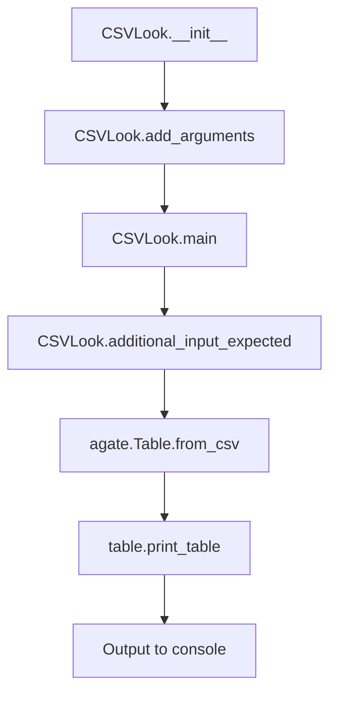

# `csvlook.py`

## `csvkit.utilities.csvlook.CSVLook` · *class*

## Summary:
Renders CSV files as Markdown-compatible, fixed-width tables in the console.

## Description:
The CSVLook utility is designed to display CSV data in a formatted table layout that is compatible with Markdown syntax. It reads CSV files (or piped input) and outputs a nicely formatted table representation to the console. This utility is particularly useful for quickly inspecting CSV data in terminal environments.

This class should be instantiated when users want to visualize CSV data in a readable tabular format. It's typically invoked through the command line interface of csvkit, where the framework handles instantiation automatically.

## State:
- `description` (str): Class-level description of the utility's purpose
- `argparser`: Argument parser instance configured with CSV processing options
- `args`: Parsed command-line arguments containing display and parsing options
- `input_file`: Input file handle (opened via `_open_input_file` inherited from CSVKitUtility)
- `output_file`: Output file handle (defaults to stdout)
- `reader_kwargs`: Dictionary of CSV reader configuration parameters inherited from CSVKitUtility
- `writer_kwargs`: Dictionary of CSV writer configuration parameters inherited from CSVKitUtility

## Lifecycle:
Creation: Instances are created automatically by the csvkit CLI framework when the command is invoked. The constructor inherits from CSVKitUtility and handles argument parsing and initialization.

Usage: The utility follows the standard CSVKitUtility pattern:
1. Arguments are parsed via `__init__` (inherited from CSVKitUtility)
2. `run()` method is called which opens input file and calls `main()` (inherited from CSVKitUtility)
3. In `main()`, the utility checks for required input using `additional_input_expected()` (inherited from CSVKitUtility)
4. CSV data is read using `agate.Table.from_csv()` with various parameters
5. Formatted output is produced using `table.print_table()`

Destruction: Cleanup happens automatically when the utility completes execution, closing input files if needed (handled by CSVKitUtility base class).

## Method Map:


## Raises:
- `argparse.ArgumentError`: Raised by argument parser when invalid arguments are provided
- `IOError`: Raised when input file cannot be opened or read
- `UnicodeDecodeError`: Raised when file encoding issues occur
- `ValueError`: Raised when invalid argument values are provided (e.g., negative integers)

## Example:
```bash
# Display CSV file as formatted table
csvlook data.csv

# Limit displayed rows and columns
csvlook --max-rows 10 --max-columns 5 data.csv

# Truncate long columns and limit decimal precision
csvlook --max-column-width 20 --max-precision 2 data.csv

# Disable type inference for raw output
csvlook --no-inference data.csv
```

### `csvkit.utilities.csvlook.CSVLook.add_arguments` · *method*

## Summary:
Configures command-line arguments for the csvlook utility to control CSV display formatting and parsing behavior.

## Description:
Adds command-line arguments to the argument parser that control how CSV data is displayed and parsed. This method is part of the CSVLook class's implementation of the CSVKitUtility interface, specifically overriding the abstract base method to define utility-specific command-line options.

## Args:
    self: The CSVLook instance whose argument parser will be configured

## Returns:
    None: This method modifies the instance's argument parser in-place

## Raises:
    None: This method does not raise exceptions directly

## State Changes:
    Attributes READ: None
    Attributes WRITTEN: self.argparser (modifies the argument parser instance)

## Constraints:
    Preconditions: The method assumes self.argparser exists and is an argparse.ArgumentParser instance
    Postconditions: The argument parser contains all the defined command-line options for csvlook

## Side Effects:
    None: This method only modifies the argument parser object and doesn't perform I/O or external service calls

### `csvkit.utilities.csvlook.CSVLook.main` · *method*

## Summary:
Processes CSV input and displays it in a formatted table view with configurable formatting options.

## Description:
This method serves as the core execution point for the csvlook utility, which reads CSV data from either a file or stdin and displays it in a nicely formatted table. It validates input requirements, configures parsing parameters based on command-line arguments, reads the CSV data using the agate library, and outputs the formatted table representation. The method handles various formatting options such as numeric precision control, column width limits, and row/column truncation.

## Args:
    self: The CSVLook instance containing parsed command-line arguments and configuration.

## Returns:
    None: This method performs I/O operations and does not return a value.

## Raises:
    SystemExit: Raised by argparser.error() when no input file is provided and no piped data is available.

## State Changes:
    Attributes READ: 
    - self.additional_input_expected(): Determines if input validation is needed
    - self.args.max_precision: Controls numeric precision in output (when not None)
    - self.args.no_number_ellipsis: Controls whether to show ellipsis for truncated numbers
    - self.args.sniff_limit: Limit for CSV dialect detection (-1 means no limit)
    - self.args.skip_lines: Number of initial lines to skip
    - self.args.line_numbers: Whether to include line numbers in output
    - self.args.max_rows: Maximum number of rows to display
    - self.args.max_columns: Maximum number of columns to display
    - self.args.max_column_width: Maximum width for each column
    - self.input_file: Source of CSV data
    - self.reader_kwargs: CSV reader configuration parameters
    - self.output_file: Destination for formatted output
    
    Attributes WRITTEN: 
    - None: This method does not modify any instance attributes directly.

## Constraints:
    Preconditions:
    - Input file must be provided via command-line argument or piped data through stdin
    - Valid CSV data must be present in the input source
    - Command-line arguments must be properly parsed
    
    Postconditions:
    - Formatted table output is written to the configured output file or stdout
    - Table formatting respects all specified command-line options including precision, truncation limits, and column width restrictions

## Side Effects:
    - Reads from input file or stdin
    - Writes formatted table output to output file or stdout
    - May modify global configuration via agate.config.set_option() when --no-number-ellipsis is specified
    - Calls agate.Table.from_csv() which performs file I/O, CSV parsing, and table creation
    - Calls table.print_table() which performs output formatting and writing

## `csvkit.utilities.csvlook.launch_new_instance` · *function*

*No documentation generated.*

