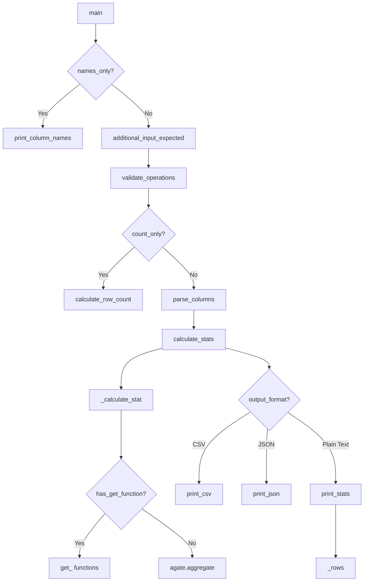
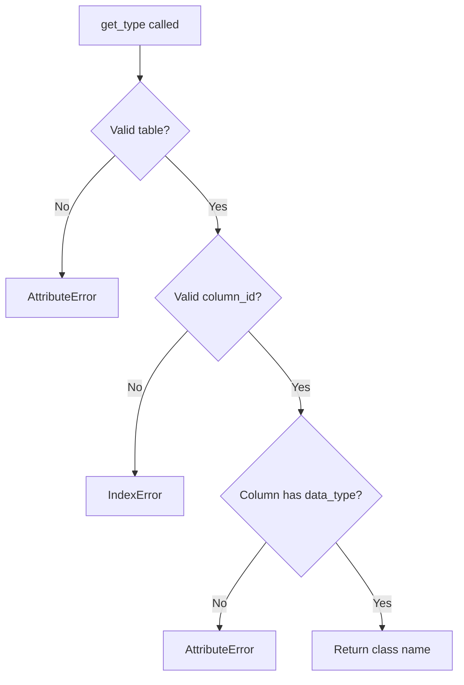

# `csvstat.py`

## `csvkit.utilities.csvstat.CSVStat` · *class*

## Summary:
The CSVStat class is a command-line utility that computes and displays descriptive statistics for columns in a CSV file, supporting various statistical measures and output formats.

## Description:
CSVStat is designed to analyze CSV data by calculating descriptive statistics for each column. It can output results in plain text, CSV, or JSON formats, and supports filtering by specific columns or statistical operations. The class extends CSVKitUtility, providing a command-line interface for statistical analysis of tabular data.

The utility supports numerous statistical operations including data type identification, null value counts, unique value counts, minimum/maximum values, sum, mean, median, standard deviation, string length analysis, precision analysis, frequency counts, and row counting. These operations are controlled through command-line flags such as --mean, --median, --sum, --min, --max, --stdev, --len, --freq, etc.

## State:
- `description`: Class attribute describing the utility's purpose
- `argparser`: Argument parser instance configured with various command-line options
- `args`: Parsed command-line arguments
- `output_file`: Output stream for writing results
- `reader_kwargs`: Keyword arguments for CSV reader configuration
- `writer_kwargs`: Keyword arguments for CSV writer configuration

## Lifecycle:
- Creation: Instantiated by the CSVKit framework when invoked as a command-line utility
- Usage: Called through the `run()` method inherited from CSVKitUtility, which internally calls `main()`
- Destruction: Managed automatically by Python garbage collection

## Method Map:


## Raises:
- `argparse.ArgumentError`: When conflicting command-line arguments are provided
- `ValueError`: When invalid column identifiers are specified
- `StopIteration`: When CSV file is empty
- Various exceptions from underlying CSV processing libraries

## Example:
```python
# Typical usage from command line:
# csvstat --mean --median data.csv
# csvstat --json --columns 1,3 data.csv
# csvstat --csv --type data.csv

# Programmatic usage would involve:
# csvstat = CSVStat(['--mean', 'data.csv'])
# csvstat.run()
```

### `csvkit.utilities.csvstat.CSVStat.add_arguments` · *method*

## Summary:
Adds all command-line arguments to the argument parser for CSV statistical analysis.

## Description:
This method populates the instance's argument parser with all available command-line options for the csvstat utility. It defines flags for controlling output format (CSV, JSON), column selection criteria, statistical measures to compute, and various formatting preferences. This method is called during the initialization phase of the CSVStat utility to set up the command-line interface.

## Args:
    None (only self parameter)

## Returns:
    None

## Raises:
    None explicitly raised

## State Changes:
    Attributes READ: self.argparser
    Attributes WRITTEN: None (modifies self.argparser state indirectly by adding arguments)

## Constraints:
    Preconditions: 
    - self.argparser must be initialized and accessible
    - This method should only be called during the initialization/setup phase of the CSVStat utility
    
    Postconditions:
    - The argument parser contains all supported command-line options for CSV statistics
    - All argument definitions are properly registered with the parser

## Side Effects:
    None directly, but indirectly affects the command-line interface configuration that will be used by the parent CSVKitUtility class to parse user input and determine program behavior

### `csvkit.utilities.csvstat.CSVStat.main` · *method*

## Summary:
Processes CSV files and performs statistical analysis or displays column information based on command-line arguments.

## Description:
This method serves as the primary execution entry point for the csvstat command-line utility, orchestrating the complete workflow of CSV file analysis. It validates command-line arguments, reads input data using agate.Table.from_csv(), processes specified columns, and produces formatted output in various formats (human-readable text, CSV, or JSON). The method handles multiple operational modes including displaying column names (--names-only), counting rows (--count-only), and performing statistical operations (--mean, --median, etc.) on specified columns.

This method is separated from the initialization logic to provide a clean execution flow that handles the complete lifecycle of CSV analysis from input parsing to result formatting, making it easier to test and maintain as part of the CSVKit command-line utilities framework.

## Args:
    self: The CSVStat instance containing command-line arguments and configuration

## Returns:
    None: This method performs I/O operations and does not return a value

## Raises:
    SystemExit: Raised by argparser.error() when validation fails for command-line arguments

## State Changes:
    Attributes READ: 
    - self.args (command-line arguments containing operation flags and configuration)
    - self.input_file (input file handle for CSV data)
    - self.output_file (output file handle for results)
    - self.reader_kwargs (CSV reader configuration parameters)
    
    Methods CALLED:
    - self.additional_input_expected() (validates that input is provided)
    - self.get_column_types() (determines column data types)
    - self.get_column_offset() (determines column indexing base)
    - self.skip_lines() (skips initial lines in input file)
    - self.print_column_names() (prints column header names)
    - self.print_one() (prints statistics for a single column)
    - self.calculate_stats() (calculates statistics for a column)
    - self.print_csv() (prints results in CSV format)
    - self.print_json() (prints results in JSON format)
    - self.print_stats() (prints results in human-readable format)

## Constraints:
    Preconditions:
    - Command-line arguments must be properly parsed
    - Input file must be available or piped data must be provided
    - Only one operation argument may be specified at a time (e.g., --mean, --median, --mode)
    - Cannot combine operation arguments with output format flags (--csv, --json)
    - Cannot combine operation arguments with --count-only flag
    
    Postconditions:
    - Output is written to self.output_file in the requested format
    - Appropriate error messages are displayed for invalid configurations

## Side Effects:
    - Reads from self.input_file (CSV input data)
    - Writes to self.output_file (analysis results)
    - May read from stdin if no input file is specified
    - Calls argparser.error() which terminates the program on validation failures

### `csvkit.utilities.csvstat.CSVStat.is_finite_decimal` · *method*

## Summary:
Checks if a value is a finite Decimal instance.

## Description:
Determines whether the provided value is an instance of the Decimal class and represents a finite number (not infinity or NaN). This method is used to validate decimal values before applying formatting operations or statistical calculations that require finite numeric values.

## Args:
    value (Any): The value to check for being a finite Decimal.

## Returns:
    bool: True if value is a Decimal instance and is finite, False otherwise.

## Raises:
    None

## State Changes:
    Attributes READ: None
    Attributes WRITTEN: None

## Constraints:
    Preconditions: The value parameter can be of any type.
    Postconditions: Returns a boolean indicating the finiteness of the Decimal value.

## Side Effects:
    None

### `csvkit.utilities.csvstat.CSVStat._calculate_stat` · *method*

*No documentation generated.*

### `csvkit.utilities.csvstat.CSVStat.print_one` · *method*

## Summary:
Formats and outputs a single statistical measure for a specified column in a CSV table, with optional labeling.

## Description:
This method calculates and displays a statistical measure for a given column in a table. It's designed to be used when displaying individual statistics for specific columns, either with or without column labels. The method handles special formatting for frequency distributions and writes the result to the configured output file. This method is typically called from the main execution flow when processing specific operations on individual columns.

## Args:
    table (agate.Table): The table containing the data to analyze
    column_id (int): The index of the column to analyze (zero-based)
    op_name (str): The name of the statistical operation to perform (e.g., 'mean', 'count', 'freq')
    label (bool): Whether to include the column name and index in the output format. Defaults to True
    **kwargs: Additional keyword arguments passed to the underlying calculation methods

## Returns:
    None: This method does not return a value but writes formatted output to self.output_file

## Raises:
    None explicitly raised: The method relies on underlying functions that may raise exceptions, but this method doesn't catch or re-raise them specifically

## State Changes:
    Attributes READ:
        - self.output_file: Used for writing formatted output
        - self.args: Used by _calculate_stat for configuration settings
        - OPERATIONS: Used to look up operation metadata (assumed to be a global constant)
    
    Attributes WRITTEN:
        - self.output_file: Modified by writing formatted output

## Constraints:
    Preconditions:
        - table must be a valid agate.Table instance
        - column_id must be a valid index for table.column_names
        - op_name must be a valid key in the OPERATIONS constant
        - OPERATIONS constant must be defined in the module scope
    
    Postconditions:
        - Output is written to self.output_file in a formatted string
        - For 'freq' operations, output is formatted as a dictionary-like string: '{ "value": count, ... }'
        - For other operations, output is a simple value representation
        - When label=True, output follows format: '  {column_id}. {column_name}: {stat}'
        - When label=False, output is simply: '{stat}\n'

## Side Effects:
    - Writes formatted text to self.output_file
    - May trigger calculations through _calculate_stat that could involve I/O or computation
    - Uses warnings.catch_warnings() internally but doesn't propagate warnings

### `csvkit.utilities.csvstat.CSVStat.calculate_stats` · *method*

## Summary:
Computes all statistical operations for a specified column in a CSV table.

## Description:
This method performs batch statistical calculation for a given column by executing all operations defined in the OPERATIONS constant. It serves as a utility for gathering comprehensive statistical profiles of individual columns when no specific operation is requested. The method iterates through each operation in OPERATIONS and delegates individual calculations to the _calculate_stat helper method.

## Args:
    table (agate.Table): The table containing the CSV data
    column_id (int): The index of the column to analyze
    **kwargs: Additional keyword arguments passed through to individual calculation functions

## Returns:
    dict: A dictionary mapping operation names (str) to their calculated values. Each key corresponds to an operation defined in the OPERATIONS constant, with values representing the computed statistics for the specified column.

## Raises:
    None explicitly raised - exceptions during individual calculations are caught and handled internally by _calculate_stat

## State Changes:
    Attributes READ: None
    Attributes WRITTEN: None

## Constraints:
    Preconditions: 
    - The table parameter must be a valid agate.Table instance
    - The column_id must be a valid index within the table's columns
    - OPERATIONS constant must be defined in the module scope and contain operation definitions
    
    Postconditions:
    - Returns a dictionary with all operation names from OPERATIONS as keys
    - Values are the computed statistics or None if calculation failed

## Side Effects:
    None directly - however, the underlying _calculate_stat method may perform I/O operations when accessing data and may issue warnings during calculations.

### `csvkit.utilities.csvstat.CSVStat.print_stats` · *method*

*No documentation generated.*

### `csvkit.utilities.csvstat.CSVStat.print_csv` · *method*

## Summary:
Writes CSV-formatted statistical data for CSV columns to the output file.

## Description:
This method generates a CSV table containing descriptive statistics for specified columns in a CSV file. It formats the data using agate's DictWriter and processes rows from the internal _rows generator method. The method specifically handles frequency data formatting by joining value-count pairs into a comma-separated string.

## Args:
    table (agate.Table): The table containing the CSV data to analyze
    column_ids (list[int]): List of column indices to include in the statistics
    stats (dict): Dictionary mapping column IDs to their calculated statistics

## Returns:
    None: This method performs I/O operations and does not return a value

## Raises:
    None explicitly raised: The method relies on underlying agate operations that may raise exceptions

## State Changes:
    Attributes READ: self.output_file, self._rows
    Attributes WRITTEN: None

## Constraints:
    Preconditions: 
    - table must be a valid agate.Table instance
    - column_ids must be a list of valid column indices
    - stats must be a dictionary with proper structure matching column_ids
    - self.output_file must be a writable file-like object
    
    Postconditions:
    - CSV header is written to self.output_file
    - Statistical data for each column is written to self.output_file
    - Frequency data is formatted as comma-separated value-count pairs

## Side Effects:
    - Writes formatted CSV data to self.output_file
    - Uses agate.csv.DictWriter for CSV output formatting
    - Processes data through self._rows generator method

### `csvkit.utilities.csvstat.CSVStat.print_json` · *method*

## Summary:
Writes statistical data for CSV columns in JSON format to the output file.

## Description:
This method formats column statistics calculated by the CSVStat utility into a JSON structure and writes it to the output file. It processes the statistical data generated by various operations (like mean, median, count, etc.) and serializes them into a structured JSON format that can be easily consumed by other applications. The method uses the internal `_rows` method to generate the data structure and then outputs it as JSON with configurable indentation.

## Args:
    table (agate.Table): The CSV data table containing the columns to analyze
    column_ids (list): List of column identifiers to process
    stats (dict): Dictionary mapping column IDs to their calculated statistics

## Returns:
    None: This method does not return any value

## Raises:
    None explicitly raised

## State Changes:
    Attributes READ: self.output_file, self.args.indent
    Attributes WRITTEN: None

## Constraints:
    Preconditions: 
    - table must be a valid agate.Table instance
    - column_ids must be a list of valid column identifiers
    - stats must be a dictionary mapping column IDs to their calculated statistics
    - self.output_file must be a writable file-like object
    - self.args.indent must be either None or an integer specifying JSON indentation

    Postconditions:
    - Data is written to self.output_file in JSON format
    - The JSON output follows the structure produced by self._rows() method

## Side Effects:
    - Writes formatted JSON data to self.output_file
    - Performs I/O operations to the output file

### `csvkit.utilities.csvstat.CSVStat._rows` · *method*

*No documentation generated.*

## `csvkit.utilities.csvstat.format_decimal` · *function*

*No documentation generated.*

## `csvkit.utilities.csvstat.get_type` · *function*

## Summary:
Returns the class name of the data type for a specified column in an agate table.

## Description:
Extracts and returns the class name of the data type associated with a specific column from an agate Table object. This utility function provides introspection capability for examining column data types within CSV processing workflows, commonly used in statistical analysis and data validation operations.

## Args:
    table: An agate Table object containing the data
    column_id: Index or identifier specifying which column to examine (int or str)
    **kwargs: Additional keyword arguments (currently unused in implementation)

## Returns:
    str: The class name of the data type for the specified column (e.g., 'String', 'Number', 'Boolean')

## Raises:
    IndexError: When column_id is out of bounds for the table's columns
    AttributeError: When table, columns, or data_type attributes are not accessible
    TypeError: When column_id is of invalid type for table.columns indexing

## Constraints:
    Preconditions:
        - table must be a valid agate Table instance
        - column_id must reference a valid column in the table
    Postconditions:
        - Returns a string representing the data type class name
        - Function execution does not modify the input table or column objects

## Side Effects:
    None: This function performs no I/O operations or external state mutations

## Control Flow:


## Examples:
    # Basic usage with integer column index
    type_name = get_type(my_table, 0)  # Returns 'String' for first column
    
    # Usage with column identifier
    type_name = get_type(my_table, 'age')  # Returns data type class name for 'age' column
    
    # Error handling example
    try:
        type_name = get_type(my_table, 999)  # Raises IndexError
    except IndexError:
        print("Column index out of bounds")

## `csvkit.utilities.csvstat.get_unique` · *function*

## Summary:
Returns the count of unique values in a specified column of a table.

## Description:
This function calculates the number of distinct (unique) values present in a given column of a table. It serves as a utility function for statistical analysis of CSV data, specifically for determining cardinality of columns. The function leverages the agate library's Column.values_distinct() method to identify unique values and returns their count. This is commonly used in data profiling to understand the diversity or uniqueness of values in a dataset column.

## Args:
    table: agate.Table object containing the data
    column_id: int or str, identifier for the column to analyze
    **kwargs: Additional keyword arguments (passed through to underlying methods)

## Returns:
    int: The count of distinct values in the specified column

## Raises:
    KeyError: If column_id is a string that does not match any column name in the table
    IndexError: If column_id is an integer that is out of bounds for the table's columns
    AttributeError: If table or table.columns does not have the expected interface

## Constraints:
    Preconditions:
    - table must be a valid agate.Table instance
    - column_id must reference a valid column in the table
    - The table must have been properly initialized with data
    
    Postconditions:
    - Returns an integer representing the count of unique values
    - Does not modify the original table or its data

## Side Effects:
    None: This function performs no I/O operations or external state mutations

## Control Flow:
```mermaid
flowchart TD
    A[get_unique called] --> B{Valid column_id?}
    B -->|No| C[Raises KeyError/IndexError]
    B -->|Yes| D[Access table.columns[column_id]]
    D --> E[Call values_distinct()]
    E --> F[Get length of distinct values]
    F --> G[Return count]
```

## Examples:
```python
# Basic usage - count unique values in first column
unique_count = get_unique(my_table, 0)
print(f"Unique values: {unique_count}")

# With column name - count unique values in named column  
unique_count = get_unique(my_table, 'age')
print(f"Unique ages: {unique_count}")

# Error handling - handle invalid column references
try:
    unique_count = get_unique(my_table, 999)  # Invalid column index
except IndexError:
    print("Column index out of range")

# Practical use case - data profiling
column_stats = {}
for col_id in range(len(my_table.columns)):
    column_stats[col_id] = {
        'unique_count': get_unique(my_table, col_id),
        'total_count': len(my_table.columns[col_id])
    }
```

## `csvkit.utilities.csvstat.get_freq` · *function*

## Summary:
Extracts frequency counts of values from a specified column in a table for statistical analysis.

## Description:
This function retrieves the most frequently occurring values from a given column in a table, returning them along with their occurrence counts. It's designed to provide quick insights into the distribution of values in a dataset column.

## Args:
    table: An agate Table object containing CSV data
    column_id: Integer index or identifier specifying which column to analyze
    freq_count: Integer count of top frequent values to return (default: 5)
    **kwargs: Additional keyword arguments (not used in current implementation)

## Returns:
    list[dict]: A list of dictionaries, each containing:
        - 'value': The value found in the column
        - 'count': The number of occurrences of that value
    Returns an empty list if the column contains no data.

## Raises:
    IndexError: When column_id is out of bounds for the table's columns
    AttributeError: When table.columns does not exist or is not accessible
    TypeError: When table.columns[column_id] does not support .values() method

## Constraints:
    Preconditions:
        - table must be an agate Table object with accessible columns
        - column_id must be a valid column identifier for the table
        - table.columns[column_id] must support the .values() method
    Postconditions:
        - Returns a list of at most freq_count dictionaries
        - Each dictionary contains 'value' and 'count' keys
        - Values are ordered from most to least frequent

## Side Effects:
    None

## Control Flow:
```mermaid
flowchart TD
    A[get_freq called] --> B{table.columns[column_id] exists?}
    B -- Yes --> C{column.values() exists?}
    C -- Yes --> D[Counter(values) created]
    D --> E[most_common(freq_count) called]
    E --> F[Return list of value/count dicts]
    B -- No --> G[Exception raised]
    C -- No --> G
```

## Examples:
```python
# Basic usage
freq_data = get_freq(my_table, 0)  # Get top 5 most frequent values from first column

# Custom frequency count
freq_data = get_freq(my_table, 2, freq_count=10)  # Get top 10 from third column

# Result format
[
    {'value': 'A', 'count': 15},
    {'value': 'B', 'count': 8},
    {'value': 'C', 'count': 3}
]
```

## `csvkit.utilities.csvstat.launch_new_instance` · *function*

*No documentation generated.*

