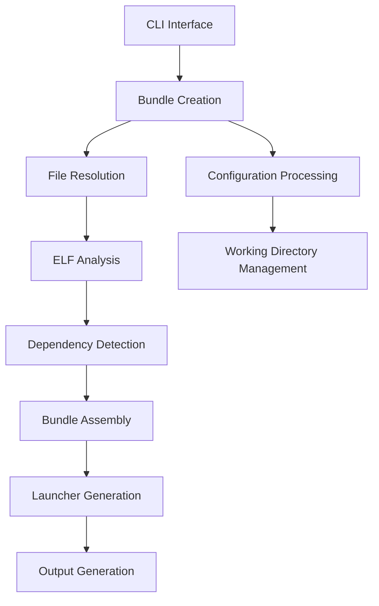

# `exodus-bundler`

## Repository Overview

### Purpose
The Exodus Bundler is a tool that creates portable bundles of ELF binary executables with all of their runtime dependencies. It solves the problem of running binaries on systems with incompatible system libraries by packaging them with their required dependencies in a relocatable format.

This tool is particularly useful for:
- Distributing Linux applications that depend on specific system libraries
- Creating self-contained executables that work across different Linux distributions
- Packaging applications for deployment in environments with restricted or incompatible library versions

### Target Users
- Linux application developers who want to distribute portable binaries
- System administrators deploying applications across heterogeneous Linux environments
- DevOps engineers managing application deployments
- Software distributors wanting to avoid dependency conflicts

### Position in Ecosystem
The Exodus Bundler is a standalone command-line tool that operates as a self-contained solution for creating portable Linux bundles. It can be integrated into build pipelines or used directly from the command line. It's designed to work with standard Linux ELF binaries and doesn't require special compilation flags.

## Architecture

### Key Abstractions and Patterns
- **Bundle Pattern**: Central abstraction representing a collection of files to be bundled together
- **File Pattern**: Represents individual files with ELF metadata and dependency tracking
- **Plugin Pattern**: Package manager detection for automatic dependency resolution
- **Template Pattern**: Uses templates for launcher scripts and installation scripts
- **Factory Pattern**: File factory for creating appropriate File objects

## Entry Points

### Command-Line Interface
- **Command**: `exodus-bundler` or `python -m exodus_bundler`
- **Usage**: `exodus-bundler EXECUTABLE [EXECUTABLE ...] [OPTIONS]`
- **Target Audience**: Developers, system administrators, DevOps engineers

### Importable API
- **Module**: `exodus_bundler`
- **Functions**:
  - `create_bundle()` - Main bundle creation function
  - `create_unpackaged_bundle()` - Lower-level bundle creation without packaging
- **Target Audience**: Developers integrating bundling into custom workflows

## Core Features

1. **ELF Binary Analysis** - Detects and analyzes ELF binary properties including architecture, type, and required libraries
2. **Dependency Resolution** - Automatically discovers runtime dependencies using ldd and system package managers
3. **Cross-Platform Compatibility** - Creates bundles that work across different Linux distributions
4. **Launcher Generation** - Creates efficient launchers for executables with proper library paths
5. **Deduplication** - Shares common files across multiple executables to reduce bundle size
6. **Chroot Support** - Allows bundling within chroot environments for testing and compatibility
7. **Flexible Output Formats** - Supports both installation scripts and tarballs

## Dependencies

### External Dependencies
- **System Tools**: `ldd`, `gcc`, `musl-gcc`, `diet` (for launcher compilation)
- **Python Libraries**: Standard library modules (`os`, `shutil`, `subprocess`, `argparse`, etc.)
- **Package Managers**: `dpkg`, `pacman`, `rpm` (for automatic dependency detection)

### Version Constraints
- Requires Python 3.6+
- Must have `ldd` utility installed on the system
- Optional: `musl-gcc` or `diet` for optimized launchers (otherwise uses bash fallbacks)

## Configuration

### Runtime Parameters
- **Working Directory**: Temporary directory for bundle creation
- **Chroot Path**: Root directory for linking operations
- **Output Format**: Installation script vs tarball
- **Logging Level**: Verbose, quiet, or normal output

### Environment Variables
- `LD_LIBRARY_PATH`: Used for library path resolution during dependency detection
- `PATH`: Used for finding executables and tools

## Extension Points

### Plugin Architecture
- **Package Manager Plugins**: Extend dependency detection to support new package managers
- **Launcher Types**: Add new launcher generation methods

### Customization Options
- **Template Overrides**: Replace default launcher templates
- **File Resolution Hooks**: Customize how files are resolved and added to bundles
- **Dependency Detection Strategies**: Implement custom dependency resolution logic

### Configuration-Driven Behavior
- Command-line options allow customization of bundling behavior
- Environment variables control runtime behavior
- Template-based approach allows easy modification of output formats

---

## Modules

- [`src`](src.md)
- [`src/exodus_bundler`](src/exodus_bundler.md)

