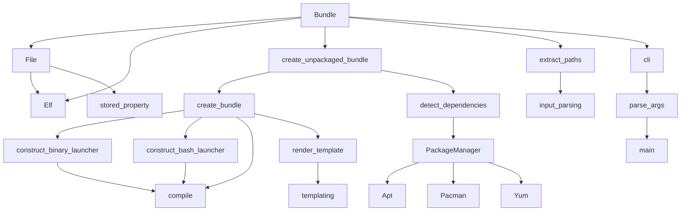

# `src.exodus_bundler`

## Tree:
```
exodus_bundler/
├── bundling.py
├── cli.py
├── dependency_detection.py
├── errors.py
├── input_parsing.py
├── launchers.py
└── templating.py
```

## Role:
Manages the creation of portable bundles containing ELF binary executables and their runtime dependencies for cross-system compatibility.

## Description:
The exodus_bundler module provides functionality to package ELF binary executables along with all their runtime dependencies into relocatable bundles. This allows programs to run on systems with different library versions or incompatible system libraries by including all necessary dependencies within the bundle itself.

This module is primarily used by the Exodus bundler CLI tool to create self-contained bundles that can be distributed and executed on different Linux systems without requiring the target system to have matching library versions.

The module is organized around core concepts:
- File handling and dependency resolution for ELF binaries
- Bundle creation and management
- Launcher generation for executables that require special handling
- Cross-platform dependency detection
- Template-based script generation for bundle installation

## Components:
- **Bundle**: Core class managing the collection and organization of files within a bundle
- **File**: Represents individual files to be bundled, handling ELF binary detection and dependency analysis
- **Elf**: Specialized handler for ELF binary files, including linker detection and dependency resolution
- **stored_property**: Descriptor for memoizing computed properties on objects
- **create_bundle**: Main function that orchestrates bundle creation from user inputs
- **create_unpackaged_bundle**: Internal function that handles the core bundle creation logic
- **detect_dependencies**: Function for automatically detecting package dependencies using system package managers
- **extract_paths**: Utility for parsing file paths from strace output
- **construct_binary_launcher**: Generates optimized C-based launchers for executables
- **construct_bash_launcher**: Creates fallback shell-based launchers
- **compile**: Attempts to compile launchers using available C compilers
- **render_template**: Simple template rendering engine for generating scripts
- **StderrFilter/StdoutFilter**: Logging filters for controlling output streams
- **PackageManager/Apt/Pacman/Yum**: Package manager abstraction for automatic dependency detection



## Public API:
- **create_bundle(executables, output, tarball=False, rename=[], chroot=None, add=[], no_symlink=[], shell_launchers=False, detect=False)**: Main entry point for creating bundles. Creates a bundle containing the specified executables and their dependencies.
- **create_unpackaged_bundle(executables, rename=[], chroot=None, add=[], no_symlink=[], shell_launchers=False, detect=False)**: Internal function that performs the core bundle creation logic without packaging.
- **detect_dependencies(path)**: Attempts to auto-detect package dependencies for a given file using system package managers.
- **extract_paths(content, existing_only=True)**: Parses file paths from strace-like input content.
- **construct_binary_launcher(linker, library_path, executable, full_linker=True)**: Generates optimized C-based launchers for executables.
- **construct_bash_launcher(linker, library_path, executable, full_linker=True)**: Creates fallback shell-based launchers.
- **compile(code)**: Compiles C code into executable binaries using available compilers.

## Dependencies:
- **Internal imports**:
  - `exodus_bundler.errors`: Error definitions for bundling operations
  - `exodus_bundler.dependency_detection`: Package manager integration for automatic dependency detection
  - `exodus_bundler.input_parsing`: Utilities for parsing file paths from various input formats
  - `exodus_bundler.launchers`: Launcher compilation and construction utilities
  - `exodus_bundler.templating`: Template rendering for bundle installation scripts

- **External imports**:
  - `argparse`: Command-line argument parsing
  - `base64`, `io`, `os`, `shutil`, `subprocess`, `sys`, `tarfile`, `tempfile`, `threading`, `time`, `logging`, `re`, `struct`, `hashlib`, `filecmp`, `stat`, `collections.defaultdict`: Standard library modules for system operations, file handling, and data processing
  - `Popen`, `PIPE`: From subprocess module for executing external processes
  - `find_executable`: From distutils.spawn for finding executables in PATH

## Constraints:
- All input paths must be valid files (not directories)
- ELF binaries must be 32-bit or 64-bit little-endian architecture
- When using chroot environments, all paths must be properly resolved relative to the chroot
- Bundle creation requires write permissions to temporary directories
- Automatic dependency detection only works on systems with supported package managers (apt, pacman, yum)
- Launchers require either musl-gcc or diet C compiler for optimal performance
- The module assumes POSIX-compliant filesystems and standard Unix tools like ldd

---

## Files

- [`bundling.py`](exodus_bundler/bundling.md)
- [`cli.py`](exodus_bundler/cli.md)
- [`dependency_detection.py`](exodus_bundler/dependency_detection.md)
- [`errors.py`](exodus_bundler/errors.md)
- [`input_parsing.py`](exodus_bundler/input_parsing.md)
- [`launchers.py`](exodus_bundler/launchers.md)
- [`templating.py`](exodus_bundler/templating.md)

