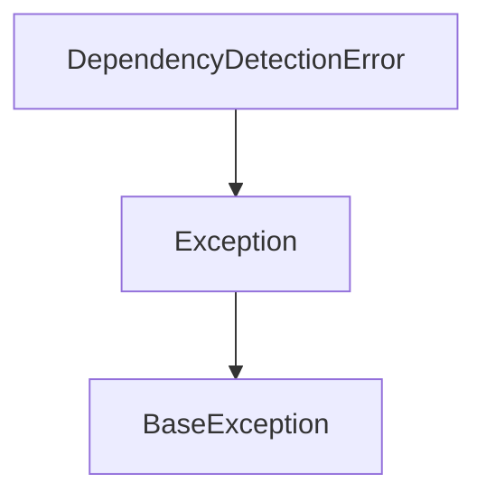
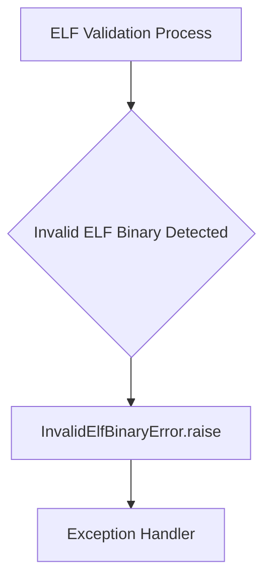
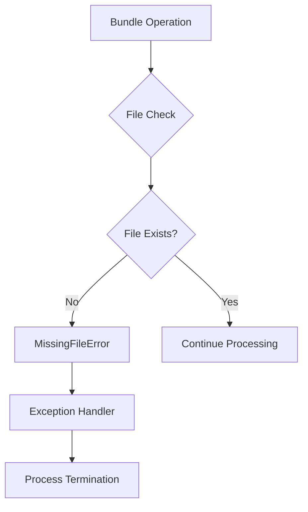
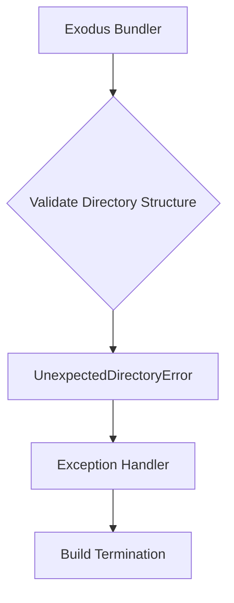
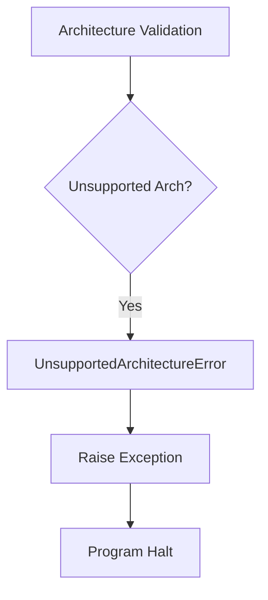

# `errors.py`

## `src.exodus_bundler.errors.FatalError` · *class*

*No documentation generated.*

## `src.exodus_bundler.errors.DependencyDetectionError` · *class*

## Summary:
Represents a fatal error that occurs during dependency detection in the Exodus bundler system.

## Description:
This exception is raised when the bundler encounters a critical issue while attempting to detect dependencies in a project. It is a subclass of `FatalError` and follows the same error handling pattern as other fatal errors in the system.

## State:
- Inherits all state from `FatalError` (which is just the standard Exception state)
- No additional attributes or parameters beyond those inherited from the base Exception class

## Lifecycle:
- Creation: Instantiated like any standard Exception, typically by raising it with `raise DependencyDetectionError("message")`
- Usage: Thrown during dependency analysis operations when a critical detection failure occurs
- Destruction: Handled by the standard Python exception handling mechanism

## Method Map:


## Raises:
- Raised when dependency detection fails critically during bundling operations
- Triggered by dependency analysis logic when encountering irrecoverable issues

## Example:
```python
try:
    # Some dependency detection operation
    detect_dependencies(project_path)
except DependencyDetectionError as e:
    print(f"Critical dependency detection failed: {e}")
    # Handle fatal error appropriately
```

## `src.exodus_bundler.errors.InvalidElfBinaryError` · *class*

## Summary:
Represents an error that occurs when an ELF binary is invalid or cannot be processed by the Exodus bundler.

## Description:
This exception is raised when the bundler encounters an ELF binary that fails validation checks or cannot be properly parsed and processed. It inherits from FatalError, indicating that this is a critical error that prevents further processing. The exception serves as a distinct error type to differentiate invalid ELF binary issues from other potential errors in the bundling process.

## State:
- Inherits all state from FatalError (which is just the standard Exception state)
- No additional attributes or instance variables
- No special initialization parameters required beyond those of Exception

## Lifecycle:
- Creation: Instantiated with optional message string, similar to any Exception subclass
- Usage: Raised during ELF binary validation or processing operations
- Destruction: Handled by exception handlers in the calling code; no special cleanup required

## Method Map:


## Raises:
- Raised when ELF binary validation fails during bundling operations
- Triggered when an ELF binary doesn't meet required format specifications
- Cannot be raised from __init__ as it's a simple inheritance with no custom constructor

## Example:
```python
try:
    bundle = ExodusBundler()
    bundle.process_elf_binary("invalid_file.elf")
except InvalidElfBinaryError as e:
    print(f"Failed to process ELF binary: {e}")
    # Handle the invalid binary case
```

## `src.exodus_bundler.errors.MissingFileError` · *class*

## Summary:
Represents an error that occurs when a required file is missing during the bundling process.

## Description:
MissingFileError is a specialized exception type that extends FatalError to specifically indicate when a file dependency required for bundling operations cannot be located. This exception is raised when the bundler encounters a situation where a file that was expected to exist is not found in the filesystem, making further processing impossible.

The class serves as a distinct error type to allow callers to differentiate between various failure modes during bundling operations, particularly when dealing with missing dependencies versus other types of failures.

## State:
This class has no additional instance attributes beyond those inherited from FatalError. It maintains the standard Exception behavior with no additional state management.

## Lifecycle:
Creation: Instances are created by raising the exception directly or through factory methods that construct and throw the exception. No special initialization parameters are required beyond what Exception provides.

Usage: The exception should be caught by the bundling system's error handling mechanisms to gracefully terminate the bundling process when critical files are missing.

Destruction: As with all Python exceptions, no explicit cleanup is required. The exception object is automatically destroyed when it goes out of scope.

## Method Map:


## Raises:
This class itself does not raise any exceptions during instantiation. It inherits standard Exception behavior and is raised when a file dependency is not found during bundling operations.

## Example:
```python
try:
    bundle = BundleBuilder()
    bundle.add_file("config.json")
    bundle.build()
except MissingFileError as e:
    print(f"Critical file missing: {e}")
    # Handle missing file scenario
```

## `src.exodus_bundler.errors.UnexpectedDirectoryError` · *class*

## Summary:
Represents a fatal error indicating an unexpected directory structure during the Exodus bundling process.

## Description:
This exception is raised when the Exodus bundler encounters a directory that violates expected naming conventions, placement, or structure requirements. As a subclass of FatalError, it signals that the bundling operation cannot proceed and must terminate immediately due to a critical structural issue in the project layout. This error type specifically addresses directory-related configuration problems that prevent successful bundling.

## State:
- Inherits all state from FatalError (standard Exception attributes)
- No additional instance variables or constructor parameters
- Maintains the standard Exception behavior for message and args

## Lifecycle:
- Creation: Instantiated by the bundler's directory validation logic when an unexpected directory is detected
- Usage: Propagated up the call stack to halt execution and indicate a fatal configuration error
- Destruction: Handled by the application's global exception handler or caught by the main bundler loop for graceful shutdown

## Method Map:


## Raises:
- None directly raised by __init__ (inherits Exception.__init__ behavior)
- Raised during directory validation phases of the bundling process when structural inconsistencies are detected

## Example:
```python
# During directory validation in bundler
try:
    validate_project_structure(project_path)
except UnexpectedDirectoryError as e:
    logger.error(f"Unexpected directory structure: {e}")
    sys.exit(1)
```

## `src.exodus_bundler.errors.UnsupportedArchitectureError` · *class*

## Summary:
Represents an error that occurs when the Exodus bundler encounters an unsupported CPU architecture.

## Description:
This exception is raised when the bundling process detects that the target system's CPU architecture is not supported by the Exodus bundler. It inherits from FatalError, indicating that this is a critical error that halts execution. The error serves as a clear signal to users that they need to either use a supported architecture or ensure proper compatibility.

## State:
- Inherits all state from FatalError (no additional attributes)
- No constructor parameters required as it's a simple marker exception

## Lifecycle:
- Creation: Instantiated when architecture validation fails during bundling process
- Usage: Raised during execution to indicate fatal architecture incompatibility
- Destruction: Standard Python exception cleanup when propagated

## Method Map:


## Raises:
- None directly raised by __init__ (inherits from FatalError)
- Raised during runtime when architecture validation fails

## Example:
```python
# When bundling for an unsupported architecture
try:
    bundle_for_architecture("arm64")
except UnsupportedArchitectureError:
    print("Error: arm64 architecture is not supported")
    # Handle the fatal error appropriately
```

