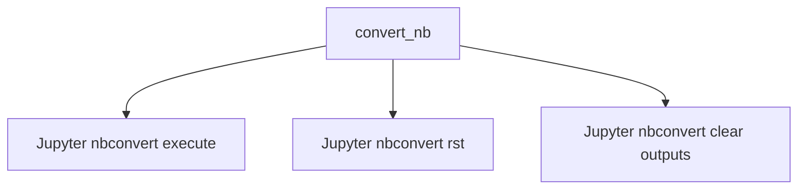

# `docs`

## Tree:
```
docs/
└── tutorials/
```

## Role:
Manages documentation generation and processing workflows for tutorials and Jupyter notebooks.

## Description:
This module serves as the central hub for documentation-related operations, particularly focusing on tutorial content management and Jupyter notebook processing. It provides tools for converting, executing, and formatting tutorial notebooks into various documentation formats while maintaining clean output states.

The module is organized to support automated documentation workflows where tutorial notebooks need to be executed, converted to different formats (like RST), and cleaned of execution outputs while preserving their educational value.

## Components:
- `convert_nb(nbname)` - Converts a Jupyter notebook through multiple stages: execution, RST conversion, and output clearing
- `tutorials/` - Directory containing tools for processing Jupyter notebooks in documentation workflows



## Public API:
- `convert_nb(nbname: str) -> None` - Execute, convert, and clean a Jupyter notebook
  - Executes the notebook with timeout
  - Converts to RST format for documentation
  - Clears outputs while preserving the notebook structure

## Dependencies:
- Internal: None
- External: `sh` command execution utility for running jupyter nbconvert commands

## Constraints:
- Requires Jupyter notebook environment to be installed
- Expects notebook files to exist with .ipynb extension
- Must be run in an environment with proper shell access for executing nbconvert commands

