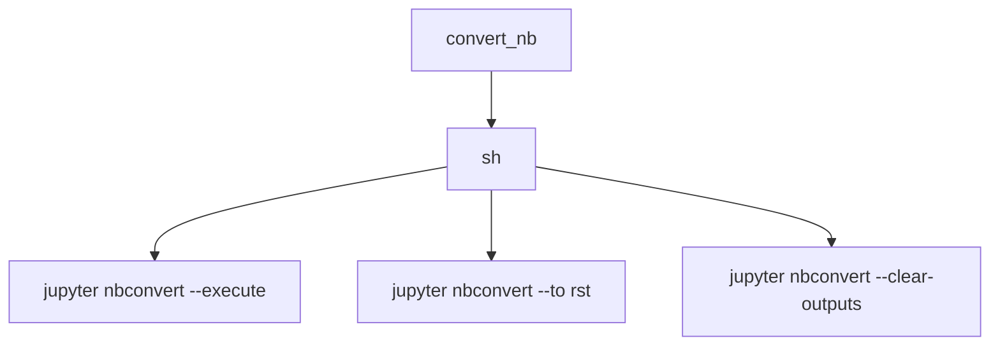

# `docs.tutorials`

## Tree:
```
tutorials/
└── tools/
```

## Role:
Converts and processes Jupyter notebooks for documentation generation

## Description:
The tutorials/tools module provides utilities for processing Jupyter notebooks to prepare them for documentation inclusion. It handles the conversion of notebooks to various formats while ensuring proper execution and output management. This module is primarily used in the documentation build pipeline to transform tutorial notebooks into appropriate formats for web presentation.

## Components:
*   `convert_nb(nbname)` - Executes a notebook, converts it to RST format, and clears outputs from the original notebook



## Public API:
*   `convert_nb(nbname)` - Execute and process a Jupyter notebook
    *   Signature: `convert_nb(nbname: str) -> None`
    *   Description: Processes a Jupyter notebook by executing it, converting to RST format, and clearing outputs
    *   Usage note: The notebook file should have .ipynb extension and be located in the working directory

## Dependencies:
*   Internal: None
*   External: `sh` - Used for executing shell commands (likely from the `sh` Python package or subprocess)

## Constraints:
*   The function assumes Jupyter notebook files exist with .ipynb extension
*   Requires Jupyter nbconvert to be installed in the environment
*   The notebook file must be readable and writable for the in-place operations
*   Execution timeout is set to 60 seconds for notebook execution

