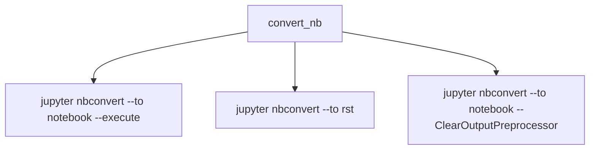

# `docs.tutorials.tools`

## Tree:
```
tools/
└── nb_to_doc.py
```

## Role:
Converts Jupyter notebooks to various formats while executing them and cleaning output

## Description:
This module provides functionality for processing Jupyter notebooks by converting them to different formats (RST, HTML, etc.) while executing them and cleaning output. It serves as a utility for documentation generation workflows where notebooks need to be processed and converted for inclusion in documentation systems.

## Components:
- `convert_nb(nbname)` - Executes a Jupyter notebook and converts it to RST format, then cleans the output



## Public API:
- `convert_nb(nbname)` - Takes a notebook name and executes it, converts to RST, and clears output
  - Signature: `convert_nb(nbname: str) -> None`
  - Description: Executes a Jupyter notebook, converts it to RST format, and removes output cells
  - Usage note: Requires Jupyter tools to be installed and available in PATH

## Dependencies:
- Internal: None
- External: `sh` module for executing shell commands

## Constraints:
- Requires Jupyter notebook tools (`jupyter`) to be installed and accessible in the system PATH
- The notebook file must exist with the .ipynb extension
- Execution timeout is set to 60 seconds
- Thread-safe: No shared mutable state, but concurrent execution of notebooks may conflict

---

## Files

- [`nb_to_doc.py`](tools/nb_to_doc.md)

