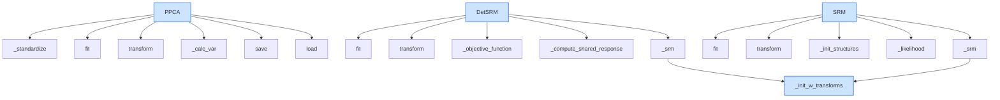

# `hypertools._externals`

## Tree:
    _externals/
    ├── ppca.py
    └── srm.py

## Role:
    Provides external dimensionality reduction and statistical modeling algorithms for neuroimaging data analysis.

## Description:
    This module serves as a container for external algorithms that are used for dimensionality reduction and shared response modeling in neuroimaging studies. It provides implementations of probabilistic PCA (PPCA) for dimensionality reduction and both deterministic and probabilistic versions of Shared Response Model (SRM) for aligning neural responses across subjects.

    The module is used primarily by the main hypertools analysis pipeline when performing dimensionality reduction and multi-subject alignment operations on neuroimaging datasets.

## Components:
    - PPCA: Probabilistic Principal Component Analysis implementation for dimensionality reduction
    - DetSRM: Deterministic Shared Response Model for aligning neural responses across subjects  
    - SRM: Probabilistic Shared Response Model for aligning neural responses across subjects
    - _init_w_transforms: Helper function for initializing weight transforms in SRM algorithms

## Public API:
    - PPCA: Class for probabilistic principal component analysis with methods for fitting, transforming, saving, and loading
    - DetSRM: Class implementing deterministic shared response model with fit and transform methods
    - SRM: Class implementing probabilistic shared response model with fit and transform methods
    - _init_w_transforms: Internal helper function for initializing weight transforms in SRM algorithms

## Dependencies:
    - numpy: Core numerical operations for matrix computations
    - scipy: Linear algebra operations and matrix decompositions (especially cho_factor and cho_solve)
    - sklearn.base: Base classes for estimators and transformers (BaseEstimator, TransformerMixin)
    - sklearn.utils.validation: Input validation utilities (assert_all_finite)
    - logging: Logging functionality for tracking algorithm progress
    - hypertools._externals.srm: Internal SRM utilities

## Constraints:
    - All classes require fitting before transformation operations
    - SRM classes require at least 2 subjects for training
    - PPCA requires valid data with sufficient observations (min_obs parameter)
    - SRM classes expect consistent dimensions across subjects (same number of timepoints)
    - SRM algorithms are computationally intensive and may require significant memory

---

## Files

- [`ppca.py`](_externals/ppca.md)
- [`srm.py`](_externals/srm.md)

