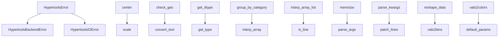

# `hypertools._shared`

## Tree:
_shared/
├── exceptions.py
├── helpers.py
└── params.py

## Role:
Provides shared utilities, error handling, and common data processing functions used across the hypertools library.

## Description:
This module serves as a centralized location for reusable components that are commonly needed throughout the hypertools library. It contains shared error types, utility functions for data manipulation and processing, and parameter management tools. The module acts as a foundational layer that supports higher-level functionality while maintaining consistency in error handling and data processing patterns.

Primary consumers of this module include:
- Core visualization components
- Data processing pipelines
- Parameter validation systems
- Utility functions used across multiple modules

The cohesion principle is based on shared functionality and common data processing needs that transcend specific domains within the library.

## Components:
- **HypertoolsError**: Base exception class for the library
- **HypertoolsBackendError**: Exception for backend-related issues  
- **HypertoolsIOError**: Exception for input/output related errors
- **center**: Centers data by subtracting mean from each data point
- **check_geo**: Processes geographic data for compatibility
- **convert_text**: Converts list of strings or string data to numpy array format
- **get_dtype**: Determines the data type of input data
- **get_type**: Identifies the specific type of input data
- **group_by_category**: Maps categorical values to integer indices
- **interp_array**: Interpolates a single array using piecewise cubic Hermite interpolating polynomial
- **interp_array_list**: Interpolates each array in a list to create smoother versions using piecewise cubic Hermite interpolating polynomial
- **is_line**: Checks if a format string represents a line plot style
- **memoize**: Decorator for caching function results
- **parse_args**: Parses arguments for multi-item processing
- **parse_kwargs**: Parses keyword arguments for multi-item processing
- **patch_lines**: Patches line data for proper plotting
- **reshape_data**: Reshapes data according to categorical grouping
- **scale**: Scales data to [-1, 1] range using min-max normalization
- **vals2bins**: Converts continuous numerical values into discrete bins using linear spacing
- **vals2colors**: Maps values to colors using a colormap
- **default_params**: Retrieves and updates default parameters for models

## Public API:
- **HypertoolsError**: Base exception class for the library
- **HypertoolsBackendError**: Exception for backend-related issues
- **HypertoolsIOError**: Exception for input/output related errors
- **center(x)**: Centers data by subtracting mean from each data point
- **check_geo(geo)**: Processes geographic data for compatibility
- **convert_text(data)**: Converts list of strings or string data to numpy array format
- **get_dtype(data)**: Determines the data type of input data
- **get_type(data)**: Identifies the specific type of input data
- **group_by_category(vals)**: Maps categorical values to integer indices
- **interp_array(arr, interp_val=10)**: Interpolates a single array using piecewise cubic Hermite interpolating polynomial
- **interp_array_list(arr_list, interp_val=10)**: Interpolates each array in a list to create smoother versions using piecewise cubic Hermite interpolating polynomial
- **is_line(format_str)**: Checks if a format string represents a line plot style
- **memoize(obj)**: Decorator for caching function results
- **parse_args(x, args)**: Parses arguments for multi-item processing
- **parse_kwargs(x, kwargs)**: Parses keyword arguments for multi-item processing
- **patch_lines(x)**: Patches line data for proper plotting
- **reshape_data(x, hue, labels)**: Reshapes data according to categorical grouping
- **scale(x)**: Scales data to [-1, 1] range using min-max normalization
- **vals2bins(vals, res=100)**: Converts continuous numerical values into discrete bins using linear spacing
- **vals2colors(vals, cmap='GnBu', res=100)**: Maps values to colors using a colormap
- **default_params(model, update_dict=None)**: Retrieves and updates default parameters for models

## Dependencies:
- **Internal**: 
  - `..datageometry`: Used in get_dtype and get_type functions to identify DataGeometry objects
- **External**:
  - `numpy` (as `np`): Used extensively for array operations in most helper functions
  - `pandas` (as `pd`): Used in get_dtype and get_type for DataFrame type checking
  - `matplotlib.lines` (as `Line2D`): Used in is_line function for marker detection
  - `scipy.interpolate` (as `pchip`): Used in interp_array function for piecewise cubic Hermite interpolation
  - `seaborn` (as `sns`): Used in vals2colors for color palette generation
  - `itertools`: Used in vals2bins for flattening nested lists
  - `functools`: Used in memoize decorator for wrapping functions

## Constraints:
- Functions like `center` and `scale` expect input data to be lists
- The `memoize` decorator caches results based on string representation of arguments
- Parameter functions require parameters dictionary to be properly structured
- Thread safety is not guaranteed for functions that modify global state or use caching

---

## Files

- [`exceptions.py`](_shared/exceptions.md)
- [`helpers.py`](_shared/helpers.md)
- [`params.py`](_shared/params.md)

