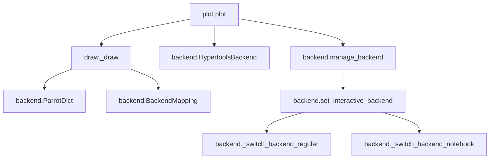

# `hypertools.plot`

## Tree:
```
plot/
├── backend.py
├── draw.py
└── plot.py
```

## Role:
Manages plotting functionality with automatic backend switching and visualization capabilities for multidimensional data.

## Description:
The plot module provides a unified interface for creating visualizations of high-dimensional data with automatic backend management. It handles the complexity of matplotlib backend switching between different execution environments (notebooks vs. scripts) while providing rich plotting features including static and animated visualizations, clustering, and dimensionality reduction support.

This module is used throughout the hypertools library to generate visual representations of complex datasets, particularly when working with multidimensional data that needs to be reduced to 2D or 3D for visualization purposes.

## Components:
- `plot.plot`: Main plotting function that handles data formatting, dimensionality reduction, clustering, and visualization
- `draw._draw`: Core drawing implementation that manages static and animated plots
- `backend.BackendMapping`: Maps Python and IPython backend names for seamless switching
- `backend.HypertoolsBackend`: Specialized string class for handling backend normalization
- `backend.ParrotDict`: Dictionary subclass that normalizes keys for backend handling
- `backend.manage_backend`: Decorator for managing backend contexts during plotting operations



## Public API:
- `plot.plot(x, fmt='-', marker=None, ...)` - Main plotting interface for multidimensional data visualization
- `draw._draw(x, legend=None, title=None, ...) ` - Low-level drawing implementation
- `backend.HypertoolsBackend` - String subclass for normalized backend handling
- `backend.manage_backend` - Decorator for backend context management

## Dependencies:
Internal:
- `hypertools.plot.backend` - Backend management utilities
- `hypertools.plot.draw` - Drawing implementation
- `hypertools.data.format_data` - Data formatting
- `hypertools.data.analyze` - Data analysis and reduction
- `hypertools.data.reducer` - Dimensionality reduction
- `hypertools.data.clusterer` - Clustering utilities
- `hypertools.data.reshape_data` - Data reshaping
- `hypertools.data.center` - Data centering
- `hypertools.data.scale` - Data scaling
- `hypertools.data.parse_kwargs` - Keyword argument parsing
- `hypertools.data.is_line` - Line detection utility
- `hypertools.data.interp_array_list` - Array interpolation
- `hypertools.data.patch_lines` - Line patching
- `hypertools.data.vals2bins` - Value binning
- `hypertools.data.group_by_category` - Category grouping

External:
- `matplotlib.pyplot` - Plotting library
- `seaborn` - Statistical data visualization
- `numpy` - Numerical computing
- `scipy` - Scientific computing
- `sklearn` - Machine learning tools
- `IPython` - Interactive Python shell
- `warnings` - Warning handling
- `traceback` - Stack trace handling
- `sys` - System-specific parameters
- `os` - Operating system interface
- `itertools` - Iterator tools
- `collections` - Container data types
- `contextlib` - Context manager utilities

## Constraints:
- Must be initialized before use (backend setup happens automatically)
- Requires matplotlib and seaborn to be installed
- When running in notebooks, interactive backends are preferred
- Animation features require ffmpeg for saving animated plots
- All data passed to plot() must be compatible with numpy arrays
- Backend switching is thread-safe but may affect global matplotlib state

---

## Files

- [`backend.py`](plot/backend.md)
- [`draw.py`](plot/draw.md)
- [`plot.py`](plot/plot.md)

