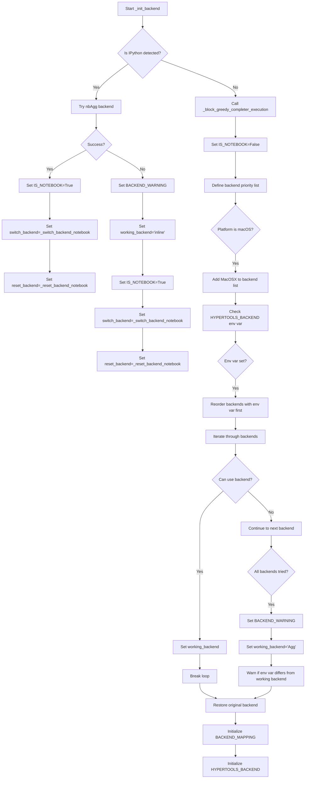

# `backend.py`

## `hypertools.plot.backend.ParrotDict` · *class*

*No documentation generated.*

### `hypertools.plot.backend.ParrotDict.__init__` · *method*

## Summary:
Initializes a ParrotDict instance by delegating to the parent dict class constructor.

## Description:
This method serves as the constructor for the ParrotDict class, which extends Python's built-in dict class. It initializes the dictionary with the provided arguments and keyword arguments by calling the parent dict.__init__ method. The ParrotDict class is designed to work with HypertoolsBackend objects, providing case-insensitive key handling and automatic conversion of keys and values to HypertoolsBackend instances through overridden methods (__getitem__, __setitem__, etc.).

## Args:
    *args: Variable length argument list passed to the parent dict.__init__ method
    **kwargs: Arbitrary keyword arguments passed to the parent dict.__init__ method

## Returns:
    None: This method does not return a value

## Raises:
    TypeError: If the arguments passed to dict.__init__ are invalid for the parent dict class

## State Changes:
    Attributes READ: None
    Attributes WRITTEN: Initializes the internal dictionary state through parent class initialization

## Constraints:
    Preconditions: 
    - The arguments passed to this constructor must be valid for dict.__init__
    - The ParrotDict class assumes that any key-value pairs will be processed by the overridden methods (__getitem__, __setitem__, etc.)

    Postconditions:
    - The instance is initialized as a standard Python dict with the provided initial content
    - All subsequent operations on this instance will use the custom behaviors defined in ParrotDict's overridden methods

## Side Effects:
    None: This method performs no I/O operations or external service calls

### `hypertools.plot.backend.ParrotDict.__contains__` · *method*

## Summary:
Checks if a backend key exists in the dictionary with case-insensitive matching.

## Description:
Implements the `in` operator for the ParrotDict class, enabling case-insensitive membership testing. This method converts the provided key to a HypertoolsBackend instance and checks if it exists among the dictionary's keys.

## Args:
    key (str): The backend key to search for, which will be normalized to a HypertoolsBackend instance.

## Returns:
    bool: True if the key exists in the dictionary (case-insensitively), False otherwise.

## Raises:
    None explicitly raised.

## State Changes:
    Attributes READ: self.keys()
    Attributes WRITTEN: None

## Constraints:
    Preconditions: The key parameter must be convertible to a string.
    Postconditions: Returns a boolean indicating membership status.

## Side Effects:
    None.

### `hypertools.plot.backend.ParrotDict.__getitem__` · *method*

## Summary:
Retrieves a value from the dictionary using a case-insensitive key lookup after converting the key to a HypertoolsBackend instance.

## Description:
This method implements dictionary key access for the ParrotDict class, providing case-insensitive key matching by converting the input key to a HypertoolsBackend instance before performing the lookup. It is part of the ParrotDict's custom dictionary behavior that ensures consistent backend key handling regardless of case.

The method is called during dictionary access operations like `dict[key]` and ensures that keys are normalized to the HypertoolsBackend type for proper lookup in the underlying dictionary storage.

## Args:
    key (Any): The key to look up in the dictionary. Can be any type that can be converted to a string.

## Returns:
    Any: The value associated with the key in the dictionary.

## Raises:
    KeyError: When the specified key is not found in the dictionary.

## State Changes:
    Attributes READ: None
    Attributes WRITTEN: None

## Constraints:
    Preconditions: The key must be convertible to a string representation for HypertoolsBackend construction.
    Postconditions: The returned value maintains its original type and value from the dictionary storage.

## Side Effects:
    None

### `hypertools.plot.backend.ParrotDict.__missing__` · *method*

## Summary:
Returns a new HypertoolsBackend instance when a key is not found in the dictionary.

## Description:
This method implements the `__missing__` protocol for the ParrotDict class. When a key lookup fails (i.e., when a key is not present in the dictionary), Python automatically calls this method with the missing key as an argument. Instead of raising a KeyError, this implementation creates and returns a new HypertoolsBackend instance initialized with the missing key value.

This enables the ParrotDict to act as a lazy factory for HypertoolsBackend objects, allowing seamless access to backend identifiers without explicitly checking for their existence first.

## Args:
    key (Any): The key that was not found in the dictionary

## Returns:
    HypertoolsBackend: A new HypertoolsBackend instance initialized with the missing key value

## Raises:
    None: This method does not raise exceptions directly

## State Changes:
    Attributes READ: None
    Attributes WRITTEN: None

## Constraints:
    Preconditions: The method assumes that `HypertoolsBackend` can be constructed with the provided key value
    Postconditions: The returned HypertoolsBackend instance is not stored in the dictionary (it's created on-demand)

## Side Effects:
    None: This method performs no I/O operations or external service calls

### `hypertools.plot.backend.ParrotDict.__setitem__` · *method*

## Summary:
Sets a key-value pair in the ParrotDict after normalizing both key and value to HypertoolsBackend objects.

## Description:
This method implements the dictionary assignment operation (__setitem__) for the ParrotDict class. When a key-value pair is assigned to a ParrotDict instance, both the key and value are converted to HypertoolsBackend objects before being stored in the underlying dictionary. This ensures consistent key handling throughout the dictionary operations.

The ParrotDict class extends Python's built-in dict class and provides enhanced key normalization capabilities through the HypertoolsBackend wrapper, which handles case-insensitive comparisons and backend-specific conversions.

## Args:
    key (Any): The key to be stored, which will be converted to a HypertoolsBackend object
    value (Any): The value to be stored, which will be converted to a HypertoolsBackend object

## Returns:
    None: This method performs an assignment operation and returns None

## Raises:
    KeyError: May raise KeyError if the parent dict implementation raises it during storage
    TypeError: May raise TypeError if the parent dict implementation raises it during storage

## State Changes:
    Attributes READ: None
    Attributes WRITTEN: The underlying dictionary storage managed by the parent dict class

## Constraints:
    Preconditions: 
    - The key and value must be convertible to strings (since HypertoolsBackend inherits from str)
    - The parent dict class must support the __setitem__ operation
    
    Postconditions:
    - Both key and value are stored as HypertoolsBackend objects in the dictionary
    - The dictionary maintains its standard key-value mapping behavior

## Side Effects:
    None: This method doesn't have observable side effects beyond modifying the dictionary contents

## `hypertools.plot.backend.BackendMapping` · *class*

*No documentation generated.*

### `hypertools.plot.backend.BackendMapping.__init__` · *method*

## Summary:
Initializes a backend mapping with Python-to-IPython key mappings and establishes equivalency relationships.

## Description:
The `__init__` method sets up the internal data structures for managing backend-specific key mappings between Python and IPython environments. It creates three `ParrotDict` instances to store forward mappings, reverse mappings, and equivalency relationships respectively. The method processes a dictionary of key mappings, normalizing keys through the `_store_equivalents` helper method to handle alternative spellings or representations of the same backend parameter.

This method is called during object instantiation to establish the initial state for backend key translation operations. It serves as the foundation for the entire backend mapping system by creating the necessary data structures and populating them with the provided key mappings.

## Args:
    _dict (dict): A dictionary mapping Python backend keys to IPython backend keys. Keys can be either strings or iterable collections of equivalent key names.

## Returns:
    None: This method initializes instance attributes and does not return a value.

## Raises:
    None explicitly raised: The method doesn't raise any exceptions directly, though underlying operations may raise exceptions from dict operations or the `ParrotDict` implementation.

## State Changes:
    Attributes READ: None
    Attributes WRITTEN: 
    - self.py_to_ipy: Populated with normalized Python-to-IPython key mappings
    - self.ipy_to_py: Populated with normalized IPython-to-Python key mappings  
    - self.equivalents: Populated with equivalency relationships between alternative key representations

## Constraints:
    Preconditions:
    - The `_dict` parameter must be a dictionary-like object with iterable items
    - Keys in `_dict` can be either strings or iterable collections of equivalent key names
    - The `_store_equivalents` method must be available and functional
    
    Postconditions:
    - Three `ParrotDict` instances (`py_to_ipy`, `ipy_to_py`, `equivalents`) are initialized and populated
    - All key mappings are normalized through the `_store_equivalents` method
    - Bidirectional mappings are established between Python and IPython keys

## Side Effects:
    None: This method performs only internal state initialization and does not cause any I/O operations, external service calls, or mutations to objects outside the instance.

### `hypertools.plot.backend.BackendMapping._store_equivalents` · *method*

## Summary:
Maps equivalent backend keys to a default key for consistent lookup across Python and IPython environments.

## Description:
Processes a key or list of equivalent keys, storing mappings in the internal `equivalents` dictionary so that all equivalent keys resolve to a canonical default key. This enables unified backend handling regardless of whether the code runs in Python or IPython contexts.

This method is called during `BackendMapping` initialization to process both Python and IPython key mappings from the input dictionary, ensuring consistent key resolution throughout the system.

## Args:
    keylist (str or Iterable[str]): A single key string or an iterable of equivalent keys that should map to the same default key.

## Returns:
    str: The default key that all equivalent keys map to, or the original key if it was a string.

## Raises:
    None explicitly raised.

## State Changes:
    Attributes READ: None
    Attributes WRITTEN: `self.equivalents` - stores key equivalency mappings

## Constraints:
    Preconditions: 
    - Input must be either a string or an iterable of strings
    - If iterable, it must contain at least one element
    
    Postconditions:
    - All elements in an iterable input (except the first) are mapped to the first element in `self.equivalents`
    - Single string inputs are returned unchanged

## Side Effects:
    None

## `hypertools.plot.backend.HypertoolsBackend` · *class*

*No documentation generated.*

### `hypertools.plot.backend.HypertoolsBackend.__new__` · *method*

## Summary:
Creates a new HypertoolsBackend instance by delegating to the parent class's object creation mechanism.

## Description:
This `__new__` method implements the standard object creation protocol for the HypertoolsBackend class. It serves as the factory method responsible for instantiating new objects of this class. When invoked, it directly calls the parent class's `__new__` method with the provided class and arguments, allowing the inheritance hierarchy to handle the actual object construction process. This is a minimal implementation that defers all instance creation logic to the parent class.

## Args:
    cls: The class being instantiated (typically HypertoolsBackend)
    x: Arguments to be passed to the parent class's `__new__` method for instance creation

## Returns:
    A newly created instance of HypertoolsBackend

## Raises:
    Any exceptions raised by the parent class's `__new__` method during object creation

## State Changes:
    Attributes READ: None
    Attributes WRITTEN: None

## Constraints:
    Preconditions:
    - cls must be a valid class object
    - x must be compatible with the parent class's expected arguments for `__new__`
    
    Postconditions:
    - Returns a properly constructed instance of HypertoolsBackend
    - The instance maintains the correct class hierarchy and type

## Side Effects:
    None

### `hypertools.plot.backend.HypertoolsBackend.__eq__` · *method*

*No documentation generated.*

### `hypertools.plot.backend.HypertoolsBackend.__getattribute__` · *method*

*No documentation generated.*

### `hypertools.plot.backend.HypertoolsBackend.__hash__` · *method*

## Summary:
Computes a case-insensitive hash value for the backend identifier string.

## Description:
This special method implements the hash protocol for HypertoolsBackend instances, returning a hash value based on the lowercase version of the string representation. It ensures consistency with the case-insensitive equality comparison implemented in `__eq__`.

## Args:
    self: The HypertoolsBackend instance being hashed.

## Returns:
    int: An integer hash value suitable for use in hash-based data structures like sets and dictionaries.

## Raises:
    None: This method does not raise any exceptions under normal circumstances.

## State Changes:
    Attributes READ: None - this method only reads the instance's string representation
    Attributes WRITTEN: None - this method does not modify any instance attributes

## Constraints:
    Preconditions: The instance must be a valid HypertoolsBackend object (which inherits from str)
    Postconditions: The returned hash value is consistent with the case-insensitive equality semantics of the class

## Side Effects:
    None: This method performs no I/O operations or external service calls.

### `hypertools.plot.backend.HypertoolsBackend.as_ipython` · *method*

*No documentation generated.*

### `hypertools.plot.backend.HypertoolsBackend.as_python` · *method*

*No documentation generated.*

### `hypertools.plot.backend.HypertoolsBackend.normalize` · *method*

*No documentation generated.*

## `hypertools.plot.backend._init_backend` · *function*

## Summary:
Initializes the matplotlib backend for hypertools plotting, detecting the execution environment and selecting an appropriate graphics backend.

## Description:
This function configures the matplotlib backend for the hypertools plotting system by detecting whether the code is running in a Jupyter notebook environment or regular Python interpreter. It attempts to set up an interactive backend for notebooks or a suitable backend for regular environments, falling back gracefully when preferred backends are unavailable. The function also establishes callback mechanisms for backend switching and resetting operations.

## Args:
    None

## Returns:
    None

## Raises:
    Exception: May raise exceptions from matplotlib backend switching operations (ImportError, NameError, ValueError) during backend selection

## Constraints:
    Preconditions:
    - Must be called before any plotting operations that depend on the backend
    - Should be called once during module initialization
    
    Postconditions:
    - Global variables are initialized: BACKEND_MAPPING, BACKEND_WARNING, HYPERTOOLS_BACKEND, IPYTHON_INSTANCE, IS_NOTEBOOK, reset_backend, switch_backend
    - The appropriate backend is selected and configured for the current environment
    - Callback functions for backend switching and resetting are properly assigned

## Side Effects:
    - Modifies global variables: BACKEND_MAPPING, BACKEND_WARNING, HYPERTOOLS_BACKEND, IPYTHON_INSTANCE, IS_NOTEBOOK, reset_backend, switch_backend
    - Calls matplotlib's use() function to switch backends
    - May issue warnings via Python's warnings module
    - Temporarily changes matplotlib backend during execution

## Control Flow:


## Examples:
```python
# Called automatically during module import
# No direct usage required by end users

# Typical usage scenario:
# When running in Jupyter notebook:
# - Attempts to use 'nbAgg' backend
# - Falls back to 'inline' if 'nbAgg' not available
# - Sets up notebook-specific callbacks

# When running in regular Python:
# - Tries various GUI backends in order of preference
# - Falls back to 'Agg' backend if none work
# - Sets up regular Python callbacks
```

## `hypertools.plot.backend._block_greedy_completer_execution` · *function*

*No documentation generated.*

## `hypertools.plot.backend._switch_backend_regular` · *function*

*No documentation generated.*

## `hypertools.plot.backend._switch_backend_notebook` · *function*

*No documentation generated.*

## `hypertools.plot.backend._reset_backend_notebook` · *function*

*No documentation generated.*

## `hypertools.plot.backend._get_runtime_args` · *function*

*No documentation generated.*

## `hypertools.plot.backend.set_interactive_backend` · *class*

*No documentation generated.*

### `hypertools.plot.backend.set_interactive_backend.__init__` · *method*

*No documentation generated.*

### `hypertools.plot.backend.set_interactive_backend.__enter__` · *method*

*No documentation generated.*

### `hypertools.plot.backend.set_interactive_backend.__exit__` · *method*

## Summary:
Restores the previous matplotlib backend configuration when exiting a context manager block.

## Description:
This method is the `__exit__` handler for the `set_interactive_backend` context manager. It ensures proper cleanup by restoring the original matplotlib backend settings when leaving the context. This method is automatically called when exiting a `with` block that uses the context manager.

## Args:
    exc_type (type): Exception type if an exception occurred in the context, else None
    exc_value (Exception): Exception instance if an exception occurred in the context, else None  
    traceback (traceback): Traceback object if an exception occurred in the context, else None

## Returns:
    None: This method does not return any value

## Raises:
    None: This method does not explicitly raise exceptions

## State Changes:
    Attributes READ: 
    - self.new_is_different
    - self.old_interactive_backend
    - self.old_backend_warning
    - self.backend_switched
    - self.curr_backend
    
    Attributes WRITTEN:
    - IN_SET_CONTEXT (global variable, set to False)
    - HYPERTOOLS_BACKEND (global variable, restored to previous value if needed)
    - BACKEND_WARNING (global variable, restored to previous value if needed)

## Constraints:
    Preconditions:
    - The context manager must have been entered via `__enter__` method
    - Global variables `BACKEND_WARNING`, `HYPERTOOLS_BACKEND`, and `IN_SET_CONTEXT` must be initialized
    - Instance attributes `new_is_different`, `old_interactive_backend`, `old_backend_warning`, `backend_switched`, and `curr_backend` must be properly set
    
    Postconditions:
    - The global `IN_SET_CONTEXT` flag is set to False
    - If a backend change was made, the original backend configuration is restored
    - The matplotlib backend is reset to its original state if it was switched during context entry

## Side Effects:
    - Modifies global variables: `IN_SET_CONTEXT`, `HYPERTOOLS_BACKEND`, `BACKEND_WARNING`
    - Calls `reset_backend(self.curr_backend)` function which resets the matplotlib backend to its original state
    - May cause matplotlib backend switching operations

## `hypertools.plot.backend._null_backend_context` · *function*

*No documentation generated.*

## `hypertools.plot.backend.manage_backend` · *function*

## Summary:
Decorator that manages matplotlib backend contexts for plotting functions, ensuring proper backend switching for animation and interactive plots while preserving original settings.

## Description:
The `manage_backend` decorator handles matplotlib backend management for plotting functions. When a decorated plotting function is called with `animate=True` or `interactive=True` parameters, it temporarily switches to an appropriate matplotlib backend to support interactive features. The decorator ensures that the original matplotlib configuration is preserved and restored after execution, preventing side effects on global matplotlib state. This extraction provides clean separation between plotting logic and backend management concerns.

## Args:
    plot_func (callable): The plotting function to be decorated and wrapped with backend management logic.

## Returns:
    callable: A wrapper function that executes the original plotting function with appropriate backend context management.

## Raises:
    None explicitly raised - delegates exceptions from the wrapped plot_func.

## Constraints:
    Preconditions:
    - The matplotlib library must be available and properly imported
    - Global variables IN_SET_CONTEXT, HYPERTOOLS_BACKEND, BACKEND_WARNING, and BACKEND_MAPPING must be properly initialized
    - Required helper functions and classes (_get_runtime_args, HypertoolsBackend, set_interactive_backend, _null_backend_context) must be defined in the module scope
    
    Postconditions:
    - Original matplotlib rcParams are restored after execution
    - Backend state is properly managed and reset
    - Global state variables are maintained consistently

## Side Effects:
    - Modifies global matplotlib configuration via rcParams
    - May switch matplotlib backends during execution
    - Updates global variables IN_SET_CONTEXT, HYPERTOOLS_BACKEND, and BACKEND_WARNING during interactive backend switching
    - Issues warnings when BACKEND_WARNING is set

## Control Flow:
```mermaid
flowchart TD
    A[manage_backend called] --> B{IN_SET_CONTEXT}
    B -- True --> C[Use _null_backend_context]
    B -- False --> D[Get runtime args]
    D --> E{animate OR interactive}
    E -- False --> C
    E -- True --> F[Get current backend]
    F --> G{tmp_backend == 'auto'}
    G -- True --> H[Set tmp_backend = HYPERTOOLS_BACKEND]
    G -- False --> I[tmp_backend = plot_kwargs.mpl_backend]
    H --> I
    I --> J{tmp_backend not in ('disable', curr_backend)}
    J -- False --> C
    J -- True --> K[Set backend_context = set_interactive_backend]
    K --> L[Enter backend context]
    L --> M{BACKEND_WARNING}
    M -- True --> N[Issue warning]
    N --> O[Execute plot_func]
    O --> P[Restore rcParams]
    P --> Q[Return result]
```

## Examples:
```python
@manage_backend
def my_plot_function(data, animate=False, interactive=False):
    # Plotting logic here
    pass

# When called with interactive=True, the backend will be switched appropriately
result = my_plot_function(my_data, interactive=True)
```

