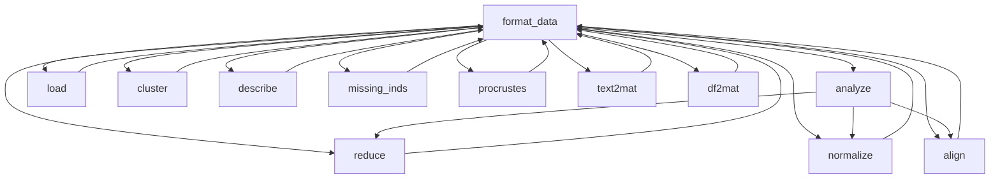

# `hypertools.tools`

## Tree:
tools/
├── align.py
├── analyze.py
├── cluster.py
├── describe.py
├── df2mat.py
├── format_data.py
├── load.py
├── missing_inds.py
├── normalize.py
├── procrustes.py
├── reduce.py
└── text2mat.py

## Role:
Provides a collection of data processing and analysis utilities for preparing heterogeneous data types (numerical, textual, mixed) for visualization and machine learning tasks.

## Description:
The tools module serves as a foundational component for data preprocessing and analysis within the hypertools ecosystem. It provides a suite of functions that handle various aspects of data manipulation including data type conversion, normalization, dimensionality reduction, alignment of multi-subject data, clustering, and missing data handling. This module acts as a bridge between raw data ingestion and advanced analytical operations, enabling users to prepare complex datasets for visualization and modeling.

Primary consumers of this module include the main plotting and analysis functions in the hypertools package, which rely on these utilities to preprocess data before performing higher-level operations. The module is designed to handle diverse data formats seamlessly, making it easy to work with mixed-type datasets that combine numerical and textual information.

## Components:
- align(data, align='hyper', normalize=None, ndims=None, method=None, format_data=True) - Performs hyperalignment or SRM-based alignment of multi-subject data
- analyze(data, normalize=None, reduce=None, ndims=None, align=None, internal=False) - Main analysis pipeline combining normalization, reduction, and alignment
- cluster(x, cluster='KMeans', n_clusters=3, ndims=None, format_data=True) - Applies clustering to data using various algorithms
- describe(x, reduce='IncrementalPCA', max_dims=None, show=True, format_data=True) - Provides descriptive analysis of data dimensionality
- df2mat(data, return_labels=False) - Converts pandas DataFrames to numerical matrices
- format_data(x, vectorizer='CountVectorizer', semantic='LatentDirichletAllocation', corpus='wiki', ppca=True, text_align='hyper') - Main data formatting function for heterogeneous data types
- load(dataset, reduce=None, ndims=None, align=None, normalize=None, *, legacy=False) - Main entry point for loading datasets
- missing_inds(x, format_data=True) - Identifies indices of missing data
- normalize(x, normalize='across', internal=False, format_data=True) - Normalizes data using various schemes
- procrustes(source, target, scaling=True, reflection=True, reduction=False, oblique=False, oblique_rcond=-1, format_data=True) - Performs Procrustes analysis for shape comparison
- reduce(x, reduce='IncrementalPCA', ndims=None, normalize=None, align=None, model=None, model_params=None, internal=False, format_data=True) - Reduces data dimensionality using various techniques
- text2mat(data, vectorizer='CountVectorizer', semantic='LatentDirichletAllocation', corpus='wiki') - Converts text data to matrix representations

## Public API:
- `align`: Performs hyperalignment or SRM-based alignment of multi-subject data
- `analyze`: Main analysis pipeline combining normalization, reduction, and alignment  
- `cluster`: Applies clustering to data using various algorithms
- `describe`: Provides descriptive analysis of data dimensionality
- `df2mat`: Converts pandas DataFrames to numerical matrices
- `format_data`: Main data formatting function for heterogeneous data types
- `load`: Main entry point for loading datasets
- `missing_inds`: Identifies indices of missing data
- `normalize`: Normalizes data using various schemes
- `procrustes`: Performs Procrustes analysis for shape comparison
- `reduce`: Reduces data dimensionality using various techniques
- `text2mat`: Converts text data to matrix representations

## Dependencies:
Internal imports:
- `hypertools.datageometry.DataGeometry` - For data structure handling
- `hypertools.tools.align` - For alignment operations
- `hypertools.tools.analyze` - For analysis pipeline
- `hypertools.tools.cluster` - For clustering operations
- `hypertools.tools.describe` - For descriptive analysis
- `hypertools.tools.df2mat` - For DataFrame to matrix conversion
- `hypertools.tools.format_data` - For data formatting
- `hypertools.tools.load` - For dataset loading
- `hypertools.tools.missing_inds` - For missing data identification
- `hypertools.tools.normalize` - For data normalization
- `hypertools.tools.procrustes` - For Procrustes analysis
- `hypertools.tools.reduce` - For dimensionality reduction
- `hypertools.tools.text2mat` - For text data processing

External imports:
- `numpy` - Core numerical computing library
- `pandas` - Data manipulation and analysis
- `scipy.spatial.distance.cdist` - Distance calculations
- `scipy.stats.pearsonr` - Statistical correlation calculations
- `sklearn.decomposition` - Dimensionality reduction algorithms
- `sklearn.cluster` - Clustering algorithms
- `sklearn.feature_extraction.text` - Text vectorization
- `sklearn.pipeline.Pipeline` - Machine learning pipelines
- `sklearn.utils.validation.check_is_fitted` - Model validation
- `sklearn.exceptions.NotFittedError` - Model fitting errors
- `requests` - HTTP requests for downloading datasets
- `pickle` - Serialization for data loading
- `warnings` - Warning messages for deprecated features

## Constraints:
- All functions expect data in list format or numpy arrays
- When working with text data, ensure appropriate vectorizers and semantic models are available
- Some functions issue deprecation warnings for older parameter usage patterns
- Functions that perform dimensionality reduction require sufficient samples relative to features
- Alignment functions require consistent number of samples across datasets
- Thread safety is not guaranteed for functions that modify global state or cache
- Users should ensure proper data types are passed to avoid unexpected behavior

---

## Files

- [`align.py`](tools/align.md)
- [`analyze.py`](tools/analyze.md)
- [`cluster.py`](tools/cluster.md)
- [`describe.py`](tools/describe.md)
- [`df2mat.py`](tools/df2mat.md)
- [`format_data.py`](tools/format_data.md)
- [`load.py`](tools/load.md)
- [`missing_inds.py`](tools/missing_inds.md)
- [`normalize.py`](tools/normalize.md)
- [`procrustes.py`](tools/procrustes.md)
- [`reduce.py`](tools/reduce.md)
- [`text2mat.py`](tools/text2mat.md)

