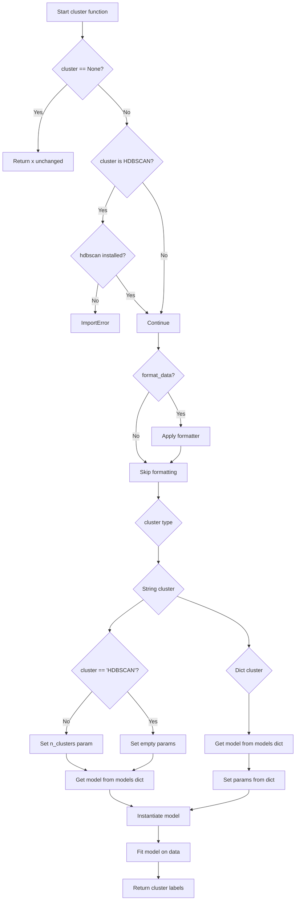

# `cluster.py`

## `hypertools.tools.cluster.cluster` · *function*

## Summary:
Performs clustering on input data using various clustering algorithms with flexible configuration options.

## Description:
This function provides a unified interface for applying different clustering algorithms to input data. It accepts either a string specifying the algorithm name or a dictionary with detailed model configuration, and returns cluster labels for each data point. The function handles preprocessing of data and supports multiple scikit-learn clustering algorithms as well as HDBSCAN.

## Args:
    x (array-like): Input data to be clustered. Can be a list of arrays, lists, or other data structures.
    cluster (str or dict, optional): Clustering algorithm to use. Can be a string like 'KMeans' or a dictionary with 'model' and 'params' keys. Defaults to 'KMeans'.
    n_clusters (int, optional): Number of clusters to form. Used when cluster is a string or when HDBSCAN is not used. Defaults to 3.
    ndims (int, optional): Deprecated parameter for dimensionality reduction. Defaults to None.
    format_data (bool, optional): Whether to preprocess input data using the formatter. Defaults to True.

## Returns:
    list: Cluster labels for each data point in the input dataset. Each label corresponds to a cluster assignment.

## Raises:
    ImportError: When HDBSCAN is requested but not installed (hdbscan package is missing).

## Constraints:
    Preconditions:
    - Input data `x` must be compatible with numpy array operations
    - If `cluster` is a string, it must be a valid key in the `models` dictionary
    - If `cluster` is a dictionary, it must contain a 'model' key with a valid string value
    
    Postconditions:
    - Returns a list of integer cluster labels
    - The length of returned labels matches the total number of data points in the input

## Side Effects:
    - Issues a warning if `ndims` parameter is provided (deprecated)
    - May issue warnings during data formatting if missing data is detected
    - Calls external clustering algorithms from scikit-learn or hdbscan libraries

## Control Flow:

## Examples:
    # Basic usage with default KMeans clustering
    labels = cluster(data)
    
    # Using different clustering algorithm
    labels = cluster(data, cluster='AgglomerativeClustering')
    
    # Using HDBSCAN clustering
    labels = cluster(data, cluster='HDBSCAN')
    
    # Using custom parameters
    labels = cluster(data, cluster={'model': 'KMeans', 'params': {'n_clusters': 5}})

